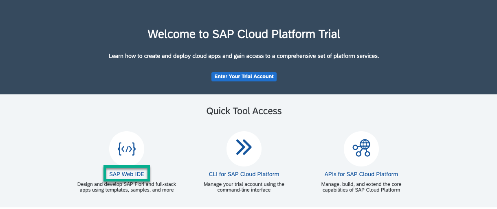
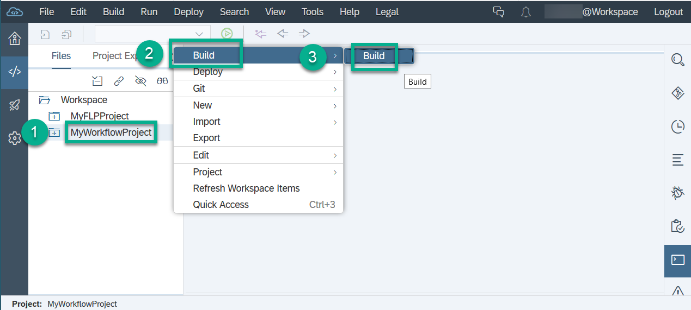
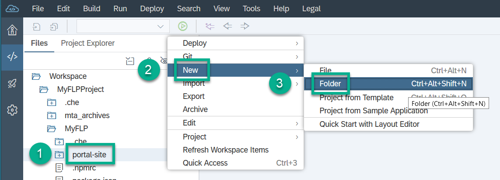
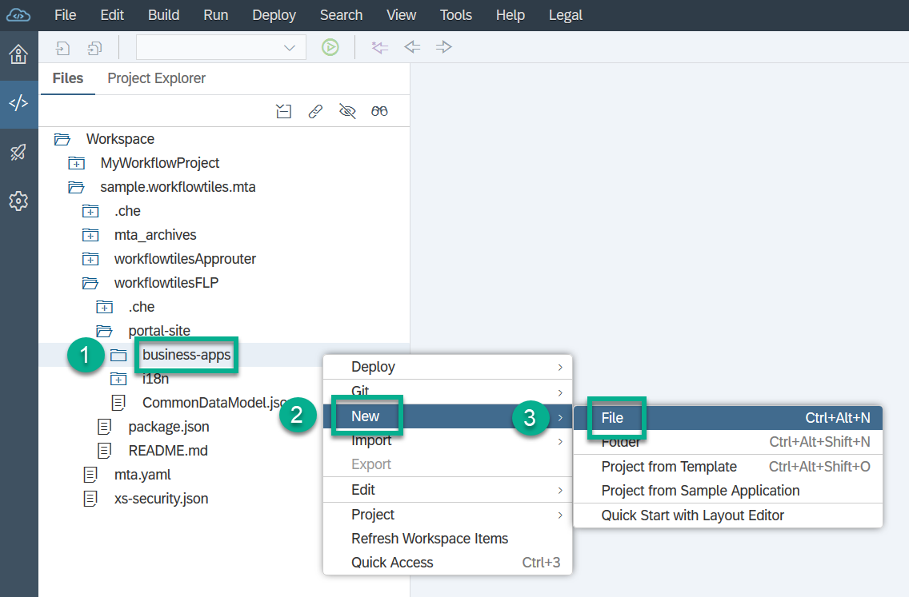
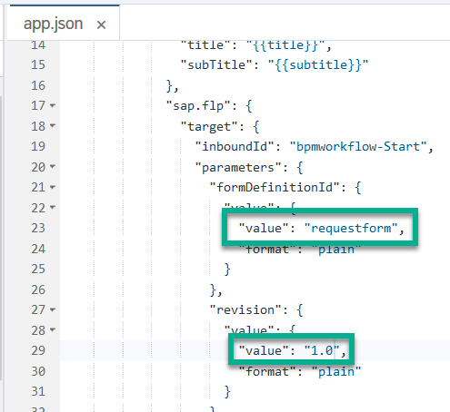
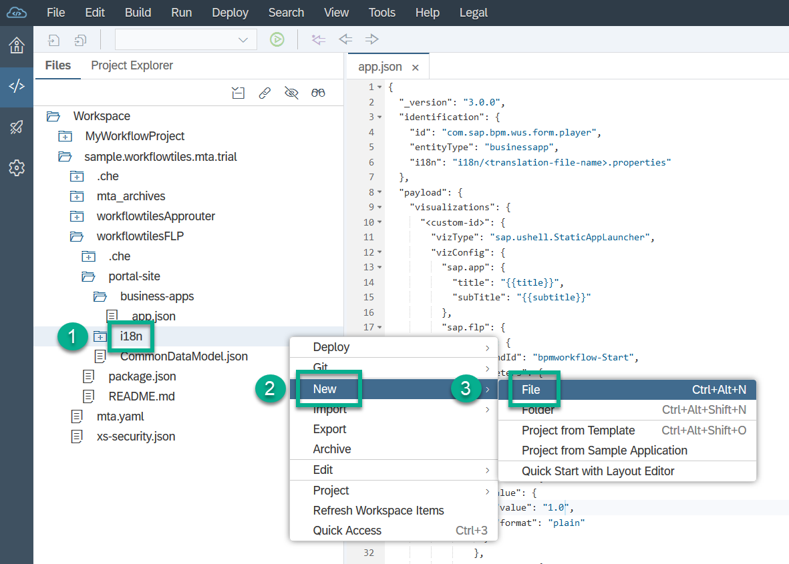
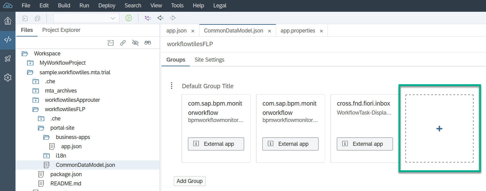
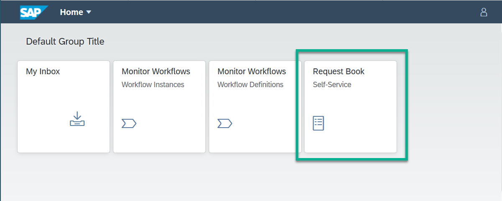
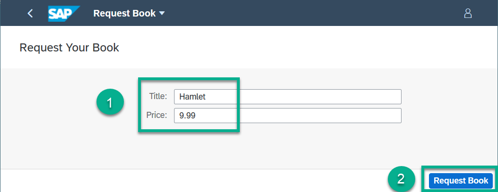
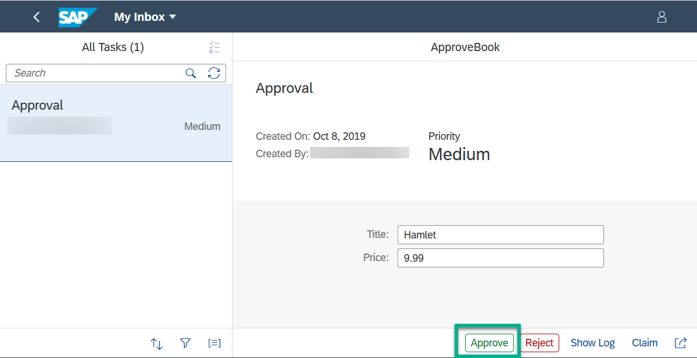

## Prerequisites
- **Tutorials:** You have executed the previous tutorials in [Get started with SAP Cloud Platform workflows](https://developers.sap.com/group.cp-workflow-service.html).

## Details
### You will learn
  - How to start an instance of the workflow definition that you have defined using a start form


---
[ACCORDION-BEGIN [Step 1: ](Launch SAP Web IDE)]
1. In your web browser, open the cockpit of [SAP Cloud Platform Trial](https://cockpit.hanatrial.ondemand.com/cockpit).

2. Choose **Launch SAP Web IDE**.

   

[DONE]
[ACCORDION-END]


[ACCORDION-BEGIN [Step 2: ](Create a start form)]
1. In your workspace, choose **`forms`** | **`ApprovalWorkflow`**, then choose **New** | **Form**.

    

2. In the popup, change the following entries, then choose **Create**:

    | **Name**             | **Value**                         |
    | :--------------------| :-------------------------------- |
    | **Name**             | **`RequestForm`**                 |
    | **Revision**         | **`1.0`**                         |
    | **Type**             | **Start Form**                    |

    

[DONE]
[ACCORDION-END]


[ACCORDION-BEGIN [Step 3: ](Add fields to your start form)]

1. In the form editor (for the ``RequestForm.form``), select the **Fields** section.

2. To add two new fields, click **Add Field** twice, and enter the following data to define the fields:

    | **`Lable/Title`**    | **Type**      | **Context Path**            |
    | :------------------- | :------------ | :-------------------------- |
    | **Title**            | **String**    | **`${context.product}`**    |
    | **Price**            | **Float**     | **`${context.price}`**      |

    

[DONE]
[ACCORDION-END]


[ACCORDION-BEGIN [Step 4: ](Add a start action)]

1. Switch to the **Actions** section of the form editor (for the ``RequestForm.form``).

2. Enter `Request Book` in the **Start Action Text** field, then choose **Select** next to **Workflow File Name**.
    The available workflow files are displayed.

    

4. Choose **/workflows/ApprovalWorkflow.workflow**, and choose **OK**.

5. Save your changes.

[DONE]
[ACCORDION-END]


[ACCORDION-BEGIN [Step 5: ](Build the workflow project)]

1. Build the **`MyWorkflowProject`** project by right-clicking it and choosing **Build** | **Build**.

    

2. In your workspace from the **`mta_archives`** folder, right-click the `MyWorkflowProject_0_0_1.mtar` file and choose **Deploy** | **Deploy to SAP Cloud Platform**.

3. In the popup, select your API endpoint, organization, and space.

4. Choose **Deploy**.

[VALIDATE_4]
[ACCORDION-END]


[ACCORDION-BEGIN [Step 6: ](Configure the business application visualization for your custom tile)]
1. In your workspace of SAP Web IDE under **`MyFLPProject`** | **`MyFLP`**, select the **`portal-site`** folder and right-click it.

2. Choose **New** | **Folder**.

    

3. Enter the name `business-apps`, then choose **OK**.

4. Right-click the `business-apps` folder, and choose **New** | **File**.

    

5. Enter the name `app.json`, then choose **OK**.

6. Paste the following code into the file:

    ```JSON
    {
      "_version": "3.0.0",
      "identification": {
        "id": "com.sap.bpm.wus.form.player",
        "entityType": "businessapp",
        "i18n": "i18n/<translation-file-name>.properties"
      },
      "payload": {
        "visualizations": {
          "<custom-id>": {
            "vizType": "sap.ushell.StaticAppLauncher",
            "vizConfig": {
              "sap.app": {
                "title": "{{title}}",
                "subTitle": "{{subtitle}}"
              },
              "sap.flp": {
                "target": {
                  "inboundId": "bpmworkflow-Start",
                  "parameters": {
                    "formDefinitionId": {
                      "value": {
                        "value": "<form-definition-id>",
                        "format": "plain"
                      }
                    },
                    "revision": {
                      "value": {
                        "value": "<revision>",
                        "format": "plain"
                      }
                    },
                    "appTitle": {
                      "value": {
                        "value": "{{apptitle}}",
                        "format": "plain"
                      }
                    },
                    "formTitle": {
                      "value": {
                        "value": "{{formtitle}}",
                        "format": "plain"
                      }
                    }
                  }
                }
              }
            }
          }
        }
      }}
    ```
7. In line 23, replace the `<form-definition-id>` with `requestform`.

8. In line 29, enter the version of your form: `1.0`.

    

9. Save your changes.

[DONE]
[ACCORDION-END]


[ACCORDION-BEGIN [Step 7: ](Create the corresponding properties file for translation)]
1. In your workspace under **`MyFLPProject`** | **`MyFLP`**, select the **`portal.site`** | **`i18`** folder and right-click it.

2. Choose **New** | **File**.

    

3. Enter the name `app.properties`, then choose **OK**.

4. Paste the following code into the file:

    ```JSON
    #XTIT
    title=<your tile title>
    #XTIT
    subtitle=<your tile subtitle>
    #XTIT
    apptitle=<your app title>
    #XTIT
    formtitle=<your form title>
    ```

5. In the file, replace the variables as follows:

    | :----------------------------------- | :---------------------------------------------- |
    | Parameter                            | Value
    | **title**                            | **Request Book**                                |
    | **`subitle`**                        | **Self-Service**                                |
    | **`apptitle`**                       | **Request Book**                                |
    | **`formtitle`**                      | **Request Your Book**                           |

    

6. Save your changes.

[DONE]
[ACCORDION-END]


[ACCORDION-BEGIN [Step 8: ](Complete the business application visualization)]
1. In your workspace under **`MyFLPProject`** | **`MyFLP`** | **`portal.site`** | **`business-apps`**, open the `app.json` file again.

2. In line 6, replace `<translation-file-name>` with `app`.

3. In line 10, replace `<custom-id>` with `request-approval-app-config`.

    

4. Save your changes.

[DONE]
[ACCORDION-END]


[ACCORDION-BEGIN [Step 9 ](Create a launchpad tile for your start form)]
1. Double-click the `CommonDataModel.json` file in your `MyFLPProject` project. Then choose the **+** icon.

    

2. On the **Select Projects Apps** screen, click the **+** icon once to insert a table row. Then enter the following data, and choose **Select**:

    | App ID                               | Intent Navigation
    | :----------------------------------- | :---------------------------------------------- |
    | **`com.sap.bpm.wus.form.player`**    | **`request-approval-app-config`**               |

5. Save your changes.

[DONE]
[ACCORDION-END]


[ACCORDION-BEGIN [Step 10: ](Build and deploy your MyFLPProject)]
1. Right-click your **`MyFLPProject`** workflow project in the workspace, and choose **Build** | **Build**.

    The console shows the status of the build.

2. Open the **`mta.archives`** folder.

3. Right-click your **`MyFLPProjct_0.0.1.mtar`** file, and choose **Deploy** | **Deploy to SAP Cloud Platform**.

4. Choose **Deploy**.

[DONE]
[ACCORDION-END]


[ACCORDION-BEGIN [Step 11: ](Start your workflow in SAP Fiori launchpad)]
1. In the SAP Fiori launchpad, choose **Refresh (F5)** to display your new tile named **Request Book**.

    

2. Click the tile, and enter any title and price, for example, `Hamlet` and `9.99` and choose **Request Book**.

    

3. In the SAP Fiori launchpad, the **My Inbox** tile displays the **Approval** task.

4. Open **My Inbox**, then choose **Approve** to process the task.

  

[VALIDATE_5]
[ACCORDION-END]

---
