## Prerequisites  
- You have executed the previous tutorials in [Get started with SAP Cloud Platform workflows](https://developers.sap.com/group.cp-workflow-cf.html).
- Make sure that you use a dev space with the extension **Launchpad Module**.

## Details
### You will learn  
  - How to start an instance of the workflow definition that you have defined using a start form

---
[ACCORDION-BEGIN [Step 1: ](Assign entitlements to your subaccount)]

So that you can deploy the `WorkflowManagementFLP_0.0.1.mtar` later on, you need to assign the Application Runtime and Portal entitlements to your subaccount.

1. In your web browser, open the [SAP Cloud Platform trial cockpit](https://cockpit.hanatrial.ondemand.com/).

2. Navigate to the trial global account by clicking **Enter Your Trial Account**.

3. Access your **trial** subaccount.

4. From the navigation area, choose **Entitlements**, and choose for **Configure Entitlements**.

5. Choose **Add Service Plans** and search for **Application Runtime**.

6. Select **Application Runtime** and choose **Add Service Plans**.

7. To add the service plan for **Portal** execute steps 5 and 6 again searching for **Portal**. From the available plans only select the **standard Create SAP Fiori launchpad sites** option.

    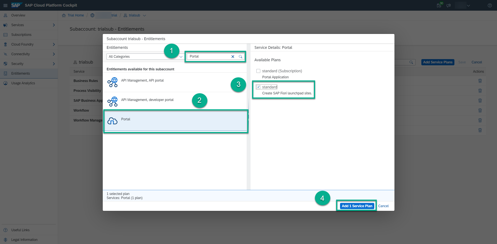

8. Save your entries.    

[DONE]
[ACCORDION-END]


[ACCORDION-BEGIN [Step 2: ](Create a start form)]
1. In your web browser, open the [SAP Cloud Platform Trial cockpit](https://account.hanatrial.ondemand.com/cockpit).

2. Choose **SAP Business Application Studio** and access your dev space.

3. In your workspace, select **onboarding** | **approvals** | **forms**, then start the forms creation.

    On a Windows PC, choose **F1** | **Workflow: Create New Form**.

    On a MAC PC, enter **`COMMAND + SHIFT + P`** and then choose **Workflow: Create New Form**.

    

4. You are prompted to enter the following:

    | **Field**            | **Value**                         |
    | :--------------------| :-------------------------------- |
    | **Workflow module**  | **`approvals`**                   |
    | **File name**        | **`onboardingapprovalform`**      |
    | **Form type**        | **Start Form**                    |
    | **Revision**         | **1.0**                           |

    The forms folder now contains your new form `onboardingapprovalform.form`.

[DONE]
[ACCORDION-END]


[ACCORDION-BEGIN [Step 3: ](Add fields to your start form)]

Once the form editor opens, add form data by choosing **Add Field**.

These expressions refer to the attributes in the JSON file that you have created in the previous step.

| Label/Title    | Type       | Context Path                         |
| :--------------| :----------| :------------------------------------|
| **First Name** | **String** | **`${context.empData.firstName}`**   |
| **Last Name**  | **String** | **`${context.empData.lastName}`**    |
| **Country**    | **String** | **`${context.empData.country}`**     |      
| **Hire Date**  | **Date**   | **`${context.empData.hireDate}`**    |      
| **Job Title**  | **String** | **`${context.empData.jobTitle}`**    |      


[DONE]
[ACCORDION-END]


[ACCORDION-BEGIN [Step 4: ](Add a start action)]

1. Switch to the **ACTION** tab of the form editor.

2. Enter `Start Approval` in the **Start Action Text** field, then choose **Select** next to **Workflow File Name**.

    The available workflow files are displayed.

4. Choose **/workflows/onboard.workflow**, and choose **OK**.

      

[DONE]
[ACCORDION-END]


[ACCORDION-BEGIN [Step 5: ](Build and deploy)]

1. Right-click the **mta.yaml** file in your **onboarding** project, and then select **Build MTA**.

    Once the build is completed, the new folder **`mta_archives`** appears under your application folder.

2. Right-click the `.mtar` file, and then select **Deploy MTA Archive**.

    > Note: You might be asked to log in to your Cloud Foundry space. Enter the right API endpoint depending on your region, for example, `https://api.cf.eu10.hana.ondemand.com`, your username and password, and select your Cloud Foundry org and space.

[DONE]
[ACCORDION-END]


[ACCORDION-BEGIN [Step 6: ](Set up SAP Fiori launchpad)]
To access custom workflow applications, for example, start forms, you can't use the standard apps of Workflow Management. Therefore, you now import, build, and deploy the multitarget project that creates your custom SAP Fiori launchpad.

1. Download the `WorkflowManagementFLP.zip` from  [GitHub](https://github.com/SAP-samples/cloud-workflow-samples/blob/master/cf-workflowmanagement-flp/resources/WorkflowManagementFLP.zip) in your local file system.

    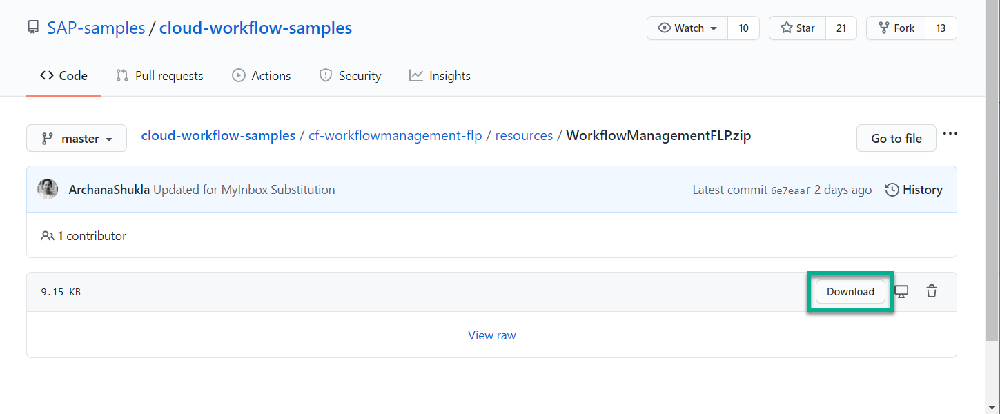

2. Extract the zip file.

    >This multitarget application when deployed will create the Fiori launchpad to access workflow, business rules, and process visibility applications.

3. In your web browser, open the [SAP Cloud Platform Trial cockpit](https://account.hanatrial.ondemand.com/cockpit).

4. Choose **SAP Business Application Studio**.

5. If you have never accessed the workspace before, open it with the **Open Workspace** button.

6. Select the **projects** folder and choose **Open**.

    

    > The **PROJECTS** explorer is opened.

7. Pull the extracted file anywhere on the empty space of the **PROJECTS** explorer. Now, the multitarget application is imported under the **PROJECTS** explorer.

    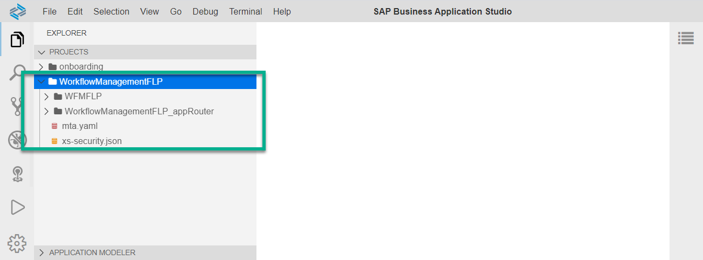

[DONE]
[ACCORDION-END]

[ACCORDION-BEGIN [Step 7: ](Configure the visualization for your custom tile)]

1. Select **`WorkflowManagementFLP`** | **portal-site** | **business-apps** folder and right-click it.

2. Choose **New File**.

    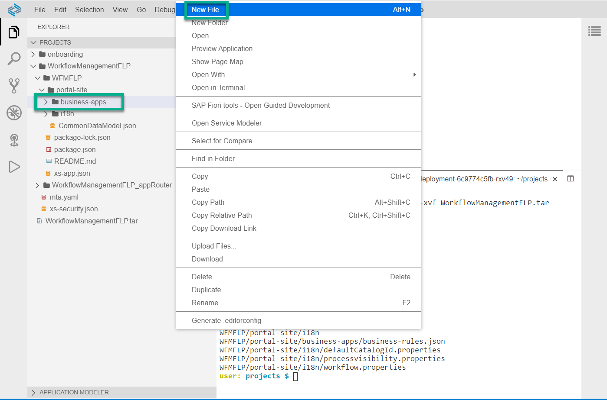

3. Enter the name `app.json`, then choose **OK**.

4. Use the **Copy** button in the header of the code sample, then paste the following code into the file:

    ```JSON
    {
      "_version": "3.0.0",
      "identification": {
        "id": "com.sap.bpm.wus.form.player",
        "entityType": "businessapp",
        "i18n": "i18n/<translation-file-name>.properties"
      },
      "payload": {
        "visualizations": {
          "<custom-id>": {
            "vizType": "sap.ushell.StaticAppLauncher",
            "vizConfig": {
              "sap.app": {
                "title": "{{title}}",
                "subTitle": "{{subtitle}}"
              },
              "sap.flp": {
                "target": {
                  "inboundId": "bpmworkflow-Start",
                  "parameters": {
                    "formDefinitionId": {
                      "value": {
                        "value": "<form-definition-id>",
                        "format": "plain"
                      }
                    },
                    "revision": {
                      "value": {
                        "value": "<revision>",
                        "format": "plain"
                      }
                    },
                    "appTitle": {
                      "value": {
                        "value": "{{apptitle}}",
                        "format": "plain"
                      }
                    },
                    "formTitle": {
                      "value": {
                        "value": "{{formtitle}}",
                        "format": "plain"
                      }
                    }
                  }
                }
              }
            }
          }
        }
      }}
    ```

5. In line 23, replace the `<form-definition-id>` with `onboardingapprovalform`.

6. In line 29, enter the version of your form: `1.0`.

    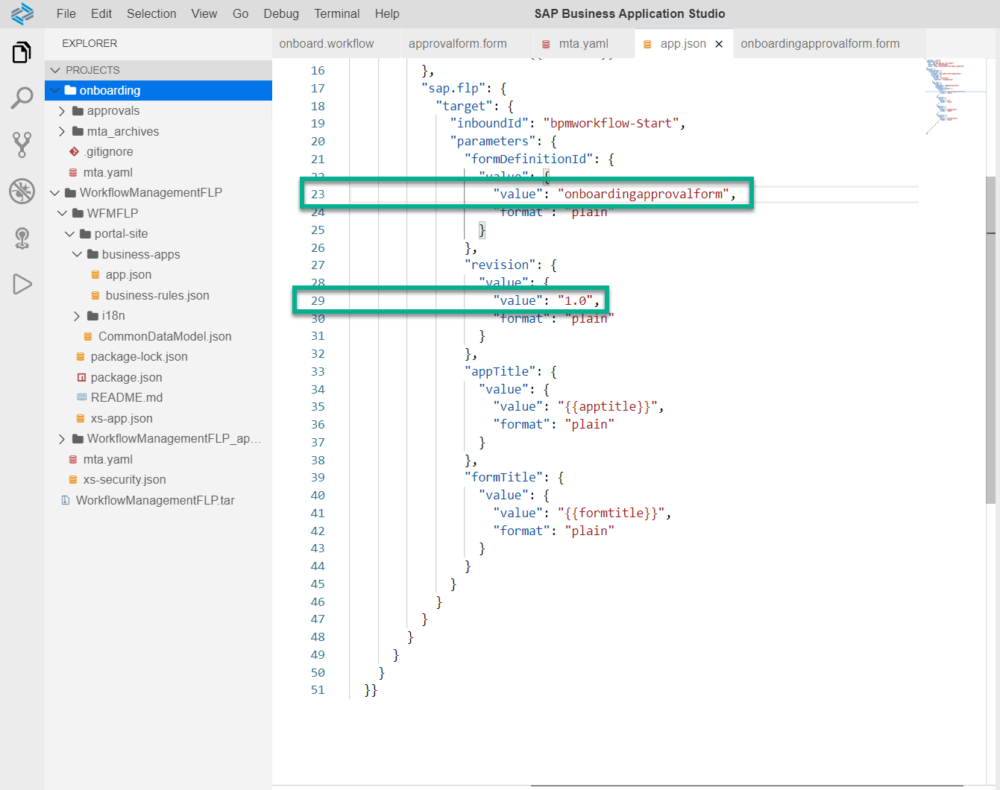


[VALIDATE_4]
[ACCORDION-END]


[ACCORDION-BEGIN [Step 8: ](Create the corresponding properties file for translation)]

1. In **`WorkflowManagementFLP`** that you have imported in the previous tutorials, select **`portal-site`** | **i18n** folder and right-click it.

2. Choose **New File**.

3. Enter the name `app.properties`, then choose **OK**.

4. Paste the following code into the file:

    ```JSON
    #XTIT
    title=<your tile title>
    #XTIT
    subtitle=<your tile subtitle>
    #XTIT
    apptitle=<your app title>
    #XTIT
    formtitle=<your form title>
    ```

5. In the file, replace the variables as follows:

    | Parameter           | Value                      |
    | :-------------------| :------------------------- |
    | **title**           | **Onboarding**             |
    | **`subitle`**       | **Approval**               |
    | **`apptitle`**      | **Onboarding Approval**    |
    | **`formtitle`**     | **Approve Onboarding**     |

    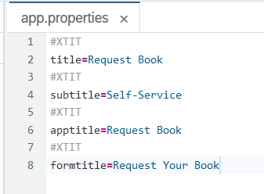

[DONE]
[ACCORDION-END]


[ACCORDION-BEGIN [Step 9: ](Complete the configuration of your custom tile)]
1. In **`WorkflowManagementFLP`** | **`portal.site`** | **`business-apps`**, open the `app.json` file again.

2. In line 6, replace `<translation-file-name>` with `app`.

3. In line 10, replace `<custom-id>` with `onboarding-approval-app-config`.

    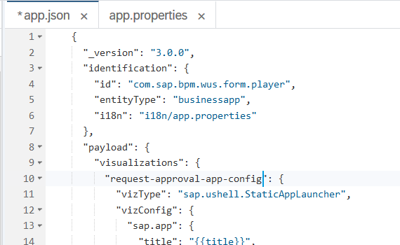

4. Save your changes.

[DONE]
[ACCORDION-END]


[ACCORDION-BEGIN [Step 10 ](Create a launchpad tile for your start form)]
1. Right-click the `CommonDataModel.json` file in your `WorkflowManagementFLP` project, and choose **Open With** | **Launchpad Editor**.

2. Choose the + icon in the row of the tiles with `com.sap.bpm.monitorworkflow`:

    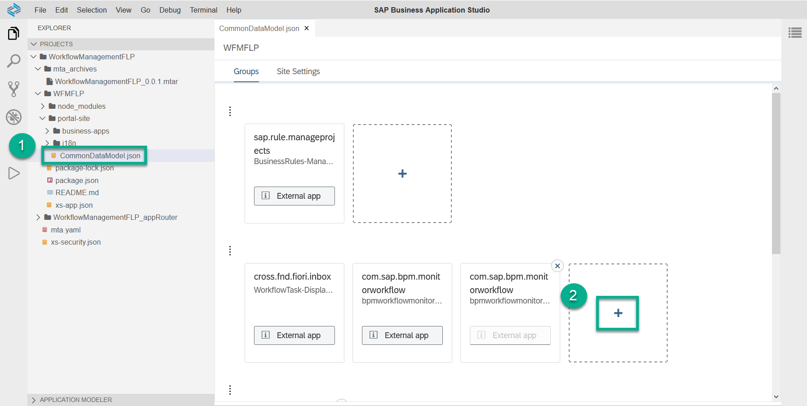

3. On the **Select Projects Apps** screen, click the + icon once to insert a table row.

    Then enter the following data, and choose **Select**:

    | App ID                            | Intent Navigation                      |
    | :---------------------------------| :--------------------------------------|
    | **`com.sap.bpm.wus.form.player`** | **`onboarding-approval-app-config`**   |

[DONE]
[ACCORDION-END]


[ACCORDION-BEGIN [Step 11: ](Build and deploy)]
1. Right-click the **mta.yaml** file inside the **`WorkflowManagementFLP`** project and choose **Build MTA**.

    !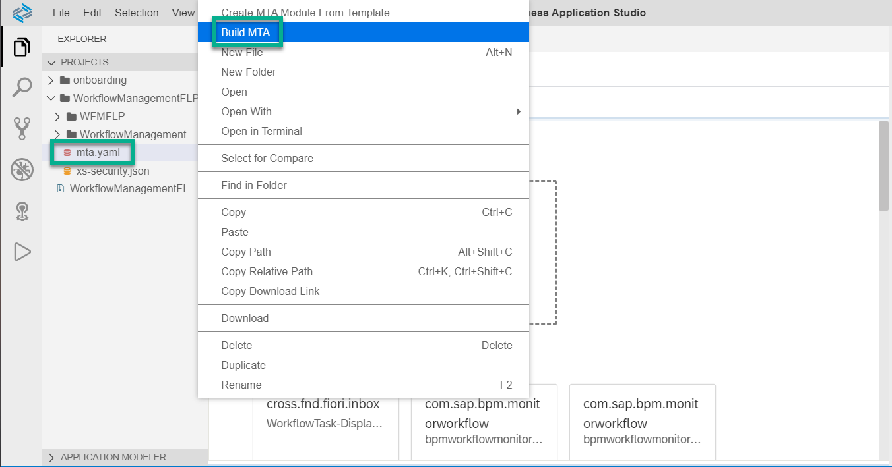

2. After the build has completed, navigate to the **`mta_archives` | `WorkflowManagementFLP_0.0.1.mtar`** file.

3. Right-click `WorkflowManagementFLP_0.0.1.mtar` and choose **Deploy MTA Archive**.

    !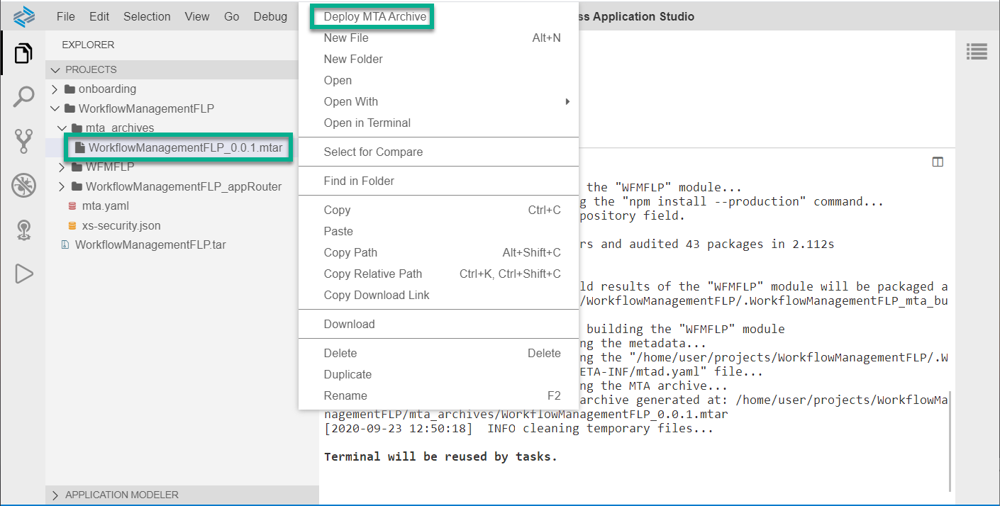

    > It will take approximately 5 minutes to deploy the multitarget application.

    

[DONE]
[ACCORDION-END]


[ACCORDION-BEGIN [Step 12: ](Start workflow in your custom tile)]
After deployment is finished, open the SAP Fiori launchpad site that contains the workflow applications.

1. In your web browser, open the [SAP Cloud Platform trial cockpit](https://cockpit.hanatrial.ondemand.com/).

2. Navigate to the trial global account by clicking **Enter Your Trial Account**.

3. In your **trial** subaccount, under **Spaces**, access your space, for example, **`dev`**.

4. From the list of applications, click the name link of **`WorkflowManagementFLP_appRouter`**.

    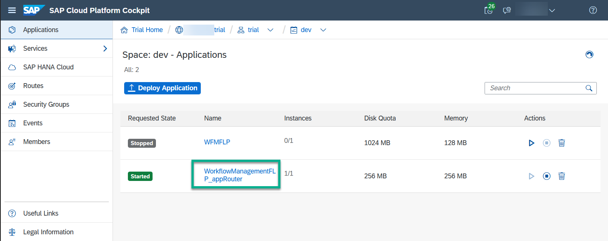

5. Under **Application Routes**, click the link.

    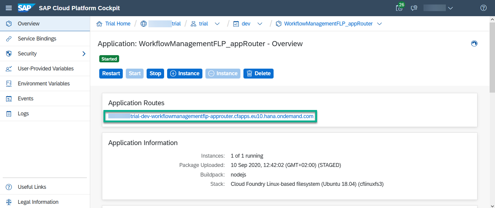

6. In the SAP Fiori launchpad, the new **Onboarding** tile displays.

    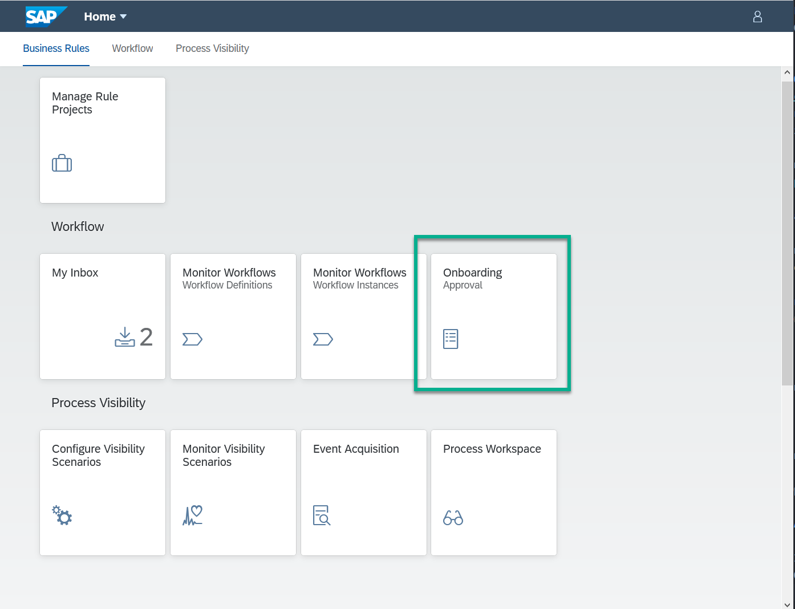

7. Open the **Onboarding** tile, and enter the following data:

    | Field          | Data           |
    | :--------------| :--------------|
    | **First Name** | **Lara**       |
    | **Last Name**  | **`Bryson`**   |
    | **Country**    | **France**     |  
    | **Hire Date**  | **2020-07-01** |
    | **Job Title**  | **Developer**  |

8. Choose **Start Approval**.

    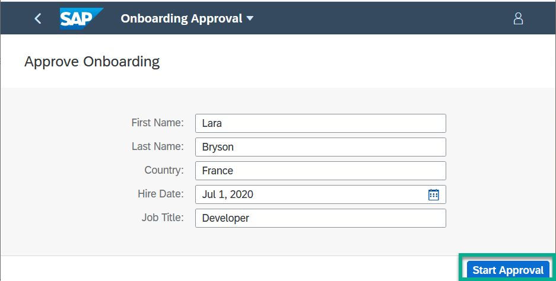

9. Open the **My Inbox** tile, to access the **Approval** task. Set the **Relocation** and **Equipment** fields, and then choose **Approve** to process the task.

    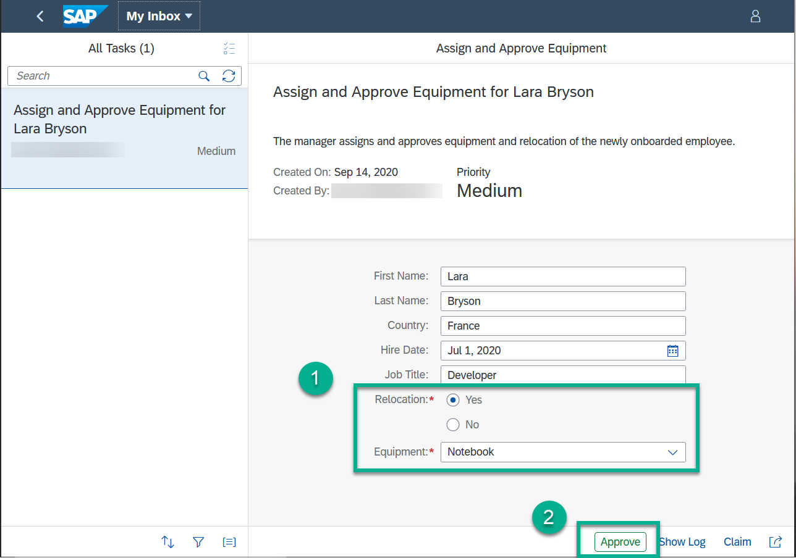

[VALIDATE_5]
[ACCORDION-END]

---
Summary

Now, you have created a custom end user UI for your workflow using a start form. To learn more about SAP Cloud Platform Workflow, see:

- The [workflow service on the Help Portal](https://help.sap.com/viewer/product/WORKFLOW_SERVICE/Cloud/en-US) with entry points to our documentation and blogs
- The workflow service in the service catalog of [Discovery Center](https://discovery-center.cloud.sap/#/serviceCatalog/workflow)
