## Prerequisites  
- You have executed the previous tutorials in [Get started with SAP Workflow Service](group.cp-workflow-cf).
- Make sure that you use a dev space with the extension **Launchpad Module**.
- You have created a destination to the workflow service instance with the authentication method `OAuth2JWTBearer`. See [Destinations Pointing to Service Instances](https://help.sap.com/viewer/cca91383641e40ffbe03bdc78f00f681/Cloud/en-US/685f383cebb54c009b2fac633b32c90f.html).

## Details
### You will learn  
  - How to start an instance of the workflow definition that you have defined using a start form

---
[ACCORDION-BEGIN [Step 1: ](Assign entitlements to your subaccount)]

So that you can deploy the `WorkflowManagementFLP_0.0.1.mtar` later on, you need to assign the Application Runtime and Portal entitlements to your subaccount.

1. In your web browser, open the [SAP Cloud Platform trial cockpit](https://cockpit.hanatrial.ondemand.com/).

2. Navigate to the trial global account by clicking **Enter Your Trial Account**.

3. Access your **trial** subaccount.

4. From the navigation area, choose **Entitlements**, and choose for **Configure Entitlements**.

5. Choose **Add Service Plans** and search for **Launchpad**.

6. Select **Launchpad** and choose **Add Service Plans**. From the available plans only select the **Standard (Subscription) Launchpad** option.

8. Save your entries.    

[DONE]
[ACCORDION-END]

[ACCORDION-BEGIN [Step 2: ](Subscribe to the Launchpad service)]

1. From the navigation area, choose **Service Marketplace**.

2. Search for the Launchpad service, which is not subscribed yet.

    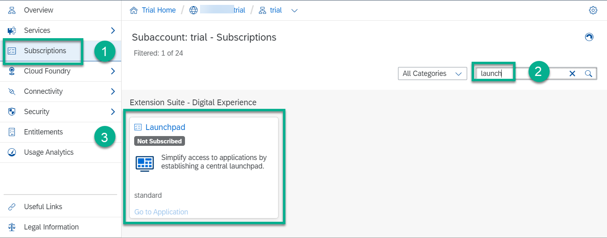

3. In the **Launchpad** details, choose **Create**.

4. In the wizard, check that the entry for **Service** is **Launchpad** and set **Plan** to **standard**.

5. Choose **Create**.

You see a popup that the subscription is created. To display the new status, choose **View Subscription**.

[DONE]
[ACCORDION-END]

[ACCORDION-BEGIN [Step 3: ](Assign yourself the Launchpad_Admin role collection)]

1. From the navigation area of your subaccount, choose **Security** | **Trust Configuration**.

2. From the list, choose the name of your IdP.

3. Enter your mail address, and choose **Show Assignments**.

    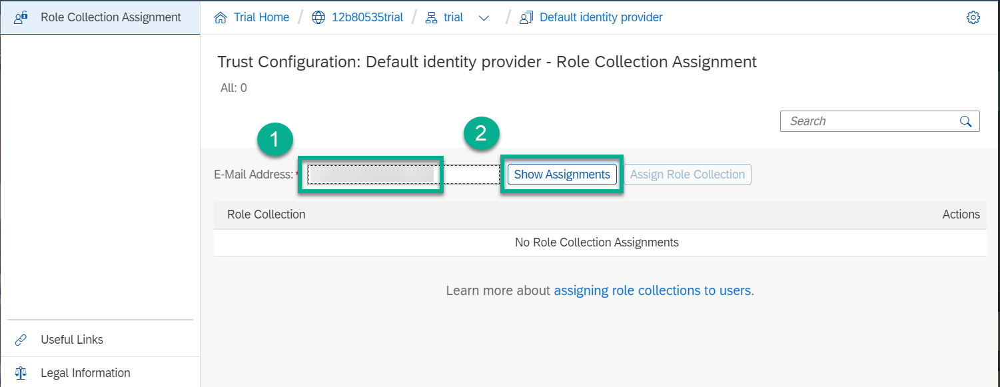

4. Choose **Assign Role Collection**, and then select **`Launchpad_Admin`**.

    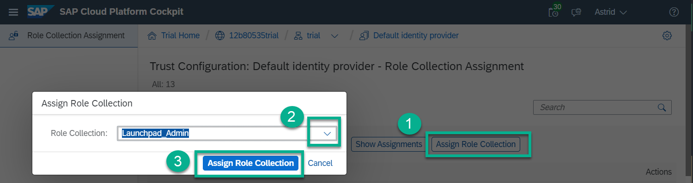

[DONE]
[ACCORDION-END]

[ACCORDION-BEGIN [Step 4: ](Create a start form)]
1. In your web browser, open the [SAP Business Technology Platform Trial cockpit](https://account.hanatrial.ondemand.com/cockpit).

2. Choose **SAP Business Application Studio** and access your dev space.

3. In your workspace, select **onboarding** | **approvals** | **forms**, then start the forms creation.

    On a Windows PC, choose **F1** | **Workflow: Create New Form**.

    On a MAC PC, enter **`COMMAND + SHIFT + P`** and then choose **Workflow: Create New Form**.

    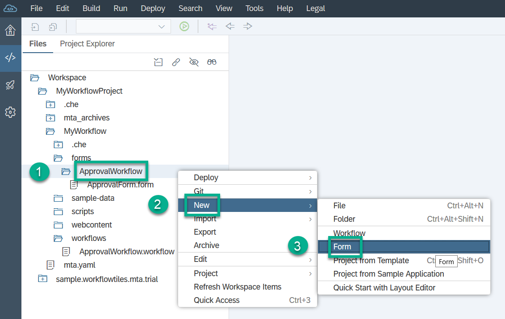

4. You are prompted to enter the following:

    | **Field**            | **Value**                         |
    | :--------------------| :-------------------------------- |
    | **Workflow module**  | **`approvals`**                   |
    | **File name**        | **`onboardingapprovalform`**      |
    | **Form type**        | **Start Form**                    |
    | **Revision**         | **1.0**                           |

    The forms folder now contains your new form `onboardingapprovalform.form`.

[DONE]
[ACCORDION-END]

[ACCORDION-BEGIN [Step 5: ](Add fields to your start form)]

Once the form editor opens, add form data by choosing **Add Field**.

These expressions refer to the attributes in the JSON file that you have created in the previous step.

| Label/Title    | Type       | Context Path                         |
| :--------------| :----------| :------------------------------------|
| **First Name** | **String** | **`${context.empData.firstName}`**   |
| **Last Name**  | **String** | **`${context.empData.lastName}`**    |
| **Country**    | **String** | **`${context.empData.country}`**     |      
| **Hire Date**  | **Date**   | **`${context.empData.hireDate}`**    |      
| **Job Title**  | **String** | **`${context.empData.jobTitle}`**    |      

[DONE]
[ACCORDION-END]

[ACCORDION-BEGIN [Step 6: ](Add a start action)]

1. Switch to the **ACTION** tab of the form editor.

2. Enter `Start Approval` in the **Start Action Text** field, then choose **Select** next to **Workflow File Name**.

    The available workflow files are displayed.

4. Choose **/workflows/onboard.workflow**, and choose **OK**.

      

[DONE]
[ACCORDION-END]

[ACCORDION-BEGIN [Step 7: ](Build and deploy)]

1. Right-click the **mta.yaml** file in your **onboarding** project, and then select **Build MTA Project**.

    Once the build is completed, the new folder **`mta_archives`** appears under your application folder.

2. Right-click the `.mtar` file, and then select **Deploy MTA Archive**.

    > Note: You might be asked to log in to your Cloud Foundry space. Enter the right API endpoint depending on your region, for example, `https://api.cf.eu10.hana.ondemand.com`, your username and password, and select your Cloud Foundry org and space.

[DONE]
[ACCORDION-END]

[ACCORDION-BEGIN [Step 8: ](Create your launchpad site)]

1. Access your **trial** subaccount.

2. From the navigation area, choose **Instances and Subscriptions**, and search for **Launchpad**.

3. From the navigation area, choose **Subscriptions**.

4. On the **Launchpad** tile, choose **Go to Application**.

    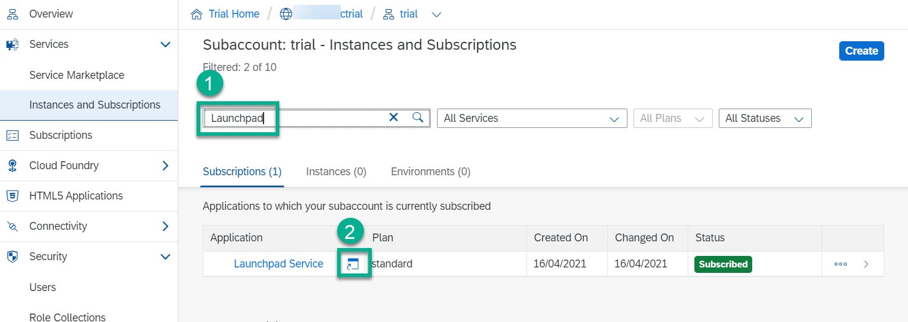

5. On the **Site Directory** that opens, choose **Create Site**.

    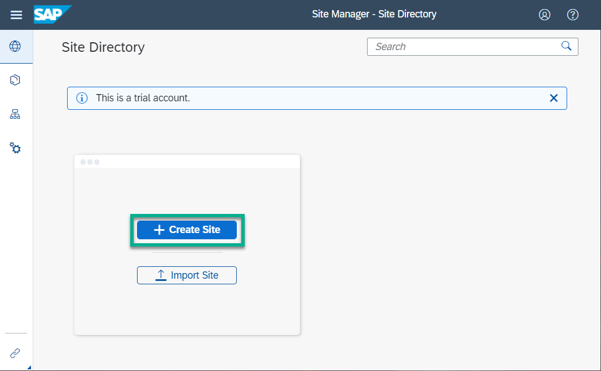

6. Enter the site name `mysite`, then choose **Create**.

[DONE]
[ACCORDION-END]

[ACCORDION-BEGIN [Step 9: ](Create your custom launchpad tile)]

1. In the navigation area of the central SAP Fiori launchpad, choose the **Provider Manager** icon.

    

2. To make the default HTML5 Apps content provider load the standard apps of the workflow service, choose the **Refresh** action.

    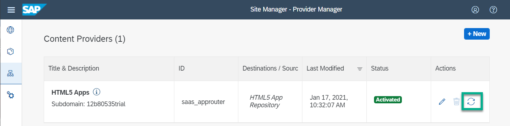

3. In the navigation area, choose the **Content Manager** icon, and open the **Content Explorer** tab.

    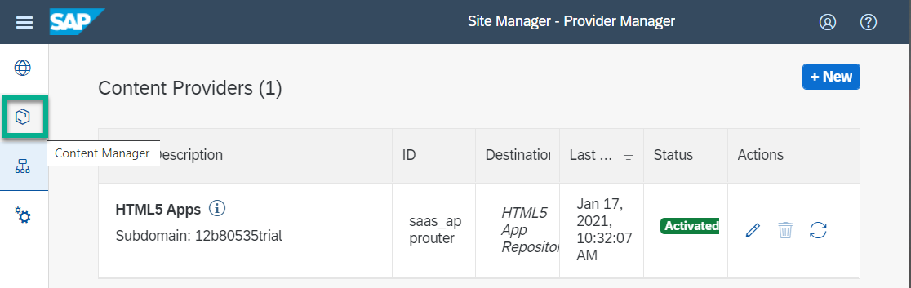

  >If the standard items are not displayed, check whether you have set up the destination correctly in the prerequisites.

4. In the dropdown, choose the **HTML5 Apps** content provider.

    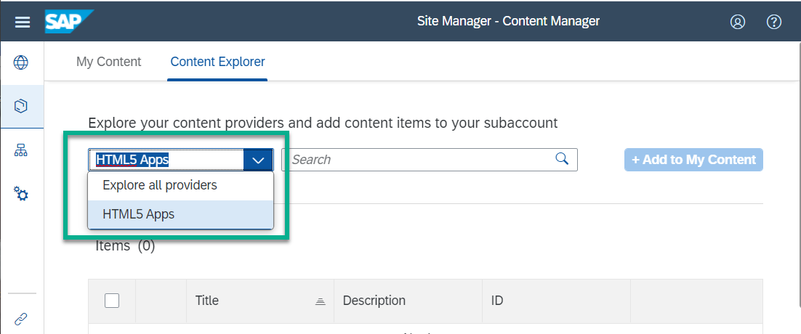

5. Select the following items and choose **Add to My Content**:

    - My Inbox
    - BPM Form Player

    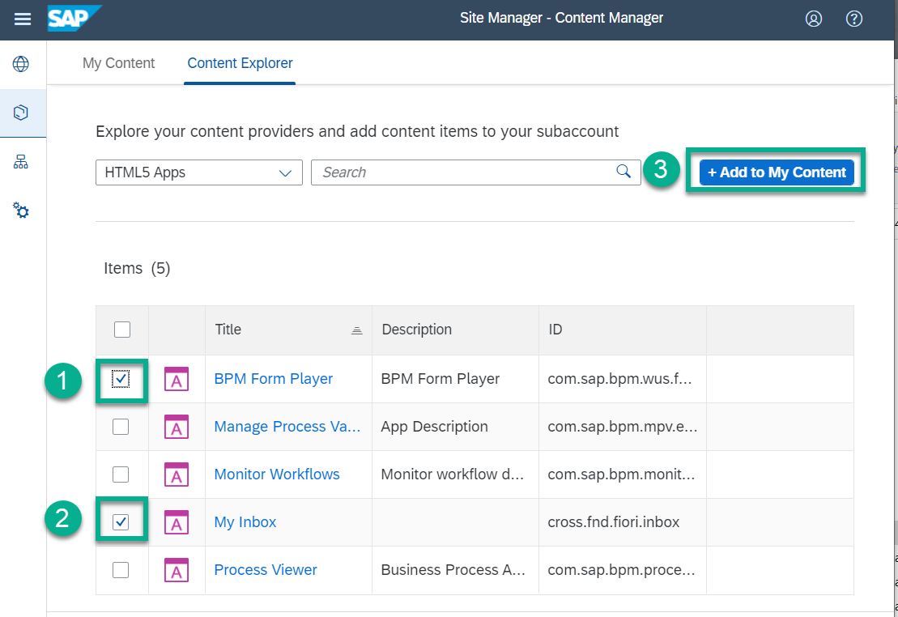

6. On the **My Content** tab, navigate into the **My Inbox** item.

7.  On the screen that opens, choose **Create a Local Copy**.

    For this exercise, we do not change the standard texts.

    > You must not change the **Configuration** data.

8. Click the **Back to Content Management** arrow icon, and on the **My Content** tab, navigate into the **BPM Form Player** item.

    1. On the screen that opens, choose **Create a Local Copy**.

    2. To adapt the texts on the **PROPERTIES** tab under **General**, choose **Edit**.

        Enter the title `Onboarding`. To make the text appear, you need to adapt it on the **TRANSLATION** tab as well:
       In the **Title - English (en)** field, enter **Onboarding**.
       In the **Subtitle - English (en)**, enter **Onboarding Employees**.

    > You must not change the **Configuration** data.

    3. To configure your local copy of the Start-Form-Based Workflow Start App, open its **NAVIGATION** tab.
    4. Set the parameters by adding new parameters that match the ones of your start form configuration:

    | Name                    | Default Value                |
    | :-----------------------| :--------------------------- |
    | **`formDefinitionId`**  | **`onboardingapprovalform`** |
    | **`revision`**          | **1.0**                      |
    | **`appTitle`**          | **Onboarding Approval**      |
    | **`formTitle`**         | **Approve Onboarding**       |

    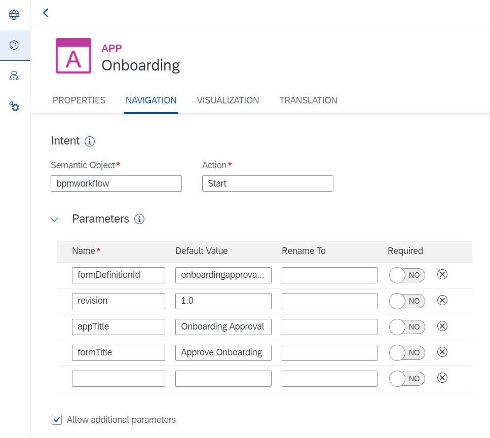

9. Save your changes.

10. Create a group and assign your local copies of the apps to it.

    1. Click the **Back to Content Management** arrow icon, choose the **My Content** | **`+New`** | **Group**.

    2. Enter the title **Workflow**.

    3. Save your changes.

    4. Click the **Back to Content Management** arrow icon, and access the **Workflow** group.

    5. Choose **Edit**, click inside the **Assign Items** field, and choose the + next to **My Inbox (Local Copy)** and **Onboarding Local**.

        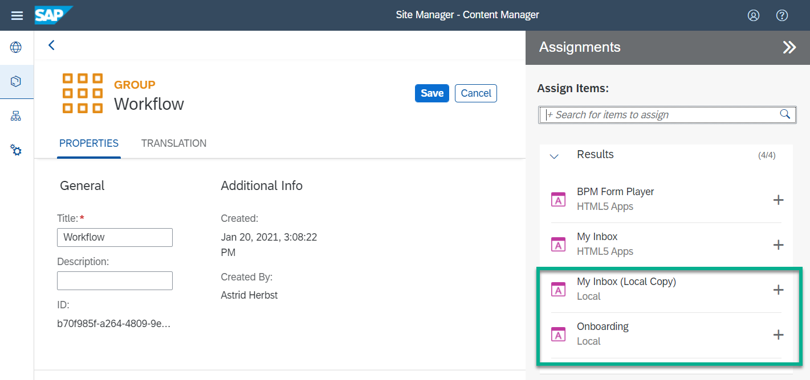

    6. Save your changes.

11. Assign your local copies to a role so that users can access them.

    1. Click the **Back to Content Management** arrow icon, and access the **Everyone** role.

    2. Choose **Edit**, click inside the **Assign Items** field, and choose the + next to **My Inbox (Local Copy)** and **Onboarding Local**.

    3. Save your changes.

[DONE]
[ACCORDION-END]

[ACCORDION-BEGIN [Step 10: ](Start the workflow in your custom tile)]
After deployment is finished, open your launchpad site that contains the workflow applications.

1. In the **Site Directory**, open your site **`mysite`** icon.

    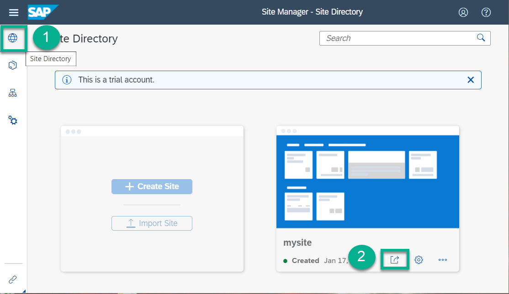

2. Open the **Onboarding** tile, and enter the following data:

    | Field          | Data           |
    | :--------------| :--------------|
    | **First Name** | **Lara**       |
    | **Last Name**  | **`Bryson`**   |
    | **Country**    | **France**     |  
    | **Hire Date**  | **2020-07-01** |
    | **Job Title**  | **Developer**  |

3. Choose **Start Approval**.

4. Open the **My Inbox** tile, to access the **Approval** task. Set the **Relocation** and **Equipment** fields, and then choose **Approve** to process the task.

    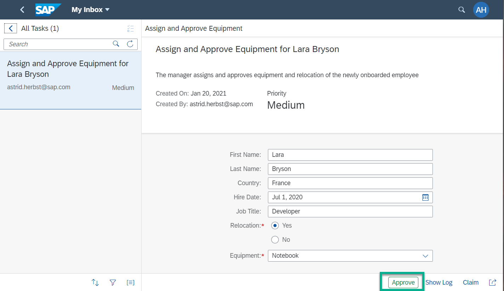

[VALIDATE_5]
[ACCORDION-END]

---
Summary

Now, you have created a custom end user UI for your workflow using a start form. To learn more about SAP Workflow service, see:

- [The SAP Help Portal](https://help.sap.com/viewer/product/WORKFLOW_SERVICE/Cloud/en-US) with entry points to our documentation and blogs
- The service catalog of [SAP Discovery Center](https://discovery-center.cloud.sap/#/serviceCatalog/workflow)
