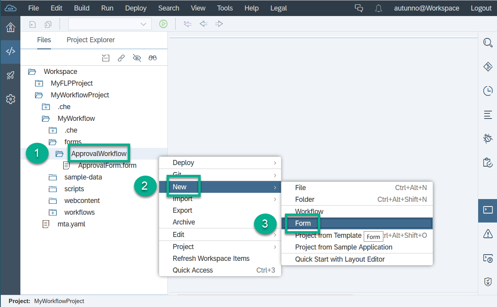
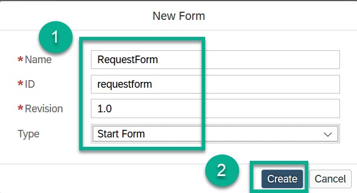
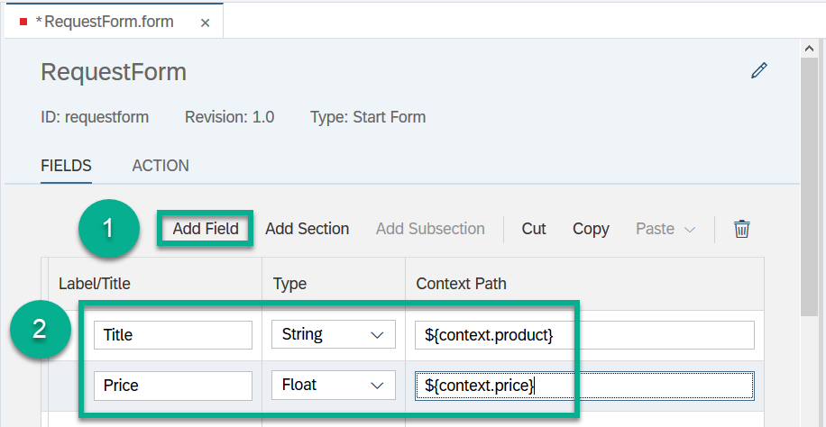
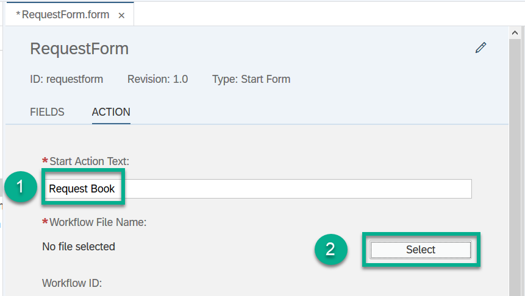
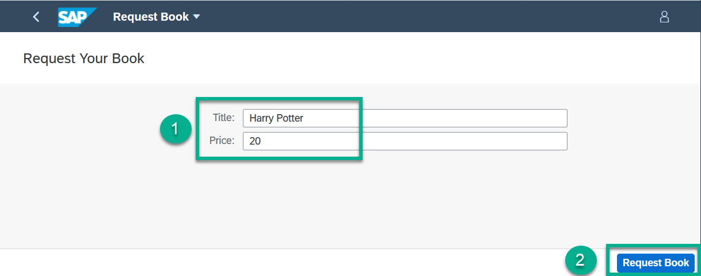
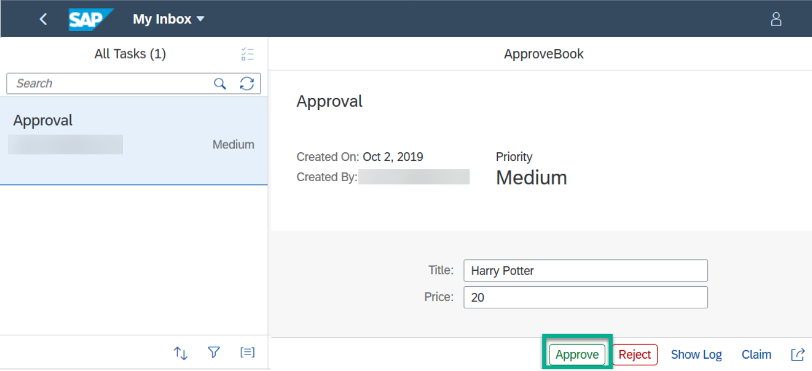

## Details
### You will learn  
  - How to start an instance of the workflow definition that you have defined using a start form

---
[ACCORDION-BEGIN [Step 1: ](Launch SAP Web IDE)]
1. In your web browser, open the cockpit of [SAP Cloud Platform Trial](https://account.hanatrial.ondemand.com/cockpit).

2. Choose **Launch SAP Web IDE**.

     

[DONE]
[ACCORDION-END]

[ACCORDION-BEGIN [Step 2: ](Create a start form)]
1. In your workspace, choose **`forms`** | **`ApprovalWorkflow`**, then choose **New** | **Form**.

    

2. In the popup, change the following entries, then choose **Create**:

    | **Name**             | **Value**                         |
    | :--------------------| :-------------------------------- |
    | **Name**             | **`RequestForm`**                 |
    | **Revision**         | **`1.0`**                         |
    | **Type**             | **Start Form**                    |

    

[DONE]
[ACCORDION-END]

[ACCORDION-BEGIN [Step 3: ](Add fields to your start form)]

1. In the form editor (for the ``RequestForm.form``), select the **Fields** section.

2. To add two new fields, click **Add Field** twice, and enter the following data to define the fields:

    | **`Lable/Title`**    | **Type**      | **Context Path**            |
    | :------------------- | :------------ | :-------------------------- |
    | **Title**            | **String**    | **`${context.product}`**    |
    | **Price**            | **Float**     | **`${context.price}`**      |

    

[DONE]
[ACCORDION-END]

[ACCORDION-BEGIN [Step 4: ](Add a start action)]

1. Switch to the **Actions** section of the form editor (for the ``RequestForm.form``).

2. Enter `Request Book` in the **Start Action Text** field, then choose **Select** next to **Workflow File Name**.
    The available workflow files are displayed.

      

4. Choose **/workflows/ApprovalWorkflow.workflow**, and choose **OK**.

5. Save your changes.

[DONE]
[ACCORDION-END]

[ACCORDION-BEGIN [Step 5: ](Build the workflow project)]

1. Build the **`MyWorkflowProject`** project by right-clicking it and choosing **Build** | **Build**.

    

2. In your workspace from the **`mta_archives`** folder, right-click the `MyWorkflowProject_0_0_1.mtar` file and choose **Deploy** | **Deploy to SAP Cloud Platform**.

3. In the popup, select your API endpoint, organization, and space.

4. Choose **Deploy**.

[DONE]
[ACCORDION-END]

[ACCORDION-BEGIN [Step 6: ](Start your workflow in SAP Fiori launchpad)]
1. In the SAP Fiori launchpad, choose **Refresh (F5)** to display your new tile named **Request Book**.

    

2. Click the tile, and enter any title and price, for example, `Harry Potter` and `20` and choose **Request Book**.

    

3. In the SAP Fiori launchpad, the **My Inbox** tile displays the **Approval** task.

4. Open **My Inbox**, choose **Approve** to process the task.

  

[VALIDATE_5]
[ACCORDION-END]

---
