## Details
### You will learn  
- To build a user task.
- To implement a SAPUI5 application that has a page (called "view").
- To complete the workflow by approving or rejecting the task in My Inbox.

### Time to Complete
**15 Min**

---
[ACCORDION-BEGIN [Step 1: ](Open SAP Web IDE Full-Stack)]
1. In your Web browser, open the cockpit of [SAP Cloud Platform](https://account.hanatrial.ondemand.com/cockpit).
2. Choose **Neo Trial**.
3. Select **Services** from the left-hand navigation.
4. Search for the **Workflow** service. Then select it, and choose **SAP Web IDE for Full-Stack Development**.

[ACCORDION-END]

[ACCORDION-BEGIN [Step 2: ](Creating a new SAPUI5 application)]
In the SAP Web IDE Full-Stack, create a new project using a template.
1. In the navigation area, choose the home icon.
2. Choose **New Project from Template**.
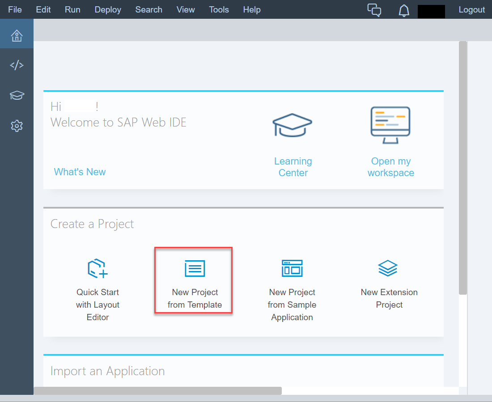
3. Choose **SAPUI5 Application**.
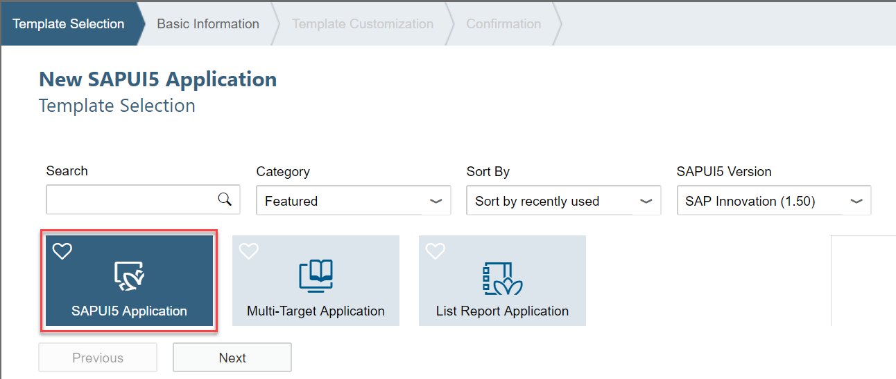
4. Choose **Next**.
5. Enter a name for the new workflow project, for example, 'BookUIApplication' and a namespace, for example, 'BookUIApplication'.
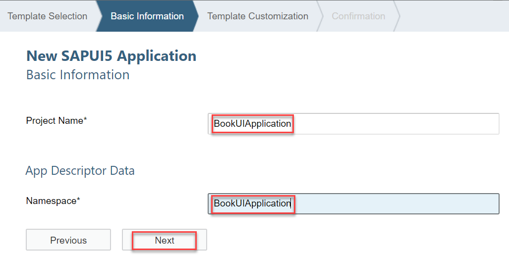
6. Choose **Next**.
7. Enter a name for the view, for example, 'ApproveBookView'.
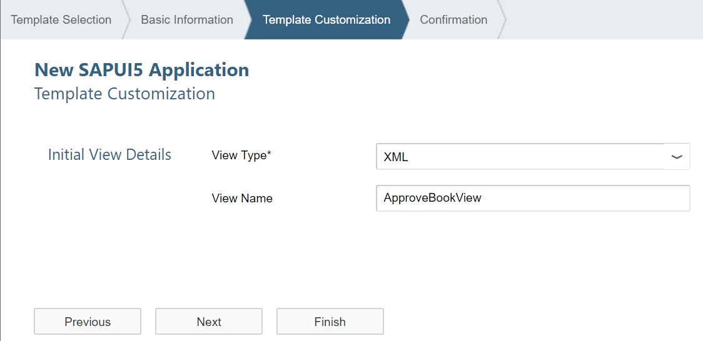
8. Choose **Finish**.
9. Choose **Run**.
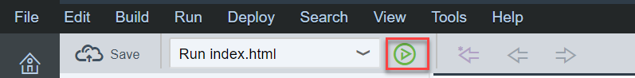
The HTML page is still empty. You need to add the necessary UI controls for displaying the book details, like title and price.

[ACCORDION-END]

[ACCORDION-BEGIN [Step 3: ](Create the form layout)]
1. To use the form layout, enable the **sap.ui.layout** package in the project settings of SAP Web IDE:
    1. Choose **Workspace** | **BookUIApplication**.
    2. Right-click the **BookUIApplication** project, and choose **Project Settings**.
     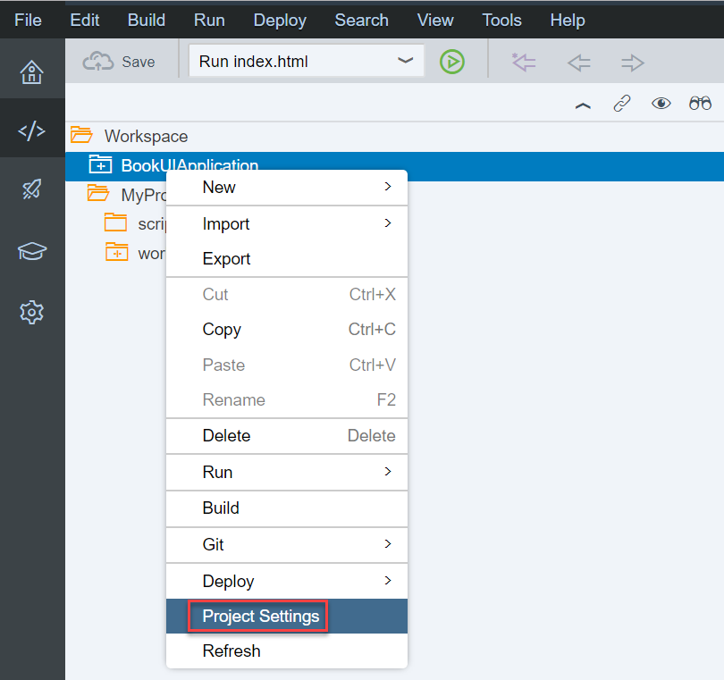
     Under **SAPUI5**, select the **sap.ui.layout** package, and then **Save**.
     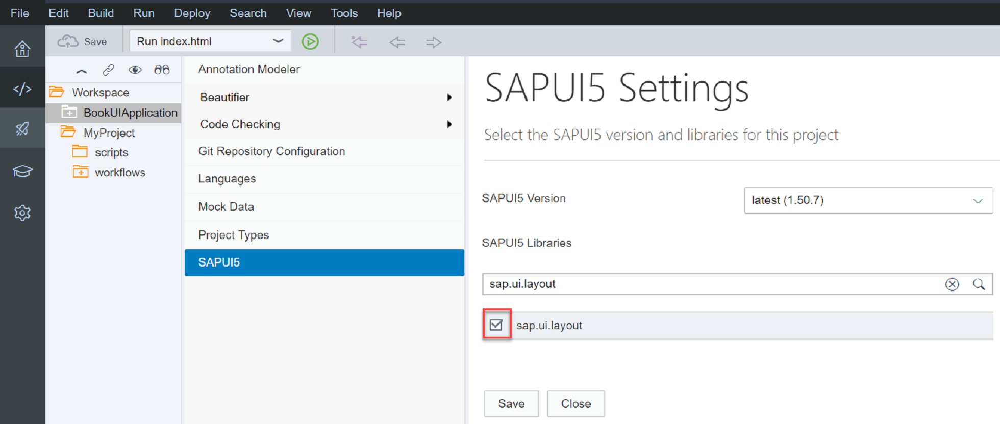
2. Open the newly created view using the layout editor:
    1. Choose **Workspace** | **BookUIApplication** | **webapp** | **view** | **ApproveBookView.view.xml**.
    2. Right-click and choose **Open With** | **Layout Editor**.
     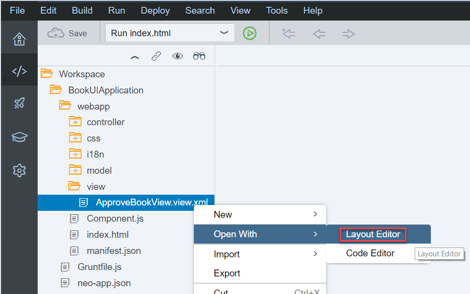    
3. To add a form to the page, choose **Layout** | **Simple Form** and drag it onto the editor canvas.
     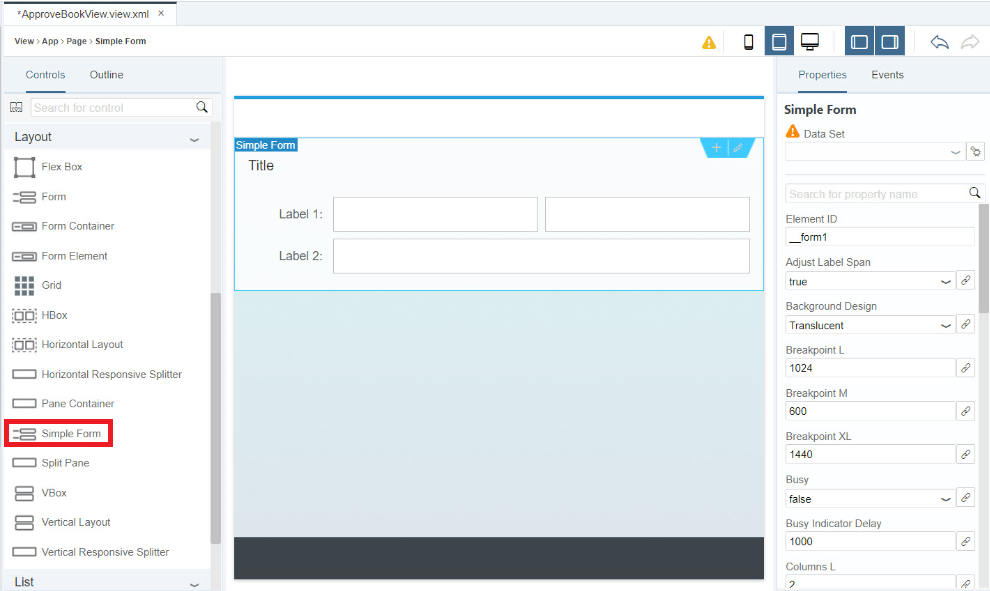    
4. Select the **Title** element, and change the title text under **Properties** to 'Book Details'.
     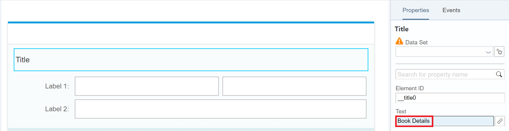
5. Similarly, select and change the **Label 1** text to 'Title' and **Label 2** to 'Price'.
6. Remove the second input control in the first row by selecting it and then pressing the delete key.
Your page layout should now look like this:
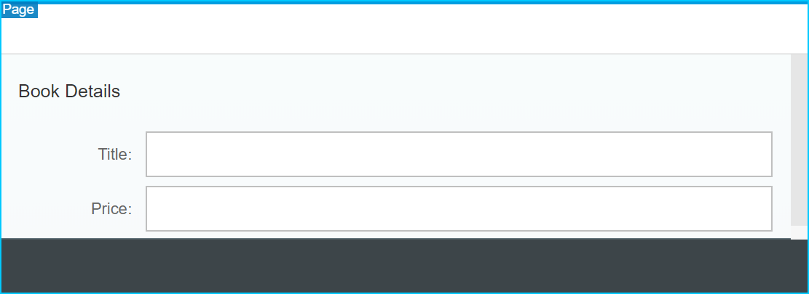

[ACCORDION-END]

[ACCORDION-BEGIN [Step 4: ](Add a data binding)]
1. To bind the UI controls to data from the workflow context, use the **Value** field in the properties of the input control:
    1. Select the input control with the label **Title**, and enter '{/product}'.
    2. Select the input control with the label **Price**, and enter '{/price}'.
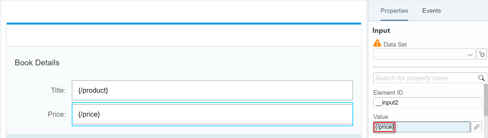
2. To prevent the approver from changing the title or price, set the **Editable** property to **false** for both input elements.
3. Choose **Save**.

[ACCORDION-END]

[ACCORDION-BEGIN [Step 5: ](Initialize the data model)]
To make the workflow context available to the UI controls, you need to retrieve the task context data. To do this, call the Workflow REST API with the task ID of the currently shown task instance in My Inbox. My Inbox passes this data to our component using the startup parameters.

1. Open the **Component.js** file under **Workspace** | **BookUIApplication** | **webapp**.
2. Find the **init** function, and add the following code snippet to the file:


    ```javascript
    // get task data
    var startupParameters = this.getComponentData().startupParameters;
    var taskModel = startupParameters.taskModel;
    var taskData = taskModel.getData();
    var taskId = taskData.InstanceID;

    // initialize model
    var contextModel = new sap.ui.model.json.JSONModel("/bpmworkflowruntime/rest/v1/task-instances/" + taskId + "/context");
    contextModel.setDefaultBindingMode(sap.ui.model.BindingMode.OneWay);
    this.setModel(contextModel);
    ```
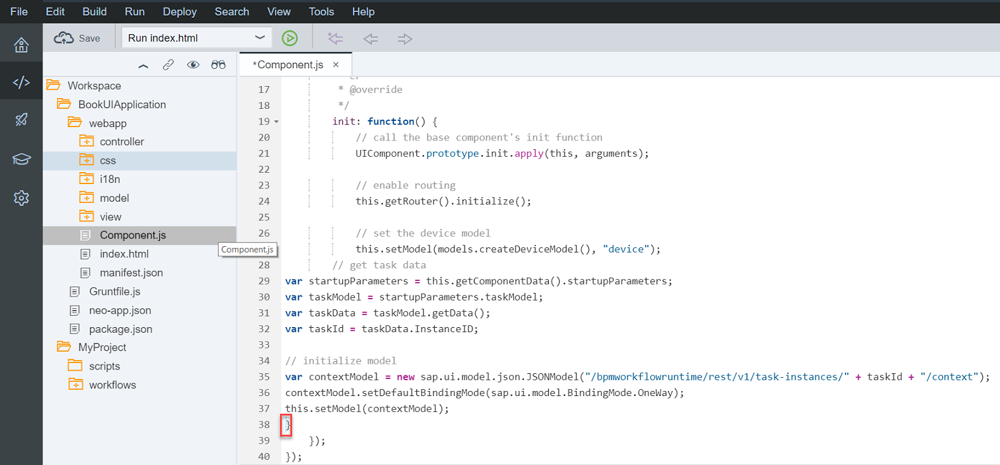
3. Choose **Save**.
4. To deploy the project, select the project in the workspace and choose **Deploy** | **Deploy to SAP Cloud Platform**. On the following screen, choose **Deploy**.
   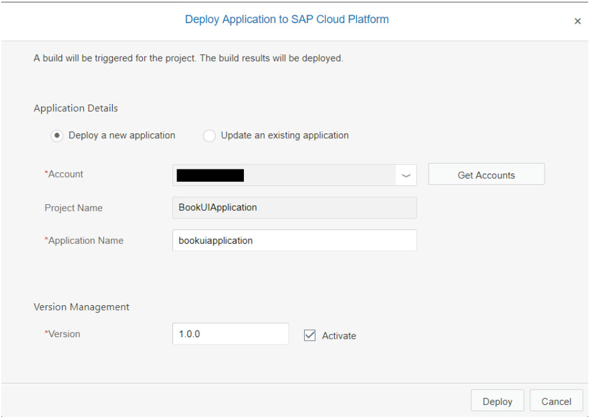
    > Note: If you open the application in the browser, you see a blank page because the UI only works when running inside the My Inbox application.  

[ACCORDION-END]  

[ACCORDION-BEGIN [Step 6: ](Link the UI5 component to the user task)]

You can now refer to the deployed UI5 application from your approval task in the workflow:

1. In the SAP Web IDE, open the workflow file and select the **ApproveBook** task.
2. Under **Details** in the **User Task Properties**, find the properties for specifying the user interface.
3. Choose **Select**.

4. Select the **BookUIApplication** project and the **webapp** component path.
5. Choose **OK**.
   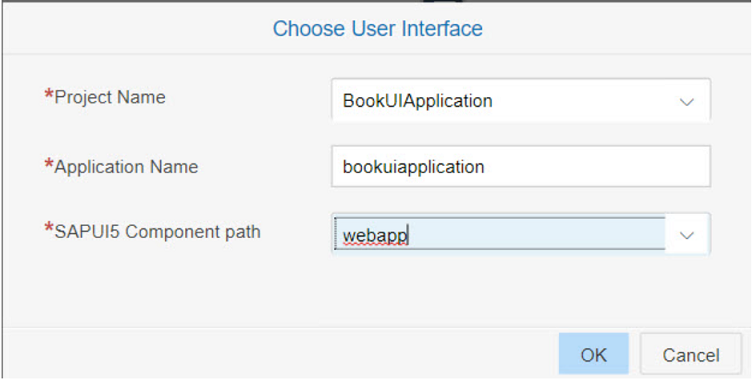
6. Choose **Save**.  
7. To deploy the workflow file again, select it in the workspace and choose **Deploy** | **Deploy to SAP Cloud Platform Workflow**.
8. To test the workflow, start a new instance from the **Monitor Workflow** application and open the task in My Inbox.
   You should see the following task details:
   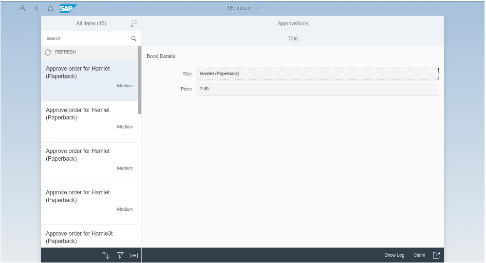

[ACCORDION-END]

[ACCORDION-BEGIN [Step 7: ](Add Approve and Reject buttons)]
To add **Approve** and **Reject** buttons to actually complete the task, go back and edit the **Component.js** file again.

1. Open the **Component.js** file under **Workspace** | **BookUIApplication** | **webapp**.
2. Add the following functions to your component:  
    - "_fetchToken": Retrieves an XSRF token from the workflow service API. The token is used to authenticate when calling the POST method to complete the task.  
    - "_completeTask": Calls the workflow service API to complete the current task, and pass on the approval status ("true" or "false") using the JSON payload to the workflow context.  
    - "_refreshTask": Tells My Inbox to remove the task on completion from the list.

    Right after the closing bracket of the init function, add the following code snippet to the file:

    ```javascript
    ,

		_completeTask: function(taskId, approvalStatus) {
			var token = this._fetchToken();
			$.ajax({
				url: "/bpmworkflowruntime/rest/v1/task-instances/" + taskId,
				method: "PATCH",
				contentType: "application/json",
				async: false,
				data: "{\"status\": \"COMPLETED\", \"context\": {\"approved\":\"" + approvalStatus + "\"}}",
				headers: {
					"X-CSRF-Token": token
				}
			});
			this._refreshTask(taskId);
		}

		, _fetchToken: function() {
			var token;
			$.ajax({
				url: "/bpmworkflowruntime/rest/v1/xsrf-token",
				method: "GET",
				async: false,
				headers: {
					"X-CSRF-Token": "Fetch"
				},
				success: function(result, xhr, data) {
					token = data.getResponseHeader("X-CSRF-Token");
				}
			});
			return token;
		},

		_refreshTask: function(taskId) {
			this.getComponentData().startupParameters.inboxAPI.updateTask("NA", taskId);
		}
    ```
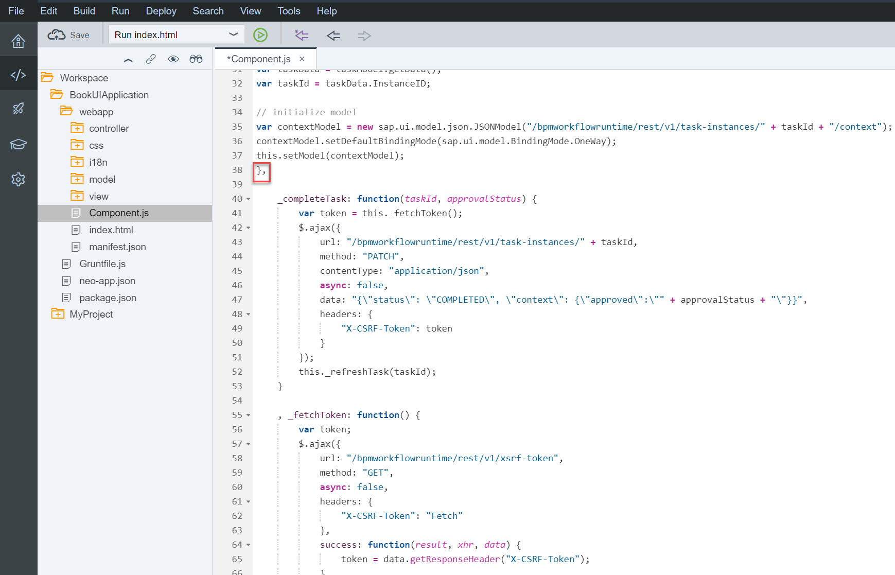
3. Add the **Approve** and **Reject** buttons to the My Inbox action footer by adding the following code to the body of the init function within the **Component.js file**:

    ```javascript
		    //add actions
                    startupParameters.inboxAPI.addAction({
                            action: "Approve",
                            label: "Approve"
                    }, function(button) {
                            this._completeTask(taskId, true);
                    }, this);
                    startupParameters.inboxAPI.addAction({
                            action: "Reject",
                            label: "Reject"
                    }, function(button) {
                            this._completeTask(taskId, false);
                    }, this);
    ```
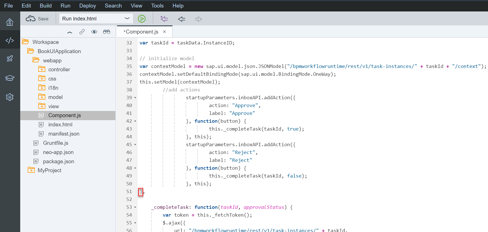
    When the user presses the buttons, the '_completeTask' function will be called.
4. Choose **Save**.

[ACCORDION-END]

[ACCORDION-BEGIN [Step 8: ](Completing the workflow)]
1. Deploy the **BookUIApplication** project again. Select the project and choose **Deploy** | **Deploy to SAP Cloud Platform**. On the following screen, choose **Deploy**.
2. Refresh My Inbox to check the updated UI for the task.
    > Note: To see the new buttons, you may have to clean the browser cache or force a "hard reload".

    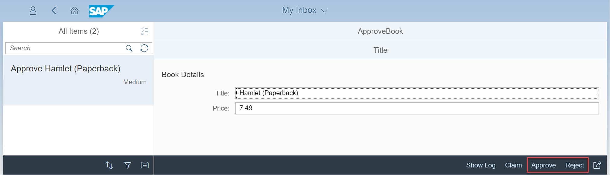
3. To complete the workflow, choose either **Approve** or **Reject** in the My Inbox app.
   The task should disappear from **My Inbox**, and the workflow instance should disappear from the **Monitor Workflows** instances list.
[ACCORDION-END]

---

You defined and deployed a workflow using the SAP Web IDE. You started and monitored workflow instances with the Monitor Workflow app, and you saw user tasks in the My Inbox.
You have successfully completed the implementation of the first version of your Book Order workflow.

Check out the [Workflow Developer Guide](https://help.sap.com/viewer/f85276c5069a429fa37d1cd352785c25/Cloud/en-US/60ae81179050478caa4212fad4ba50f2.html) or explore the [REST API](https://help.sap.com/doc/40db36d987084ab09e496381090e9a2e/Cloud/en-US/wfs-core-api-docu.html).

Share your feedback on SAP Cloud Platform Workflow!

If you want to learn more about the integration of workflow into your user interfaces, check out this [blog](https://blogs.sap.com/2017/10/12/understanding-custom-ui-integration-with-sap-cloud-platform-workflow/).


---
