## Prerequisites  
- **Tutorials:** You have executed the previous tutorials in [Get started with SAP Cloud Platform workflows](https://www.sap.com/developer/groups/cp-workflow-service.html).

## Details
### You will learn  
  - How to define a basic form-based user task UI without having to cope with SAPUI5 coding.
  - How to use it in a user task of a workflow.

---
[ACCORDION-BEGIN [Step 1: ](Open SAP Web IDE Full-Stack)]
1. In your Web browser, open the cockpit of [SAP Cloud Platform](https://account.hanatrial.ondemand.com/cockpit).
2. Choose **Neo Trial**.
3. Select **Services** from the left-hand navigation.
4. Search for the **Workflow** service. Then select it, and choose **SAP Web IDE for Full-Stack Development**.

[ACCORDION-END]

[ACCORDION-BEGIN [Step 2: ](Create a form for a user task)]

1. In the SAP Web IDE Full-Stack, open the ``MyFirstWorkflow.workflow`` workflow file and select the **`ApproveBook`** task.
2. Under **User Task Properties**, select **User Interface**.
   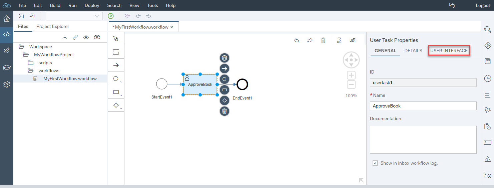
3. In the **Type** field, choose **Form**.
4. To create a new form, choose the **Create File** link.  
   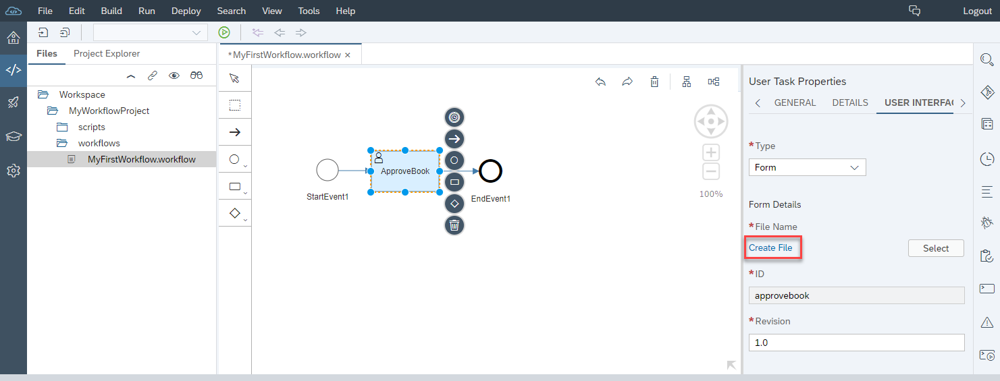
5. In the **New Form** dialog, enter the following data:
      - Name: `ApproveBook`
      - ID: `approvebook`
      - Revision: `1.0`
   
6. Choose **Create**.

  You created the new file ``ApproveBook.form`` in the workflow project in the folder ``MyWorkflowProject/forms/MyFirstWorkflow``. The form editor opened automatically, so you can edit the form in the subsequent steps.
  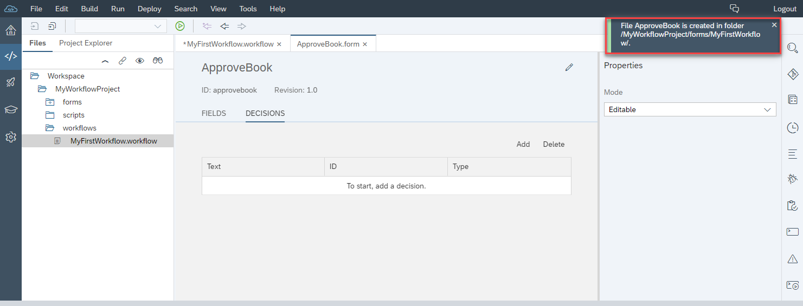

[ACCORDION-END]

[ACCORDION-BEGIN [Step 3: ](Add fields to your form)]

1. In the form editor (for the ``ApproveBook.form``), select the **Fields** section.
2. To add two new fields, click **Add Field** twice.
   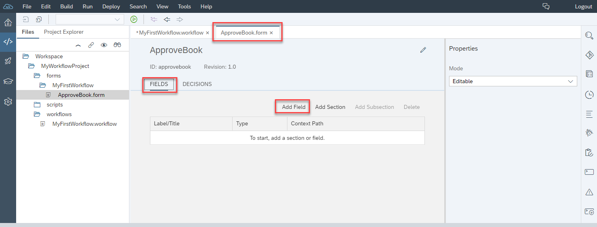
3. Fill the two new rows that are added in the **Fields** section as follows.

    First row:
      - In column **`Lable/Title`**, enter `Title`.
      - In column **Type**, select **String**.
      - In column **Context Path**, enter `${context.product}`.      

    Second row:
      - In column **`Lable/Title`**, enter `Price`.
      - In column **Type**, select **Float**.
      - In column **Context Path**, enter `${context.price}`.
   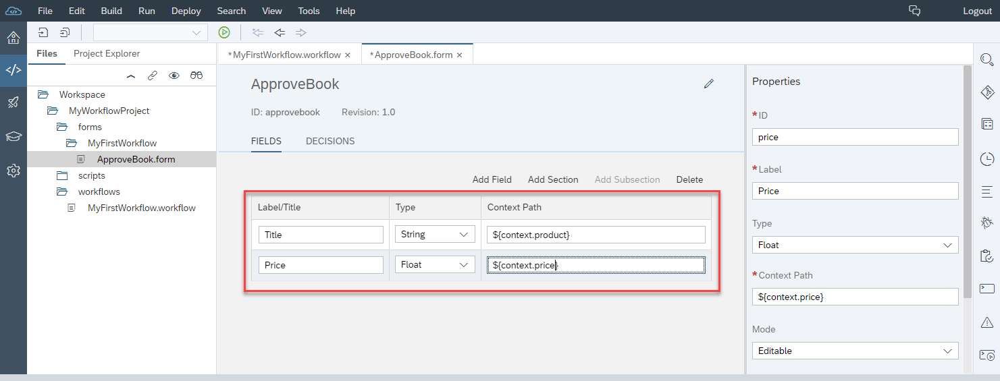

[ACCORDION-END]

[ACCORDION-BEGIN [Step 4: ](Add approve and reject buttons)]

1. In the form editor (for the ``ApproveBook.form``), select the **Decisions** section.
2. To add two new buttons, click **Add** twice.
   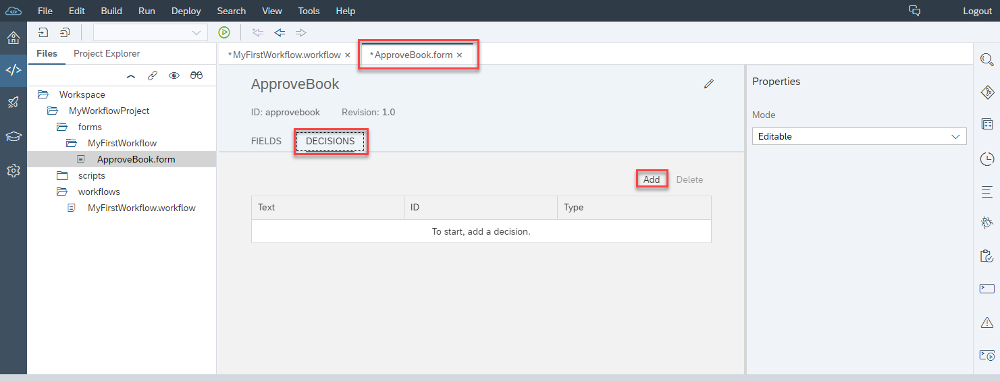
3. Fill the two new rows that are added in the **Decisions** section as follows.

    First row:
      - In column **Text**, enter `Approve`.
      - In column **ID**, make sure that **approve** is entered.
      - In column **Type**, enter **Positive**.

    Second row:
      - In column **Text**, enter `Reject`.
      - In column **ID**, make sure that **reject** is entered.
      - In column **Type**, enter **Negative**.
   

[ACCORDION-END]

[ACCORDION-BEGIN [Step 5: ](Deploy your form)]

1. Select the form file in the workspace.
2. Open the context menu by right-clicking on the ``ApproveBook.form`` file, and choose **Deploy** | **Deploy to SAP Cloud Platform Workflow**.
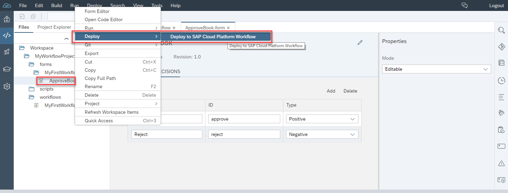

After the successful deployment a corresponding message toast is displayed.
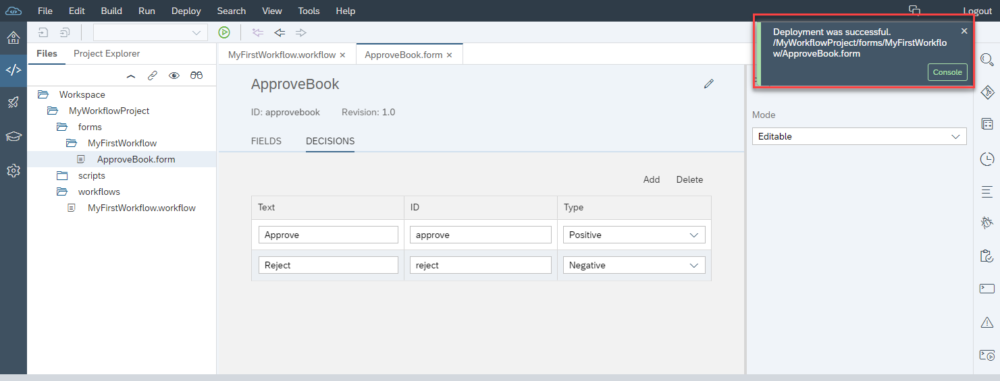

[ACCORDION-END]

[ACCORDION-BEGIN [Step 6: ](Deploy your workflow)]

1. Select the workflow file in the workspace.
2. Open the context menu by right-clicking on the ``MyFirstWorkflow.workflow`` file, and choose **Deploy** | **Deploy to SAP Cloud Platform Workflow**.
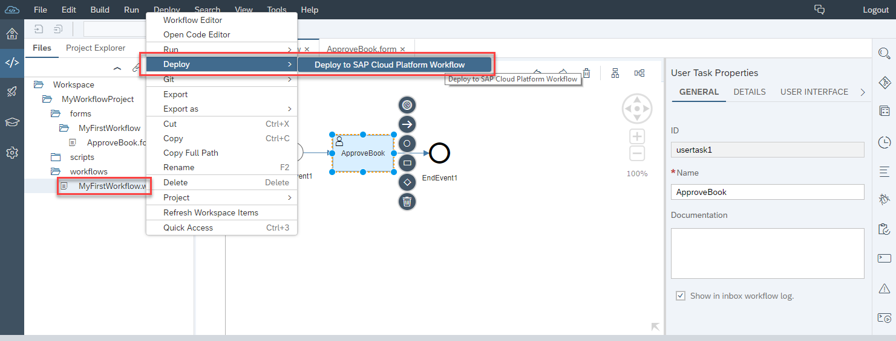

[ACCORDION-END]

[ACCORDION-BEGIN [Step 7: ](Start a new workflow instance)]
1. In the SAP Fiori launchpad, open the **Monitor Workflow - Workflow Definitions** tile.
   Note that the version of your workflow definition has increased from "1" to "2".
2. Choose **Start New Instance**.
3. Leave the standard JSON input as is, and choose **Start New Instance**.

4. Choose **Show Instances**.
   The execution log shows a task waiting in the inbox.
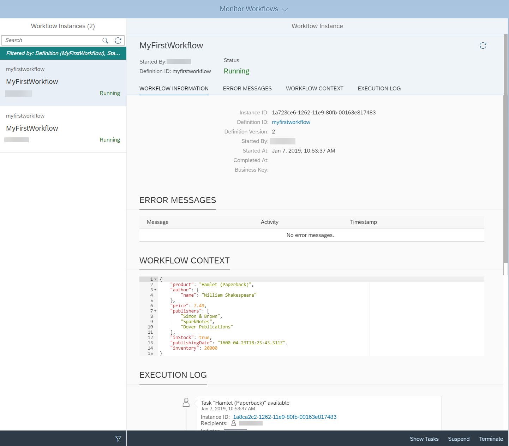

[ACCORDION-END]

[ACCORDION-BEGIN [Step 8: ](Open the task in My Inbox)]
1. Go back to the Fiori launchpad homepage. The **My Inbox** tile shows one open task.
   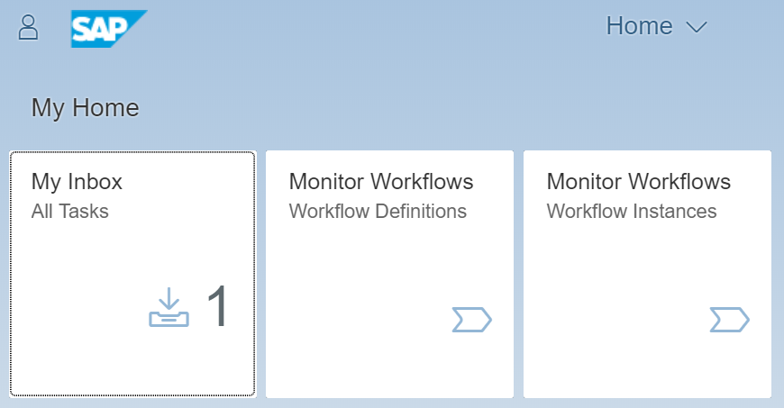
2. Open the inbox. The task and some header information is displayed, but no further details or actions are given.
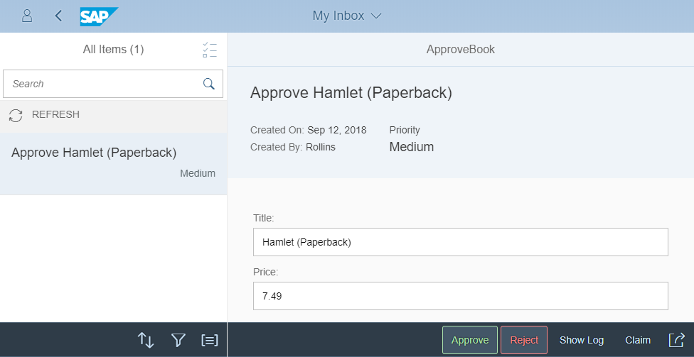

[ACCORDION-END]

---
