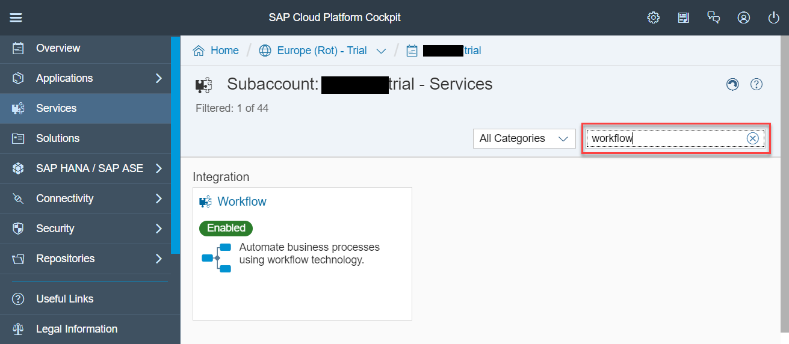
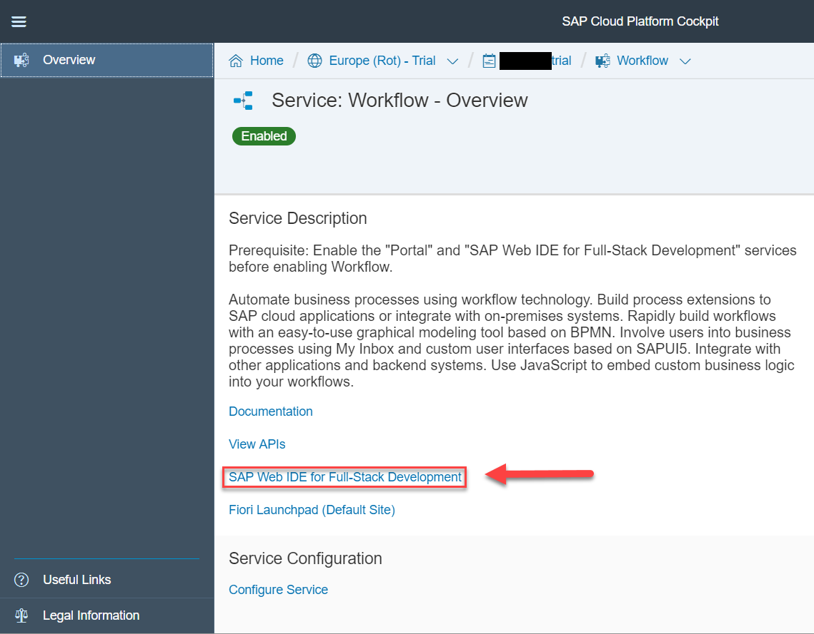
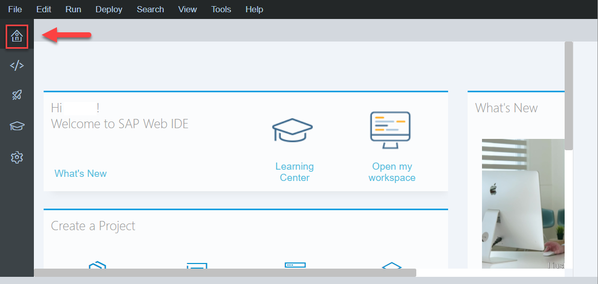
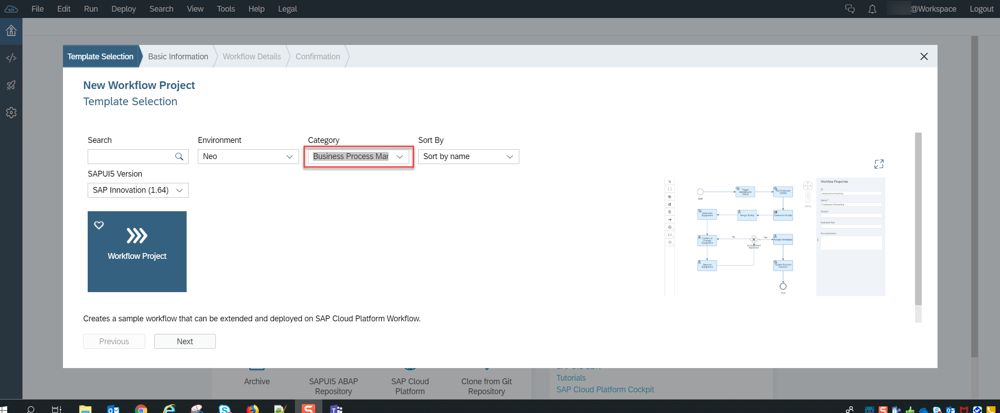
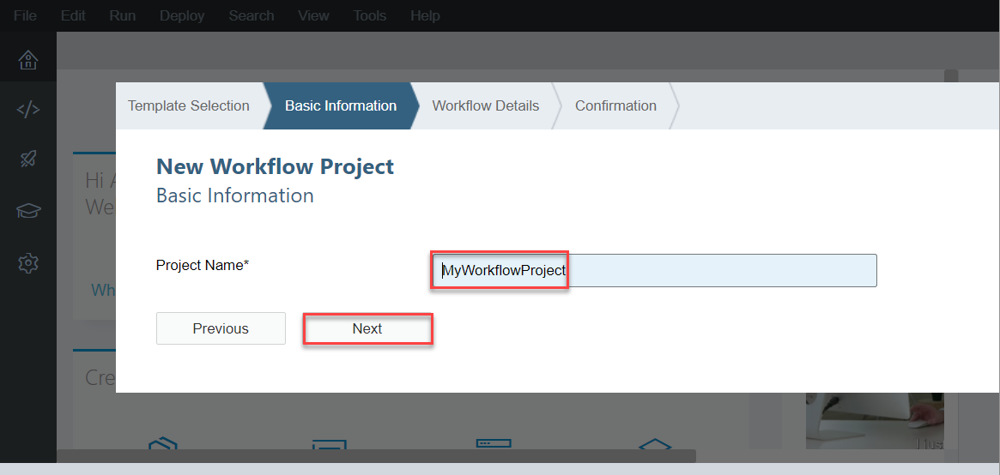
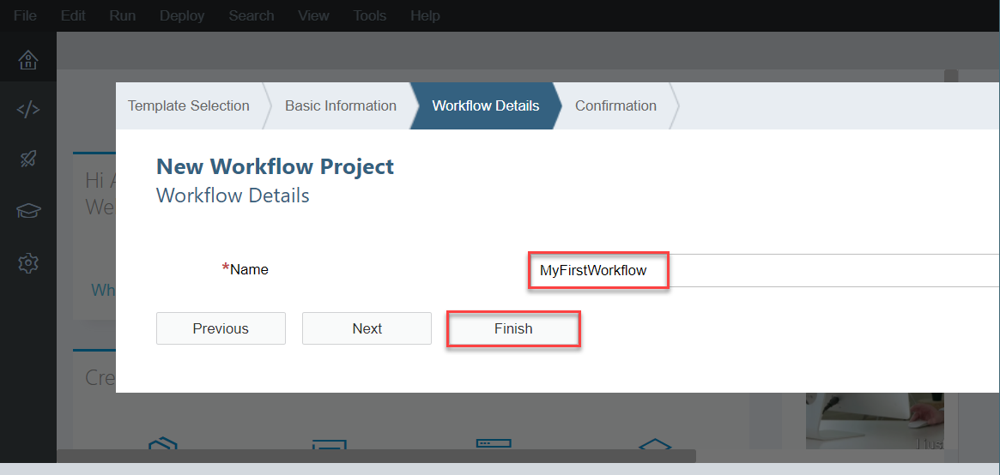
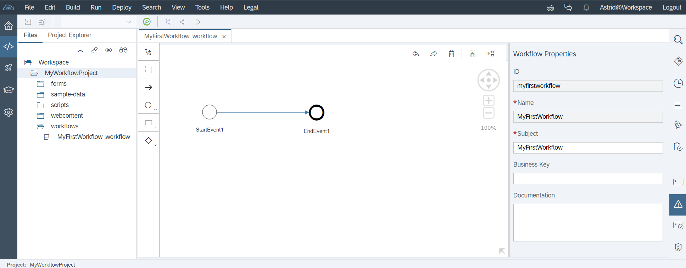
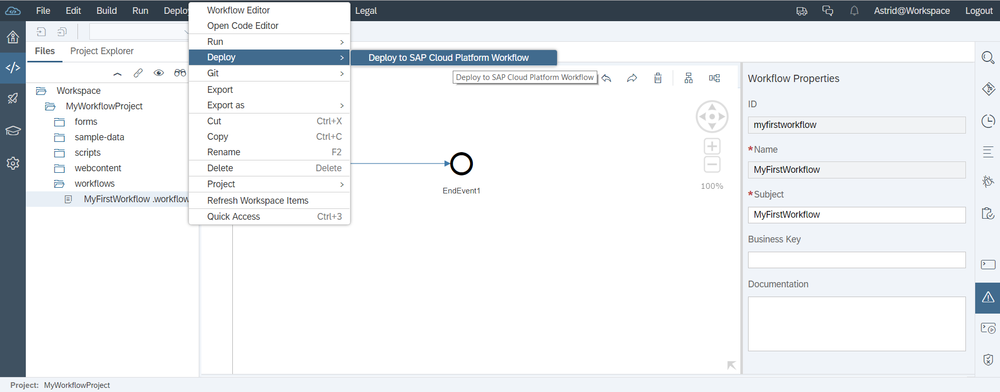
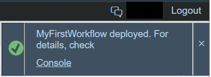

## Prerequisites  
 - **Proficiency:** Beginner

## Details
### You will learn  
- To create a project for your workflow in the SAP Web IDE Full-Stack.
- To deploy this project to the SAP Cloud Platform.

### Time to Complete
**5 Min**

---

[ACCORDION-BEGIN [Step 1: ](Access the SAP Web IDE Full-Stack)]
1. In your Web browser, open the cockpit of [SAP Cloud Platform](https://account.hanatrial.ondemand.com/cockpit).
2. Choose **Neo Trial**.
3. Select **Services** from the left-hand navigation.
4. Search for the **Workflow** service.

3. On the **Workflow** tile, choose **SAP Web IDE for Full-Stack Development**.

[ACCORDION-END]

[ACCORDION-BEGIN [Step 2: ](Create a new project)]
1. In the navigation area, choose the home icon.

2. Choose **New Project from Template**.

3. Change the **Category** to **Business Process Management**, and then select the **Workflow Project** template.

4. Choose **Next**.
5. Enter a name for the new workflow project, for example, `MyWorkflowProject`, and choose **Next**.

6. Enter a name for the new workflow, for example, `MyFirstWorkflow` and a description.

7. Choose **Finish**.   
   You should now see a project with a workflow file in your workspace:

> Note: If there are layout issues with the editor window (can't see the properties), simply refresh the SAP Web IDE window (F5).

[ACCORDION-END]

[ACCORDION-BEGIN [Step 3: ](Deploy your workflow)]
1. Select the workflow file in the workspace.
    > Note: Make sure that you really selected the file and not the project.
2. Open the context menu by right-clicking on the project, and select **Deploy** | **Deploy to SAP Cloud Platform Workflow**.

In the top right corner, you see a success notification.

  

[ACCORDION-END]

---
