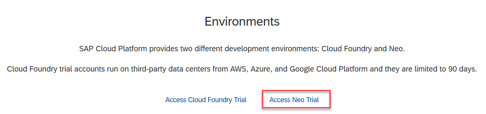
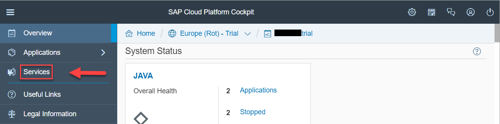
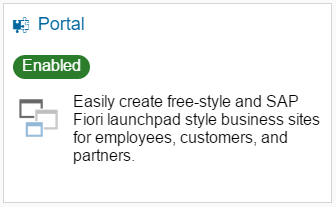
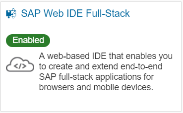
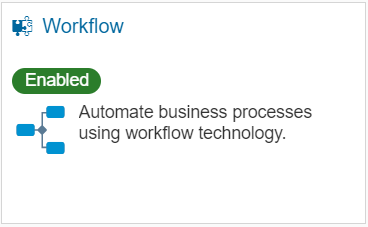
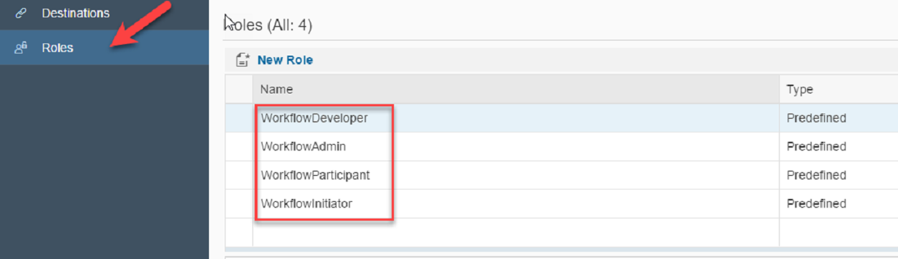
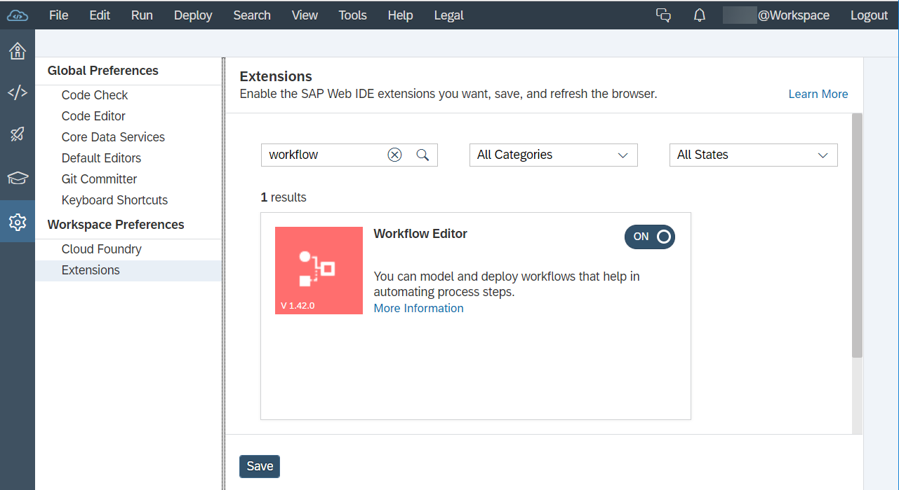

## Prerequisites  
 - **Proficiency:** Beginner
 - **Tutorials:** [Sign up for a free trial account on SAP Cloud Platform](https://www.sap.com/developer/tutorials/hcp-create-trial-account.html)

## Details
### You will learn  
- To enable the workflow service in your SAP Cloud Platform account.
- To assign the roles you need to develop and use workflow applications.

### Time to Complete
**5 Min**

---

[ACCORDION-BEGIN [Step 1: ](Open the SAP Cloud Platform Cockpit)]

1. In your Web browser, open the [SAP Cloud Platform](https://account.hanatrial.ondemand.com/cockpit) cockpit. If you do not have a trial account, see Prerequisites.
2. Choose **Neo Trial**.

3. Select **Services** from the left-hand navigation.

[ACCORDION-END]

[ACCORDION-BEGIN [Step 2: ](Enable the Portal service for your account)]

Search for the **Portal** service. Then select it, and choose **Enable**.

[ACCORDION-END]

[ACCORDION-BEGIN [Step 3: ](Enable SAP Web IDE Full-Stack)]

Search for **SAP Web IDE Full-Stack**. Then select it, and choose **Enable**.
> Note: The workflow features are only available with SAP Web IDE Full-Stack.

[ACCORDION-END]

[ACCORDION-BEGIN [Step 4: ](Enable the workflow service)]

Search for the **Workflow** service. Then select it, and choose **Enable**.

[ACCORDION-END]

[ACCORDION-BEGIN [Step 5: ](Assign roles)]

1. On the **Workflow** tile, choose **Configure Service**.
2. In the navigation area, choose **Roles**. Select each of the following roles and in the **Individual User** table, choose **Assign** and enter your user ID:
    - `WorkflowDeveloper`: Required to edit and deploy workflow models
    - `WorkflowAdmin`: Required to manage workflows and tasks
    - `WorkflowParticipant`: Required to process tasks in My Inbox
    - `WorkflowInitiator`: Required to start new workflow instances

3. Log off and log on again for the changes to take effect.
> Note: If you are not sure what your user ID is, see the person icon in the header toolbar of the SAP Cloud Platform cockpit.

[ACCORDION-END]

[ACCORDION-BEGIN [Step 6: ](Setting up the workflow editor)]

To use the workflow editor, you need to first activate the feature in the SAP Web IDE.
    1. On the **Workflow** tile, choose **SAP Web IDE for Full-Stack Development**.
    2. Open **Tools** | **Preferences**, and then select **Features**.
    3. Find the **Workflow Editor** feature in the list, and switch it on.
    4. Choose **Save** and then **Refresh**.

[ACCORDION-END]

---
