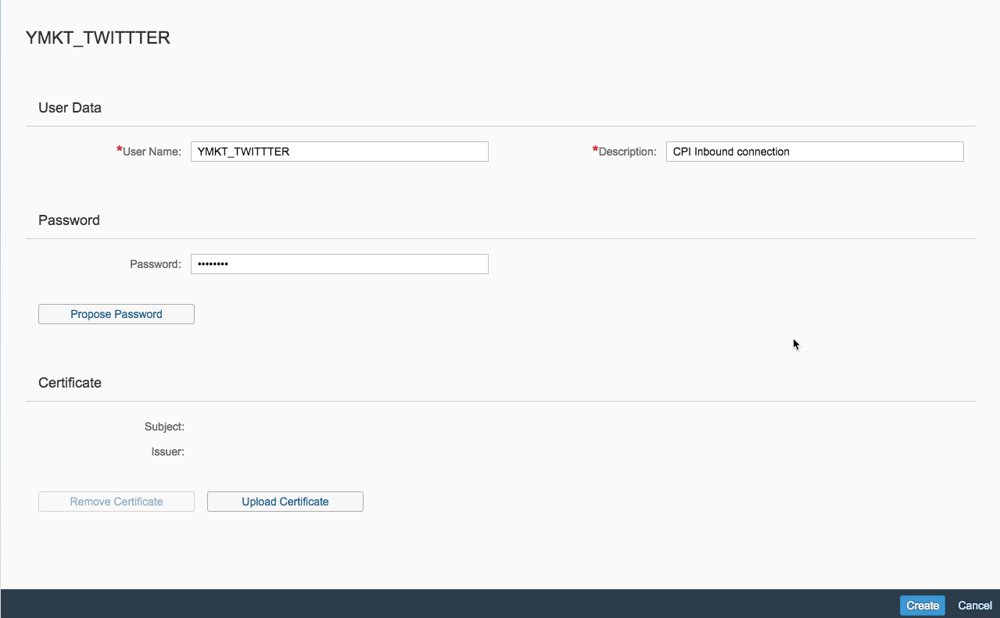
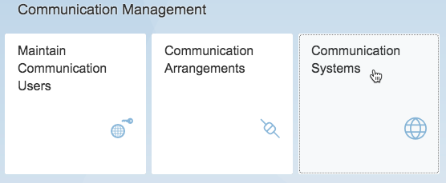
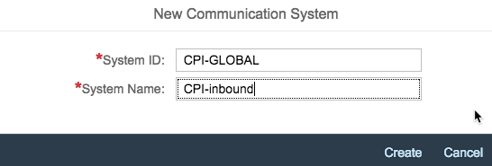
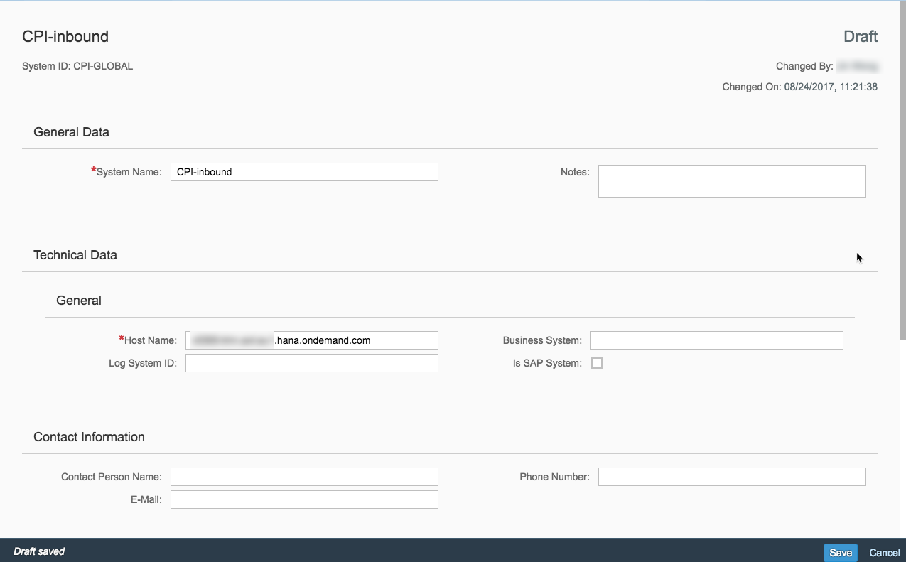
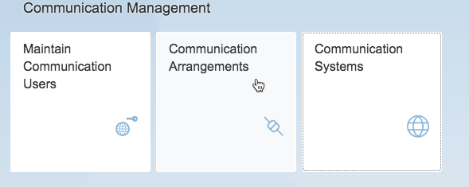
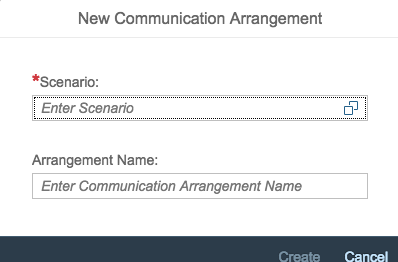
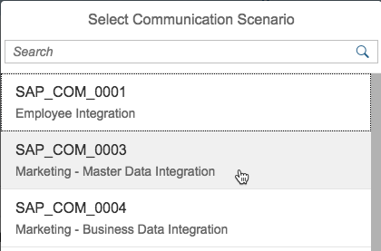
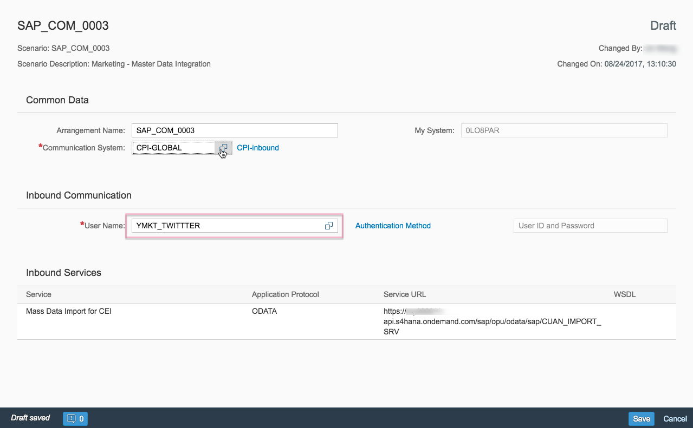
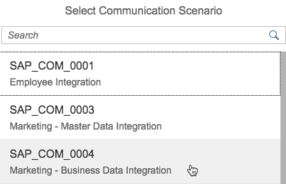
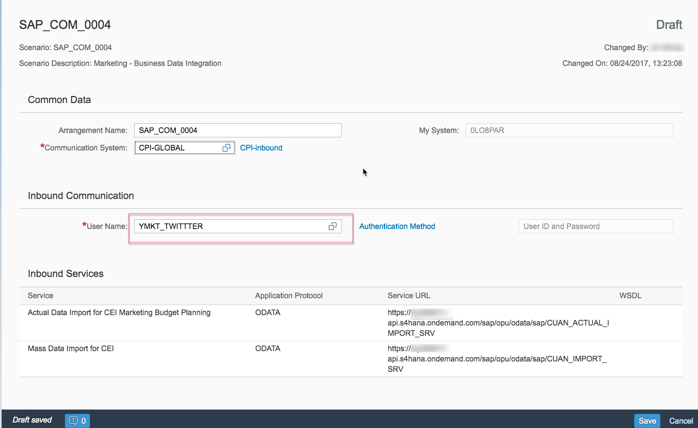

## Prerequisites  
 - **Proficiency:** Beginner

## Details
### You will learn  
How to set up the communication user in your SAP Hybris Marketing Cloud system with the necessary roles.

### Time to Complete
**15 Min**

---

[ACCORDION-BEGIN [Step 1: ](Create communication user in Hybris Marketing Cloud)]

Log on on to your SAP Hybris Marketing Cloud system

In the SAP Fiori launchpad, select the **Maintain Communication Users** tile.

Choose **New** to create a new user: `yMkt_Credential`

Assign a password for the user in the password field for basic authentication. Enter `CPI Inbound connection` on the description field.
  

Choose **Create**
>Note:  It is also possible to use an existing user.  If an existing user is used, the password of this user is required as well.

&nbsp;

[ACCORDION-END]

[ACCORDION-BEGIN [Step 2: ](Create communication system in Hybris Marketing Cloud)]

This step enables the Hybris system to communicate to the Integration system.

Logon to your Hybris Marketing Cloud System and in the SAP Fiori launchpad select the **Communication Systems** title.
  

Choose **New** to create a new system. Enter the value as shown below and choose **Create**..  Please remember the information here for later usage.  

Field Name             | Entry Value
---------              | -------------
System ID              | `CPI-GLOBAL`
System Name            | `CPI-inbound`

In the Technical Data section enter the URL of your SAP CPI tenant under the Host Name field.

In the User for Inbound Communication section add the technical user which was created in step 1 and choose **Save**.

[ACCORDION-END]

[ACCORDION-BEGIN [Step 3: ](Create marketing master data integration)]  

For communication with the OData Web service a technical user must be created in the SAP Hybris Marketing Cloud System.
This user needs to have two communication scenarios assigned:  

 - SAP_COM_0003 Marketing – Master Data Integration   
 - SAP_COM_0004 Marketing – Business Data Integration  

Log on to your SAP Hybris Marketing Cloud system.  

In the SAP Fiori launchpad, select the **Communication Arrangements** tile.  
  

Choose **New** to create a new communication arrangement.
  

Select **SAP_COM_0003 (Marketing - Master Data Integration)** and choose **Create**.
  

Under **Common Data**, select the Communication System via value help which was created in step 2.

  

Under **Inbound Communication**, the technical user that was created in step 1 needs to be entered. This field should be automatically filled in.  

Choose **Save**.

[ACCORDION-END]

[ACCORDION-BEGIN [Step 4: ](Assign the Business Data Integration scenario)]

Select the **Home** icon on the top of the screen.

In the SAP Fiori launchpad select the **Communication Arrangements** tile.  
  

Choose **New** to create a new communication arrangement.

Select **SAP_COM_0004 (Marketing - Business Data Integration)** and choose **Create**.  

Under **Common Data**, select the **Communication System** via value help which was created in step 2.

Under **Inbound Communication**,  use the technical user that was created in step 1.  The user field should be automatically added.
  

Choose **Save**.

[ACCORDION-END]
---
