## Prerequisites  
 - **Proficiency:** Beginner

## Details
### You will learn  
How to set up the SAP Cloud Platform Integration package to load Twitter posts to your SAP Hybris Marketing Cloud system.

### Time to Complete
**20 Min**

---

[ACCORDION-BEGIN [Step 1: ](Start a new tweet)]
Logon on to your Twitter account and post a tweet.  The SAP Cloud Integration service will fetch for this tweet.   

Post a tweet using hash tag `#happyworker this is cool!`.  Click on the tweet in order to post your tweet.  

[ACCORDION-END]

[ACCORDION-BEGIN [Step 2: ](Log on to SAP CP Integration)]  
Log on to your SAP Cloud Platform Integration tenant.
  

Click on the **all**.  
Enter `Twitter` in the search field.
Select the **SAP Hybris Marketing Cloud - Twitter Integration**
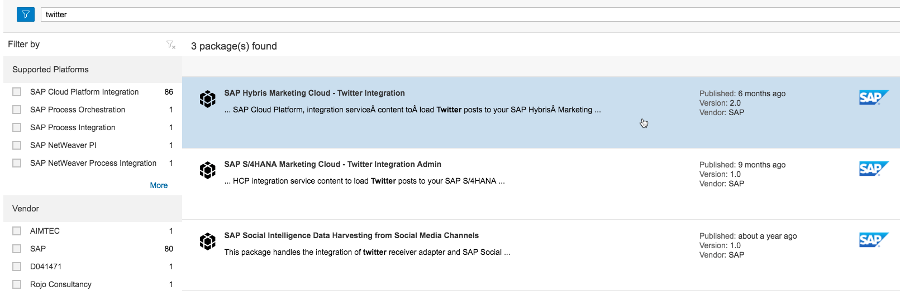

Click on the **ARTIFACTS** tab.
Click on the **Copy** and this action will copy the package to your design area.
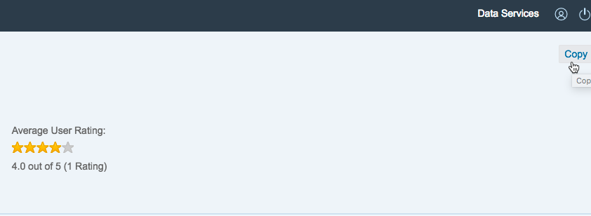  

>Hint: How to navigate the web UI of SAP Cloud Platform Integration:  
In the left-hand navigation you can switch between the following sections of the Web application:
- Discover → SAP's Reference Catalog
- Design →  Your customer workspace (Design Time Content)
- Monitor → Monitoring of messages and deployed artifacts  

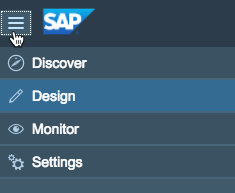  

Click on the **Design** icon from the menu. Select the **SAP Hybris Marketing Cloud - Twitter Integration** package
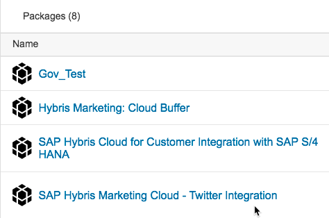

[ACCORDION-END]

[ACCORDION-BEGIN [Step 3: ](Configure the Twitter integration flow)]  
Click on the **Action** icon (icon the arrow pointing to the right). Select the option **Configure**.
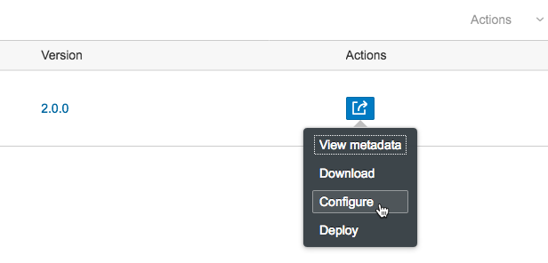  

Ensure that the Time event is scheduled with the Run Once option, so that the integration flow will run immediately after it is deployed to the runtime of SAP Cloud Platform Integration.  
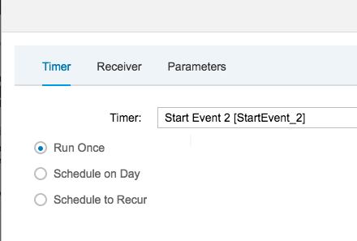  

Switch to the **Receiver** tab. Within this Integration Flow, two receivers are maintained. Select **MKT_Receiver**. Ensure that following attributes are set:
- Address:  Replace the URL with your S/4 HANA Host URL
- credential Name:  This is the technical user created in the [**setup a Hybris Marketing cloud tutorial**].
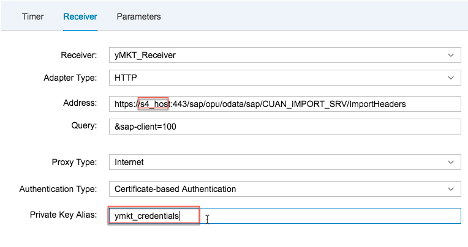  

Switch to the **MKT_Receiver_metadata** from the drop down menu.
Ensure that following attributes are set:
- Address:  Replace the URL with the S/4 HANA Host URL
- credential Name:  This is the technical user created in the [**setup a Hybris Marketing cloud tutorial**].  
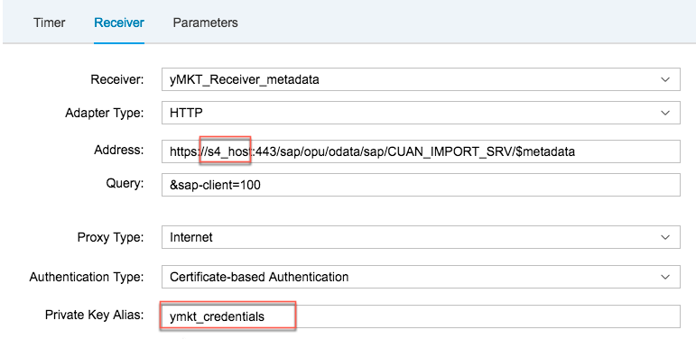  

Select the  **Twitter receiver** from the drop down menu.  Keep the default value.
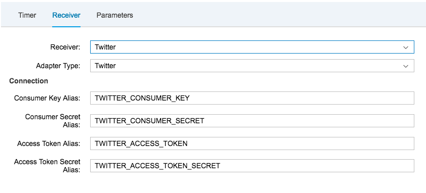  

Switch to the **Parameters** section and ensure that the following settings:  
Keywords:  `happyworker`
>Note: the Keyword needs to be identical to the hash tag test used before within your tweet.
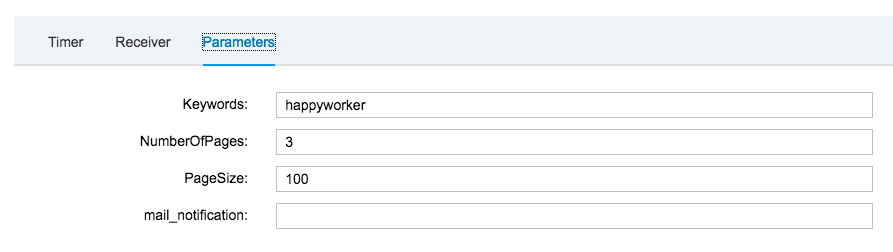  

Click on **Save**.
  

[ACCORDION-END]

[ACCORDION-BEGIN [Step 4: ](Understand monitor area of CP Integration)]
Navigate to the **Monitor** area of SAP Cloud Platform Integration, via the menu on the top left hand corner.  
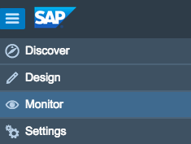  

Three main sections in the Monitor area of SAP Cloud Platform Integration:

- Monitor Message Processing
- Manage Integration Content
- Manage Security
- Manage Stores
- Manage Locks

Navigate back to the **overview** section and select **Manage Security Material**.
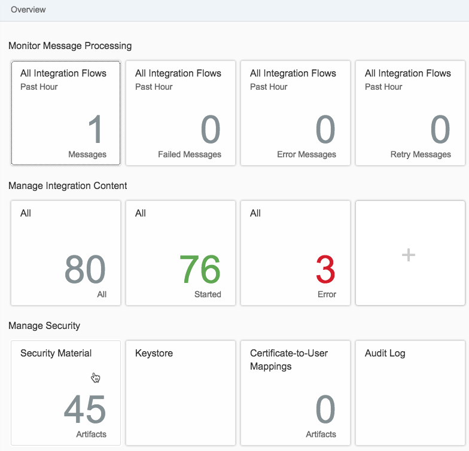

In this section, the Authorization for Twitter API is needed. The Twitter API was created in the Twitter API tutorial.  
●	Consumer Key   
●	Consumer Secret  
●	Access Token  
●	Access Token Secret  

Select **Add** and select **Security Parameters**.  
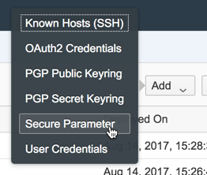

Enter the below value:  

Field Name             | Entry Value
---------              | -------------
Name                   | `TWITTER_CONSUMER_KEY`
Description            | `Twitter Consumer Key`
Secure Parameter       | Enter your keys from Twitter
Repeat Secure Parameter| Enter your keys from Twitter

Choose OK.

Repeat above steps for:
- TWITTER_CONSUMER_SECRET
- TWITTER_ACCESS_TOKEN
- TWITTER_ACCESS_TOKEN_SECRET

[ACCORDION-END]

[ACCORDION-BEGIN [Step 5: ](Deploy technical communication User data)]
>Note:  In the SAP Hybris Marketing Cloud Communication Management tutorial, you created a technical user in your SAP Hybris Marketing Cloud system. This user's credentials need to be stored now in your SAP Cloud Platform Integration tenant as User Credential

Navigate to the Monitor area of SAP Cloud Platform Integration, via the menu on the top left.  
  

Navigate back to the **Overview** section and select **Manage Security Material**.

Choose **Add**.  
Select **User Credentials**, and enter values below:

Field Name  |Entry Value
----------- | -------------
Name        | `yMKT_Credential`
Description | `Hybris Marketing User`
User        |  The user created in the [Set up a Hybris Marketing Cloud system](https://www.sap.com/developer/tutorials/cpi-sentiment-analysis-s4.html) tutorial]  
Password    | Password of your technical user

Choose **OK**.
[ACCORDION-END]

[ACCORDION-BEGIN [Step 6: ](Deploy integration flow)]  
Click on the **Design** link.  
  

Select the **SAP Hybris Marketing Cloud - Twitter Integration** package
  

Navigate to **ARTIFACTS** tab
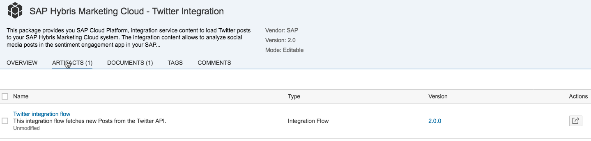  

Click on the **Action** icon (icon the arrow pointing to the right).
Click on **Deploy**.
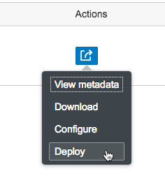

Navigate to the **Monitor** area of SAP Cloud Platform Integration, via the menu on the top left hand corner.  
  

Check that the Integration Flow has been successfully deployed. Below the Manage Integration Content section, select the **All** tile.  
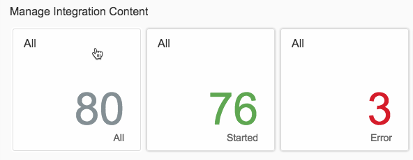  

In the search field, enter `Twitter`. Ensure the status is started. If not, then please wait for few second unit it is started before moving to the next step.
  

Check the **Message Processing Log**  to see everything is working on the integration level.
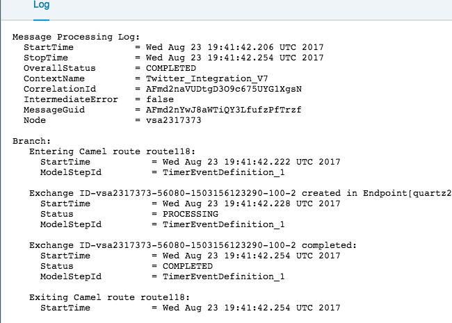

[ACCORDION-END]

[ACCORDION-BEGIN [Step 7: ](Log on to SAP Hybris Marketing Cloud)]
Logon to your SAP Hybris Marketing Cloud system.

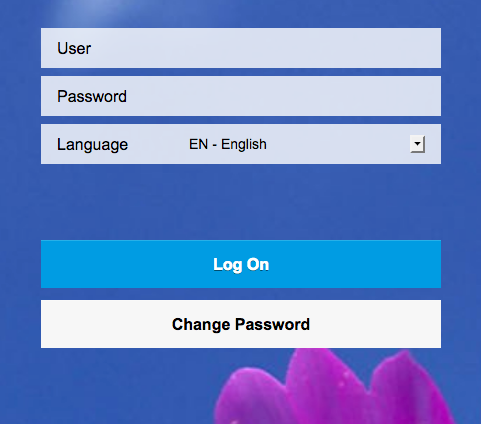

To view the tweets that have been pushed to SAP Hybris Marketing via SAP Cloud Platform Integration.  In SAP Hybris Marketing, select the menu **Insight** and then click on the tile **Sentiment Engagement**.
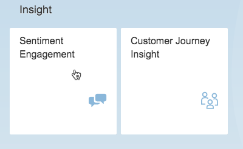  

Enter `#happyworker` in the search field. The tweet is the 1st on on the list.
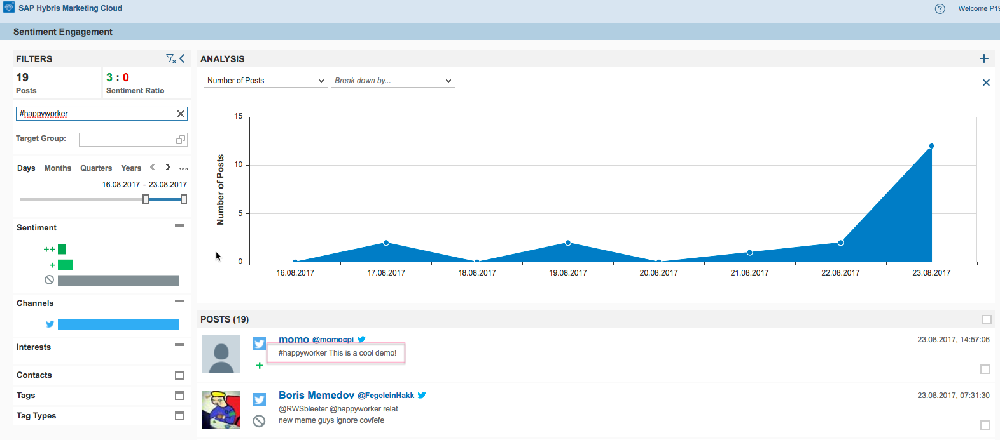  

[ACCORDION-END]

---
