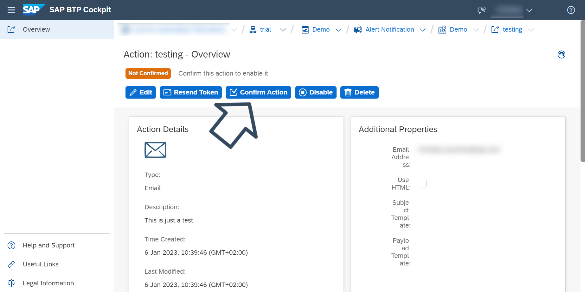

# Create an Action of a Type Email
<!-- description --> Learn how to create an action of a type email.

## Prerequisites
- You have activated Alert Notification in a trial account as described in [Set Up SAP Alert Notification service for SAP BTP for Initial Use](set-up-alert-notification)

## You will learn
- How to create an action of a type email, so that you can receive notifications to a given email
    

## Intro

> If you want to receive notifications to other delivery channels, see the SAP Cloud Platform Alert Notification documentation at [Managing Actions](https://help.sap.com/docs/ALERT_NOTIFICATION/5967a369d4b74f7a9c2b91f5df8e6ab6/8a7e092eebc74b3ea01d506265e8c8f8.html).

### Create an action of a type email.

1. Open the **Actions** menu of the Alert Notification cockpit page.

    

2. Click on the **Create** button to open the dialog box. 

    

3. In the **Actions** dialog box, choose the preferred email action type and then click on the **Next** button.

    

4. Enter a unique name for your action in the **Name** field.

    

5. In the **Email Address** field, enter the destination email address to which the notification must be sent and optionally provide a custom template for customizing your notification email. Then click on the **Create** button.

    

    Your newly created action is now available in the **Actions** menu in the left pane. Its initial state is **Not Confirmed**. A confirmation email with a confirmation token and a confirmation link is sent to the email address you have provided.

    

### Confirm the action.

1. Open the automated confirmation email you have received. It contains the name of the action you have to confirm, a token, and a confirmation link you have to navigate to.

2. You can confirm the action in one of the following ways:

    * Using the **Actions** view:

        1. Locate and open your new action.
        2. In the overview that appears, click on the **Confirm Action** button.

            
        3. Enter the token that was sent to your email.

    * Using a confirmation link:

        1. Open the provided confirmation link that leads to the **Action Confirmation** page.
        2. Choose **Confirm**.
