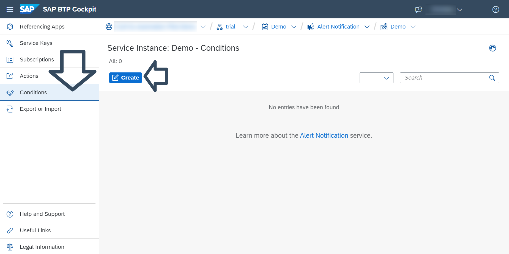
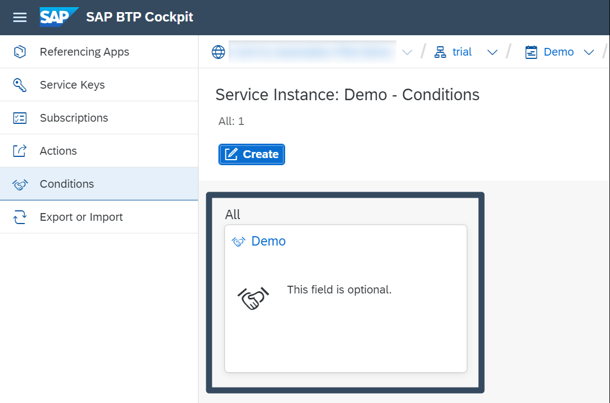

## Prerequisites
- Tutorial: You have activated **Alert Notification** in a trial account as described in [Set Up SAP Alert Notification service for SAP BTP for Initial Use](set-up-alert-notification)

## You will learn
- How to create a condition with an event property **Category**, predicate **Is Equal To** and value **NOTIFICATION**. SAP Alert Notification service for SAP BTP uses this condition to filter all relevant events regarding notifications

## Intro
> If you want to use other conditions, see the SAP Alert Notification Service for SAP BTP documentation at [Managing Conditions](https://help.sap.com/docs/ALERT_NOTIFICATION/5967a369d4b74f7a9c2b91f5df8e6ab6/35ca5de101fc4d5791cdbb2df15e9d9b.html?locale=en-US).

### Create a condition

1.	Open the **Conditions** menu on the Alert Notification cockpit page and click on the **Create** button.

    

2.	Once the **Create Conditions** dialog opens, enter the following:
    * A unique name for your condition in the **Name** field.
    * [Optional] You can add additional details about the condition in the **Description** field and assign one or more labels to your condition in the **Labels** field. 
    * In the **Condition** field choose the **Category** option in the first box, **Is Equal To** in the second box, and in the third box set the value to **NOTIFICATION**. 

        
    
3. Click on the **Create** button. Your newly created condition is now available in the **Conditions** menu.

    
