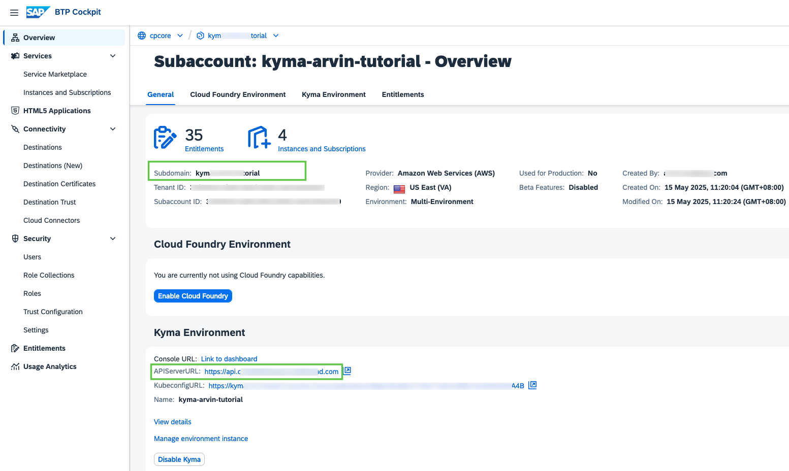

# Create and Configure the Approuter Application for a Multitenant Application
<!-- description --> Use the tenant-aware approuter application in SAP BTP, Kyma runtime.

## Prerequisites
- You have finished the tutorials [Create a Basic Node.js Application with Express Generator](basic-nodejs-application-create) and [Deploy a Node.js Application in SAP BTP, Kyma runtime](deploy-nodejs-application-kyma), or cloned the repository: [btp-kyma-runtime-multitenancy-tutorial](https://github.com/SAP-samples/btp-kyma-runtime-multitenancy-tutorial) to find the source for both missions.

## You will learn
- What is SAP Application Router
- How to create and configure Application Router
- How to configure Destination for Application Router in Kyma runtime
- How to describe Kubernetes objects for Application Router


---

### Get to know SAP Application Router


Each multitenant application has to deploy its own [SAP Application Router (also knows as Approuter)](https://help.sap.com/products/BTP/65de2977205c403bbc107264b8eccf4b/01c5f9ba7d6847aaaf069d153b981b51.html??locale=en-US), and the application router handles requests of all tenants to the application. The application router is able to determine the tenant identifier out of the URL and then forwards the authentication request to the tenant User Account and Authentication (UAA) service and the related identity zone.

When a consumer accesses the application, their consumer tenant calls the multitenant application via the application router with their tenant-specific URL. The application router then derives the tenant from the URL and calls the tenant-aware XSUAA (containing the user account and authentication service), which is responsible for the authentication of the business user. The XSUAA reads the tenant and gets the customer-specific identity provider (IdP) from the tenant-specific identity zone. Then, the XSUAA delegates the authentication to the configured IdP, and creates a JSON Web Token (JWT) that contains the tenant, the current user, and the authorization scopes of the user. The JWT is then sent back to the application router, and from there to the application.


### Create Approuter Application


1. Create a folder `kyma-multitenant-approuter` in the root directory.
```Shell / Bash
mkdir kyma-multitenant-approuter
cd kyma-multitenant-approuter
```

2. In the folder `kyma-multitenant-approuter`, create a file `package.json` with the following content:
```JSON
{
    "name": "kyma_multitenant_approuter",
    "dependencies": {
        "@sap/xsenv": "^5",
        "@sap/approuter": "^20"
    },
    "scripts": {
        "start": "node node_modules/@sap/approuter/approuter.js"
    }
}
```


### Configure Route in Approuter Application


Then you should configure the **routes** in the security descriptor file `xs-app.json` of the application router so that application requests can be forwarded to the multitenant application destination.

In the folder `kyma-multitenant-approuter`, create a file `xs-app.json` with the following content:

```JSON
{
    "authenticationMethod": "none",
    "routes": [{
        "source": "/",
        "target": "/",
        "destination": "dest_kyma_multitenant_node"
    }]
}
```

### Determine SAP BTP Subaccount Subdomain and Cluster Domain

Open your subaccount in SAP BTP cockpit. In the overview page, find the `subaccount-subdomain` for your deployment YAML file definition.  

Find your cluster domain in the APIServerURL field. It contains the URL in the following format:  
> Example: https://api.xxxxx.kyma.ondemand.com  

Your `clusterdomain` will be `xxxxx.kyma.ondemand.com`.  

`subaccount-subdomain` and `clusterdomain` will be quoted in subsequent deployment definition.  

<!-- border -->


### Configure Destination with ConfigMap


The destinations configuration can be provided by the `destinations` environment variable or by destination service.

In order to provide `destinations` environment variable to the approuter application, you should create a `ConfigMap` object for reference later.

Create a new deployment YAML file named `k8s-deployment-approuter.yaml` for the approuter app with the following content:

```YAML
---
apiVersion: v1
kind: ConfigMap
metadata:
  name: destinations-config
data:
  destinations: |
    [
      {"name":"dest_kyma_multitenant_node","url":"https://<subaccount-subdomain>-node.<clusterdomain>","forwardAuthToken" : true}
    ]
```

> There are two alternatives to define the destination URL:
>
> 1. Use external service URL provided by Kyma `APIRule` (JWT enabled): `"url":"https://<subaccount-subdomain>-node.<clusterdomain>`
>
> 2. Use internal service URL of cluster: `"url":"http://<service-name>.<namespace>.svc.cluster.local:<service-port>`


### Define Deployment


Create a YAML file for the approuter app called `k8s-deployment-approuter.yaml`:

```YAML
---
apiVersion: apps/v1
kind: Deployment
metadata:
  creationTimestamp: null
  labels:
    app: kyma-multitenant-approuter-multitenancy
    release: multitenancy
  name: kyma-multitenant-approuter-multitenancy
spec:
  replicas: 1
  selector:
    matchLabels:
      app: kyma-multitenant-approuter-multitenancy
      release: multitenancy
  strategy: {}
  template:
    metadata:
      creationTimestamp: null
      labels:
        app: kyma-multitenant-approuter-multitenancy
        release: multitenancy
        sidecar.istio.io/inject: "true"  # Enable Istio sidecar injection on Deployment and all Pods
    spec:
      automountServiceAccountToken: false
      imagePullSecrets:
        - name: registry-secret   # replace with your own registry secret for Docker Hub
      containers:
      - env:
        - name: destinations      # refer to the ConfigMap for destinations you created before
          valueFrom:
            configMapKeyRef:
              name: destinations-config
              key: destinations
        - name: PORT
          value: "8080"
        - name: TMPDIR
          value: /tmp
        image: <docker-hub-account>/multitenant-approuter:v1   # replace with your Docker Hub account name
        livenessProbe:
          exec:
            command:
            - nc
            - -z
            - localhost
            - "8080"
          failureThreshold: 1
          initialDelaySeconds: 60
          periodSeconds: 30
          successThreshold: 1
          timeoutSeconds: 60
        name: kyma-multitenant-approuter-multitenancy
        ports:
        - containerPort: 8080
        readinessProbe:
          exec:
            command:
            - nc
            - -z
            - localhost
            - "8080"
          failureThreshold: 1
          initialDelaySeconds: 60
          periodSeconds: 30
          successThreshold: 1
          timeoutSeconds: 60
        resources:
          limits:
            ephemeral-storage: 256M
            memory: 256M
          requests:
            cpu: 100m
            ephemeral-storage: 256M
            memory: 256M
        securityContext:
          allowPrivilegeEscalation: false
          capabilities:
            drop:
            - ALL
          privileged: false
          readOnlyRootFilesystem: false
        volumeMounts:
        - mountPath: /tmp
          name: tmp
      securityContext:
        runAsNonRoot: true
      volumes:
      - emptyDir: {}
        name: tmp
status: {}
```


### Define Service and APIRule


Now you can create a `Service` and `APIRule` to make the approuter application accessible to the internet.

Add a `Service` and an `APIRule` for the approuter application in the `k8s-deployment-approuter.yaml` file:  

```YAML
---
apiVersion: v1
kind: Service
metadata:
  creationTimestamp: null
  labels:
    app: kyma-multitenant-approuter-multitenancy
    release: multitenancy
  name: kyma-multitenant-approuter-multitenancy
spec:
  type: ClusterIP
  ports:
  - port: 8080
    protocol: TCP
    targetPort: 8080
  selector:
    app: kyma-multitenant-approuter-multitenancy
    release: multitenancy
---
apiVersion: gateway.kyma-project.io/v2
kind: APIRule
metadata:
  creationTimestamp: null
  labels:
    app: kyma-multitenant-approuter-multitenancy
    release: multitenancy
  name: kyma-multitenant-approuter-multitenancy
spec:
  gateway: kyma-system/kyma-gateway
  hosts: 
    - <subaccount-subdomain>-approuter.<clusterdomain>   # Replace <subaccount-subdomain> with the subdomain of your subaccount, and <clusterdomain> with the domain of your Kyma cluster
  rules:
    - path: /*
      methods: ["GET", "POST", "PUT", "PATCH", "DELETE", "HEAD"]
      noAuth: true
  service:  
    name: kyma-multitenant-approuter-multitenancy
    port: 8080
```

> Replace the placeholder with your subaccount subdomain and cluster domain. Note that the host name of the approuter application must start with your subaccount subdomain so that the application can be redirected to the right authenticator.


---
