# Create a Theme with the UI Theme Designer
<!-- description --> Create a custom theme with the UI theme designer to adapt the application UIs to the corporate design of your company.

## Prerequisites
  - [You've set up the SAP Build Work Zone, standard edition Service.](btp-app-work-zone-subscribe) You can follow the tutorial until the subscribing step.
  - You've a user with the **`Subaccount Administrator`** and **`Launchpad_Advanced_Theming`** role collection in the subaccount where you set up the SAP SAP Build Work Zone, standard edition Service.
  - You've at least one site in your SAP SAP Build Work Zone, standard edition.

## You will learn
  - How to create a new custom theme
  - How to change the logo
  - How to change colors
  - How to publish it so that it can be used by your users.

---

### Access the Theme Designer

The **UI theme designer** is a business service integrated in the SAP Build Work Zone, standard edition service and can be accessed from your site.

1. Access any SAP Build Work Zone, standard edition site.
2. Choose the user profile icon in the top-right corner to open the dropdown menu. Choose **Theme Manager**.

    <!-- border -->
    

3. Choose **Launch Theme Designer** in the bottom-left corner. In the **UI theme designer** you can see an overview of all available custom themes, and you can create new ones of your own. 

    <!-- border -->
    

4. The theme designer opens and you get an overview of your existing custom themes if any exist.

    <!-- border -->
    

### Create a New Theme

From the overview of the UI theme designer, you can create a new custom theme or open an existing theme. You will create one for this tutorial.

Every custom theme is based on an SAP theme (e.g. SAP Horizon, SAP Quartz)

1. Choose **Create a New Theme** in the top right. 

    <!-- border -->
    

2. You get a list of possible SAP themes you could use as the base for your custom theme. Choose **SAP Morning Horizon** and click on **Create Theme.** 

    <!-- border -->
    

3. Now, you see a screen with three parts. On the left, you will see the list of available preview pages. The selected preview page is displayed in the middle . On the right, you get a list of parameters that you could change, this includes colors, images, fonts, and other values. 

    <!-- border -->
    

### Select Preview Pages

You can select which preview pages are shown. It's best to start with **Shell, Tiles and Cards** to preview the changes you're planning.

1. In the left area click on the **⊕** besides the **Preview Pages**.
2. Select the Test Suite **SAPUI5 Controls**.

    <!-- border -->
    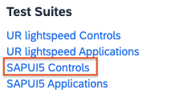

3. Deselect all preview pages except for **Shell, Tiles and Cards**.
4. In the left area, choose **Shell, Tiles and Cards**.

### Change the Company Logo

Replace the SAP logo with your company logo. For the purposes of this tutorial, you can use this [demo logo](demoLogo.png). Right click on the link and choose **Save Link As...**, save it into a folder where you can access it.

1. In the list of parameters on the right, on the top, choose the tab **Quick**.
2. Look for the **Shell** part and click there at the gray box next to the text field. 

    <!-- border -->
    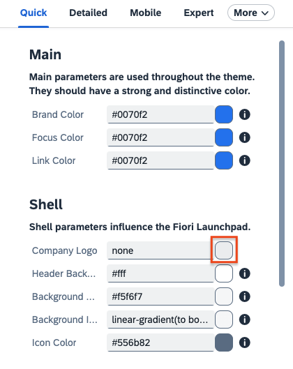

3. Drag and drop the saved demo company logo _demoLogo.png_ from your file explorer/finder to the box **Drop image files here or press to browse** 

    <!-- border -->
    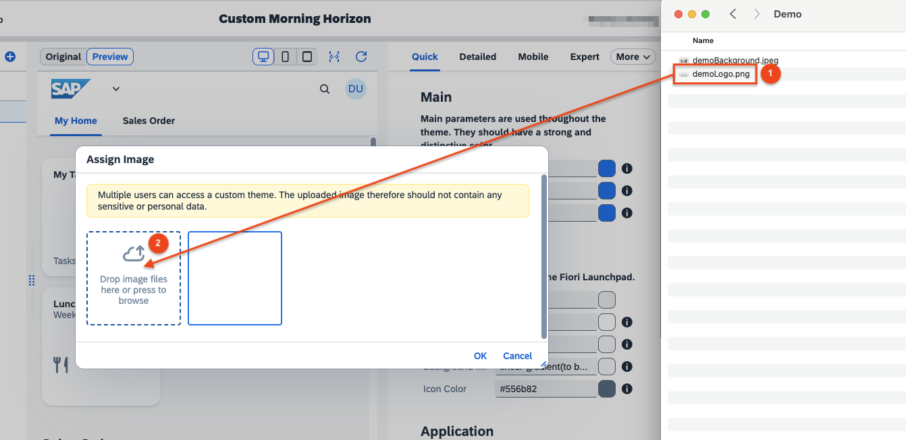

4. After the image is uploaded, choose it and click on **OK**. 
    
    <!-- border -->
    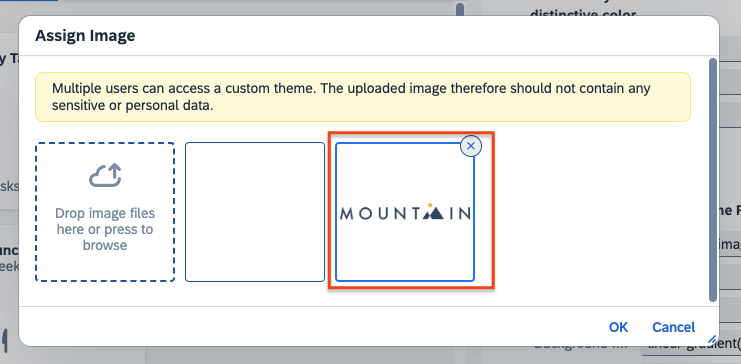

5. You are done, the logo should be updated in the top-left corner of the preview area.

### Save the Theme

You need to save your custom theme. This has to be done latest at the end of your design process but it's a good idea to do it often as you make changes too.

1. In the menu on the top-left choose **Theme → Save**. 

    <!-- border -->
    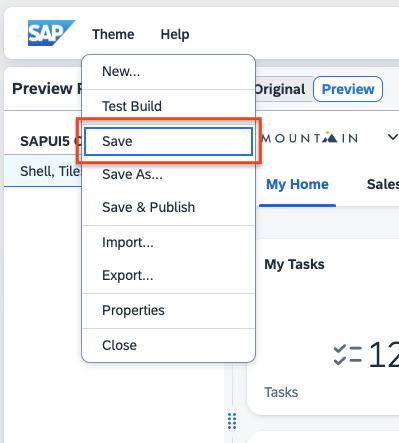

2. When saving a theme the first time, you need to enter some metadata for it. 

    <!-- border -->
    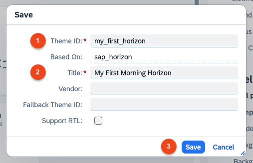

3. Enter **`my_first_horizon`** as the custom theme's ID.
4. Enter **`My First Morning Horizon`** as the Title.
5. Choose **Save**.

Your theme is now saved. You should do this often during development—you won't see the popup window for entering the data after saving once.

>Your theme ID can contain characters (a—z), digits, and underscores, but it has to start with a character and can't start with `sap`.

### Define Own Colors
While you can enter color values by hand, it's a good idea to define often used colors (e.g. brand colors) and give it a name—this will allow you to reuse these colors later consistently.

1. In the properties area on the right choose the **Palette** tab (if it isn't visible you need to choose **More** first).

    <!-- border -->
    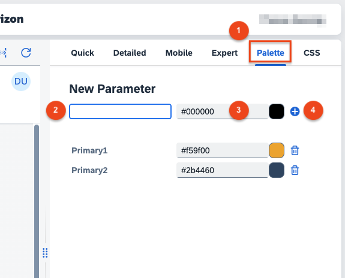

2. Enter **`Primary1`** for the new parameter's name.
3. Enter **`#f59f00`** for the color's value .
4. Choose the **⊕** icon to add the new parameter.
5. Repeat this step with the parameter name **`Primary2`** and the color value **`#2b4460`**. Don't forget to click on the **⊕** at the end.

### Assign Colors

Besides defining a company logo a common use-case is using brand colors to make the UI more familiar. For this, it's helpful to define the most important colors as palette colors (as shown in the previous step).

1. In the parameters area on the right choose the **Quick** tab.

    <!-- border -->
    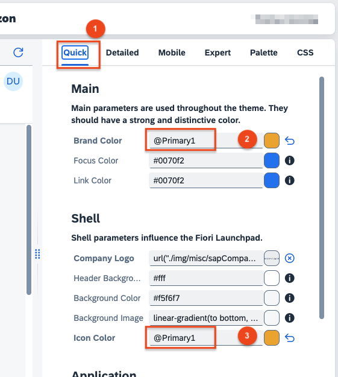

2. Look for the **Main** section and there for the **Brand Color**. Enter the text **`@Primary1`**.
3. Look for the **Shell** section and there for the **Icon Color**. Enter also the text **`@Primary1`**.
4. Choose the **Detailed** tab. 

    <!-- border -->
    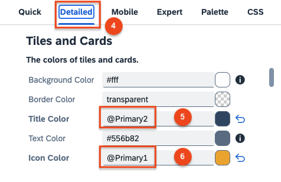

5. Scroll down to the section **Tiles and Cards**. Enter the text **`@Primary2`** for **Title Color**.
6. Look Enter the text **`@Primary1`** for **Icon Color**.

>By choosing the colored box to the right of a color value, you can interactively select a color. If you change parameters in the Quick area of the parameters many Detailed and Expert parameters are changed automatically unless you change them individually. So, you can change the overall experience by changing a handful of color—but in case you're not getting the desired results for a specific design that you had in mind you can do that with more specific changes.

### Select a Background Image

As with the company logo you'll upload a background image for the site. For this tutorial you can use this [demo background](demoBackground.jpeg).

1. In the parameters area on the right choose the **Detailed** tab and look for the **Shell Canvas** section.
2. Choose the gray box next to the text field for **Background Image**.
3. Drag and drop the demo background image _demoBackground.jpeg_ that you saved into the area **Drop image files here or press to browse**.
4. Choose **OK**.
5. Drag the slider right of **Background Opacity** to **0.4**. 

    <!-- border -->
    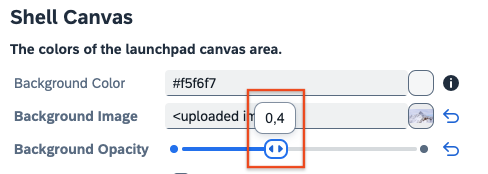

### Publish the Theme

At the end, you need to publish your custom theme so that users are able to select it.

1. In the top-left menu, choose **Theme → Save & Publish**. 

    <!-- border -->
    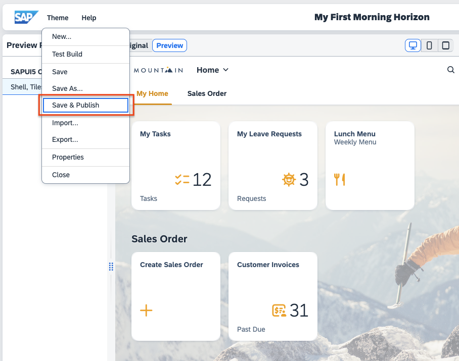

2. The theme is published and you can return to the theme designer overview page via **Theme → Close**.

>You need to (re)publish your theme every time you make changes so that the changes can be seen by the users.

### Enable the Theme in Theme Manager

The theme is now available but it needs to be enabled for the end users in the Theme Manager.

1. Back in the site choose the **Theme Manager** as before via your user profile icon. 

    <!-- border -->
    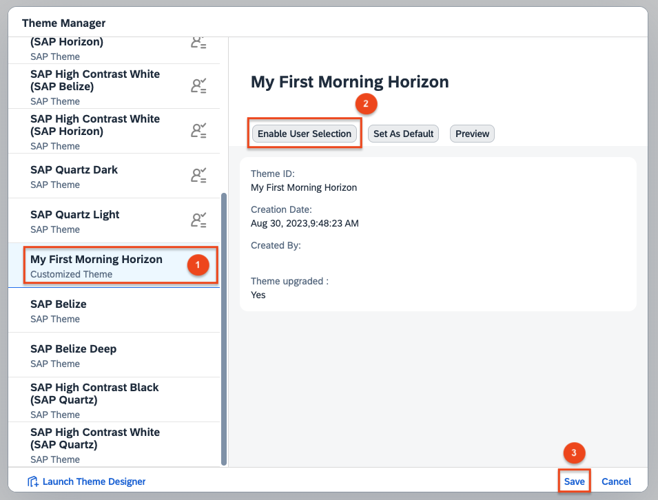

2. Select your newly created theme **My First Horizon Theme**.
3. Choose **Enable User Selection**.
4. Choose **Save**.

Now, your users will be able to select this theme via their Settings.
