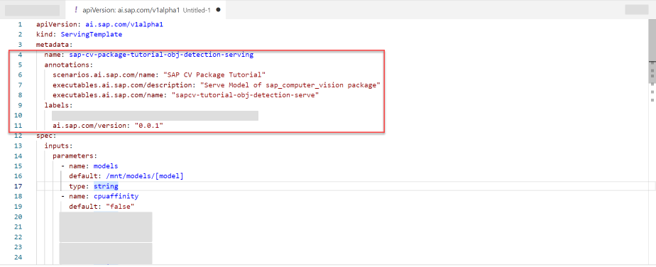
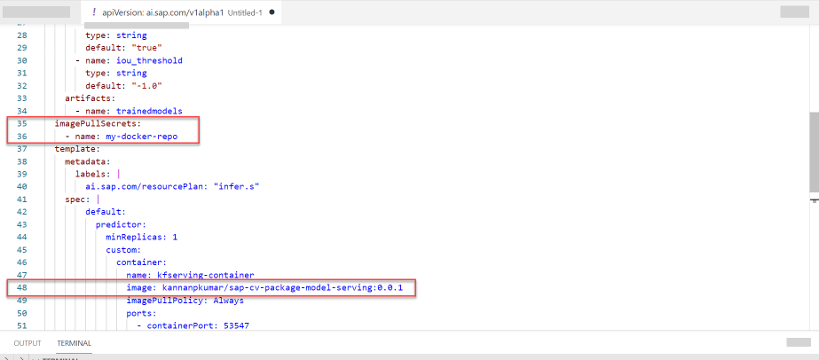

## Details
### You will learn
- How to generate serving template for computer vision package
- How to generate and deploy online inferencing server using computer vision package
- How to consume endpoints of online inferencing server

## Prerequisites
 - You had trained model for object detection mentioned in [this tutorial](cv-package-aicore-train-object-detection).
 - You are using the notebook from the above mentioned tutorial.

**IMPORTANT** You must successfully complete the execution from the tutorial mentioned above because you require the value of the variable `trained_model` to complete the tutorial.

---

[ACCORDION-BEGIN [Step 1: ](Get template generator reference)]

To store the generator reference paste and run the snippet. The generator is named `model-serving`.

```PYTHON
workflow = sap_cv_pkg.workflows['model-serving']
```

Computer vision package (`sap-cv`) provides `model-serving` template generator for creating serving templates and Docker image for deployment server..

[DONE]
[ACCORDION-END]


[ACCORDION-BEGIN [Step 2: ](Create labels for template)]

Paste and edit the snippet to store the labels in JSON format. You must use your own Docker username for `image`.

```PYTHON[3]
workflow_config = {
   "name": "sap-cv-package-tutorial-obj-detection-serving",
   "image": "<YOUR_DOCKER_USERNAME>/sap-cv-package-model-serving:0.0.1",
   "annotations": {
       "scenarios.ai.sap.com/name": "SAP CV Package Tutorial",
       "executables.ai.sap.com/name": "sapcv-tutorial-obj-detection-serve",
   },
   "labels": {
       "scenarios.ai.sap.com/id": "sap-cv-package-tutorial",
       "ai.sap.com/version": "0.0.1"
   },
   "imagePullSecret": "<YOUR_DOCKER_SECRET>",
   "objectStoreSecret": "default-object-store-secret"
}
```

[DONE]
[ACCORDION-END]

[ACCORDION-BEGIN [Step 3: ](Generate Docker Image for Serving)]

The template generator contains `create_image` function which builds Docker image using the template serving code contained in computer vision package.

Paste and run the snippet. The variable `workflow_config` contains the key `image` which sets the name for the Docker image to be built.

```PYTHON
workflow.create_image(workflow_config, silent=True)
```

!

Paste the snippet in terminal. You should see your Docker image in your system's local memory.

```BASH
docker images
```

!

[DONE]
[ACCORDION-END]


[ACCORDION-BEGIN [Step 4: ](Upload Docker image to Cloud)]

Upload your Docker image to cloud Docker repository for SAP AI Core to download and run  for deployment.

Paste and edit the snippet. The exclamation prefix `!` executes command in your system's terminal from your Jupyter notebook.

```PYTHON
!docker push <YOUR_DOCKER_USERNAME>/sap_cv_obj_detection:0.0.1
```
!

It could take a few minutes for Docker to upload your code . On successful completion you should have `Pushed` message in the output.

[DONE]
[ACCORDION-END]


[ACCORDION-BEGIN [Step 5: ](Generate serving template)]

The template generator contains `create_template` function which builds Docker image using the template serving code contained in computer vision package.

Paste and edit the snippet. The `output_file` is the target location to output generated template. The target location must be existing in your system.

```PYTHON[1]
output_file = '/path/to/output/sap-cv-demo-aicore-sdk-cli-serving.yaml'
workflow.create_template(None, output_file, silent=True)
```

The snippet creates a generic workflow template. You passed `None` as value for `workflow_config` as it has no use when generating a model serving template.

Open generated YAML file in the text editor. Paste the values mentioned, use screenshots for reference of lines to edit.

```YAML
...
metadata:
  name: sap-cv-package-tutorial-obj-detection-serving
  annotations:
    scenarios.ai.sap.com/name: "SAP CV Package Tutorial"
    executables.ai.sap.com/description: "Serve Model of sap_computer_vision package"
    executables.ai.sap.com/name: "sapcv-tutorial-obj-detection-serve"
  labels:
    scenarios.ai.sap.com/id: "sap-cv-package-tutorial"
    ai.sap.com/version: "0.0.1"
...
spec:
    ...
    imagePullSecrets:
      - name: <YOUR_DOCKER_SECRET>
    template:
        ...
        spec:
            ...
            image: <YOUR_DOCKER_USERNAME>/sap-cv-package-model-serving:0.0.1

```

!

!


[DONE]
[ACCORDION-END]


[ACCORDION-BEGIN [Step 6: ](Sync serving template to SAP AI Core)]

Put the generated serving template to the GitHub repository inside the folder tracked by **Application** of SAP AI Core.

You may run this snippet in Jupyter notebook cell if you need help with committing and pushing to Git. Paste and edit the snippet.


```PYTHON[2]
print(f'''Run in Terminal:
cd <YOUR_REPO>
git add <YOUR_PATH_WITHIN_REPO>/{pathlib.Path(output_file).name}
git commit -m \'updated template {workflow_config["name"]}\'
git push
''')
```

- Replace `<YOUR_REPO>` with your GitHub repository .
- Replace `<YOUR_PATH_WITHIN_REPO>` with directory within your repo which contains the template file.

> **AI Core Git Ops Sync:**
Once the template is pushed into the Git repo, you need to wait for AI Core to sync with this repository. AI Core syncs with the on-boarded Git repositories at periodic intervals. Once the template is synced with AI Core you can execute the template to start training.


[DONE]
[ACCORDION-END]

[ACCORDION-BEGIN [Step 7: ](Get trained model artifact ID)]

Paste and run the snippet.

>**CAUTION** The variable `trained_model` references value from tutorial mentioned in prerequisite.

```PYTHON
if trained_model is None:
    print('Training not finished -> model not ready for deployment')
else:
    serving_config_name = f'demo-object-detection-meter-reading-serving-{trained_model.id[:6]}'
```

[DONE]
[ACCORDION-END]

[ACCORDION-BEGIN [Step 8: ](Create deployment configuration)]

Paste and run the snippet.

```PYTHON
params = [
    ParameterBinding("iou_threshold", "0.5")
]

try:
    configuration = [r for r in ai_api_client.configuration.query().resources if r.name == serving_config_name][0]
    print('Found configuration')
except IndexError:
    with open(output_file) as stream:
        template_metadata = yaml.safe_load(stream)['metadata']
    configuration_deployment = ai_api_client.configuration.create(
        name=serving_config_name,
        scenario_id=template_metadata["labels"]["scenarios.ai.sap.com/id"],
        executable_id=template_metadata["name"],
        input_artifact_bindings=[InputArtifactBinding('trainedmodels', trained_model.id)],
        parameter_bindings=params
    )
    print('Configuration Created')
```

The snippet checks your SAP AI Core for configuration with name same as variable `serving_config_name` (initialized in previous step). It only creates the new configuration if it does not already exist.

!

The other information to create configuration is retrieved from your model serving template YAML file. The following table summarizes the values used.

| key | purpose |
| --- | --- |
| `name` | to identify configuration |
| `scenario_id` & `executable_id`| to associate the YAML file to your configuration |
| `input_artifact_bindings` | to select the trained models as an input to the template code, the Docker image |
| `parameter` | (value not from the YAML file) parameters to be used during inference |

[DONE]
[ACCORDION-END]

[ACCORDION-BEGIN [Step 9: ](Start deployment)]

Paste and run the snippet.

```PYTHON
deployment = ai_api_client.deployment.create(configuration_deployment.id)
```

To create and start a deployment you just need the `id` of the deployment configuration created in previous step. You must wait for SAP AI Core to fetch the required resources mentioned in deployment configuration and start server for online inferencing.

Query the deployment status, paste and run the snippet. You may execute the snippet again in interval of 2 mins to get the updated status.

```Python
from ai_core_sdk.resource_clients import RestClient

if 'deployment' not in locals():
    deployment_id = input('Restarting this Notebook again? Provide DeploymentID: ')
else:
    deployment_id = deployment.id

deployment = ai_api_client.deployment.get(deployment_id)

if deployment.status == Status.RUNNING:    
    deployment_client = RestClient(deployment.deployment_url, ai_api_client.rest_client.get_token)
    deployment_client.headers = ai_api_client.rest_client.headers
    print('Deployment Ready!')
else:
    trained_model = None
    print('Deployment not Ready!')
```

!

The snippet checks the status of the deployment. In addition it also fetched the `Deployment URL` and created a Rest Client(`deployment_client`) using it. You can use `deployment_client` to send inference requests to the deployed model.

Execute the snippet again in few minutes, the expected output should be `Deployment Ready`.

!

You may observe the same status of your deployment in **SAP AI Launchpad** through **ML Operations > Deployments**. On ready state your deployment's **Current Status** changes to `RUNNING`

!

Click on row  to the details of the Deployment shows you the Deployment URL along with the components used in this deployment (Workflow, Input artifacts and Configuration used) under the **Process Flow**.

!

[VALIDATE_5]
[ACCORDION-END]


[ACCORDION-BEGIN [Step 10: ](Check status endpoint of inference server)]

You should check status of your deployment using the `/v1/status` endpoint provided out of the box as part of the Docker image generated for serving.

```PYTHON
status_path = '/v1/status'
status = deployment_client.get(status_path)
print(json.dumps(status, indent=4))
```

!


[DONE]
[ACCORDION-END]


[ACCORDION-BEGIN [Step 11: ](Detect meter reading from image)]

Visualize the test image, paste the snippet.

```PYTHON
import base64
import numpy as np
import cv2
from matplotlib import pyplot as plt

def decode_image_path(img_path):
    img = cv2.imread(img_path)
    img_np = cv2.imencode('.jpg', cv2.imread(img_path))
    return img, base64.b64encode(img_np[1]).decode()

img_path = 'MeterDataset/Rough-Digit-Classification/Images/00450000100544_0.jpg'

img, img_str = decode_image_path(img_path)
plt.imshow(img[:,:,::-1])
```

!


Predict the meter reading from the selected test image using the `/models/model:predict` endpoint.

```Python
predict_path = f'/v1/models/model:predict'
predict = deployment_client.post(predict_path, body={'images': img_str})

print(json.dumps(predict, indent=4))
```

!

!

[DONE]
[ACCORDION-END]


[ACCORDION-BEGIN [Step 12: ](Visualize detected meter reading)]

Visualize the predicted bounding box in your image using below snippet.

```PYTHON
%matplotlib inline  
import torch

from detectron2.structures.instances import Instances
from detectron2.structures.boxes import Boxes
from detectron2.utils.visualizer import Visualizer

class Metadata:
    thing_classes = [str(i) for i in range(10)]

    def get(self, k, default):
        return getattr(self, k, default)


inst = Instances(img.shape[:2],
                 pred_boxes=Boxes(torch.tensor(predict[0]['pred_boxes'])),
                 scores=torch.tensor(predict[0]['scores']),
                 pred_classes=torch.tensor(predict[0]['pred_classes'])
                 )


vis = Visualizer(img_rgb=img[:,:,::-1], metadata=Metadata())
vis.draw_instance_predictions(inst).fig
```

!


[DONE]
[ACCORDION-END]

[ACCORDION-BEGIN [Step 13: ](Stop deployment server)]

Once you have tried out predicting multiple examples, it is a good idea to stop the deployment to save costs.

```PYTHON
from ai_api_client_sdk.models.target_status import TargetStatus
response = ai_api_client.deployment.modify(deployment_id, target_status=TargetStatus.STOPPED)
print(response.__dict__)
```

You may stop the deployment from the SAP AI Launchpad. Under deployment details page, click **Stop** button.

!


[DONE]
[ACCORDION-END]
---
