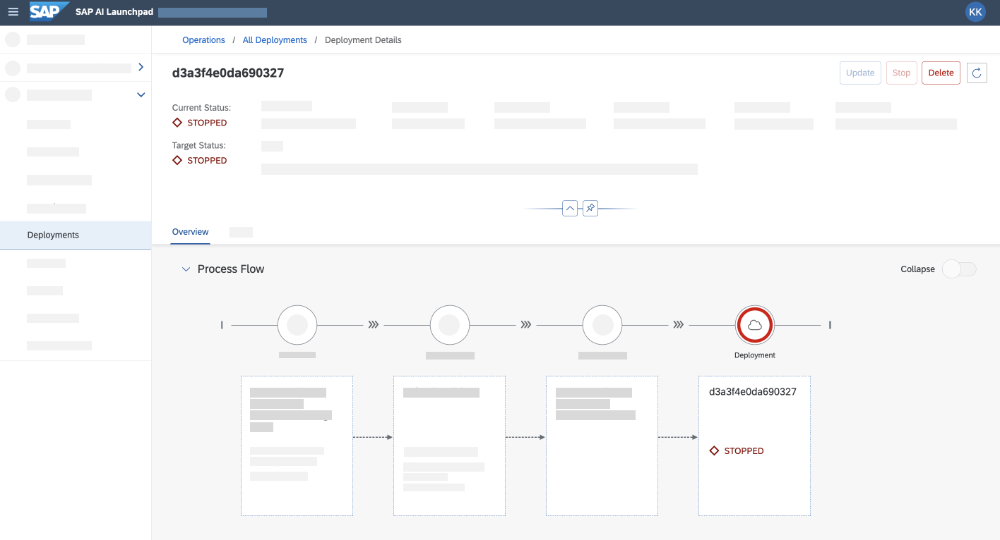

# Use Computer Vision Package to Serve AI Model for Meter Reading

<!-- description --> Deploy an object detection model in SAP AI Core for number recognition of meter readings.

## You will learn

- How to generate serving templates for a computer vision package
- How to generate and deploy an online inferencing server using a computer vision package
- How to consume endpoints for online inferencing

## Prerequisites

- You have trained an AI model for object detection using the [set up tutorial](cv-package-aicore-train-object-detection).
- You are using the Jupyter notebook from the [set up tutorial](cv-package-aicore-train-object-detection).

## Intro

**IMPORTANT** You must have successfully created an execution using the [prerequisite tutorial](cv-package-aicore-train-object-detection). You"ll need the value of the variable `trained_model` to complete this tutorial.

---

### Get reference content for serving template and Docker image

The computer vision package (`sap-cv`) provides reference `model-serving` workflow, for creating a serving template and creating a Docker image for the deployment server. The reference content is used like a boilerplate, and helps accelerate creation of your serving template and server.

To store the reference content, paste and run the snippet. The name of the reference content is `model-serving`.

```PYTHON
workflow = sap_cv_pkg.workflows['model-serving']
```

### Create labels for serving template

Paste and edit the snippet to store the serving template labels in JSON format. You must use your own Docker username for `image`.

```PYTHON[3]
workflow_config = {
   "name": "sap-cv-package-tutorial-obj-detection-serving",
   "image": "<YOUR_DOCKER_USERNAME>/sap-cv-package-model-serving:0.0.1",
   "annotations": {
       "scenarios.ai.sap.com/name": "SAP CV Package Tutorial",
       "executables.ai.sap.com/name": "sapcv-tutorial-obj-detection-serve",
   },
   "labels": {
       "scenarios.ai.sap.com/id": "sap-cv-package-tutorial",
       "ai.sap.com/version": "0.0.1"
   },
   "imagePullSecret": "<YOUR_DOCKER_SECRET>",
   "objectStoreSecret": "default-object-store-secret"
}
```

### Generate Docker image for serving

The reference workflow contains a `create_image` function. This function builds a Docker image using the serving template code contained in the computer vision package.

Paste and run the snippet.

> The variable `workflow_config` contains the key `image` which indicates the name of the new Docker image.

```PYTHON
workflow.create_image(workflow_config, silent=True)
```

<!-- border -->

Paste the snippet. You should see your Docker image in your system's local memory.

```BASH
docker images
```

<!-- border -->

### Upload Docker image to cloud

Upload your Docker image to the cloud Docker repository. SAP AI Core will download the image from the cloud repository and run the deployment.

Paste and edit the snippet. The exclamation prefix `!` executes the command in your system's terminal from your Jupyter notebook.

```PYTHON
!docker push <YOUR_DOCKER_USERNAME>/sap_cv_obj_detection:0.0.1
```

<!-- border -->

It may take a few minutes for the Docker registry to upload your code. After completion, you'll see a `Pushed` message in the output.

### Generate model serving template

The reference content contains a `create_template` function. This function builds a template using the serving template code contained in the computer vision package.

Paste and edit the snippet. The `output_file` is the target location for your new serving template. The target location must be a valid system location.

```PYTHON[1]
output_file = '/path/to/output/sap-cv-demo-aicore-sdk-cli-serving.yaml'
workflow.create_template(workflow_config, output_file, silent=True)
```

The snippet generates a workflow template based on your workflow config.

### Sync new serving template with SAP AI Core

Save the new serving template to the GitHub repository, in the folder tracked by **Application** of SAP AI Core.

You may run this snippet in a Jupyter notebook cell if you need help with committing and pushing to Git. Paste and edit the snippet.

```PYTHON[2]
print(f'''Run in Terminal:
cd <YOUR_REPO>
git add <YOUR_PATH_WITHIN_REPO>/{pathlib.Path(output_file).name}
git commit -m \'updated template {workflow_config["name"]}\'
git push
''')
```

- Replace `<YOUR_REPO>` with your GitHub repository .
- Replace `<YOUR_PATH_WITHIN_REPO>` with directory within your repo which contains the template file.

> **AI Core Git Ops Sync:**
> Once the template is pushed into the Git repo, you need to wait for AI Core to sync with this repository. AI Core syncs with the on-boarded Git repositories at periodic intervals. Once the template is synced with AI Core you can execute the serving template to start model training.

### Get model ID for trained model

Paste and run the snippet to check the trained model.

> **CAUTION** The variable `trained_model` references the value from the prerequisite tutorial.

```PYTHON
if trained_model is None:
    print('Training not finished -> model not ready for deployment')
else:
    serving_config_name = f'demo-object-detection-meter-reading-serving-{trained_model.id[:6]}'
```

### Create configuration for the deployment

Paste and run the snippet.

```PYTHON
params = [
    ParameterBinding("iou_threshold", "0.5")
]

try:
    configuration = [r for r in aicore_client.configuration.query().resources if r.name == serving_config_name][0]
    print('Found configuration')
except IndexError:
    with open(output_file) as stream:
        template_metadata = yaml.safe_load(stream)['metadata']
    configuration_deployment = aicore_client.configuration.create(
        name=serving_config_name,
        scenario_id=template_metadata["labels"]["scenarios.ai.sap.com/id"],
        executable_id=template_metadata["name"],
        input_artifact_bindings=[InputArtifactBinding('trainedmodels', trained_model.id)],
        parameter_bindings=params
    )
    print('Configuration Created')
```

The snippet checks your SAP AI Core instance for a configuration with the same name as variable `serving_config_name` (initialized in the previous step). A new configuration is only created if the name doesn't already exist.

<!-- border -->

The remaining configuration data is retrieved from your serving template YAML file. The following table summarizes the values.

| Key                             | Purpose                                                                         |
| ------------------------------- | ------------------------------------------------------------------------------- |
| `name`                          | to identify configuration                                                       |
| `scenario_id` & `executable_id` | to associate the YAML file to your configuration                                |
| `input_artifact_bindings`       | to select the trained models as an input to the template code, the Docker image |
| `parameter`                     | (value not from the YAML file) parameters to be used during inference           |

### Start deployment

Paste and run the snippet.

```PYTHON
deployment = aicore_client.deployment.create(configuration_deployment.id)
```

To create and start a deployment, you need the `ID` of the deployment configuration created in the previous step. You may need to wait a few moments, while SAP AI Core fetches the resources mentioned in the deployment configuration, and starts the server for online inferencing.

To check the deployment status, paste and run the snippet. You may need to execute the snippet again (wait a few minutes) to retrieve the updated status.

```Python
from ai_core_sdk.resource_clients import RestClient

if 'deployment' not in locals():
    deployment_id = input('Restarting this Notebook again? Provide DeploymentID: ')
else:
    deployment_id = deployment.id

deployment = aicore_client.deployment.get(deployment_id)

if deployment.status == Status.RUNNING:
    deployment_client = RestClient(deployment.deployment_url, aicore_client.rest_client.get_token)
    deployment_client.headers = aicore_client.rest_client.headers
    print('Deployment Ready!')
else:
    trained_model = None
    print('Deployment not Ready!')
```

<!-- border -->

The snippet checks the status of the deployment. It also fetches the `Deployment URL` and the Rest Client (`deployment_client`) using it. You can use `deployment_client` to send inference requests to the deployed model.

If required, wait a few minutes and execute the snippet again. The expected output is `Deployment Ready`.

<!-- border -->

> You can also use the **ML Operations** app in **SAP AI Launchpad** to check the status of your deployment. When ready, the deployment's **Current Status** changes to `RUNNING`.

<!-- border -->

You'll find the deployment URL in the deployment details. The other components used in this deployment (workflow, input artifacts, configuration) can be found in the **Process Flow** pane.

<!-- border -->

### Check status endpoint of inference server

Check the status of your deployment using the `/v1/status` endpoint. This endpoint is provided as a standard part of the Docker image generated for model serving.

```PYTHON
status_path = '/v1/status'
status = deployment_client.get(status_path)
print(json.dumps(status, indent=4))
```

<!-- border -->

### Detect meter reading from test image

Paste the snippet to display a test image.

```PYTHON
import base64
import numpy as np
import cv2
from matplotlib import pyplot as plt

def decode_image_path(img_path):
    img = cv2.imread(img_path)
    img_np = cv2.imencode('.jpg', cv2.imread(img_path))
    return img, base64.b64encode(img_np[1]).decode()

img_path = 'MeterDataset/Rough-Digit-Classification/Images/00450000100544_0.jpg'

img, img_str = decode_image_path(img_path)
plt.imshow(img[:,:,::-1])
```

<!-- border -->

Determine the meter reading from the test image using the `/models/model:predict` endpoint.

```Python
predict_path = f'/v1/models/model:predict'
predict = deployment_client.post(predict_path, body={'images': img_str})

print(json.dumps(predict, indent=4))
```

<!-- border -->

<!-- border -->

### Visualize detected meter reading

Display the predicted bounding box for your image using the following snippet.

```PYTHON
%matplotlib inline
import torch

from detectron2.structures.instances import Instances
from detectron2.structures.boxes import Boxes
from detectron2.utils.visualizer import Visualizer

class Metadata:
    thing_classes = [str(i) for i in range(10)]

    def get(self, k, default):
        return getattr(self, k, default)


inst = Instances(img.shape[:2],
                 pred_boxes=Boxes(torch.tensor(predict[0]['pred_boxes'])),
                 scores=torch.tensor(predict[0]['scores']),
                 pred_classes=torch.tensor(predict[0]['pred_classes'])
                 )


vis = Visualizer(img_rgb=img[:,:,::-1], metadata=Metadata())
vis.draw_instance_predictions(inst).fig
```

<!-- border -->

### Stop deployment server

After you have tried determining meter readings for multiple examples, it's a good idea to stop the deployment (this saves resources).

```PYTHON
from aicore_client_sdk.models.target_status import TargetStatus
response = aicore_client.deployment.modify(deployment_id, target_status=TargetStatus.STOPPED)
print(response.__dict__)
```

You can also stop a deployment using the **ML Operations** app in **SAP AI Launchpad**. In the deployment's details screen, choose **Stop**.

<!-- border -->

---
