# Set Up Computer Vision Package for SAP AI Core

<!-- description --> Set up Python and install computer vision package and its dependencies like PyTorch and Detectron2. Install the SAP AI Core SDK to interact with SAP AI Core using Python.

## You will learn

- How to install Python packages for computer vision AI pipelines
- How to execute Python code in Jupyter
- How to connect to SAP AI Core using the SAP AI Core SDK

## Prerequisites

- You have completed the [Create Your First Machine Learning Project using SAP AI Core tutorial series](group.ai-core-get-started-basics)
- You have [provisioned SAP AI Core](https://help.sap.com/viewer/2d6c5984063c40a59eda62f4a9135bee/LATEST/en-US/38c4599432d74c1d94e70f7c955a717d.html)
- You have [set up your Git repository with SAP AI Core](https://help.sap.com/viewer/808d9d442fb0484e9b818924feeb9add/LATEST/en-US/3269092e37d141a293f0dbd7eaafc829.html).
- You have [created Docker registry secret in SAP AI Core](https://help.sap.com/viewer/2d6c5984063c40a59eda62f4a9135bee/LATEST/en-US/b29c7437a54f46f39c911052b05aabb1.html)
- You have [registered your object store secret in SAP AI Core](https://help.sap.com/docs/AI_CORE/2d6c5984063c40a59eda62f4a9135bee/b083d73f672c428faac3048b74733546.html)

## Pre-read

The computer vision package provides a fast and easy way to train computer vision models and set up a serving infrastructure. The computer vision package works with the SAP AI Core SDK (ai-core-sdk) to provide a command line interface to create SAP AI Core templates for training and serving.
The package bundles capabilities of detectron2 (library for object detection and image segmentation) with extensions such as image classification, feature extraction and model serving.

## Intro

In this tutorial, you first create a Python virtual environment and install Python packages in the Python virtual environment. You then link the virtual environment to a Jupyter notebook so that you can run computer vision pipelines on SAP AI Core from a Jupyter notebook.

After set up, you can train and serve an AI model for object detection. The aim of the model is to recognise objects (numbers) on electricity meter readings. See the related computer vision tutorials for training and serving an object detection model.

### For Windows users

Python package `detectron2` currently [only supports Linux or MacOS](https://detectron2.readthedocs.io/en/latest/tutorials/install.html#requirements). For this reason, it's recommended that you set up a Linux Virtual Machine (VM) in your Windows OS to use the computer vision package and complete the tutorial. For more information about how to install Linux VM, see [guide to install Ubuntu VM on VirtualBox here](https://ubuntu.com/tutorials/how-to-run-ubuntu-desktop-on-a-virtual-machine-using-virtualbox#1-overview).

---

### Install Python

Download and install Python 3.9.X from [python.org v3.9.13](https://www.python.org/downloads/release/python-3913/).

> **CAUTION**: Python version `3.9` is required for the computer vision package.

`pip` is the Python package installer. It is required to install `sap-computer-vision-package` and other required packages. `pip` is installed along with Python.

Check `pip` availability.

```BASH
pip --version
```

### Create Python virtual environment

The Python virtual environment helps you install Python packages inside a sandbox-like environment. You use the environment to maintain required versions of the packages for your project.

Create and activate a virtual Python environment using the following snippet. Note, `sap_cv_env` is the name of your environment.

```BASH
$ python -m venv sap_cv_env
$ source sap_cv_env/bin/activate
```

Check which Python is used by your virtual environment.

```Shell
$ which python
```

You can see the path of the Python executable in your virtual environment.

```Shell
/Users/<username>/Documents/tutorials/sap_cv_env/bin/python
```

### Install SAP AI Core SDK

The `ai-core-sdk` Python package allows us to interact with SAP AI Core. It also provides a command line interface to content packages like the computer vision package.

Install the `SAP AI Core SDK` package by running the snippet below.

> (The command `pip install <package_name>` downloads the package from [public python repository](https://pypi.org/project/ai-core-sdk/). and installs it in your virtual environment.)

```BASH
pip install "ai-core-sdk[aicore-content]"
```

<!-- border -->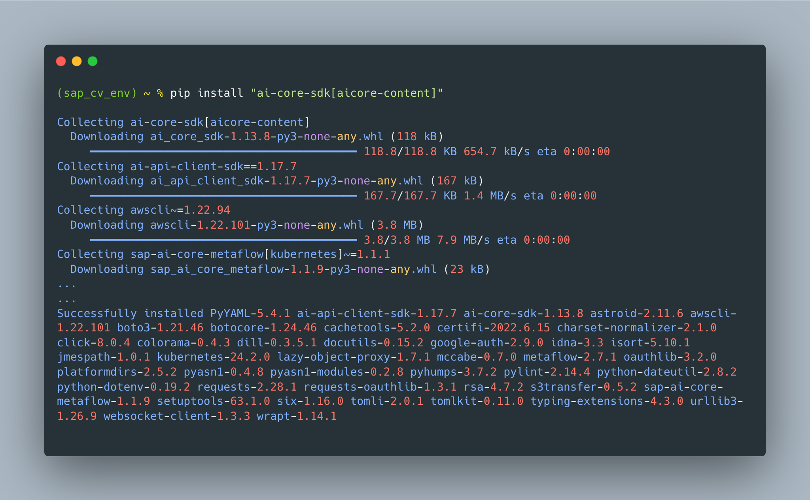

### Install PyTorch and Detectron2

You must install `Torch` and `detectron2` packages.

[OPTION BEGIN [Mac OS]]

```BASH
pip install torch==1.10 torchvision
pip install https://github.com/facebookresearch/detectron2/archive/refs/tags/v0.6.zip
```

<!-- border -->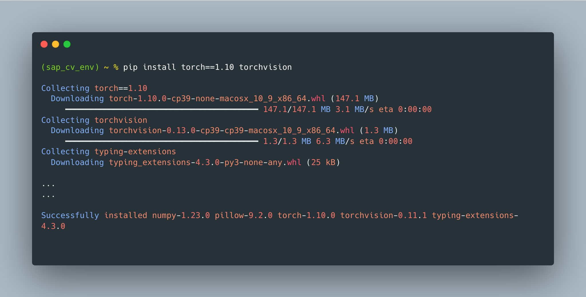

<!-- border -->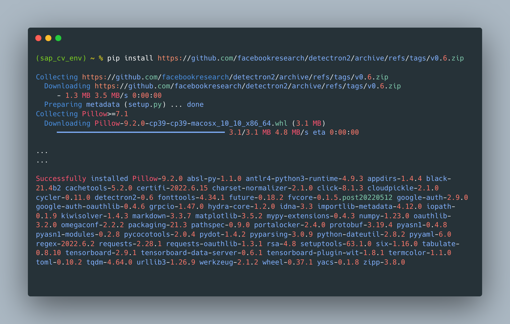

[OPTION END]

[OPTION BEGIN [Linux]]

For Linux, pre-builds of `detectron2` are available. Run the snippet.

```BASH
pip install torch==1.10 torchvision
pip install detectron2 -f https://dl.fbaipublicfiles.com/detectron2/wheels/cpu/torch1.10/index.html
```

<!-- border -->

<!-- border -->

[OPTION END]

[OPTION BEGIN [Windows]]

> NOTE: `detectron2` does not currently support Windows OS. We recommend that you use a Linux VM for the tutorial. If you need assistance, check [Guide to install Ubuntu VM on VirtualBox here](https://ubuntu.com/tutorials/how-to-run-ubuntu-desktop-on-a-virtual-machine-using-virtualbox#1-overview).

On the Linux Virtual Machine, follow the installation steps listed under the Linux tab.

[OPTION END]

> **INFORMATION** For detailed Torch installation instructions, see [here](https://pytorch.org/get-started/locally/). After installing Torch, the matching version of `detectron2` must be installed. Check the [detectron2 installation guide](https://detectron2.readthedocs.io/en/latest/tutorials/install.html) to select the required version. Test the package with `detectron2=0.6`.

### Install computer vision package

Install the computer vision package.

```BASH
pip install sap-computer-vision-package
```

### Configure Metaflow

The computer vision package uses Metaflow library for creating pipelines on SAP AI Core. Metaflow is installed along with `sap-computer-vision-package`. You need to configure Metaflow on your system and set your AWS connection to it.

Paste and run the snippet. When prompted, provide the credentials for your AWS object store (example: S3).

> **CAUTION** For Windows users, run the snippet within your Linux VM.

```BASH
metaflow configure aws
```

You should now have a Metaflow configuration file (`~/.metaflowconfig/config.json`) in the home directory of your user. The contents of the configuration file should look something like this.

(Template for Metaflow configuration file)

```JSON
{
    "METAFLOW_DEFAULT_DATASTORE": "s3",
    "METAFLOW_DATASTORE_SYSROOT_S3": "s3://<your_object_store_bucket_name>/path/in/your/bucket"
}
```

Alternatively, you can manually create the configuration file (`~/.metaflowconfig/config.json`) for Metaflow and use your `S3 bucket` data from the example above.

### Configure AWS Command Line Interface (CLI)

You must ensure your [AWS CLI](https://aws.amazon.com/cli/) is configured for the same bucket that you used for Metaflow

If you don't have `awscli` installed, you can [install AWS CLI](https://docs.aws.amazon.com/cli/latest/userguide/getting-started-install.html), and then run the snippet to configure AWS CLI.

```BASH
aws configure
```

When prompted, provide account details for your AWS object store (S3). It's similar to the example below.

<!-- border -->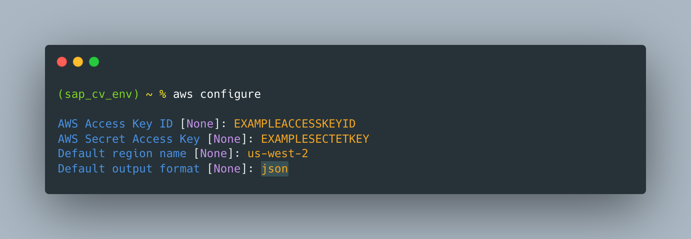

For more details about configuring AWS CLI, see [Official AWS user guide for configuring `awscli`](https://docs.aws.amazon.com/cli/latest/userguide/cli-configure-quickstart.html).

### Install Jupyter

Jupyter is used to execute Python code pieces in **cells**. You'll paste and run Python code in the cells in your own Jupyter notebook.

Run the snippet.

```BASH
pip install notebook
```

<!-- border -->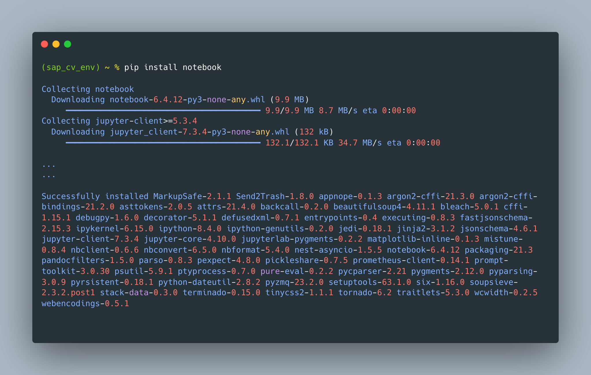

You can confirm the Jupyter installation using the following snippet.

```BASH
jupyter --version
```

Example output.

```BASH
$ jupyter --version

jupyter core     : 4.6.1
jupyter-notebook : 6.0.3
qtconsole        : 4.6.0
ipython          : 7.12.0
ipykernel        : 5.1.4
jupyter client   : 5.3.4
jupyter lab      : 1.2.6
nbconvert        : 5.6.1
ipywidgets       : 7.5.1
nbformat         : 5.0.4
traitlets        : 4.3.3
```

Add the `sap_cv_env` virtual environment to your Jupyter installation.

```BASH
python -m ipykernel install --name=sap_cv_env
```

You should see an output that indicates that the kernel is installed.

```Shell
Installed kernelspec sap_cv_env in /usr/local/share/jupyter/kernels/sap_cv_env
```

### Start Jupyter Notebook

Navigate to the folder that you are using for this the tutorial. The folder must not be GitHub synced, as the folder may store sensitive information.

In this tutorial, the folder is `~/tutorial`.

Run the snippet to start the Jupyter notebook.

```BASH
jupyter notebook
```

This starts the Jupyter notebook, like the example shown below, and automatically opens the notebook in your default browser.

<!-- border -->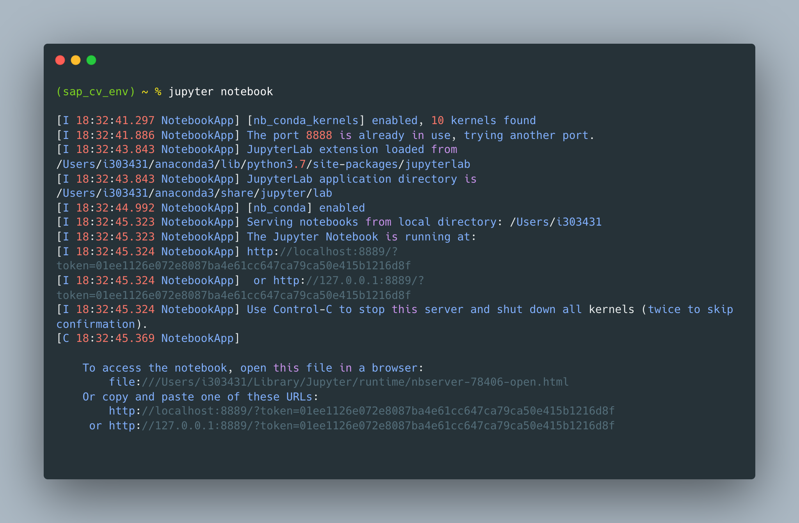

> **IMPORTANT:** DO NOT close the terminal which started the Jupyter notebook while using the notebook. The webpage is an interface to this terminal.

The Jupyter notebook should look similar to the example below.

<!-- border -->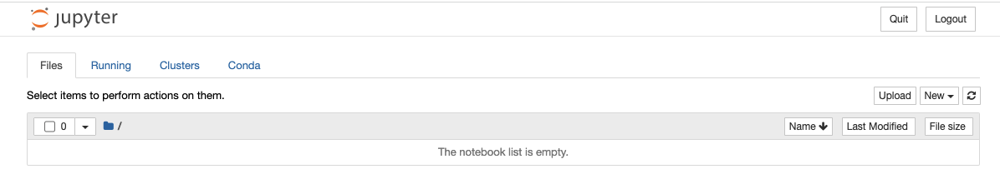

### Create Jupyter notebook

To create a notebook, choose **New > `sap_cv_env (ipykernel)`** in the open Jupyter session. A new notebook starts with `sap_cv_env` environment as the kernel.

<!-- border -->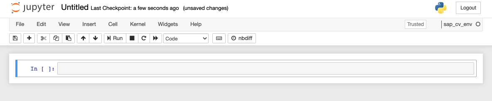

To change the notebook name, click **Untitled** on the header bar.

In the dialog box that appears, enter `Meter Reading using SAP CV Package`. Then choose **Rename**.

<!-- border -->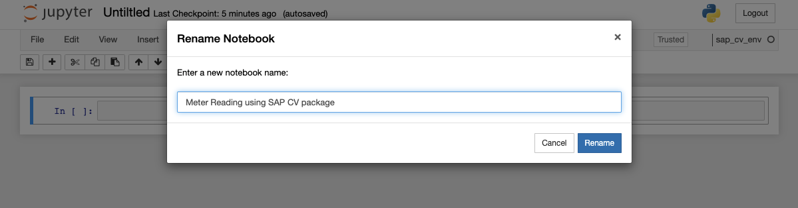

You'll see the renamed file in the folder for your Jupyter session.

<!-- border -->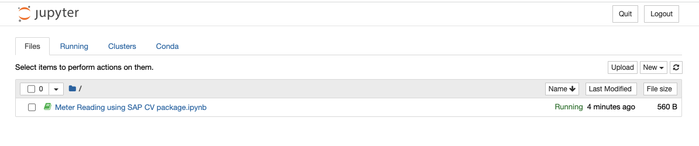

### Run Python code in Jupyter notebook

Enter your Python code inside your Jupyter notebook.

```Python
print("Hi, printed using python")
```

<!-- border -->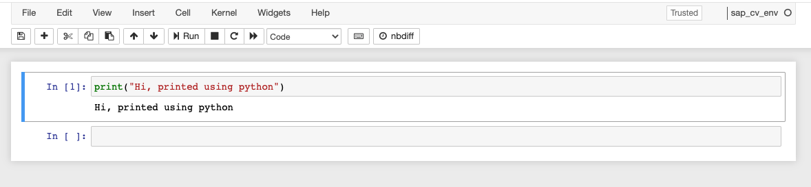

1. Enter your Python code in the grey box. The grey box is a Jupyter notebook **cell**.

2. Choose **Run** to execute the cell. You can also use the shortcut (`CTRL` + `Enter`).

### Download SAP AI Core service key

Get the service key for your SAP AI Core. Check how to [create a service key for SAP AI Core.](https://help.sap.com/viewer/2d6c5984063c40a59eda62f4a9135bee/LATEST/en-US/7323ff4e37ba41c198b06e9669b80920.html)

> If you have not provisioned SAP AI Core, check the [steps](https://help.sap.com/viewer/2d6c5984063c40a59eda62f4a9135bee/LATEST/en-US/38c4599432d74c1d94e70f7c955a717d.html) to provision SAP AI Core service.

Here's an example service key file. Confirm that your SAP AI Core service key file has the same properties.

```JSON
{
    "clientid": "<YourClientID>",
    "clientsecret": "<YourClientSecret>",
    "url": "https://tutorial.authentication.sap.hana.ondemand.com",
    "identityzone": "tutorial",
    "identityzoneid": "5555a-a2c-4444-2222",
    "appname": "example-cdefg-111-12233!h7777|aicore!1111",
    "serviceurls": {
        "AI_API_URL": "https://api.ai.ml.hana.ondemand.com"
    }
}
```

Now, download the service key file in JSON format.

> Save the `aic_service_key.json` file in the folder relative to your Jupyter notebook. You'll use the saved location to load the service key and create the AI API client, so ensure the path is correct.

After you've added the `aic_service_key.json` file to the correct folder, it should look like this example in your Jupyter file browser.

<!-- border -->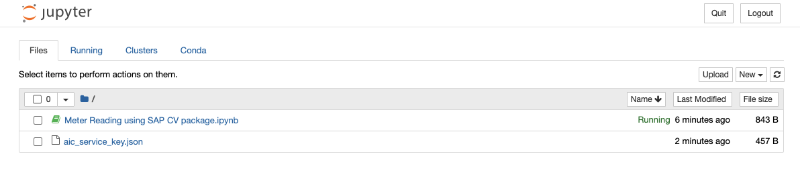

### Connect to SAP AI Core

To connect the AI API client with SAP AI Core, first paste the code snippet in a new Jupyter cell.

```PYTHON
from ai_core_sdk.ai_core_v2_client import AICoreV2Client
import json

# Your service key JSON file relative to this notebook
aic_service_key_path = 'aic_service_key.json'

# Loads the service key file
with open(aic_service_key_path) as ask:
    aic_service_key = json.load(ask)

# Creating an AI API client instance
aicore_client = AICoreV2Client(
    base_url = aic_service_key["serviceurls"]["AI_API_URL"] + "/v2", # The present AI API version is 2
    auth_url=  aic_service_key["url"] + "/oauth/token",
    client_id = aic_service_key['clientid'],
    client_secret = aic_service_key['clientsecret']
)
```

Then, execute the cell. You can either click the arrow beside the cell, press `Shift` + `Enter` on keyboard, or \*alternatively: **Run** > **Run Cells\***.

The code first loads file `aic_service_key.json`. Then, it creates a connection to your SAP AI Core instance via AI API client SDK. Finally, it stores the connection to the AI API client instance variable `aicore_client`.

> Note, you'll use the `aicore_client` variable throughout the tutorial to refer to your SAP AI Core connection.

### Check AI API client connection

Check that the AI API is correctly set up.

```PYTHON
aicore_client.scenario.query('default').count
```

You should see a numeric value based on the number of scenarios in your AI Core instance (most likely `0`).

<!-- border -->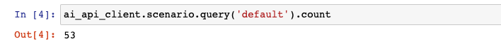

### Test yourself

Let's assume you have the following file snippet in your SAP AI Core service key _(JSON file)_.

```
{
    ...
    "serviceurls": {
      "AI_API_URL": "https://api.ai.ml.hana.ondemand.com"
}
```

And given that at present the API version for AI API is `v2`.

---
