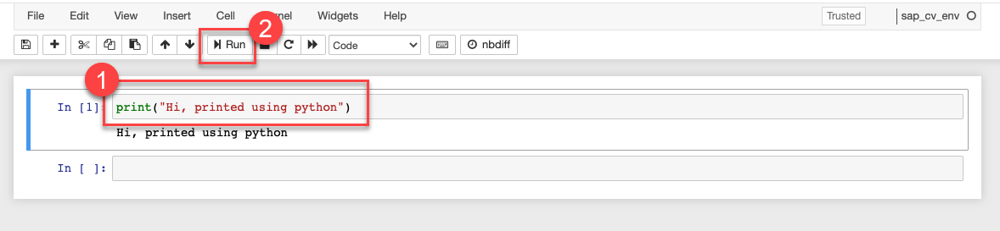

### You will learn
  - How to install packages for python
  - How to install dependencies for `sap-computer-vision package`
  - How to execute python code in Jupyter
  - How to connect to SAP AI Core using the SAP AI Core SDK

## Prerequisites
  - You have completed the [Create Your First Machine Learning Project using SAP AI Core tutorial series](group.ai-core-get-started-basics)

## Details
You would create a Python environment with Jupyter notebook. After installing the required Python packages into this environment you can use it for running Computer Vision pipelines on SAP AI Core from the Jupyter notebook.
---

[ACCORDION-BEGIN [Step 1: ](Check Prerequisites)]
The tutorial series showcases an Advanced usage of SAP AI Core and requires that SAP AI Core components are on-boarded completely.
> NOTE: If you have not provisioned SAP AI Core. Read [provisioning steps](https://help.sap.com/viewer/2d6c5984063c40a59eda62f4a9135bee/LATEST/en-US/38c4599432d74c1d94e70f7c955a717d.html) to provision SAP AI Core service.

Please ensure the following components for SAP AI Core are setup:
 - You have [set up your Git Repository with SAP AI Core](https://help.sap.com/viewer/808d9d442fb0484e9b818924feeb9add/LATEST/en-US/3269092e37d141a293f0dbd7eaafc829.html).

 - You have [created docker registry secret in SAP AI Core](https://help.sap.com/viewer/2d6c5984063c40a59eda62f4a9135bee/LATEST/en-US/b29c7437a54f46f39c911052b05aabb1.html)

 - You have [registered your Object Store secret in SAP AI Core](https://help.sap.com/docs/AI_CORE/2d6c5984063c40a59eda62f4a9135bee/b083d73f672c428faac3048b74733546.html)

This tutorial also uses a few Python packages for implementing the Computer Vision use-case. One of the packages (`detectron2`) currently [only supports Linux or MacOS](https://detectron2.readthedocs.io/en/latest/tutorials/install.html#requirements). For this reason, We would recommend Windows OS users to setup a Linux Virtual Machine for using the computer vision package and this tutorial.
> NOTE: If you need some assistance for installing a Linux VM, check out the [Guide to install Ubuntu VM on VirtualBox here](https://ubuntu.com/tutorials/how-to-run-ubuntu-desktop-on-a-virtual-machine-using-virtualbox#1-overview).

Ensure these above Prerequisites are completed before proceeding with the next steps.

[DONE]
[ACCORDION-END]

[ACCORDION-BEGIN [Step 2: ](Install Python)]
We need python to run the tutorial. Let's start by installing Python.

[Download and Install Python from here](https://www.python.org/downloads/release/python-3913/)

> **CAUTION**: Please ensure to install python version `3.9`.

You will need to install a few packages for this tutorial including the `sap-computer-vision-package`. To be able to install Python packages you would need a package installer.
`pip` is the python package installer which will be installed along with python.

To check for `pip` after installation completes,
execute the following on terminal *(command prompt)*

```Shell
pip --version
```

```Shell
21.x
```

[DONE]
[ACCORDION-END]

[ACCORDION-BEGIN [Step 3: ](Create Virtual environment)]

Create a virtual environment so you can install all the required packages inside it.

Run the following commands to create and then activate the environment.

```Shell
$ python -m venv sap_cv_env
$ source sap_cv_env/bin/activate
```
To check if the virtual environment is activated, you can check which python is used by default now.

```Shell
$ which python
```

You should see something like this. note the `sap_cv_env` from the environment name specified above:
```Shell
/Users/kannan/Documents/tutorials/sap_cv_env/bin/python
```

[DONE]
[ACCORDION-END]

[ACCORDION-BEGIN [Step 4: ](Install AI Core SDK)]

The interface for all content packages is part of the `ai-core-sdk`.

It offers a Python API and a CLI to consume content packages. In this tutorial you will be using the python API.  

Execute the following on terminal to install `AI Core SDK` package in python.

```Shell
pip install "ai-core-sdk[aicore-content]"
```

!

This fetches the python package from the public repository for python packages and installs in your system. Locate the public repository [here](https://pypi.org/project/ai-core-sdk/).


[DONE]
[ACCORDION-END]


[ACCORDION-BEGIN [Step 5: ](Install PyTorch and Detectron2)]

Before installing the `sap-computer-vision-package`, make sure that `Torch` and `detectron2` are installed.

[OPTION BEGIN [Mac OS]]

On MacOS following commands can be used to install both:
```Shell
pip install torch==1.10 torchvision
pip install https://github.com/facebookresearch/detectron2/archive/refs/tags/v0.6.zip
```

!

!

Further details on how to install Torch can be found [here](https://pytorch.org/get-started/locally/). After the installation of Torch the matching version of `detectron2` has to be installed. Please check the [detectron2 installation guide](https://detectron2.readthedocs.io/en/latest/tutorials/install.html) to select the proper version. The package is tested with `detectron2=0.6`.
[OPTION END]

[OPTION BEGIN [Linux]]

For Linux pre-builds of `detectron2` are available:
```Shell
pip install torch==1.10 torchvision
pip install detectron2 -f https://dl.fbaipublicfiles.com/detectron2/wheels/cpu/torch1.10/index.html
```
!

!

Further details on how to install Torch can be found [here](https://pytorch.org/get-started/locally/). Make sure to select the URL matching your `torch` version and `cuda` when GPU support is needed. Details can be found in the [detectron2 installation guide](https://detectron2.readthedocs.io/en/latest/tutorials/install.html).

[OPTION END]

[OPTION BEGIN [Windows]]

> NOTE: Unfortunately, `detectron2` currently does not support Windows OS. We recommend to use a Linux VM for the tutorial. If you need some assistance check out the [Guide to install Ubuntu VM on VirtualBox here](https://ubuntu.com/tutorials/how-to-run-ubuntu-desktop-on-a-virtual-machine-using-virtualbox#1-overview).

On the Linux Virtual Machine you can follow the installation steps listed under the Linux tab.
[OPTION END]

[DONE]
[ACCORDION-END]


[ACCORDION-BEGIN [Step 6: ](Install SAP Computer Vision Package)]
Install the main package for the tutorial: `sap-computer-vision`.
Execute the following command:
```Shell
pip install sap-computer-vision-package
```

This fetches the python package from the public repository for python packages and installs in your system. Locate the public repository [here](https://pypi.org/project/sap-computer-vision-package/).


[VALIDATE_7]
[ACCORDION-END]


[ACCORDION-BEGIN [Step 7: ](Configure Metaflow)]

SAP Computer Vision package uses Metaflow internally so it has installed it already as part of its dependencies. You just need to configure Metaflow on your system.

Run the below command in a shell and provide the requested details for Object Store (example: S3)

```Shell
metaflow configure aws
```

After this configuration you should have a config file (`~/.metaflowconfig/config.json`) at the home directory of your user.

The contents of that file would look something like this:
```json
{
    "METAFLOW_DEFAULT_DATASTORE": "s3",
    "METAFLOW_DATASTORE_SYSROOT_S3": "s3://<bucket>/<prefix>"
}
```

Alternatively, you can also manually create the config file (`~/.metaflowconfig/config.json`) and fill it with your `S3 bucket` and `prefix` as shown above.

[DONE]
[ACCORDION-END]


[ACCORDION-BEGIN [Step 8: ](Configure AWS CLI)]
In addition to configuring Metaflow, your local `awscli` has to be configured for the same bucket.

If you don't have `awscli` installed, you can [install aws cli](https://docs.aws.amazon.com/cli/latest/userguide/getting-started-install.html) and then run :

```Shell
aws configure
```
You'll be asked to provide details of your Object Store (S3) account details similar to the one shown below:
!

For more details you can refer to the [Userguide for configuring awscli](https://docs.aws.amazon.com/cli/latest/userguide/cli-configure-quickstart.html)

[DONE]
[ACCORDION-END]

[ACCORDION-BEGIN [Step 9: ](Install Jupyter)]
Jupyter is used to execute python code pieces in form of cells.

Use `pip` to install Jupyter. Execute the following on terminal.

```Shell
pip install notebook
```

!

Check if Jupyter is correctly installed. Execute the following on terminal.

```Shell
jupyter --version
```
Output:
```Shell
$ jupyter --version

jupyter core     : 4.6.1
jupyter-notebook : 6.0.3
qtconsole        : 4.6.0
ipython          : 7.12.0
ipykernel        : 5.1.4
jupyter client   : 5.3.4
jupyter lab      : 1.2.6
nbconvert        : 5.6.1
ipywidgets       : 7.5.1
nbformat         : 5.0.4
traitlets        : 4.3.3
```

Add the `sap_cv_env` environment to the Jupyter. Run this command:
```Shell
python -m ipykernel install --name=sap_cv_env
```

You should see an output that says that the kernel is installed:
```Shell
Installed kernelspec sap_cv_env in /usr/local/share/jupyter/kernels/sap_cv_env
```

[DONE]
[ACCORDION-END]


[ACCORDION-BEGIN [Step 10: ](Start Jupyter Notebook)]

On the terminal, navigate to folder which you will be using for this the tutorial (must not be GitHub synced, as in the folder you will store sensitive information). Here my folder is `C:/aicore-test`

Execute the following on terminal.

```Shell
jupyter notebook
```
This would start the Jupyter environment like shown below and automatically open the Jupyter Environment in your default browser.

!
> **IMPORTANT:** DO NOT close the terminal which started the Jupyter notebook while using the notebook. The webpage is just an interface to this terminal.


The Jupyter environment would look similar to this:
!


[DONE]
[ACCORDION-END]

[ACCORDION-BEGIN [Step 11: ](Create a Jupyter notebook)]

Click **New > `sap_cv_env (ipykernel)`** on Jupyter webpage (result of starting Jupyter).
This opens a new Notebook with the `sap_cv_env` environment set as the kernel.

!

Click on *Untitled* on the header bar to change the notebook name.

Type in a name in the dialog box that appears. Click *Rename*.

!


After renaming you can see your folder (where you started Jupyter session from terminal) will have `Meter Reading using SAP CV package.ipynb`.

*(The below screenshot is of the folder from IDE)*

!

[DONE]
[ACCORDION-END]


[ACCORDION-BEGIN [Step 12: ](Run Python code in Jupyter notebook)]

Type your python codes inside the Jupyter notebook.

```Python
print("Hi, printed using python")
```

!

- (1) Write you python code in the gray box, its called **cell** in Jupyter notebook.

- (2) Click on the `Run` button on the toolbar to execute the cell. You could also press the keyboard shortcut (`Shift` + `Enter`) to run the cell.

[DONE]
[ACCORDION-END]

[ACCORDION-BEGIN [Step 13: ](Download the SAP AI Core Service Key)]

Get service key for your SAP AI Core. [Read How to create service key for SAP AI Core.](https://help.sap.com/viewer/2d6c5984063c40a59eda62f4a9135bee/LATEST/en-US/7323ff4e37ba41c198b06e9669b80920.html)

> If you have not provisioned SAP AI Core. Read [provisioning steps](https://help.sap.com/viewer/2d6c5984063c40a59eda62f4a9135bee/LATEST/en-US/38c4599432d74c1d94e70f7c955a717d.html) to provision SAP AI Core service.

Here's an example service key file. Verify if your SAP AI Core service file has same name of keys as mentioned here:

```JSON
{
    "clientid": "<YourClientID>",
    "clientsecret": "<YourClientSecret>",
    "url": "https://tutorial.authentication.sap.hana.ondemand.com",
    "identityzone": "tutorial",
    "identityzoneid": "5555a-a2c-4444-2222",
    "appname": "example-cdefg-111-12233!h7777|aicore!1111",
    "serviceurls": {
        "AI_API_URL": "https://api.ai.ml.hana.ondemand.com"
    }
}
```

Download SAP AI Core service key file (JSON).

Save the file in the folder relative to where your Jupyter notebook is located, `aic_service_key.json`.

You will use the saved location to load service key and create AI API client, so ensure the path is correct.                    
After you have added the `aic_service_key.json` file to the correct location, it should look like this in your Jupyter File browser:

!

[DONE]
[ACCORDION-END]


[ACCORDION-BEGIN [Step 14: ](Create AI API client in Python)]
To setup the AI API client paste the code snippet below in a new cell in Jupyter:

```Python
from ai_core_sdk.ai_core_v2_client import AICoreV2Client
import json

# Your service key JSON file relative to this notebook
aic_service_key_path = 'aic_service_key.json'

# Loads the service key file
with open(aic_service_key_path) as ask:
    aic_service_key = json.load(ask)

# Creating an AI API client instance
ai_api_client = AIAPIV2Client(
    base_url = aic_service_key["serviceurls"]["AI_API_URL"] + "/v2/lm", # The present AI API version is 2
    auth_url=  aic_service_key["url"] + "/oauth/token",
    client_id = aic_service_key['clientid'],
    client_secret = aic_service_key['clientsecret']
)
```

And execute the cell. (Click the arrow beside the cell or press `Shift` + `Enter` on keyboard. *Alternatively: **Run** > **Run Cells**)*.

 - The code will load `aic_service_key.json`

  - It will create connection to your SAP AI Core instance via AI API client SDK.

  - Store the connection to AI API client instance variable `ai_api_client`.

  - Use this `ai_api_client` variable  throughout the tutorial to refer to your connection to SAP AI Core, watch out for **Warning** in the tutorials, where the same variable is referred (used).

[DONE]
[ACCORDION-END]

[ACCORDION-BEGIN [Step 15: ](Check AI API Client connection)]
Check that the AI API is correctly setup by running the following snippet:
```Python
ai_api_client.scenario.query('default').count
```
You should see a numeric value (most likely `0`) based on the number of scenarios in your AI Core instance.

!

[DONE]
[ACCORDION-END]

[ACCORDION-BEGIN [Step 16: ](Test yourself 2)]

Assuming you have the following file snippet in your SAP AI Core service key *(JSON file)*.

```
{
    ...
    "serviceurls": {
      "AI_API_URL": "https://api.ai.ml.hana.ondemand.com"
}
```
And given that at present the API version for AI API is `v2`.

[VALIDATE_4]
[ACCORDION-END]

---
