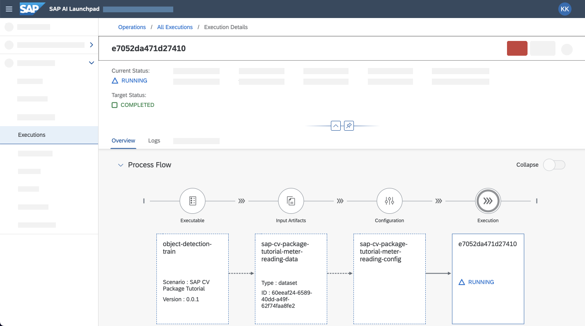
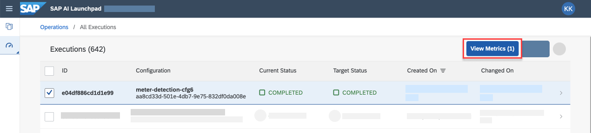
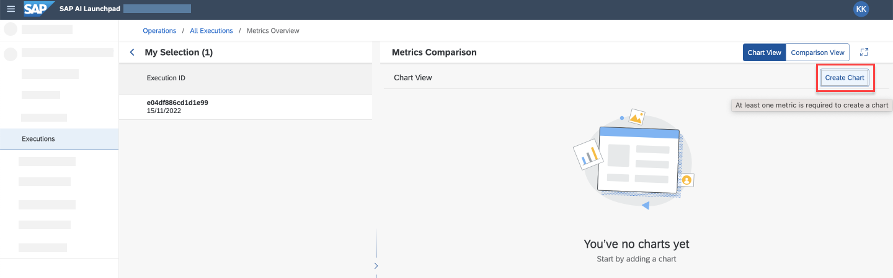

# Use Computer Vision Package to Train AI Model for Meter Reading

<!-- description --> Use computer vision package integrated with SAP AI Core, to train an AI model to read electricity meters.

## Prerequisites

- You have completed the tutorial to [set up SAP Computer Vision package for SAP AI Core](cv-package-aicore-setup)
- You have [set up your Git repository with SAP AI Core](https://help.sap.com/viewer/808d9d442fb0484e9b818924feeb9add/LATEST/en-US/3269092e37d141a293f0dbd7eaafc829.html)
- You have [created a Docker registry secret in SAP AI Core](https://help.sap.com/viewer/2d6c5984063c40a59eda62f4a9135bee/LATEST/en-US/b29c7437a54f46f39c911052b05aabb1.html)

## You will learn

- How to use the command line interface of SAP AI Core SDK to explore a content package
- How to use the computer vision package to create boilerplate Docker images for object detection (number recognition)
- How to use the computer vision package to create templates for your model training pipeline on SAP AI Core

## Pre-read

The `ai-core-sdk` Python package comes with a command line interface to explore content packages (like the computer vision package). The computer vision package helps you generate pipelines for common computer vision tasks, such as:

- object detection: detect multiple objects in an image. Example: bottles, chairs, pedestrians, numbers.
- image classification: differentiate an image based on category. Example: nature vs city, cat vs dog.
- image retrieval: search for similar images in a catalog of trained images. Example: similar apparel, similar plant.

In this tutorial, your task is to use object detection for number recognition. You'll train your AI code on a dataset containing images of electricity meters. The numbers in these images become objects which the AI code will learn to detect in new images of meter readings.

> Your business challenge might be different, and you should consider how to use the computer vision package for your data and expected outcomes.

---

### Inspect content package

Start your virtual environment created in the prerequisite tutorial. Paste and run the snippet.

```BASH
source sap_cv_env/bin/activate
```

List the available content packages using the following snippet.

> The `list` subcommand lists all content packages available in your environment.

```BASH
aicore-content list
```

You should see `sap-cv` content packages in the output.

<!-- border -->

List contents within `sap-cv` using the snippet below.

```BASH
aicore-content list sap-cv
```

You should see all available pipelines relevant for computer vision tasks, as well as their details.

<!-- border -->

### Inspect content package using Python

List available content packages using the following snippet in a new cell in a Jupyter notebook.

```PYTHON
from ai_core_sdk.content import get_content_packages

pkgs = get_content_packages()

for pkg in pkgs.values():
    print(pkg)
```

<!-- border -->

List available pipelines in the `sap-cv` content package.

```PYTHON
sap_cv_pkg = pkgs['sap-cv']

for workflow in sap_cv_pkg.workflows.values():
    print(workflow)
```

You should see available `Workflow` (pipeline) Python objects.

<!-- border -->

You don't need to know the internal definition of these workflows but it's helpful to understand their purpose.

- `type` indicates the following:
- - `ExecutionMetaflow`: generates workflows for training using Metaflow library
- - `DeploymentYaml`: generates workflows for online inferencing server

Select `object-detection-train` pipeline using the snippet.

```PYTHON
workflow = sap_cv_pkg.workflows['object-detection-train']
```

### Create labels for template

To generate a Docker image and templates, you need to pass values of labels to `sap-cv` generator. These values are used in creation of the pipelines.

Paste and edit the snippet in your Jupyter notebook using the following details.

```PYTHON
workflow_config = {
   "name": "sap-cv-package-tutorial-obj-detection-train",
   "image": "<YOUR_DOCKER_USERNAME>/sap-cv-package-object-detection-train:0.0.1",
   "labels": {
       "scenarios.ai.sap.com/id": "sap-cv-package-tutorial",
       "ai.sap.com/version": "0.0.1"
   },
   "annotations": {
       "scenarios.ai.sap.com/name": "SAP CV Package Tutorial",
   },
   "imagePullSecret": "<YOUR_DOCKER_SECRET>",
   "objectStoreSecret": "default-object-store-secret"
}
```

| Labels                                  | Description                                                                                                                                                                                                                                                                  |
| --------------------------------------- | ---------------------------------------------------------------------------------------------------------------------------------------------------------------------------------------------------------------------------------------------------------------------------- |
| `name`                                  | Custom ID of workflow. Can be a string with alphanumeric characters and underscores.                                                                                                                                                                                         |
| `image`                                 | The name to use in building Docker image. You must pass your username of [Docker registry](https://hub.docker.com) `<YOUR_DOCKER_USERNAME>/sap-cv-package-object-detection-train:0.0.1`.                                                                                     |
| `labels.scenarios.ai.sap.com/id`        | Custom ID of the machine learning scenario. Can be any valid string. Should be unique on your SAP AI Core instance.                                                                                                                                                          |
| `labels.ai.sap.com/version`             | A descriptive scenario version in any format. Example: `0.0.1`.                                                                                                                                                                                                              |
| `annotations.scenarios.ai.sap.com/name` | Descriptive name of your scenario. Example: `Detection of Digits`, `Detection of Cars in Traffic`                                                                                                                                                                            |
| `imagePullSecret`                       | Secret containing credentials to access your Docker repository. Should match with the registered secret name on your SAP AI Core                                                                                                                                             |
| `objectStoreSecret`                     | Secret containing credentials to access the object store (either from BTP/S3). Should match with the registered object store secret name on your SAP AI Core. **Please add the suffix `-object-store-secret` to the name of your object store secret when adding to label.** |

### Generate Docker image for training

The workflows (the variable `workflow` pointing to `object-detection-train` content) in computer vision package have a method `create-image` to build a Docker image using the template contained in computer vision package. The Docker image provides the runtime environment for the pipeline that you will create later in this tutorial.

Paste and run the snippet. The variable `workflow_config` contains the key `image` which sets the name for the Docker image to be built.

```PYTHON
workflow.create_image(workflow_config, silent=True)
```

<!-- border -->

Push your built Docker image to your Docker registry with below snippet. The `!` (exclamation) prefix executes command in your terminal from your Jupyter notebook.

```PYTHON
!docker push <YOUR_DOCKER_USERNAME>/sap-cv-package-object-detection-train:0.0.1
```

<!-- border -->

> **INFORMATION** You may also generate the Docker image from content package using Command Line interface.
>
> ```BASH
> aicore-content create-image -p <CONTENT_PACKAGE> -w <WORKFLOW> <WORKFLOW_CONFIG.YAML>
> ```

### Generate training template

The workflows have another method `create-template` to build a training pipeline with placeholders for datasets and hyper-parameters. This training pipeline internally references the Docker image you created previously. You are not required to modify/ update the AI code contained, but you can tweak hyper-parameters to achieve different model qualities, demonstrated later in the tutorial.

Paste and edit the following snippet. Replace `<YOUR_GIT_Repo_PATH>` with the absolute path to the directory that contains the repository you've on-boarded to SAP AI Core. This repository syncs using Git Ops.

> In this tutorial, the workflow object points to the object-detection-train content.

```PYTHON
output_file = '<YOUR_GIT_Repo_PATH>/sap-cv-package-tutorial-obj-detection-train.json'
workflow.create_template(workflow_config, output_file, silent=True)
```

<!-- border -->

> **INFORMATION** You may also generate the training template from the content package using the command line interface.
>
> ```BASH
> aicore-content create-template -p <CONTENT_PACKAGE> -w <WORKFLOW> <WORKFLOW_CONFIG.YAML> -o <OUTPUT_TEMPLATE_FILE.JSON
> ```

Now, commit and push this generated template to the Git repository that you have specified in SAP AI Core.

You can use the following snippet for commands to push the template to GitHub. Paste and edit.

```PYTHON
import pathlib

print(f'''Run in Terminal:
cd <YOUR_GIT_Repo_PATH>
git add <path_within_repo>/{pathlib.Path(output_file).name}
git commit -m \'updated template {workflow_config["name"]}\'
git push
''')
```

After the template is pushed to the Git repo, you'll need to wait a few minutes for the template in the repo to sync with SAP AI Core. On-boarded Git repositories are regularly synced with SAP AI Core (~3 mins).

### Download training data

You'll need to use a dataset which contains images of electricity meters for this tutorial. The model will attempt to read the meters using object detection. Find more information about the dataset on [Gas-Meter Reading Datasets, Applied Recognition Technology Laboratory](http://artelab.dista.uninsubria.it/downloads/datasets/automatic_meter_reading/gas_meter_reading/gas_meter_reading.html)

Run the following snippet to download the training dataset to your local system.

```BASH
! [ -d "MeterDataset" ] && echo "skipping" || (wget -nc --no-check-certificate "http://artelab.dista.uninsubria.it/downloads/datasets/automatic_meter_reading/gas_meter_reading/gas_meter_reading.zip" && unzip -qq gas_meter_reading -d .)
```

<!-- border -->

### Upload data to object store

SAP AI Core fetches the training dataset from the object store (cloud), therefore you need to upload the data to the object store.

Upload the dataset to your AWS object store using the following snippet.

> The object store should be the same as the one whose secret you've used in prerequisite tutorials.

```PYTHON
s3_target = "s3://<YOUR_S3_BUCKET>/meter-reading/Rough-Digit-Classification"
# Example: s3://hcp-787c1894-e893-4c8edf-b406-440347f6b411/kannan/meter-reading/Rough-Digit-Classification

! mv MeterDataset/Rough-Digit-Classification/JPEGImages MeterDataset/Rough-Digit-Classification/Images

! aws s3 cp --recursive --quiet MeterDataset/Rough-Digit-Classification {s3_target}
```

### Register dataset reference as artifact for SAP AI core

Paste and edit the snippet. Replace `< >` with your values.

| Variable/ Parameter    | Description                                                                                                                                              |
| ---------------------- | -------------------------------------------------------------------------------------------------------------------------------------------------------- |
| `ai_core_path` (`url`) | Path relative to `pathPrefix` of your object store secret created in SAP AI Core. Note the format: `ai://<object-store-secret-name>/<path-to-artifact>`. |
| `artifact_name`        | Descriptive name for the artifact                                                                                                                        |
| `scenario_id`          | Descriptive tag to identify that the purpose and value are the same as the one used in template creation                                                 |
| `kind`                 | Descriptive tag `DATASET` to identify purpose                                                                                                            |

```PYTHON
from ai_core_sdk.models import Artifact

ai_core_path =  'ai://default/meter-reading/Rough-Digit-Classification'
# example of artifact-path: 'ai://default/meter-reading/Rough-Digit-Classification'

artifact_name = 'tutorial-dataset-meter-reading-digits'

try:
    artifact = [r for r in aicore_client.artifact.query().resources if r.name == artifact_name][0]
    print('Found artifact')
except IndexError:
    print('Artifact Created')
    artifact = aicore_client.artifact.create(
        name=artifact_name,
        scenario_id=workflow_config["labels"]["scenarios.ai.sap.com/id"],
        kind=Artifact.Kind.DATASET,
        url=ai_core_path,
        description='Meter Reading Digits Dataset')
```

The previous snippet checks if an artifact of the same name has already registered in SAP AI Core.
If it has already been registered, it will return the ID of the existing artifact. If the artifact does not exist, a new artifact is created.

<!-- border -->

### Set hyperparameters for the template

Run the following snippet to create a `params` object with `Parameter Bindings`. You'll use the variable `params` to create the configuration for execution (training).

```PYTHON
from ai_core_sdk.models import ParameterBinding

params = [
    ParameterBinding("base_learning_rate", "0.001"),
    ParameterBinding("early_stopping", "False"),
    ParameterBinding("maximum_training_steps", "100"), # increase to 5000 for more accurate results but takes longer time to train ~ 1 Hr.
    ParameterBinding("train", "0.8"),
    ParameterBinding("validation", "0.1"),
    ParameterBinding("test", "0.1")
]
```

These parameters impact the training of the model for object detection.

> Once you have a baseline model, you can tweak hyper-parameters here to test different model settings and improve the model.

### Create configuration for training

Run the following snippet to check if a configuration of the same name already exists in SAP AI Core. If it exists, it will use the existing configuration.

```PYTHON
from ai_core_sdk.models import InputArtifactBinding

config_name = 'tutorial-sapcv-meter-reading'
# can customize, example config name 'sapcv-tutorial-meter-reading'

try:
    configuration = [r for r in aicore_client.configuration.query().resources if r.name == config_name][0]
    print('Found configuration')
except IndexError:
    print('Configuration Created')
    configuration = aicore_client.configuration.create(
        name=config_name,
        scenario_id=workflow_config["labels"]["scenarios.ai.sap.com/id"],
        executable_id=workflow_config["name"],
        input_artifact_bindings=[InputArtifactBinding('datain', artifact.id)], # dataset to use `datain` is placeholder name in the template
        parameter_bindings=params # hyper-parameter values to use.
    )
```

<!-- border -->

#### Details of configuration variables

| Parameter                | Description                                                                                                      |
| ------------------------ | ---------------------------------------------------------------------------------------------------------------- |
| `name`                   | Name of configuration                                                                                            |
| `scenario_id`            | Used to connect the configuration to the scenario ID mentioned previously in our workflow configuration          |
| `executable_id`          | Name of the workflow mentioned in workflow configuration                                                         |
| `input_artifact_binding` | Binds the dataset artifact you created (in the previous tutorial) to the placeholder for dataset in the template |
| `parameter_bindings`     | Parameters for the training you set in previous step                                                             |

### Start training

Start training by initiating the execution, using the following snippet.

```PYTHON
execution = aicore_client.execution.create(configuration.id) # configuration from previous step.
```

Wait for the training to finish. You may use the below snippet to check if training has finished.
This snippet checks if the execution variable is present in notebook environment. If it is present it checks for the status of this execution.

```PYTHON
# Execute in interval of 5 mins

from ai_core_sdk.models import Status

if 'execution' not in locals():
    execution_id = input('Restarting this Notebook again? Provide ExecutionID: ')
else:
    execution_id = execution.id
execution = aicore_client.execution.get(execution_id)
if execution.status == Status.COMPLETED:
    trained_model = execution.output_artifacts[0]
    print('Training finished!')
else:
    trained_model = None
    print('Training not finished!')
```

<!-- border -->

> **CAUTION:** Do not close you Jupyter notebook. To make predictions, you need to use the same notebook in the follow-up tutorial. You can use SAP AI Launchpad to monitor your execution in the next step. Continue to use your notebook when the execution reaches `COMPLETED` state.

### Monitor execution

Use **SAP AI Launchpad**, and open the **Workspace** app. Select your SAP AI Core Connection and **Resource Group**.

Navigate to the **Executions** tab. You should see that a new execution is listed with the configuration you created.

Confirm that the **Current Status** is either `PENDING` or `RUNNING`.

<!-- border -->

Choose your execution and navigate to its details. You should see detailed information about your execution, showing the entire pipeline with the name of the executable, artifact used, and configuration.

<!-- border -->

The `Logs` tab shows the logs from the executing pipeline.

<!-- border -->

After the model training has started, you can see the logs of the execution where you can find useful information like estimated time to completion for training under `eta` and other details about the training.

<!-- border -->

The metrics from the training can be found under the "Metric Resource" tab.

<!-- border -->

After model training is completed, a trained model appears under **Output Artifacts**. As part of the pipeline, this model is stored in the object store. The template generated by computer vision package handles all this behind the scenes for you.

<!-- border -->

On your Jupyter notebook, re-run the previous cell to determine the execution status. This fetches the trained model from the output artifacts of the execution and output `Training Completed`.

<!-- border -->

### Visualize Training Metrics

The SAP Computer Vision Package pushes metrics that could be interesting for you. These metrics can be visualized using the SAP AI Launchpad.

To visualize metrics for an execution, go to the Executions page, select the particular execution and click **View Metrics** on the header of the Executions table.

<!-- border -->

Selecting the **ComparisonView** would show you the configurations used for this run and also the Execution Metrics. Since we ran an Object Detection pipeline on digits from the Electricity Meter, the metrics show the **Mean Average Precision** of the individual digits in addition to the overall Precision of "allClasses".

<!-- border -->

If you select multiple executions from the Execution page, this screen would show you the comparison across the multiple executions. Since we have only one
This is a useful way of comparing the different configuration used and their corresponding impact on the training of the model.

In the **ChartView**, you can visualize these metrics as charts. To create a chart, Click on **Create Chart**.

<!-- border -->

Enter a name for your chart and an optional description. Select **Metrics to Steps**. In the field for "Metrics", select **mAP/allClasses** and for "Steps of Time" select **Steps** as shown below.

<!-- border -->

Click **Preview** and it should show a preview of chart. Click **OK**.

<!-- border -->

This would add the chart to your Metrics Comparison page.You can add more charts in the same way for metrics for individual digits (eg - **mAP/7**).
You can also view the chart in full screen.

<!-- border -->

This allows you to debug the training process to find digits which had difficulty learning from the images you provided.

### Summary

As a recap, in this tutorial, you have looked at creating Docker images and templates for a computer vision scenario.

### Cheat sheet

#### Workflow Configuration(Label)

```JSON
{
   "name": "sap-cv-package-tutorial-obj-detection-train",
   "image": "<YOUR_DOCKER_USERNAME>/sap-cv-package-object-detection-train:0.0.1",
   "labels": {
       "scenarios.ai.sap.com/id": "sap-cv-package-tutorial",
       "ai.sap.com/version": "0.0.1"
   },
   "annotations": {
       "scenarios.ai.sap.com/name": "SAP CV Package Tutorial",
   },
   "imagePullSecret": "<YOUR_DOCKER_SECRET>",
   "objectStoreSecret": "default-object-store-secret"
}

```

#### Build Docker image:

- Python: `workflow.create_image(workflow_config)`

- CLI: `ai-core-content create-image <workflow_config_file>`

#### Create Templates:

- Python: `workflow.create_template(workflow_config, out_file)`

- CLI: `ai-core-content create-template workflow_config out_file`

Everything else is regular SAP AI Core usage, that is, the other steps are similar to any other SAP AI Core tutorial.

---
