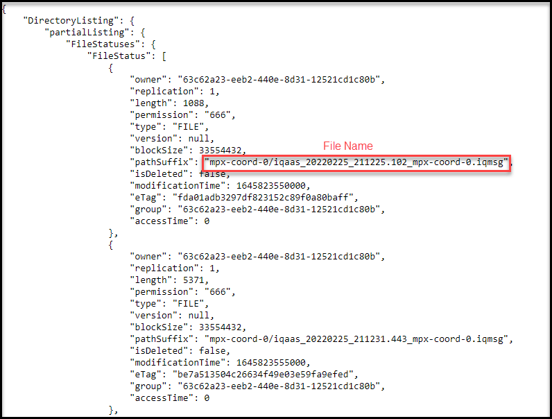
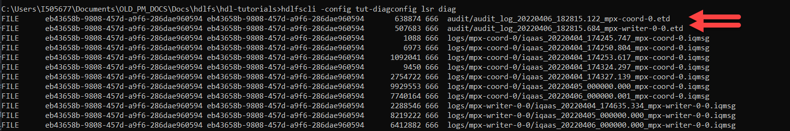
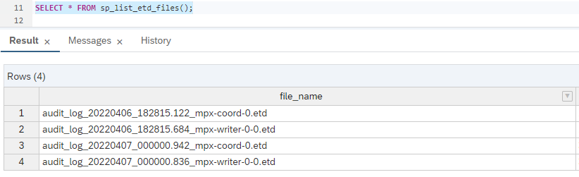
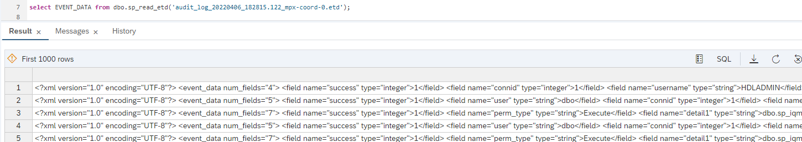

# View your SAP HANA Cloud, data lake Diagnostic Files and Audit Logs
<!-- description --> SAP HANA data lake allows you access to diagnostic and audit files that contain logs for server information, transactions, server checkpoints, errors and status messages. Learn how setup and access these files through the HDLFSCLI, REST API, and SQL Console.

## Prerequisites
 - Access to the Cloud Foundry space of a SAP HANA Cloud, data lake
 - Installation of the HANA data lake File Store Command Line Interface (HDLFSCLI)
 - [Optional] Completion of [Getting Started with Data Lake Files HDLFSCLI tutorial](group.hana-data-lake-containers)
 - Access to a licensed SAP HANA Cloud, data lake instance

## You will learn
  - How to set up the file container user to get access to the diagnostic files
  - How to download the diagnostic files to your local machine and read them
  - How to use the REST API to retrieve the diagnostic files
  - How to view the diagnostic files from a SQL Console

---

### Get Access to the Diagnostics User

The SAP HANA Cloud, data lake (HDL) generates diagnostic files that may be useful for understanding common problems in a HDL instance. There is a specific user that can be used to retrieve these files that needs to be enabled.

Start by heading to the Cloud Foundry space where the HDL instance is provisioned. In the space you will find "Instances" under "Services". This is where the diagnostics user's credentials can be found.


Upon selecting "create" a modal should appear named "New Service Key". Give the service key a name and paste the following JSON into the parameters box and select create.

```JSON
{
    "scope": "diagnostics",
    "credential-type": "X509_GENERATED",
    "duration": 90
}
```

Use the ellipses on the created service key to view the certificates that will have access to the diagnostic files. Copy the contents of the "certificate" to a local file and call it `tut-diagcert.crt` and copy the contents of the "key" to a local file and call it `tut-diagkey.key`.


> You will need to manually remove each `\n` in the files and replace them with real like breaks. An alternative to this is to use a code editor like Visual Studio Code and use the find and replace function. Use the regex find option and search for `\\n` and replace it with '\n'.

**[Optional]**: Use Visual Studio Code


### Access and Download the Diagnostic Files using the HDLFSCLI


If you've set up an HDLFSCLI configuration before, navigate to the `.hdlfscli.config.json` file in your home directory. Open it with a text editor and add a new configuration by pasting the following JSON.

```JSON
"tut-diagconfig": {
  "timeout": 3000000000,
  "format": "text",
  "output": "",
  "cert": "<path>/tut-diagcert.crt",
  "key": "<path>/tut-diagkey.key",
  "passphrase": "",
  "cacert": "",
  "skipServerCertificateVerification": true,
  "filecontainer": "<file-container-uuid>-diag",
  "endpoint": "<file container endpoint>",
  "pretty": false
}
```

If there are already configurations in the `.hdlfscli.config.json` file you can add the new configuration as another entry. Your `<path>` is the file path to the corresponding certificate or key. The file container endpoint can be found on the instance in SAP HANA Cloud Central. The `<file container uuid>` is the UUID portion of the file container endpoint (the first 36 characters).


Use the below JSON skeleton to add the diagnostics user configuration.

If the `.hdlfscli.config.json` file does not exist, create it in your home directory and paste the following JSON. The HDLFSCLI uses this file to identify configurations for easier usage.

```JSON
{
  "configs":{
    "tut-diagconfig": {
      "timeout": 3000000000,
      "format": "text",
      "output": "",
      "cert": "<path>/tut-diagcert.crt",
      "key": "<path>/tut-diagkey.key",
      "passphrase": "",
      "cacert": "",
      "skipServerCertificateVerification": true,
      "filecontainer": "<file-container-uuid>-diag",
      "endpoint": "<file container endpoint>",
      "pretty": false
    }
  }
}
```

Now, open a terminal or a command prompt and look inside the diagnostics file container.

`hdlfscli -config tut-diagconfig lsr`


Now that you've seen the diagnostic files, you can use the HDLFSCLI download command to download the diagnostic files and read them. To identify what diagnostic file you wish to download, understanding the format of the file names is helpful.

File names come in two flavors. The date in the file name can be used to identify the most recently updated log file.

1. Server Logs: `iqaas_<YYYYMMDD_HHMMSS.mmm><multiplex_node>.iqmsg`
2. Query Plans: `<iqaas>_<query_name>_<YYYYMMDD_HHMMSS>_<sequence_number>.html`

Choose a file in from the diagnostic files container and paste its path into the below command. The command will create a local directory called `sample-diagnostic-file` and place inside the diagnostic file. Now you can locate the file and open it with a text editor.

`hdlfscli -config tut-diagconfig download <file to download> ./sample-diagnostic-file`


### View the Diagnostic Files Using the REST API


The diagnostic files can also be accessed using a REST API. These examples will use Python to write requests to the REST API. The SAP HANA Cloud, data lake Files REST API reference can be found [here](https://help.sap.com/doc/9d084a41830f46d6904fd4c23cd4bbfa/QRC_4_2021/en-US/html/index.html).

Create a file `datalake_diagnostic_files_api.py` and paste the following in the script. The information for the placeholders is the same as in the configuration from step 2.

```Python
import http.client
import json

FILES_REST_API = '<File Container REST API>'
CONTAINER = '<File Container ID>-diag'
CRT_PATH = '<Path to Client Certificate>'
KEY_PATH = '<Path to Client Key>'
```

Now, add the logic for using the `LISTSTATUS_RECURSIVE` endpoint, which will list all the items in your directory. You should also format the response so that it is easier to read.

```Python
# Setup the request
file_path = '/diag/logs/'
request_url = f'/webhdfs/v1/{file_path}?op=LISTSTATUS_RECURSIVE'
request_headers = {
    'x-sap-filecontainer': CONTAINER,
    'Content-Type': 'application/json'
}

# Make the request
connection = http.client.HTTPSConnection(
    FILES_REST_API, port=443, key_file=KEY_PATH, cert_file=CRT_PATH)

connection.request(
    method="GET", url=request_url, body=None, headers=request_headers)

response = connection.getresponse()

# Decode the returned byte string and format it for legibility
files = response.read().decode('utf8')
data = json.loads(files)
formatted_data = json.dumps(data, indent=4)

# Print the response and close the connection
print(formatted_data)
response.close()
```

The output should look something like the following.



Notice where the file name can be identified. Once the file name is known, you can use the OPEN endpoint to read the file and write the contents to a local file. Add the below code to your script and fill in `<diagnostic file name>` with the file you wish to read.

```Python
file_path = '/diag/logs/<diagnostic file name>'
request_url=f'/webhdfs/v1/{file_path}?op=OPEN'
request_headers = {
    'x-sap-filecontainer': CONTAINER,
    'Content-Type': 'application/json'
}

connection = http.client.HTTPSConnection(
    FILES_REST_API, port=443, key_file=KEY_PATH, cert_file=CRT_PATH)

connection.request(
    method="GET", url=request_url, body=None, headers=request_headers)

response = connection.getresponse()

file_contents = response.read().decode('utf8')
print(file_contents)
response.close()
```

Now, if you want to write the contents of the diagnostic file to a local file, replace the print statement in the above code to the following. Make sure that the parent directory `sample-diagnostic-file` exists or remove it from the open statement.

```Python
file_name = 'my-diagnostics-file.txt'
f = open(f"sample-diagnostic-file/{file_name}", "w+")
f.write(file_contents)
f.close()
```

If you look inside the `sample-diagnostic-file` directory, or where ever you specified the file to be written to, you should find a file named `my-diagnostic-file.txt`. Open the file with a text editor to read it.


### View the Diagnostic Files Using Database Explorer


Another way to read diagnostic files is through the SQL Console in the Database Explorer. This is made possible through a number of stored procedures and SQL functions. The first procedure you will use is `sp_list_directory` which is similar to the list recursively command in the HDLFSCLI.

```SQL
CALL sp_list_directory('/diag/logs/');
```

Below is a sample of what might be seen with the `sp_list_directory` stored procedure.


Using the `file_path` column you can identify which files exist and can be read with the `read_server_file` stored procedure. Choose a file and read it using the SQL below.


```SQL
SELECT * FROM sa_split_list(cast( READ_SERVER_FILE('/diag/logs/<file_path>') as long varchar ), '\n');
```

In the above SQL you cast the `read_server_file` result to a VARCHAR or else it will come back as a long binary and not be legible. You can also use the `sa_split_list` function to format the result so that the result is split by the newline character `\n`. Here is a sample result.


That is how you can leverage Database Explorer and built in stored procedures to read log files. However, it is important to note that there is a limit on the amount of data that can be returned and displayed in a SQL result. However, the diagnostic files can be retrieved with Python and saved locally using the `sqlanydb` module.

```Python
import sqlanydb

conn = sqlanydb.connect(uid='<User Name>', pwd='<Password>', host='<host>:443', enc='tls(tls_type=rsa;direct=yes)')
curs = conn.cursor()
curs.execute("select read_server_file('/diag/logs/mpx-coord-0/<diagnostic file>')")
s = curs.fetchall()[0][0].decode('utf-8')
print(s)
```


### Enable and View SAP HANA, data lake Audit Logs


Audit logs in SAP HANA, data lake are accessible using the same diagnostic user and retrieval methods as the diagnostic files. In order to find these files, you need to first enable audit logging. Navigate to your SAP HANA Database Explorer SQL Console and follow the steps below.

1. Enable auditing for your SAP HANA Cloud, data lake.

    ```SQL
    SET OPTION PUBLIC.auditing = 'On';
    ```

2. Allow the data lake to write the audit logs to the file container by specifying an audit log prefix.

    ```SQL
    SET OPTION PUBLIC.audit_log='FILE(filename_prefix=audit_log)';
    ```

3. Select the auditing type that you would like to record and store in the file store. See the table below to review the available options.

    ```SQL
    CALL sa_enable_auditing_type( '<Auditing Type>' );
    ```

    |  Auditing Type    | Description
    |  :-------------   | :-------------
    |  `all`              | enables all types of auditing
    |  `connect`          | enables auditing of both successful and failed connection attempts
    |  `connectFailed`    | enables auditing of failed connection attempts
    |  `DDL`              | enables auditing of DDL statements
    |  `options`          | enables auditing of public options
    |  `permission`       | enables auditing of permission checks, user checks, and SETUSER statement
    |  `permissionDenied` | enables auditing of failed permission and user checks
    |  `triggers`         | enables auditing of a trigger event
    ---

4. If you want to disable the auditing type you've selected above, use the following SQL.

    ```SQL
    CALL sa_disable_auditing_type( '<Auditing Type>' );
    ```

5. To turn off auditing all together set the public auditing option to off.

    ```SQL
    SET OPTION PUBLIC.auditing = 'Off';
    ```

6. For this tutorial, use the following options.

    ```SQL
    SET OPTION PUBLIC.auditing = 'On';

    SET OPTION PUBLIC.audit_log='FILE(filename_prefix=audit_log)';

    CALL sa_enable_auditing_type( 'all' );
    ```

Now, since the auditing type has been set to all, any changes to the public options will create an auditing event. So our data lake should have already created an audit log for that event. Using the HDLFSCLI and the same configuration that was used for the diagnostic files, run an `ls` command and notice if the audit folder has been created.


If you run the `lsr` command you will be able to locate the full file path to any of the audit logs.



To read the file use the `cat` command and write the contents to a local file. The command below will copy the contents of the audit file of your choosing to a local file.

`hdlfscli -config tut-diagconfig cat diag/audit/<Audit File Name> > myauditfile.etd`

When the SAP HANA data lake Client was installed, a tool named `dbmanageetd` came with the package. This tool can be used to read `etd` files. To ensure that you have the utility, open a command prompt or terminal and type `dbmanageetd`. There should be some output describing the usage of the utility. You can read the file `myauditfile.etd` using the utility and write the output to a new file. Use the below command in a command prompt or terminal.

`dbmanageetd myauditfile > humanreadableetd.txt`

Now, open the `humanreadableetd.txt` text file in your favorite text editor to read the file. However, if the file is short or you only care able a glimpse of the log the log can be read from a SQL console. First, in a SQL Console connected to the SAP HANA, data lake instance use the below SQL to list the available audit files.

```SQL
SELECT * FROM sp_list_etd_files();
```



Then, select a file from the results and read it.

```SQL
SELECT * FROM dbo.sp_read_etd('<Audit File>');
```



Another way to access the audit files is through the REST API. However, due to the format of the audit files the response from the API will need to be written to a file and then read with the `dbmanageetd` utility. Below is an example of how to write the audit file contents to a local file using Python and the REST API. Use the same credentials and variable values as you did in Step 3.

```Python
import http.client

FILES_REST_API = '<File Container REST API>'
CONTAINER = '<File Container ID>-diag'
CRT_PATH = '<Path to Client Certificate>'
KEY_PATH = '<Path to Client Key>'

file_path = '/diag/audit/<Audit File Name>'
request_url=f'/webhdfs/v1/{file_path}?op=OPEN'
request_headers = {
    'x-sap-filecontainer': CONTAINER,
    'Content-Type': 'application/json'
}

connection = http.client.HTTPSConnection(
    FILES_REST_API, port=443, key_file=KEY_PATH, cert_file=CRT_PATH)

connection.request(
    method="GET", url=request_url, body=None, headers=request_headers)

response = connection.getresponse()

file_contents = response.read()
file_name = 'restapi-myauditfile.etd'
f = open(f"{file_name}", "w+b")
f.write(file_contents)
f.close()
response.close()
```

Once the files are written, in this case in a file named `restapi-myauditfile.txt`, use the `dbmanageetd` utility to write the audit logs to a local human readable file. In a command prompt use the following command.

`dbmanageetd restapi-myauditfile.etd > restapi-humanreadableetd.txt`

For more information on reading the audit files you can checkout the [SAP Help documentation](https://help.sap.com/viewer/a89a0a8384f21015b1e7adbeca456f73/2022_1_QRC/en-US/4c20fb59d0e848e09ffb191c9d2c0b16.html).

