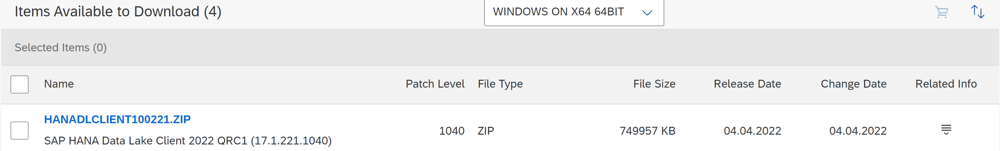
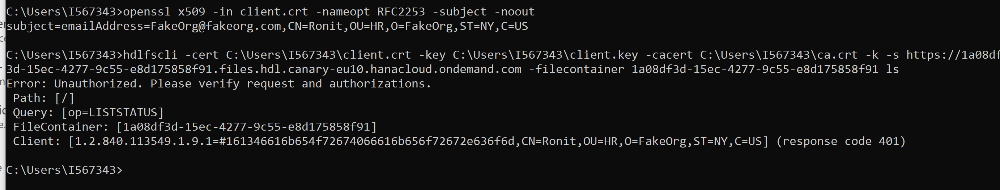

# Getting Started with Data Lake Files HDLFSCLI
<!-- description --> Learn how to setup the SAP HANA Data Lake file container command line interface and use the it to manage your data files.

## Prerequisites
 - A licensed SAP HANA Data Lake instance (non-trial / non-free tier)
 - Access to SAP Software Center
 - Basic understanding of the public key infrastructure (PKI)
 - [Download the sample TPCH Data](https://help.sap.com/viewer/a89a80f984f21015b2b2c84d2498d36d/QRC_4_2021/en-US/6e1dd06335704f4c96d48279ca1ed555.html)

## You will learn
  - How to install and use the SAP HANA Data Lake file container Command Line Interface (HDLFSCLI)
  - Use the HDLFSCLI to put, manage, and remove files from an [SAP HANA Data Lake File Container](https://help.sap.com/viewer/683a53aec4fc408783bbb2dd8e47afeb/alibabacloud/en-US/f4eae33ffb7a44f7af823ee6b70e3598.html)

---

### Download the SAP HANA Data Lake Client

The HDLFSCLI is included in the HANA Data Lake Client download from the [SAP software center](https://launchpad.support.sap.com/#/softwarecenter/template/products/_APP=00200682500000001943&_EVENT=NEXT&HEADER=Y&FUNCTIONBAR=Y&EVENT=TREE&NE=NAVIGATE&ENR=73555000100800003274&V=MAINT&TA=ACTUAL/HANA%20CLOUD%20CLIENTS). The first step is to download and install the latest version of the HANA Data Lake client.

The latest HANA Data Lake Client package can by identified by the most recent release date.

Once you've identified the correct package for your operating system, download it.

### Install HDLFSCLI

[OPTION BEGIN [Linux]]
Once the package is downloaded, extract the contents of the file using a terminal.

`tar -xvf <file_name>`

Change directories to the extracted files.

`cd <extracted_directory_name>`

Then, run the setup file.

`./setup.bin`

### GUI Installation
If you are using a Linux distribution with a GUI, and installer GUI should appear.

Proceed with the installer to complete the installation. Take note of the installation directory that is chosen during the installation setup. This is where necessary environment setup scripts are placed.

### No GUI Command Line Installation [Optional].
Alternatively, the installation can be completed using the -i console command in the terminal. This will require you to specify all the setup parameters on the command line.

`./setup.bin -i console`

This will guide you through the installation process via the terminal that you are using. Follow the prompts until the installation is completed.

### Source the IQ and SYBASE Scripts.
After completing either of the installation processes outlined above, navigate to the installation directory that was specified in the installation process.

`cd <installation directory>`

In the installation directory there should be two script files: IQ.sh and SYBASE.sh. Source both of these files to start using the HDLFSCLI.

`source IQ.sh`

`source SYBASE.sh`

These commands can also be added to a `.bash_profile` or `.bashrc` file to persist these changes in new terminal sessions. Once theses commands have been run, run the `hdlfscli` command to ensure it is accessible.

`hdlfscli -help`

Some HDLFSCLI help documentation should appear if it is successfully installed and accessible.

[OPTION END]

[OPTION BEGIN [Windows]]

The HDLFSCLI is included in the HANA Data Lake Client download in the [SAP software center](https://launchpad.support.sap.com/#/softwarecenter/template/products/_APP=00200682500000001943&_EVENT=NEXT&HEADER=Y&FUNCTIONBAR=Y&EVENT=TREE&NE=NAVIGATE&ENR=73555000100800003274&V=MAINT&TA=ACTUAL/HANA%20CLOUD%20CLIENTS). The first step is to download and install the latest version of the HANA Data Lake Client. Once the compressed client is downloaded, extract the components, and run the installer with Admin Privileges.

Proceed with the installer to complete the installation. Then open a command window and verify a successful installation with the command below.

`hdlfscli -help`

Some HDLFSCLI help documentation should appear if it is successfully installed and accessible.

[OPTION END]

### Generate Certificates

To connect the HDLFSCLI to a HANA Data Lake file container, a certificate will need to be generated to make a secure connection. Below are the steps required to create a self-signed certificate to get started using the HDLFSCLI. You will require an installation of OpenSSL. Use your preferred Linux package installer to install OpenSSL if it is not already installed. If you're using a Windows machine, then Windows Subsystem Linux will have OpenSSL installed. Alternatively, OpenSSL can be installed for Windows. OpenSSL for Windows can be downloaded from [Here](https://slproweb.com/products/Win32OpenSSL.html).  

Then, follow these steps to creating your self-signed certificate.

Make sure the certificate fields are not all exactly the same between the Certificate Authority (CA) and client certificates, otherwise it is assumed to be a self-signed cert and the cert validation below will fail.

Create a private key for the CA (2048 bits).

`openssl genrsa -out ca.key 2048`

Create the CA's public certificate (valid for 200 days). Provide at least a common name and fill other fields as desired. Fields can be skipped; it is not necessary to fill out every field.

`openssl req -x509 -new -key ca.key -days 200 -out ca.crt`

Create a signing request for the client certificate.

Provide at least a common name and fill other fields as desired. Also, leave the email-Id field blank.

`openssl req -new -nodes -newkey rsa:2048 -out client.csr -keyout client.key`

Create the client certificate (valid for 100 days)

`openssl x509 -days 100 -req -in client.csr -CA ca.crt -CAkey ca.key -CAcreateserial -out client.crt`

Verify the certificate was signed by the CA.

`openssl verify -CAfile ca.crt client.crt`

To obtain the subject string of a certificate in the RFC2253 format used in HDL Files authorizations (omit the "subject="prefix).

**Note:** You will need this later when you configure authentication for HDL Files.

`openssl x509 -in client.crt -nameopt RFC2253 -subject -noout`

### Update the SAP HANA Data Lake Trust Configuration

Navigate to the SAP HANA Cloud Central Cockpit and select "Manage File Container" on the HDL instance.

Select the edit button at the top of the page.

Here is a full view of the screen showing the location of "Trusts" and "Authorizations".
You may need to scroll down to find these.

Click on **"Add"** under Trusts configuration and hit on **"Upload"** file button and browse to the location where your `ca.crt` is located and upload that file and click on apply.

The **alias** can be anything, but the certificate should be exactly what is in the generated `ca.crt`.

Click on **"Add"** under Authorizations and select the roles as **"Admin"** or **"User"** and then click on **"Generate pattern"** from the output of the following command. (exclude the "subject=" prefix):

`openssl x509 -in client.crt -nameopt RFC2253 -subject -noout`

Alternatively, you can use the **"Generate Pattern"** option and similarly upload the `client.crt` file after clicking on the "Upload" file option. It will automatically generate a pattern like above.

Now click save at the bottom of the page.

### Check that a Connection can be Established from the HDLFSCLI

Next, we will verify that the configuration we did in Steps 5 & 6 work.

The `<REST API Endpoint>` and `<Instance ID>` can be found in the SAP HANA Cloud Central Cockpit. `<PATH>` is the path to the corresponding certificate.
The following command wont return anything in the output.

`hdlfscli -cert <PATH>\client.crt -key <PATH>\client.key -cacert <PATH>\ca.crt -k -s https://<REST API Endpoint> -filecontainer <Instance ID> ls`

**[Optional]:** Configure a configuration file to make using the CLI simpler.

**Note:** The configuration will be placed in the **user's root directory**. It is saved as a JSON file that can be modified in any text editor.

`hdlfscli -cert <PATH>\client.crt -key <PATH>\client.key -k -s <REST API Endpoint> -config myconfig -dump-config ls`

Test the configuration that was just created.

`hdlfscli -config myconfig ls`

Upload a file to the SAP HANA Data Lake file container. Ensure you know the path to the TPCH data files that were downloaded in the prerequisites.

`hdlfscli -config myconfig upload <Your Local Path>\TPCH <Target File Path>\TPCH`

Verify that the files has been uploaded.

`hdlfscli -config myconfig lsr`

Now that the TPCH data files are in the Data Lake file container we can use SQL on Files to query the data. Learn how to do this in the tutorial "Use SQL on Files to Query Structured Data Files".

**[Troubleshoot]:** If anyone receives the following error while verifying the configuration, please do the needful as mentioned.

Copy the content of the **Client** field which is mentioned inside [ ] brackets and then go to your Data Lake Instance, click on edit configuration and scroll down to Authorizations and first **delete** the entire value from the "Pattern" field and now paste the Client field value here.

Now, re-verify the configuration. It should work.

---
