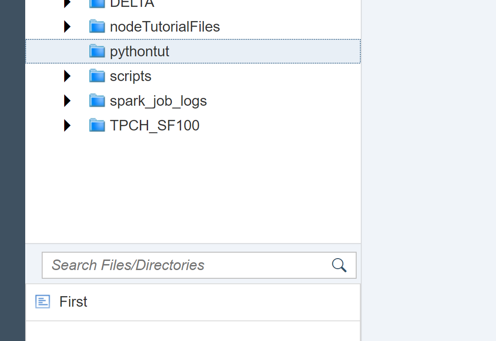
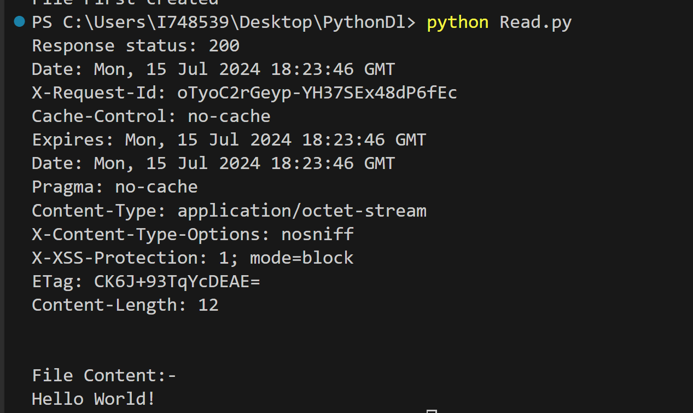
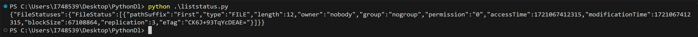
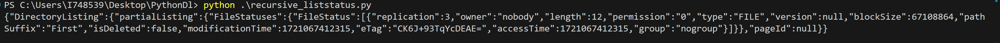
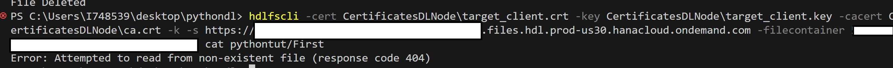
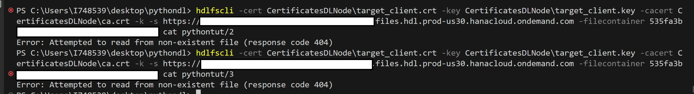

# Using the SAP HANA data lake File Store REST API
<!-- description --> Learn how to use the SAP HANA data lake REST API to manage, upload, read,delete, and list your files.

## Prerequisites
 - Access to a non-trial SAP HANA data lake instance.
 - Python and/or some other REST API request tool.
 - [Download the sample TPCH Data](https://help.sap.com/docs/hana-cloud-data-lake/quick-start-tutorial-for-standalone-data-lake/download-sample-tpch-data).

## You will learn
  - How to use the SAP HANA data lake File Store REST API.
  - Users without access to the HDLFSCLI can use the REST API to perform File Store operations.

## Intro
SAP HANA data lake file containers are accessible via a REST API. The official REST API reference can be found [here](https://help.sap.com/doc/9d084a41830f46d6904fd4c23cd4bbfa/latest/en-US/html/index.html). However, below are some python demonstrations using some of the common endpoints. Although this tutorial doesn't cover other endpoint testing tools, these endpoints and the contents of the request body can be used in any other http interface such as PostMan or CURL.

---

### Set Up a Python Script


First, in the top of a python script append the following and fill in the variables with the appropriate data for your SAP HANA data lake file container. This will load the appropriate Python library for making HTTP requests and will set some commonly re-used variables for the API calls.

```python
import http.client
import ssl

FILES_REST_API='<File Container REST API>'
CONTAINER = '<File Container ID>'
CRT_PATH = '<Path to Client Certificate>'
KEY_PATH= '<Path to Client Key>'

context = ssl.SSLContext(ssl.PROTOCOL_TLS_CLIENT)
context.check_hostname = False
context.verify_mode = ssl.CERT_NONE
context.load_cert_chain(certfile=CRT_PATH, keyfile=KEY_PATH)
```


### Use the CREATE Endpoint

Fill in the code below with your information. The following code sets up the API call to the CREATE endpoint and will upload a file to the folder specified in your SAP HANA data lake File Store.

```python
file_path = '/pythontut/'  #Define the path where the new file will be created within the data lake.
file_name = 'First' #Specify the name for the new file you want to create.NOTE:-an existing file with the given name will be overriden.
file_content = 'Hello World!'  # Set the content that will be written to the new file.

request_url = '/webhdfs/v1/' + file_path + file_name + '?op=CREATE&data=true'
request_headers = {
    'x-sap-filecontainer': CONTAINER,
    'Content-Type': 'application/octet-stream'
}
connection = http.client.HTTPSConnection(FILES_REST_API, port=443, context=context)
connection.request(method="PUT", url=request_url, body=file_content, headers=request_headers)
response = connection.getresponse()

print('Response status:', response.status)
print(response.headers)
print("File "+file_name+" created")
response.close()

```

We can verify the file and its contents using the HDLFSCLI.

`hdlfscli -cert <PATH>\client.crt -key <PATH>\client.key -cacert <PATH>\ca.crt -k -s https://<REST API Endpoint> -filecontainer <Instance ID> cat <file_path>/<file_name>`


Or Using DBX:-




### Use the OPEN Endpoint


Fill in the code below with your information. Ensure that you have a file in your SAP HANA data lake File Store that you want to read. The following code sets up the API call to the OPEN endpoint and will print your file contents.

```python
file_path = '/pythontut/First' #Contains the entire path of the file to be read (including the file name)


request_url=f'/webhdfs/v1/'+file_path+'?op=OPEN'
request_headers = {
    'x-sap-filecontainer': CONTAINER,
    'Content-Type': 'application/json'
}
connection = http.client.HTTPSConnection(FILES_REST_API, port=443, context=context)
connection.request(method="GET", url=request_url, body=None, headers=request_headers)
response = connection.getresponse()
print('Response status:', response.status)
print(response.headers)
print("File Content:-")
print(response.read().decode())
response.close()
```

Run the code.

Example Output:-




### Use the LISTSTATUS Endpoint

Fill in the code below with your information. Ensure that you have a files in your SAP HANA data lake File Store that you can list. The following code sets up the API call to the LISTSTATUS endpoint and will print the list of files in your SAP data lake File Store.

```python
file_path = '/pythontut' #Path to the directory containing the files to be listed


request_url=f'/webhdfs/v1/{file_path}?op=LISTSTATUS'
request_headers = {
    'x-sap-filecontainer': CONTAINER,
    'Content-Type': 'application/json'
}
connection = http.client.HTTPSConnection(FILES_REST_API, port=443, context=context)
connection.request(method="GET", url=request_url, body=None, headers=request_headers)
response = connection.getresponse()

print(response.read().decode())
response.close()

```
Run the code.

Example Output:-




### Use the LISTSTATUS_RECURSIVE Endpoint

Fill in the code below with your information. Ensure that you have a files in your SAP data lake File Store that you can list recursively (i.e. some folder hierarchy exists). The following code sets up the API call to the `LISTSTATUS_RECURSIVE` endpoint and will print the list of files and their hierarchy in your SAP data lake File Store.

```python
file_path = '/pythontut' #Path to the directory containing the files to be listed recursively.

request_url=f'/webhdfs/v1/{file_path}?op=LISTSTATUS'
request_headers = {
    'x-sap-filecontainer': CONTAINER,
    'Content-Type': 'application/json'
}
connection = http.client.HTTPSConnection(FILES_REST_API, port=443, context=context)
connection.request(method="GET", url=request_url, body=None, headers=request_headers)
response = connection.getresponse()

print(response.read().decode())
response.close()
```
Run the code.

Example Output:-




### Use the DELETE Endpoint

The DELETE Endpoint is used to delete a file.

Fill in the code below with your information.The following code sets up the API call to the `DELETE` endpoint and will delete the given file in your SAP data lake File Store.

```python
file_path = '/pythontut/' # Define the path where the file to be deleted is located within the data lake.
file_name = 'First' #//name of the file that needs to be deleted.


if file_name:
    request_url = '/webhdfs/v1/' + file_path + file_name + '?op=DELETE'
    request_headers = {
        'x-sap-filecontainer': CONTAINER,
        'Content-Type': 'application/json'
    }
    connection = http.client.HTTPSConnection(FILES_REST_API, port=443, context=context)
    connection.request(method="DELETE", url=request_url, headers=request_headers)
    response = connection.getresponse()
    obj = response.read().decode()
    jsonobj=json.loads(obj)
    if jsonobj['boolean']==False:
        print("Status:",response.status)
        print("File or directory does not exist, make sure the file/directory exists and try again!")
    else:
        print("Status:",response.status)
        print("File Deleted")

    response.close()
else:
    print("enter valid file name")
```
Run the code.

Example Output:-

The file deleted no longer exists in DBX.

Or 

Upon attempting to access the file via the command line, an error message indicates that the file no longer exists, confirming its deletion.


`hdlfscli -cert <PATH>\client.crt -key <PATH>\client.key -cacert <PATH>\ca.crt -k -s https://<REST API Endpoint> -filecontainer <Instance ID> cat <file_path>/<file_name>`




### Use the DELETE_BATCH Endpoint

The DELETE_BATCH Endpoint is used to delete multiple files in a single go.

Fill in the code below with your information.The following code sets up the API call to the `DELETE_BATCH` endpoint and will delete the given files in your SAP data lake File Store.


```python
file_paths = ["/pythontut/2", "/pythontut/3"] #this variable contains a list of all the file paths of the files that need to be deleted.

files_json = json.dumps({"files":[{ "path": path } for path in file_paths]})

request_url = '/webhdfs/v1/?op=DELETE_BATCH'

request_headers = {
    'x-sap-filecontainer': CONTAINER,
    'Content-Type': 'application/json'
}
connection = http.client.HTTPSConnection(FILES_REST_API, port=443, context=context)
connection.request(method="POST", url=request_url,body=files_json, headers=request_headers)

response = connection.getresponse()
print("Status:",response.status)
print(response.read().decode())
print("Files Deleted")
response.close()

```

Run the code.

Example Output:-

The files that were to be deleted no longer exists in DBX.


Or 

Upon attempting to access the files via the command line, an error message indicates that the files no longer exists, confirming thier deletion.

`hdlfscli -cert <PATH>\client.crt -key <PATH>\client.key -cacert <PATH>\ca.crt -k -s https://<REST API Endpoint> -filecontainer <Instance ID> cat <file_path>/<file_name>`




### Explore and Experiment!

These endpoints along with the others documented in the [REST API reference](https://help.sap.com/doc/9d084a41830f46d6904fd4c23cd4bbfa/latest/en-US/html/index.html) can be used by any application to manipulate or manage the files in the HANA Data Lake File Container. Other endpoints not demonstrated here include DELETE, APPEND, GETRESTORSNAPSHOT, WHOAMI, RENAME, and RESTORESNAPSHOT.

To replicate these requests in other languages or HTTP tools, copy the request headers, FILES REST API + request URL, and body contents.


---
