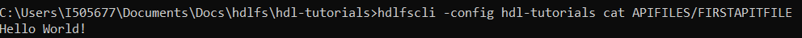

# Using the SAP HANA data lake File Store REST API
<!-- description --> Learn how to use the SAP HANA data lake REST API to manage, upload, download, and list your files.

## Prerequisites
 - Access to a non-trial SAP HANA data lake instance.
 - Python and/or some other REST API request tool.
 - [Download the sample TPCH Data](https://help.sap.com/viewer/a89a80f984f21015b2b2c84d2498d36d/QRC_4_2021/en-US/6e1dd06335704f4c96d48279ca1ed555.html).

## You will learn
  - How to use the SAP HANA data lake File Store REST API.
  - Users without access to the HDLFSCLI can use the REST API to perform File Store operations.

## Intro
SAP HANA data lake file containers are accessible via a REST API. The official REST API reference can be found [here](https://help.sap.com/doc/9d084a41830f46d6904fd4c23cd4bbfa/latest/en-US/html/index.html). However, below are some python demonstrations using some of the common endpoints. Although this tutorial doesn't cover other endpoint testing tools, these endpoints and the contents of the request body can be used in any other http interface such as PostMan or CURL.

---

### Set Up a Python Script


First, in the top of a python script append the following and fill in the variables with the appropriate data for your SAP HANA data lake file container. This will load the appropriate Python library for making HTTP requests and will set some commonly re-used variables for the API calls.

```python
import http.client

FILES_REST_API='<File Container REST API>'
CONTAINER = '<File Container ID>'
CRT_PATH = '<Path to Client Certificate>'
KEY_PATH= '<Path to Client Key>'
```


### Use the CREATE Endpoint

Fill in the code below with your information. The following code sets up the API call to the CREATE endpoint and will upload a file to the folder specified in your SAP HANA data lake File Store.

```python
place = '/APIFILES/'
file_name = 'FIRSTAPIFILE'
file = 'Hello World!'
request_url = '/webhdfs/v1/' + place + file_name + '?op=CREATE&data=true'
request_headers = {
    'x-sap-filecontainer': CONTAINER,
    'Content-Type': 'application/octet-stream'
}
connection = http.client.HTTPSConnection(
    FILES_REST_API, port=443, key_file=KEY_PATH, cert_file=CRT_PATH)
connection.request(
    method="PUT", url=request_url, body=file, headers=request_headers)
response = connection.getresponse()
response.close()
```

We can verify the file and its contents using the HDLFSCLI.

`hdlfscli -config hdl-tutorials cat APIFILES/FIRSTAPIFILE`




### Use the OPEN Endpoint


Fill in the code below with your information. Ensure that you have a file in your SAP HANA data lake File Store that you want to read. The following code sets up the API call to the OPEN endpoint and will print your file contents.

```Python
f_path = '/APIFILES/FIRSTAPIFILE'
request_url=f'/webhdfs/v1/{f_path}?op=OPEN'
request_headers = {
    'x-sap-filecontainer': CONTAINER,
    'Content-Type': 'application/json'
}
connection = http.client.HTTPSConnection(
    FILES_REST_API, port=443, key_file=KEY_PATH, cert_file=CRT_PATH)
connection.request(
    method="GET", url=request_url, body=None, headers=request_headers)
response = connection.getresponse()

print(response.read())
response.close()
```


### Use the LISTSTATUS Endpoint

Fill in the code below with your information. Ensure that you have a files in your SAP HANA data lake File Store that you can list. The following code sets up the API call to the LISTSTATUS endpoint and will print the list of files in your SAP data lake File Store.

```python
f_path = '/APIFILES'
request_url=f'/webhdfs/v1/{f_path}?op=LISTSTATUS'
request_headers = {
    'x-sap-filecontainer': CONTAINER,
    'Content-Type': 'application/json'
}
connection = http.client.HTTPSConnection(FILES_REST_API, port=443, key_file=KEY_PATH, cert_file=CRT_PATH)
connection.request(method="GET", url=request_url, body=None, headers=request_headers)
response = connection.getresponse()
print(response.read())
response.close()
```


### Use the LISTSTATUS_RECURSIVE Endpoint

Fill in the code below with your information. Ensure that you have a files in your SAP data lake File Store that you can list recursively (i.e. some folder hierarchy exists). The following code sets up the API call to the `LISTSTATUS_RECURSIVE` endpoint and will print the list of files and their hierarchy in your SAP data lake File Store.

```python
f_path = '/'
request_url=f'/webhdfs/v1/{f_path}?op=LISTSTATUS_RECURSIVE'
request_headers = {
    'x-sap-filecontainer': CONTAINER,
    'Content-Type': 'application/json'
}

connection = http.client.HTTPSConnection(
  FILES_REST_API, port=443, key_file=KEY_PATH, cert_file=CRT_PATH)

connection.request(
  method="GET", url=request_url, body=None, headers=request_headers)

response = connection.getresponse()

print(response.read())

response.close()
```


### Explore and Experiment!

These endpoints along with the others documented in the [REST API reference](https://help.sap.com/doc/9d084a41830f46d6904fd4c23cd4bbfa/QRC_4_2021/en-US/html/index.html) can be used by any application to manipulate or manage the files in the HANA Data Lake File Container. Other endpoints not demonstrated here include DELETE, APPEND, GETRESTORSNAPSHOT, WHOAMI, RENAME, and RESTORESNAPSHOT.

To replicate these requests in other languages or HTTP tools, copy the request headers, FILES REST API + request URL, and body contents.


---
