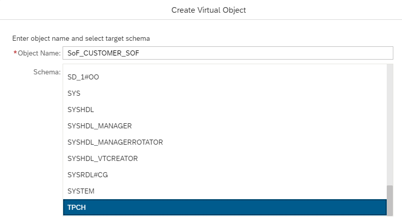

# Use SQL on Files to Query Structured Data Files
<!-- description --> You will learn how to setup SQL on Files, optimize SQL on Files performance using folder hierarchies, and how to use SQL on Files from an SAP HANA database for both managed and standalone data lakes.

## Prerequisites
 - Have access to a licensed managed or standalone SAP HANA data lake.
 - Installation of the HDLFSCLI.
 - Have some structured data files inside of a [SAP HANA data lake File Container](https://help.sap.com/viewer/683a53aec4fc408783bbb2dd8e47afeb/alibabacloud/en-US/f4eae33ffb7a44f7af823ee6b70e3598.html).
 - [Download the sample TPCH Data](https://help.sap.com/viewer/a89a80f984f21015b2b2c84d2498d36d/QRC_4_2021/en-US/6e1dd06335704f4c96d48279ca1ed555.html).
 - The sample TPCH Data has been uploaded to your SAP HANA data lake file container.

## You will learn
  - How to define the database objects required to query structured data files.
  - This technology will allow you to explore your data at a low cost before moving the refined data up the [data pyramid](https://blogs.sap.com/2021/12/06/data-management-concepts-and-techniques-in-sap-hana-cloud/).

## Intro
Querying structured data files (CSV, ORC, Parquet) in a HANA Data Lake file container can be done using SQL on Files. Below you will find all of the steps required to start using SQL on Files.

If you've not yet provisioned an SAP HANA data lake, [here](hana-cloud-hdl-getting-started-1) is a great tutorial on how to do so!

Also, the data files used in this tutorial can be found [here](https://github.com/SAP-samples/hana-cloud-relational-data-lake-onboarding/tree/main/TPCH).

---

### Establish the SQL on Files Basics


For this tutorial all steps are completed through a SQL console connected directly to an SAP HANA Data Lake. The easiest way to find a SQL console is through the SAP Database Explorer. Step 4 of the [SAP HANA Cloud, Data Lake IQ Client Interfaces Overview](https://developers.sap.com/tutorials/hana-cloud-dl-clients-overview.html#3e78548b-cbf9-4481-acce-b67946684bea) tutorial demonstrates where to find the SAP Database Explorer. This list of sections creates the foundation for querying structured files.

Start by using the `HDL_ADMIN` user and grant a database user the `HDL_FILES_SERVICE_ADMIN` role.

```SQL
CREATE USER SOF_TUTORIAL_USER IDENTIFIED BY MyPassword123;

GRANT ROLE HDL_FILES_SERVICE_ADMIN TO SOF_TUTORIAL_USER;

GRANT ALTER ANY TABLE,
CREATE ANY TABLE,
DROP ANY TABLE,
DELETE ANY TABLE,
INSERT ANY TABLE,
LOAD ANY TABLE TO SOF_TUTORIAL_USER WITH NO ADMIN OPTION;

GRANT MANAGE ANY REMOTE SERVER TO SOF_TUTORIAL_USER WITH NO ADMIN OPTION;
```

Log into another SQL Console as the user from above. Now, create a SQL on Files Remote Server.

```SQL
CREATE REMOTE SERVER MY_REMOTE_SERVER CLASS 'FILES_SERVICE' READ ONLY VALUE 'ON';
```

Create a schema in the Files Service.

```SQL
CREATE SCHEMA TPCH IN FILES_SERVICE;
```

Create a SQL on Files remote table in the Files Service.

**Note:** the table definition will need to match the expected schema/data types of the columns in the structured file you are trying to query.

```SQL
CREATE TABLE TPCH.CUSTOMER_SOF (
   C_CUSTKEY            integer                        ,
   C_NAME               varchar(300)                    ,
   C_ADDRESS            varchar(600)                    ,
   C_NATIONKEY          integer                        ,
   C_PHONE              varchar(150)                    ,
   C_ACCTBAL            decimal(15,3)                  ,
   C_MKTSEGMENT         varchar(100)                    ,
   C_COMMENT            varchar(5000)                   
) IN FILES_SERVICE;
```

Create a virtual table. Notice in the SQL below where the remote server name goes and where the reference to the table in the Files Service goes.

**Note:** the table definition will need to match the expected schema/data types of the columns in the structured file.

```SQL
CREATE EXISTING TABLE CUSTOMER_SOF (
   C_CUSTKEY            integer                        ,
   C_NAME               varchar(300)                    ,
   C_ADDRESS            varchar(600)                    ,
   C_NATIONKEY          integer                        ,
   C_PHONE              varchar(150)                    ,
   C_ACCTBAL            decimal(15,3)                  ,
   C_MKTSEGMENT         varchar(100)                    ,
   C_COMMENT            varchar(5000)                   
) AT 'MY_REMOTE_SERVER..TPCH.CUSTOMER_SOF';
```

Add a data source, this can be done multiple times with multiple files.

**Note:** In this step the file path can lead to an exact file or it can lead to a directory. If it leads to a directory, SQL on Files will try to parse all the data files in that directory. To ensure that there are no parse errors, make sure that all the files in the directory match the schema of the table the data source it is being added to.

```SQL
ALTER TABLE TPCH.CUSTOMER_SOF IN FILES_SERVICE ADD DATASOURCE
AS CUSTOMER_DATASOURCE CSV(webhdfs('hdlfs:///TPCH/customer.tbl')) ENCODING 'utf-8';
```


### Query the Structured File


Now that you've created all the foundational database objects for querying our file, you can simply query the files as if it were a table.

**Note**: the table name here will be the name of the **EXISTING** table created in the previous step.

```SQL
SELECT * FROM CUSTOMER_SOF;
```


### Drop a Data Source

If you want to drop a data source for a SQL on Files table you can do so as well.

```SQL
ALTER TABLE TPCH.CUSTOMER_SOF IN FILES_SERVICE DROP DATASOURCE CUSTOMER_DATASOURCE;
```


### Clean Up or Remove SQL on Files Table

To clean up the SQL on Files table created in step 1, you drop the existing table, then the files service table, and lastly the files service schema.

```SQL
DROP TABLE CUSTOMER_SOF;
DROP TABLE TPCH.CUSTOMER_SOF IN FILES_SERVICE;
DROP SCHEMA TPCH IN FILES_SERVICE;
```


### Optimize SQL on Files Performance Using Folder Hierarchies

Another way to declare a data source with SQL on Files is using folder hierarchies. Folder hierarchies allow you to skip (or prune) files that do not need to be parsed in a query. Take a look at the following example.


In this hierarchy, you define the `N_REGIONKEY` column with values 0, 1, 2, 3, and 4. In other words, all subdirectories within `N_REGIONKEY=0` have 0 as the region key value. Formatting our files this way allows the query `SELECT * FROM <TABLE_NAME> WHERE N_REGIONKEY=0` to skip parsing any data files under all the other directories for better performance.

Let's create the simple folder hierarchy seen in the above image and create some data files. Create a root folder named "Nation", 5 subdirectories within the "Nation" folder, and create some data files.

In subdirectory 1, `N_REGIONKEY=0` create a text file `nation.tbl` and paste the following contents.

```
0|ALGERIA|0|final accounts wake quickly. special reques|
5|ETHIOPIA|0|fluffily ruthless requests integrate fluffily. pending ideas wake blithely acco|
14|KENYA|0|ironic requests boost. quickly pending pinto beans cajole slyly slyly even deposits. ironic packages |
15|MOROCCO|0|ideas according to the fluffily final pinto beans sleep furiously|
16|MOZAMBIQUE|0|ironic courts wake fluffily even, bold deposi|
```

In subdirectory 2, `N_REGIONKEY=1` create a text file `nation.tbl` and paste the following contents.

```
1|ARGENTINA|1|idly final instructions cajole stealthily. regular instructions wake carefully blithely express accounts. fluffi|
2|BRAZIL|1|always pending pinto beans sleep sil|
3|CANADA|1|foxes among the bold requests|
17|PERU|1|final, final accounts sleep slyly across the requests. |
24|UNITED STATES|1|blithely regular deposits serve furiously blithely regular warthogs! slyly fi|
```

Repeat the creation of subdirectories for each of `N_REGIONKEY=2`, `N_REGIONKEY=3`, `N_REGIONKEY=4` and paste the data in each file respectively.

`N_REGIONKEY=2`

```
8|INDIA|2|ironic packages should have to are slyly around the special, ironic accounts. iron|
9|INDONESIA|2|unusual excuses are quickly requests. slyly ironic accounts haggle carefully above the pendin|
12|JAPAN|2|blithely final packages cajole quickly even dependencies? blithely regular deposits haggle express, ironic re|
18|CHINA|2|bold accounts are. slyly ironic escapades haggle acc|
21|VIETNAM|2|doggedly ironic requests haggle furiously ironic, ironic packages. furiously final courts wake fur|
```

`N_REGIONKEY=3`

```
6|FRANCE|3|even requests detect near the pendin|
7|GERMANY|3|blithely ironic foxes grow. quickly pending accounts are b|
19|ROMANIA|3|deposits boost against the brave id|
22|RUSSIA|3|slowly pending patterns x-ray quickly. ironic, even accounts haggle furiously. even, final deposits mold bl|
23|UNITED KINGDOM|3|fluffily regular pinto beans breach according to the ironic dolph|
```

`N_REGIONKEY=4`

```
4|EGYPT|4|pending accounts haggle furiously. furiously bold accounts detect. platelets at the packages haggle caref|
10|IRAN|4|blithely even accounts about the furiously regular foxes nag slyly final accounts. quickly final fo|
11|IRAQ|4|express, pending deposits boost quick|
13|JORDAN|4|blithe, express deposits boost carefully busy accounts. furiously pending depos|
20|SAUDI ARABIA|4|fluffily final accounts wake slyly-- fi|
```

Once all the files are in place, then upload them to a SAP HANA data lake file container using the HDLFSCLI.

`hdlfscli -config <Your Config Name> upload <Path>/Nation Nation`

You can verify that the upload was successful with the command `hdlfscli -config <Your Config Name> lsr` and expecting the output be as below.


Below you can see how this data source can be defined in SQL.

```SQL
ALTER TABLE TPCH.NATION IN FILES_SERVICE ADD DATASOURCE AS NATION_DATASOURCE
(
  N_NATIONKEY FROM COLUMN $0,
  N_NAME FROM COLUMN $1,
  N_REGIONKEY	FROM DIRECTORY $0,
  N_COMMENT FROM COLUMN $3
) CSV ('hdlfs:///Nation/') ENCODING 'UTF_8' DELIMITED BY '|';
```

Notice that directories are located using a 0-index. The `N_REGIONKEY` column is directory `$0` and subsequent directories would be `$1, $2, ... $n`. This tells the parser to look at these directory levels to find the value for the corresponding column name. The value is parsed from what is placed after the "=" in the directory name.

Let's query our files.

```SQL
SELECT * FROM NATION WHERE N_REGIONKEY=0;
```

Similarly, columns can be specified by either their name in the file or by a 0-index. **Note**: our data files are not set up for using column names, however if the header was present in the data files the data source might look like this:

```SQL
ALTER TABLE TPCH.NATION IN FILES_SERVICE ADD DATASOURCE AS NATION_DATASOURCE
(
  N_NATIONKEY FROM COLUMN "NATIONKEY",
  N_NAME FROM COLUMN "NAME",
  N_REGIONKEY	FROM DIRECTORY $0,
  N_COMMENT FROM COLUMN "COMMENT"
) CSV ('hdlfs:///Nation/') ENCODING 'UTF_8' DELIMITED BY '|';
```

Another example can be found in the SAP Help documentation [here](https://help.sap.com/viewer/3ef213750ce94aac885ac4fc54ea212f/QRC_3_2021/en-US/c712a4dff1ad429cad9a2a3e42336e42.html).


### Using SQL on Files from a HANA Cloud database (Standalone SAP HANA data lake)


Structured data files that have been setup to be queried with SQL on Files can also be queried from an SAP HANA Cloud, HANA database (HDB) through virtual tables. The first step in querying structured data files from HDB is creating a remote connection to the corresponding SAP HANA data lake. First, log into a HANA database as a user that has the CREATE REMOTE SOURCE privilege. From the database explorer, add a remote source by finding the 'Remote Sources' entity in the catalog.


Select 'Add Remote Source' and fill in the appropriate connection details. Step 2 of the following [tutorial](https://developers.sap.com/tutorials/hana-dbx-remote-sources.html#baf1d51c-e039-4fab-8245-b4017787f29f) demonstrates how to do this via SQL with the appropriate connection details.

For the UI method, right click the Remote Sources item from the catalog list and use the "IQ (ODBC)" adapter. Then in "Extra Adapter Properties" paste the following with your SAP HANA data lake's host name.

`host=<SQL_ENDPOINT>:443;ENC=TLS(trusted_certificates=*;direct=yes;certificate_name=hanacloud.ondemand.com)`

Use the `SOF_TUTORIAL_USER` as the user credentials.

Once the remote connection has been established, you will use the `SOF_CUSTOMER` table that was created earlier. This table can be found as a Remote Source and added as a virtual table.


In the remote sources screen, identify the SQL on Files table that you created and select "Create Virtual Object(s)".

In the pop-up modal, select the schema and name that you would like to reference the virtual table by. The virtual table name does not have to match the SAP HANA data lake table name. For example, I like to prefix my tables with `SoF_` to identify them as SQL on Files. Also, select the schema that the virtual table should exist under. You may want to create a Schema in the HANA database.

```SQL
CREATE SCHEMA TPCH;
```



Now, open a SQL console as the HANA database user that created the virtual table. Then, query the virtual table as if it were any other HANA database table.


Now, your structured data file can be queried from an SAP HANA SQL console.

**Note:** Although the data files can be queried from the HANA console, they will still need to be managed from a Data Lake console. Adding data sources, altering the table schema, and other DDL will need to be performed from an SAP HANA data lake console.


### Using SQL on Files from a HANA Cloud database (Managed SAP HANA data lake)


When provisioning an SAP HANA Cloud Instance an SAP HANA database can be created along with a managed SAP HANA data lake (HDL). This generates an HDL container and remote connection to the data lake from the HANA database. The interaction between a managed data lake and a standalone data lake from HANA differs only slightly.

When a managed Data Lake is provisioned you will notice two remote sources `SYSHDL_SOURCE` and `SYSRDL#CG_SOURCE`. `SYSHDL_SOURCE` is a connection directly to the HDL instance and `SYSRDL#CG_SOURCE` is a connection to a container within the data lake.


First, make sure that your data file is already loaded into your data lake's file container. For this example, I will use the TPCH customer file for my SQL on Files query. Feel free to use any data/table you have on hand.

For a managed SAP HANA data lake, you open an SQL console connected to your SAP HANA database and use the `REMOTE_EXECUTE` procedure for running DDL on our data lake. Remember, this SQL is for the TPCH Customers table, adjust the table schema definition to match your scenario.

```SQL
CALL SYSRDL#CG.REMOTE_EXECUTE('
	-- Step 1, Create a Schema in the Files Service.
	CREATE SCHEMA TPCH IN FILES_SERVICE;

	-- Step 2, Create a Table Under the Schema in the Files Service
	CREATE TABLE TPCH.CUSTOMER_SOF (
	   C_CUSTKEY            integer                        ,
	   C_NAME               varchar(300)                    ,
	   C_ADDRESS            varchar(600)                    ,
	   C_NATIONKEY          integer                        ,
	   C_PHONE              varchar(150)                    ,
	   C_ACCTBAL            decimal(15,3)                  ,
	   C_MKTSEGMENT         varchar(100)                    ,
	   C_COMMENT            varchar(5000)                   
	) IN FILES_SERVICE;

	-- Step 3, Create a Virtual Table in IQ that points to the Table in the
-- Files Service
	CREATE EXISTING TABLE CUSTOMER_SOF (
	   C_CUSTKEY            integer                        ,
	   C_NAME               varchar(300)                    ,
	   C_ADDRESS            varchar(600)                    ,
	   C_NATIONKEY          integer                        ,
	   C_PHONE              varchar(150)                    ,
	   C_ACCTBAL            decimal(15,3)                  ,
	   C_MKTSEGMENT         varchar(100)                    ,
	   C_COMMENT            varchar(5000)                   
	) AT ''sof..TPCH.CUSTOMER_SOF'';

	-- Step 4, declare the data source for the Table in the Files Service
	ALTER TABLE TPCH.CUSTOMER_SOF IN FILES_SERVICE ADD DATASOURCE AS CUSTOMERDATA csv(''hdlfs:///TPCH/customer.tbl'') ENCODING ''utf_8'' DELIMITED BY ''|'' SKIP 1;
');
```

**Note**: In step 3 of the code above you notice a `sof…` in the EXISTING TABLE command. This `sof…` is the files service that the table will use. This files service is meant for the managed data lake and is used by the HANA user. For a data lake user, or in a standalone data lake, you can create our own files service. See the SAP Help note [here](https://help.sap.com/viewer/3ef213750ce94aac885ac4fc54ea212f/QRC_3_2021/en-US/5489722c6d8b411abd801b88e4d066e7.html).

Now, you have created the SQL on Files table and need to find the remote source table in our SAP HANA database.


Click the check box for the SQL on Files Table and then select "Create Virtual Object". Choose an object name and the schema that you want the remote virtual table to exist under. Then, locate the table in the "Tables" section of the catalog.


And now, you have access to our file's data from an SAP HANA Database. Query and use this table as if it were any other HANA table.


---
