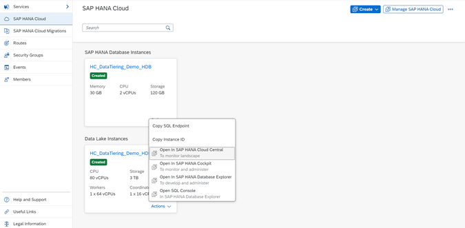
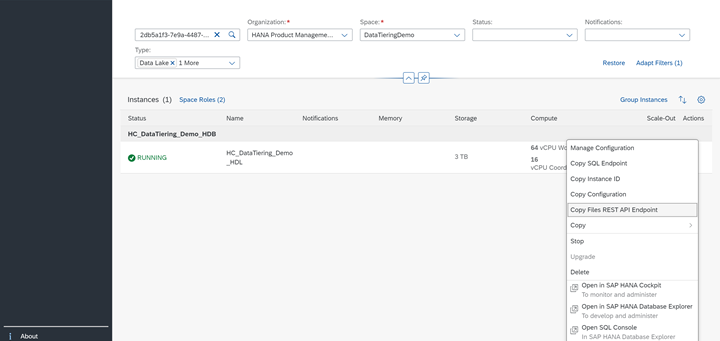
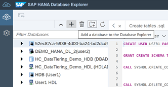
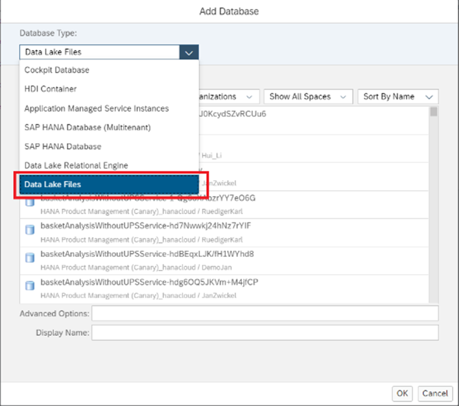
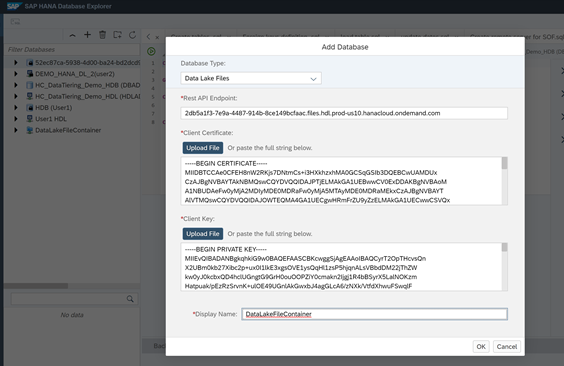
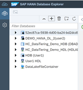
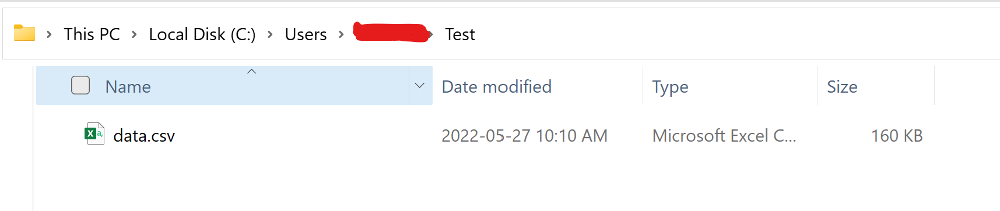
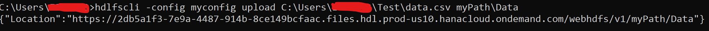
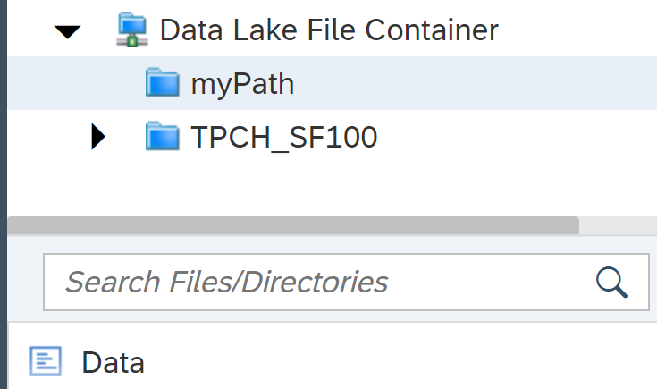

# Setting Up HDLFS Connection In Database Explorer
<!-- description --> Learn how to setup the SAP HANA Data Lake file store/container connection in the database explorer.

## Prerequisites
 - A licensed SAP HANA data Lake instance (non-trial / non-free tier).
 - Access to SAP Software Center.
 - Basic understanding of the public key infrastructure (PKI).
 - Should have completed the [Getting Started with Data Lake Files HDLFSCLI](data-lake-file-containers-hdlfscli) tutorial.

## You will learn
  - How to setup a HANA Data Lake file container connection in the Database Explorer.
  - Use the HDLFSCLI to add, remove and manage data files into the File Container.

---

### Collect the Required Connection Details

To get the REST API Endpoint, login to the BTP Cockpit, click on the **Actions** tab of your Data Lake instance and then select **Open in SAP HANA Cloud Central**

Once you are in the Cloud Central, In the **Actions** of your Data Lake Instance menu select the **Copy Files REST API Endpoint** option.

The REST API Endpoint will be copied to the clipboard. It has a format like this:  

`2db5a1f3-7e9a-4487-914b-8ce149bcfaac.files.hdl.prod-us10.hanacloud.ondemand.com`

Make sure that your REST API endpoint has **files** keyword in it.

### Generating Client Certificate & Client Key

You may already have these files available from configuring the Trust and Authorization in your HDLFS instance. If not, then you can regenerate them from the `ca.crt` that is configured in your HDLFS instance.  

Follow the Step 3 and Step 4 from [Getting Started with Data Lake Files HDLFSCLI | Tutorials](data-lake-file-containers-hdlfscli) for SAP Developers exactly as it is.

### Adding the connection in Database Explorer

Go to the Database explorer from BTP Cockpit or Cloud Central by clicking on the **Actions** menu of your Data Lake instance.

Once you are in the Database explorer, click on the **+** symbol on top left panel. See Below.

A new window will pop up once. In the **Database Type** drop down, select type **Data Lake Files**. See Below.

In the next window, you will need to paste the **REST API Endpoint** that you copied earlier from the Cloud Central.

Next is to upload the Client Certificate and Client Key (which will be created after completing the Getting Started with Data Lake Files HDLFSCLI | Tutorials for SAP Developers tutorial)

Click on the **Upload file** button and browse to the location where you have saved the **client.crt** and **client.key** and upload them. You can give any name under **Display Name**

Once you click on OK. A **Data Lake File Store/Container** connection would be visible in the Databases section on the left in the Database Explorer. See Below.

### Verify the File container connection

You need to verify whether you have added the right connection of File Container in DBX. You can do that by adding/uploading a file to the File container and checking it in the DBX.

Upload a file using the following command in Windows OpenSSL.

`hdlfscli -config <Your Config name> upload <Your Local Path>/TPCH <Target File Path>/TPCH`

Upload a Data File into the File Container to demonstrate that you have verified the connection setup to be successful.

Let us try uploading the following **data.csv** file onto our Data Lake File Container.

Following command will upload the given CSV file and will also create a Target path(i.e. **`myPath\Data`**) in the File container where the file will be stored.

`hdlfscli -config <your config? upload <Local path of the file> <Target path in the container>`

Example- `hdlfscli -config myconfig upload C:\Users\I567343\Test\data.csv myPath\Data`

Once you run this command in Open SSL, it will look something like below.

After this is done, go back to DBX and hit refresh and then click on your Data Lake File Container dropdown and you should be able to see the file uploaded successfully. See below.

The above screenshot shows that there is a target folder **`myPath`** in the File Container and the **Data** file at the bottom is the CSV file which you uploaded.
Thus, our Data Lake File Container has been successfully configured and verified in DBX.

---
