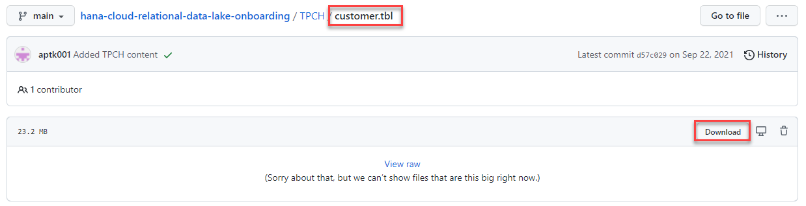
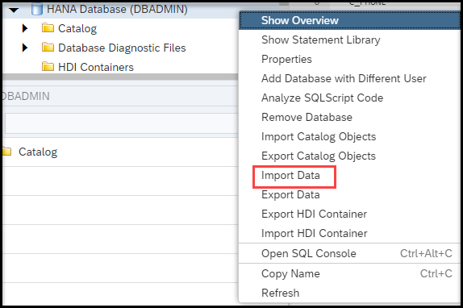
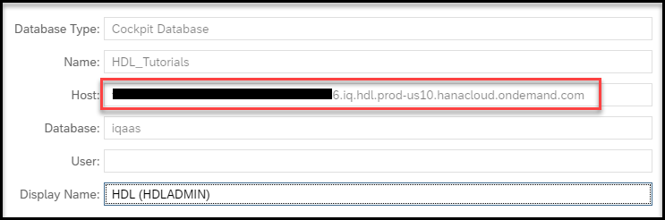
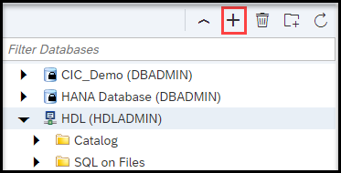
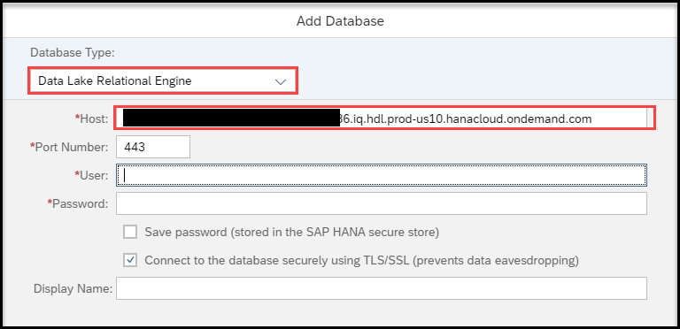
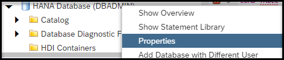
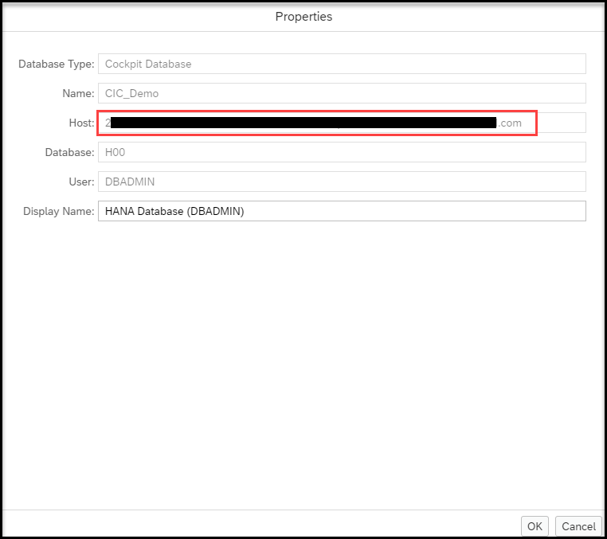
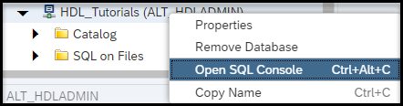

# Use SAP HANA Cloud, data lake Events to Schedule Data Movement
<!-- description --> SAP HANA Cloud, data lake has a built-in event scheduler that can be used to schedule SQL functionality. Learn how to use this event scheduler to schedule data movement from a SAP HANA Cloud, HANA database to a SAP HANA Cloud, data lake.

## Prerequisites
 - A SAP HANA Cloud, HANA database instance
 - A SAP HANA Cloud, data lake instance

## You will learn
  - How to create and schedule events in a SAP HANA Cloud, data lake instance
  - How scheduling data movement from SAP HANA Cloud, HANA database (HDB) to SAP HANA Cloud, data lake (HDLRE) can be achieved through SQL

---

### Import Data Into an SAP HANA Cloud, HANA database


Download and import the `customer.tbl` TPCH data file from [this](https://github.com/SAP-samples/hana-cloud-relational-data-lake-onboarding/blob/main/TPCH/customer.tbl) GitHub repository.



Once the data file is downloaded, create a table to import the data to. Navigate to the SAP HANA Database Explorer from the SAP BTP Cockpit and open a SQL console. Inside the SQL console, create the table using the following SQL. The SQL script creates a new schema called TPCH and then creates a table under that schema called "CUSTOMER".

```SQL
CREATE SCHEMA TPCH;
CREATE TABLE TPCH.CUSTOMER (
   C_CUSTKEY            integer                        not null,
   C_NAME               varchar(25)                    not null,
   C_ADDRESS            varchar(40)                    not null,
   C_NATIONKEY          integer                        not null,
   C_PHONE              varchar(15)                    not null,
   C_ACCTBAL            decimal(15,2)                  not null,
   C_MKTSEGMENT         varchar(10)                    not null,
   C_COMMENT            varchar(117)                   not null,
   primary key (C_CUSTKEY)
);
```

Next, right click the HANA database instance in the left side menu and select "Import Data".



On the "Import Type" page select "Import Data" and proceed to the "Import Source" step. On the "Import Source" step select "Local" and then uncheck the "File has header in first row" box. Then select the `customer.tbl` file that was downloaded earlier. You may need to rename this file to `customer.csv`.


On the "Import Target" step, select "Add to an existing table" and fill in the information for the `TPCH.CUSTOMER` table that was created.


Verify the table mapping and go to step 5 to finish the import.


### Set up a User for Scheduling and Managing Events


Throughout this tutorial you will need a user that has certain permissions. Log into an HDLRE SQL console as HDLADMIN and execute the following SQL to create a user and grant them the permissions needed to complete this tutorial. Comments in the SQL below will explain the permissions being granted.

```SQL
-- First you need a user to give the permissions to
-- Provide a customer USER name in place of <HDL_USER> and password in place of <PASSWORD>
CREATE USER <HDL_USER> IDENTIFIED BY <PASSWORD> FORCE PASSWORD CHANGE OFF;

-- to create a `REMOTE SERVER`, the HDLRE user needs the `MANAGE ANY REMOTE SERVER` privilege.
GRANT MANAGE ANY REMOTE SERVER TO <HDL User>;

-- to create an `EXTERNLOGIN` the HDLRE user needs the `MANAGE ANY USER` privilege.
GRANT MANAGE ANY USER TO <HDL User>;

-- to create an `EVENT` the HDLRE user needs the `MANAGE ANY EVENT` privilege.
GRANT MANAGE ANY EVENT TO <HDL User>;
```

Once the user is created, create a database connection to HDLRE with that user. Right click the HDLRE database in Database Explorer and click properties.


Copy the host value in the properties modal.



Close the modal and click the add connection icon in SAP Database Explorer.



Now, choose Data Lake Relational Engine and fill in the values with the host and user credentials from above.



Click OK and then there should be a new database in the left side menu in the Database Explorer. Right click that instance and open a new SQL console. The rest of the tutorial should be completed from there.


### Set up a Remote Server from SAP HANA Cloud, data lake to SAP HANA Cloud, HANA database


The first task in preparing the HDLRE instance is creating a remote server that connects HDLRE to the HDB instance that contains the data you want to access. First, right click the HANA database in Database Explorer and select properties.



In the properties modal, copy the "Host" value and use it in the below SQL to create a remote server to the HANA database.



Since you've already imported your data into your HANA database, you can proceed to preparing HDLRE for scheduling data movement. Use a SQL console that is connected directly to the HDLRE instance.



Run this SQL against the HDLRE instance using a user with the `MANAGE ANY REMOTE SERVER` privilege to create a remote server. Notice, you are naming the remote server `HDB_SERVER`. Replace the `<HANA Host Name>` with the host copied from the properties modal.

```SQL
CREATE SERVER HDB_SERVER CLASS 'HANAODBC' USING
'Driver=libodbcHDB.so;
ConnectTimeout=0;
CommunicationTimeout=15000000;
RECONNECT=0;
ServerNode=<HANA Host Name>:443;
ENCRYPT=TRUE;
ssltruststore=<HANA Host Name>;
ssltrustcert=Yes;';
```

Now that the remote server is created, you must create the `EXTERNLOGIN` that will map your HDLRE user to the HANA user credentials and allow access to the HANA database. Notice below in the `CREATE EXTERNLOGIN` statement you are granting your HDLRE user permission to use the HANA user for the `HDB_SERVER` that was created above. Ensure that the HANA user used in the SQL below has access to the objects that need to be referenced. It would be a good idea to use the HANA user that was used in Step 1 to create the CUSTOMER table.

Replace `<HDL USER NAME>` with the current HDLRE user that is being used and replace `<HANA USER NAME>` and `<HANA PASSWORD>` with the HANA user credentials.

```SQL
CREATE EXTERNLOGIN <HDL USER NAME> to HDB_SERVER REMOTE LOGIN <HANA USER NAME> IDENTIFIED BY <HANA PASSWORD>;
```

Do a quick test to ensure everything has been set up successfully. You will create a temporary table that points to your customer table in HANA. Then run a select against that table to ensure you are getting data back.

```SQL
CREATE EXISTING LOCAL TEMPORARY TABLE HDLRE_CUSTOMER
(
   C_CUSTKEY            integer                        not null,
   C_NAME               varchar(25)                    not null,
   C_ADDRESS            varchar(40)                    not null,
   C_NATIONKEY          integer                        not null,
   C_PHONE              varchar(15)                    not null,
   C_ACCTBAL            decimal(15,2)                  not null,
   C_MKTSEGMENT         varchar(10)                    not null,
   C_COMMENT            varchar(117)                   not null,
   primary key (C_CUSTKEY)
) AT 'HDB_SERVER..TPCH.CUSTOMER';

SELECT * FROM HDLRE_CUSTOMER;
DROP TABLE HDLRE_CUSTOMER;
```

Run the above SQL and expect a result set to be returned.


### Create and Schedule the Data Movement Event


HDLRE has a built-in event and event scheduler. You can take advantage of the remote service and the event scheduler to copy data from your HANA database to your HDLRE. Start by creating a destination table for your data. In this case this is just a customer table that is inside HDLRE.

```SQL
CREATE TABLE HDLRE_CUSTOMER
(
   C_CUSTKEY            integer                        not null,
   C_NAME               varchar(25)                    not null,
   C_ADDRESS            varchar(40)                    not null,
   C_NATIONKEY          integer                        not null,
   C_PHONE              varchar(15)                    not null,
   C_ACCTBAL            decimal(15,2)                  not null,
   C_MKTSEGMENT         varchar(10)                    not null,
   C_COMMENT            varchar(117)                   not null,
   primary key (C_CUSTKEY)
);
```

Here I will break down [creating an event](https://help.sap.com/viewer/19b3964099384f178ad08f2d348232a9/2021_4_QRC/en-US/a617091784f210158db2e43f0733ae5d.html?q=CREATE%20EVENT) in HDLRE. In the following SQL you create an event called `PullCustomerDataFromHANA`. Immediately after you create a schedule `SchedulePullCustomerDataFromHANA`. The schedule is scheduled to start at 12:00am and repeat the event every Sunday. Below the "HANDLER" you define the SQL script to be executed. The script creates a local temporary table (this table will be lost once the connection is dropped) and then inserts the data from that the temporary table into your `HDLRE_CUSTOMER` table which persists inside of your HDLRE instance. So, every Sunday the event is copying the data from your HANA table to your HDLRE table.

```SQL
CREATE EVENT PullCustomerDataFromHANA
SCHEDULE SchedulePullCustomerDataFromHANA
START TIME '12:00am' ON ('Sun')
HANDLER
BEGIN
	CREATE EXISTING LOCAL TEMPORARY TABLE HDLRE_CUSTOMER_TT
	(
	   C_CUSTKEY            integer                        not null,
	   C_NAME               varchar(25)                    not null,
	   C_ADDRESS            varchar(40)                    not null,
	   C_NATIONKEY          integer                        not null,
	   C_PHONE              varchar(15)                    not null,
	   C_ACCTBAL            decimal(15,2)                  not null,
	   C_MKTSEGMENT         varchar(10)                    not null,
	   C_COMMENT            varchar(117)                   not null,
	   primary key (C_CUSTKEY)
	) AT 'HDB_SERVER..TPCH.CUSTOMER';

	INSERT INTO HDLRE_CUSTOMER SELECT * FROM HDLRE_CUSTOMER_TT;
END;
```

You can trigger the event manually to test if it is working. Trigger the event and then select from the HDLRE table to ensure that the data has been copied.

```SQL
TRIGGER EVENT PullCustomerDataFromHANA;
SELECT * FROM HDLRE_CUSTOMER;
```


Now you have successfully created an event that recurs and moves data from a HANA database to a data lake database. Events can contain any valid SQL operations, so get creative and automate any repetitive SQL workloads with SAP HANA Cloud, data lake events!


---
