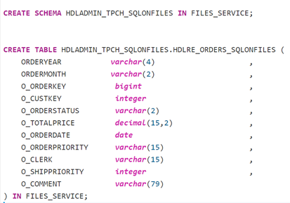
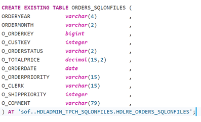
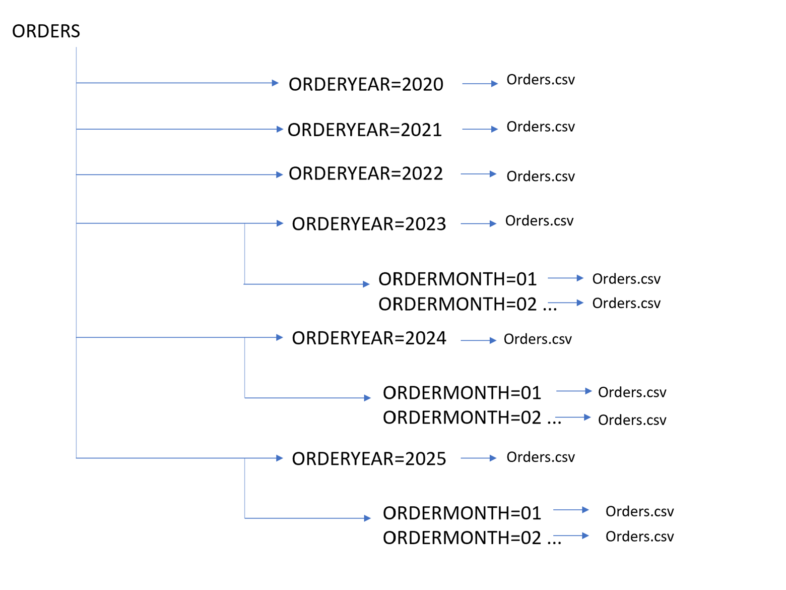
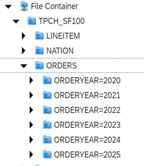
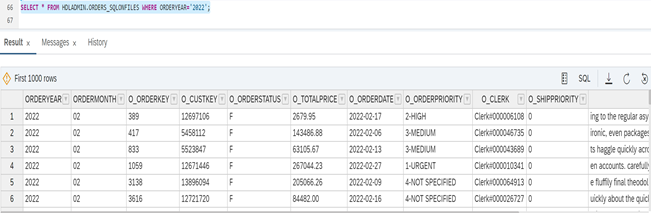
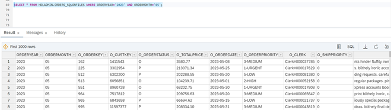
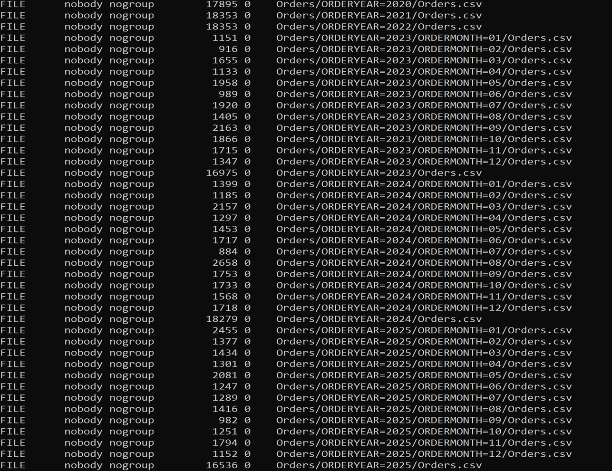

# Use SQL on Files to query data from multiple directory
<!-- description --> It will teach you how to setup SQL on Files, optimize SQL on Files performance using a folder and subfolder directory.


## Prerequisites
-	Have access to a licensed managed or standalone SAP HANA data lake.
-	Installation of the HDLFSCLI. See tutorial [Getting Started with Data Lake Files HDLFSCLI](data-lake-file-containers-hdlfscli)
-	Load some structured data files inside of a SAP HANA data lake File Container.
-	Already set up HDLFS Connection in Database Explorer - Setting Up HDLFS Connection In Database Explorer.


## You will learn
- How to define the database objects required to query structured data files.
- How to add a data source for a folder and subfolder directory and query the output of that file.


## Intro

Querying structured data files (CSV, ORC, Parquet) in a HANA Data Lake file container can be done using SQL on Files. Below you will find all of the steps required to start using SQL on Files.
If you have not yet provisioned an SAP HANA data lake, here is a great tutorial on how to do so!
Please go through the entire tutorial on [Use SOF to Query data from Single Directory](data-lake-sof-single-directory)

You will be using the Orders table as a reference.

---

### Create a SQL on Files remote table in Files service

Note that the table definition will need to match the expected schema/data types of the columns in the structured file you are trying to query. Log in to the SQL console as User1 or HDLADMIN and execute all the queries associated with this tutorial. This tutorial will be demonstrated by executing the queries through HDLADMIN.

Firstly, you create a SCHEMA in files service.

```SQL
CREATE SCHEMA HDLADMIN_TPCH_SQLONFILES IN FILES_SERVICE;
```

Let us CREATE THE TABLE now

```SQL
CREATE TABLE HDLADMIN_TPCH_SQLONFILES.HDLRE_ORDERS_SQLONFILES
(
ORDERYEAR		varchar(4),
ORDERMONTH	varchar(2),
O_ORDERKEY           bigint,
O_CUSTKEY              integer,
O_ORDERSTATUS     varchar(2),
O_TOTALPRICE         decimal(15,2),
O_ORDERDATE          date,
O_ORDERPRIORITY   varchar(15),
O_CLERK                    varchar(15),
O_SHIPPRIORITY       integer,
O_COMMENT             varchar(79)   
) IN FILES_SERVICE;
```
<!-- border --> 

For information about the parameter definitions and supported data types, see  [CREATE (Remote) TABLE Statement for Data Lake Relational Engine (HANA DB-Managed)](https://help.sap.com/docs/SAP_HANA_DATA_LAKE/a898e08b84f21015969fa437e89860c8/24e694b566814ad285cb32fe3e5d3928.html?state=DRAFT&version=2022_1_QRC)


Next, You will create a virtual table. Notice in the SQL below where the remote servers name goes and where the reference to the table in the Files Service goes. Over here, you will be creating an ORDERS VIRTUAL TABLE  in HDLRE that points to the ORDERS table that you just created in SQL On Files service.

The EXISTING keyword is used in conjunction with CREATE TABLE and IN FILES SERVICE to indicate that a table exists remotely in SQL on Files and to import its metadata into the new virtual table. The remote table is now visible to users thanks to this syntax.

`Note that the table definition will need to match the expected schema/data types of the columns in the structured file.`

```SQL
CREATE EXISTING TABLE ORDERS_SQLONFILES
 (
ORDERYEAR			varchar(4) ,
ORDERMONTH		varchar(2),
O_ORDERKEY		bigint ,
O_CUSTKEY			integer ,
O_ORDERSTATUS		varchar(2) ,
O_TOTALPRICE		decimal(15,2) ,
O_ORDERDATE 		date ,
O_ORDERPRIORITY  	varchar(15) ,
O_CLERK 			varchar(15) ,
O_SHIPPRIORITY		integer ,
O_COMMENT			varchar(79) ,
) AT 'sof..HDLADMIN_TPCH_SQLONFILES.HDLRE_ORDERS_SQLONFILES';
```

<!-- border --> 


### Optimize SQL on Files Performance Using Folder Hierarchies

Another way to declare a data source with SQL on Files is using folder hierarchies. Folder hierarchies allow you to skip (or prune) files that do not need to be parsed in a query. Take a look at the following example.

<!-- border --> 


This diagram represents the folder structure hierarchy of the ORDERS table, for years 2020 to 2022 for ORDERS table there will be yearly data and from 2023 onwards to 2025, the table will have monthly data as well.
In this case, you will create the folder structure in such a way that for ORDERYEAR=2020, it will query the data for that particular year i.e. 2020. You can also query the data for a particular month from that year and that is when ORDERMONTH and ORDERYEAR parameters comes into role. `SELECT * FROM ORDERS WHERE ORDERYEAR=2023 AND ORDERMONTH=05;` to skip parsing any data files under all the other directories for better performance.

Make sure to note that data has been already loaded into the File Container. Here, I have used the **LOAD Statement** to load the data from an external entity (Amazon S3 bucket) with Scale factor 100. The scale factor measures the size of the input data. Below is the query to load the data into File container. This data will be loaded into the ORDERS Table which will be created in the HDLRE either by the HDLRE User that you might have created or by the HDLADMIN user.

```SQL
BEGIN
LOAD TABLE ORDERS(
	   O_ORDERKEY,
	   O_CUSTKEY,
	   O_ORDERSTATUS,
	   O_TOTALPRICE,
	   O_ORDERDATE,
	   O_ORDERPRIORITY,
	   O_CLERK,
	   O_SHIPPRIORITY,
	   O_COMMENT
	)
	USING FILE 's3://hdl-test-data-eu-central-1/tpch-sf100/orders.tbl'
	DELIMITED BY '|'
	FORMAT CSV
	ACCESS_KEY_ID 'Access Key ID'
	SECRET_ACCESS_KEY 'SecretAccessKey'
	REGION 'region'
	ESCAPES OFF
	QUOTES OFF;
END;
```

Make sure you have added your File Container connection in DBX. If not, one can go through the tutorial –[Setting Up HDLFS Connection In Database Explorer](data-lake-hdlfs-dbx-connection)


<!-- border --> 


### Add a Data source 	

Below you can see how this data source can be defined in SQL.

Note that in this step the file path can lead to an exact file or it can lead to a directory. If it leads to a directory, SQL on Files will try to parse all the data files in that directory. To ensure that there are no parse errors, make sure that all the files in the directory match the schema of the table the data source it is being added to.  

```SQL
ALTER TABLE HDLADMIN_TPCH_SQLONFILES.HDLRE_ORDERS_SQLONFILES IN FILES_SERVICE ADD DATASOURCE AS ORDERSDATA
(
ORDERYEAR FROM DIRECTORY $0,
ORDERMONTH FROM DIRECTORY $1,
O_ORDERKEY FROM COLUMN $0,
O_CUSTKEY FROM COLUMN $1,
O_ORDERSTATUS FROM COLUMN $2,
O_TOTALPRICE FROM COLUMN $3,
O_ORDERDATE FROM COLUMN $4,
O_ORDERPRIORITY FROM COLUMN $5,
O_CLERK FROM COLUMN $6,
O_SHIPPRIORITY FROM COLUMN $7,
O_COMMENT FROM COLUMN $8
) PARQUET('hdlfs:///TPCH_SF100/ORDERS/**/*.parquet') ENCODING 'UTF_8';
```

Notice that directories are located using a 0-index. The `ORDERYEAR` column is directory `$0, ORDERMONTH` column is directory $1, and subsequent directories would be `$1, $2, ... $n`. This tells the parser to look at these directory levels to find the value for the corresponding column name. The value is parsed from what is placed after the **=** in the directory name.

One could also refer the ALTER TABLE ADD DATASOURCE doc for any further reference - [ALTER (Remote) TABLE ADD DATASOURCE Statement for Data Lake Relational Engine (HANA DB-Managed)](https://help.sap.com/docs/SAP_HANA_DATA_LAKE/a898e08b84f21015969fa437e89860c8/e6e7243b09c34d48adf387e96f43c014.html?q=ADD%20DATASOURCE)


### Query the uploaded data

Now that you have created all the foundational database objects for querying our file, you can simply query the files as if it were a table.

To get specific year data
```SQL
SELECT * FROM HDLADMIN.ORDERS_SQLONFILES WHERE ORDERYEAR='2022';
```

<!-- border --> 


To get specific year and month data

```SQL
SELECT * FROM HDLADMIN.ORDERS_SQLONFILES WHERE ORDERYEAR='2023' AND ORDERMONTH='05';
```

<!-- border --> 


###  Clean up or Remove SQL on Files Table

If you want to drop a data source for a SQL on Files table you can do so as well.

```SQL
ALTER TABLE HDLADMIN_TPCH_SQLONFILES.HDLRE_ORDERS_SQLONFILES IN FILES_SERVICE DROP DATASOURCE ORDERSDATA;
```


To clean up the SQL on Files table created in step 2, you drop the existing table, then the files service table, and lastly the files service schema.


```SQL
DROP TABLE ORDERS_SQLONFILES;

DROP TABLE HDLADMIN_TPCH_SQLONFILES.HDLRE_ORDERS_SQLONFILES IN FILES_SERVICE;

DROP SCHEMA HDLADMIN_TPCH_SQLONFILES IN FILES_SERVICE;
```


### Command line script to cleanup the file container

Connect to OpenSSL. Make sure you are all set up with the HDLFSCI tutorial with generating the certificates. If not, please go through the tutorial - [Getting Started with Data Lake Files HDLFSCLI](data-lake-file-containers-hdlfscli)

Just run the below command to see the files under your path in the File container

`hdlfscli -config myconfig lsr`

It will look something like this –

<!-- border --> 

If you want to cleanup the already existing files. Run the below command in OpenSSL


for e.g. `hdlfscli -config myconfig rm -f ORDERS`


The above command should remove all the files in the file container. Along with the entire directory and the files.
Then you can start uploading files to the file container from scratch.

---
