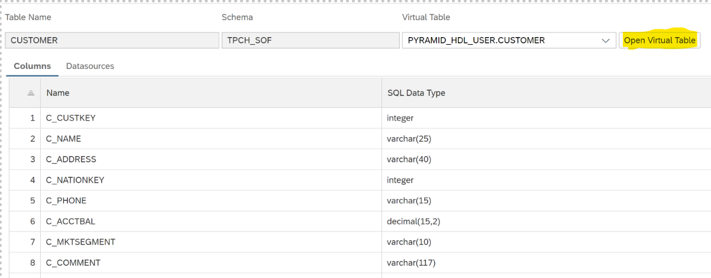

# Use SOF to Query data from Single Directory
<!-- description --> It will teach you how to setup SQL on Files, optimize SQL on Files performance using a single folder directory.

## Prerequisites
- Have access to a licensed managed or standalone SAP HANA data lake.
-	Installation of the HDLFSCLI. See tutorial. [Getting Started with Data Lake Files HDLFSCLI | Tutorials for SAP Developers](data-lake-file-containers-hdlfscli).
-	Have some structured data files inside of a [SAP HANA data lake File Container](https://help.sap.com/docs/SAP_HANA_DATA_LAKE/a89a80f984f21015b2b2c84d2498d36d/6e1dd06335704f4c96d48279ca1ed555.html?version=2021_4_QRC).
-	Have some data with you, which will be uploaded onto the SAP HANA data lake File container.
-	Already set up HDLFS Connection in Database Explorer.


## You will learn
 -	How to define the database objects required to query structured data files.
 -	How to add a data source for a single data file and query the output of that file.


 Querying structured data files (CSV, ORC, Parquet) in a HANA Data Lake file container can be done using SQL on Files. Below you will find all of the steps required to start using SQL on Files.

 If you have not yet provisioned an SAP HANA data lake, [here](hana-cloud-hdl-getting-started-1) is a great tutorial on how to do so!

---

### Set up SQL on File Basics


To start off with this Tutorial, you will need to connect to a SQL console connected directly with your SAP HANA Data Lake Instance. This can be done easily by clicking on the **Actions** tab of your Data Lake Instance from the **BTP cockpit** or **Cloud Central** and selecting **Open in SAP HANA Database Explorer**. That way you will be connected to the SQL console connected directly with your SAP HANA Data Lake Instance.

Connect using **HDLADMIN** user and grant a database user the `HDL_FILES_SERVICE_ADMIN` role.

```SQL
CREATE USER SOF_USER IDENTIFIED BY Password1;

GRANT ROLE HDL_FILES_SERVICE_ADMIN TO SOF_USER;

GRANT ALTER ANY TABLE,
CREATE ANY TABLE,
DROP ANY TABLE,
DELETE ANY TABLE,
INSERT ANY TABLE,
LOAD ANY TABLE TO SOF_USER WITH NO ADMIN OPTION;

GRANT MANAGE ANY REMOTE SERVER TO SOF_USER WITH NO ADMIN OPTION;
```

Now, Open a new SQL console and you need to add a new Database Connection of the USER we recently created in DBX, and login using the above created user **`SOF_USER`** credentials.


From Database Explorer, right-click on your Data Lake Instance and select **PROPERTIES**. Copy the entire field of **HOST** and hit OK. Now in the DBX, click on the **+** symbol in the DBX. And from the dropdown under **Database Type** select **Data Lake Relational Engine**.  Enter the copied value of Host now. Input the username as **`SOF_USER`** and Password as **Password1** and check the box to save the password.


### Create a Remote Server to Access SQL-on-Files


Now, let us open a new SQL console window and connect it with the new user **`SOF_USER`** to our HANA Data Lake Instance and create a SQL on files Remote Server.

```SQL
CREATE REMOTE SERVER MY_REMOTE_SERVER CLASS 'FILES_SERVICE' READ ONLY VALUE 'ON';
```


### Create SQL-on-Files Schema


Next, we create a Schema in the Files Service. Creating a Schema adds a layer of security to who can access your SQL servers. A good schema design reduces database complexity and optimizes database query time.

```SQL
CREATE SCHEMA TPCH_SOF IN FILES_SERVICE;
```


This remote schema will contain a collection of Remote Tables, each of which must be associated with an existing Remote Schema.

Create a SQL on Files Remote Table in Files service.

Note that the table definition will need to match the expected schema/data types of the columns in the structured file you are trying to query 	

```SQL
CREATE TABLE TPCH_SOF.CUSTOMER (
   C_CUSTKEY            integer,                       
   C_NAME               varchar(300),                 
   C_ADDRESS            varchar(600),             
   C_NATIONKEY          integer,                      
   C_PHONE              varchar(150),                
   C_ACCTBAL            decimal(15,3),             
   C_MKTSEGMENT         varchar(100),         
   C_COMMENT            varchar(5000)                   
) IN FILES_SERVICE;
```


For information about the parameter definitions and supported data types, see [docs](https://help.sap.com/docs/SAP_HANA_DATA_LAKE/a898e08b84f21015969fa437e89860c8/24e694b566814ad285cb32fe3e5d3928.html?version=2022_1_QRC)


### Create Data Lake Virtual Table to Access SQL-on-Files


Next, We create a Virtual Table. Notice in the SQL below where the remote server name goes and where the reference to the table in the Files Service goes. Over here, we will be creating a CUSTOMER VIRTUAL TABLE in HDLRE that points to the CUSTOMER table that we just created in SQL On Files service.

The EXISTING keyword is used in conjunction with CREATE TABLE and IN FILES SERVICE to indicate that a table exists remotely in SQL on Files and to import its metadata into the new virtual table. The remote table is now visible to users thanks to this syntax.

Note that the table definition will need to match the expected Schema/Data types of the columns in the structured file

```SQL
CREATE EXISTING TABLE CUSTOMER(
   C_CUSTKEY            integer,                        
   C_NAME               varchar(300),                  
   C_ADDRESS            varchar(600),               
   C_NATIONKEY          integer,                       
   C_PHONE              varchar(150),               
   C_ACCTBAL            decimal(15,3),              
   C_MKTSEGMENT         varchar(100),           
   C_COMMENT            varchar(5000)                   
) AT 'MY_REMOTE_SERVER..TPCH_SOF.CUSTOMER';
```



For the full syntax of clauses available to create an existing table, see [CREATE EXISTING TABLE Statement for Data Lake Relational Engine & SQL on Files](https://help.sap.com/docs/SAP_HANA_DATA_LAKE/19b3964099384f178ad08f2d348232a9/8bfd6bbf659b4c9ea03236eb2767ec80.html?version=2022_1_QRC) OR [CREATE EXISTING TABLE Statement for Data Lake Relational Engine (HANA DB-Managed) & SQL on Files](https://help.sap.com/docs/SAP_HANA_DATA_LAKE/a898e08b84f21015969fa437e89860c8/569aa95237b54d28883feeceef487e21.html?version=2022_1_QRC)


### Upload a file from HDLFS onto the Data Lake File container


Make sure that you have everything setup with respect to HDLFSCLI. One can go through the tutorial for getting started with HDLFSCLI - [Getting Started with Data Lake Files HDLFSCLI | Tutorials for SAP Developers](data-lake-file-containers-hdlfscli).

Use the below command to upload a local file onto the Data Lake -

`hdlfscli -config <your config> upload <Your Local Path>\ <Target File Path>\`

For e.g. I am using the table name **`Lineitem`** as reference.

`hdlfscli -config myconfig upload C:\Users\<YOUR SAP ID>\Lineitem myPath\Lineitem`

`C:\Users\<YOUR SAP ID>\Lineitem` is my Local Path

`myPath\Lineitem` is my Target path in the File Container


Verify that the files has been uploaded.

`hdlfscli -config <your config> lsr`


Make sure you have already set up a HDLFS Connection in Database Explorer. It will look something like below. To get to know how to setup a HDLFS Connection In Database Explorer go through the tutorial – [Setting Up HDLFS Connection In Database Explorer](data-lake-hdlfs-dbx-connection).


### Add Data Source and Query the structured file


Add a data source, this can be done multiple times with multiple files.

Note that in this step the file path can lead to an exact file or it can lead to a directory. If it leads to a directory, SQL on Files will try to parse all the data files in that directory. To ensure that there are no parse errors, make sure that all the files in the directory match the schema of the table the data source it is being added to.

One could also refer the ALTER TABLE ADD DATASOURCE doc for any further reference -[ALTER (Remote) TABLE ADD DATASOURCE Statement for Data Lake Relational Engine (HANA DB-Managed) and SQL on Files](https://help.sap.com/docs/SAP_HANA_DATA_LAKE/a898e08b84f21015969fa437e89860c8/e6e7243b09c34d48adf387e96f43c014.html?q=ADD%20DATASOURCE)


```SQL
ALTER TABLE TPCH_SOF.ORDERS IN FILES_SERVICE ADD DATASOURCE
AS ORDERS_DATASOURCE CSV(webhdfs('hdlfs:///<your path>')) DELIMITED BY ',' ENCODING 'utf-8' SKIP 1;
```

Now that you have created all the foundational database objects for querying our file, you can simply query the files as if it were a table.
Note that the table name here will be the name of the EXISTING table (Virtual table) created in the Step 2 above.

```SQL
SELECT * FROM CUSTOMER;
```


### Clean up or Remove SQL on Files Table


If you want to drop a data source for a SQL on Files table you can do so as well.

```SQL
ALTER TABLE TPCH_SOF.CUSTOMER IN FILES_SERVICE
DROP DATASOURCE CUSTOMER_DATASOURCE;
```

To clean up the SQL on Files table created in Step 2, you drop the existing table, then the files service table, and lastly the files service schema.

```SQL
DROP TABLE CUSTOMER;
DROP TABLE TPCH_SOF.CUSTOMER IN FILES_SERVICE;
DROP SCHEMA TPCH_SOF IN FILES_SERVICE;
```


---
