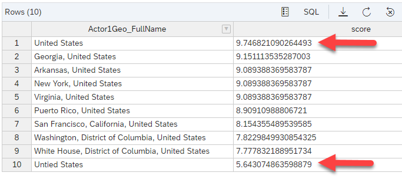

# Index and Search Text In a SAP HANA Cloud, data lake
<!-- description --> Learn how to use and configure a text index on text columns in a SAP HANA Cloud, data lake. Then learn how to perform a text search on those columns when querying the data.

## Prerequisites
 - A provisioned SAP HANA Cloud, data lake
 - Access to the SAP HANA Cloud, data lake File Store
 - Access to the SAP Database Explorer
 - An installation of the HDLFSCLI

## You will learn
  - How to create a text index on a text column
  - How to perform a text search on a text column
  - How to understand text search scoring

## Intro
Searching long text for keywords may assist in filtering or analyzing important data from large data sets. Some data sets might have very large text columns where you do not know what words or partial words are contained. One good example is the [GDELT](https://www.gdeltproject.org/) data set. Today you will explore the events data from GDELT and learn how to use text search in an SAP HANA Cloud, data lake.

---

### Import the Data into a SAP HANA Cloud, data lake.


To import the data into your SAP HANA Cloud, data lake (HDLRE) you first need the data files. SAP hosts some sample files that you can pull from Git to your local machine. Go to [this](https://github.com/SAP-samples/hana-cloud-relational-data-lake-onboarding/blob/main/event_samp.CSV) GitHub repository and click the copy raw contents button.


Then create a local text file and paste the contents that were just copied. Save the text file as `events_data.csv`. Open a terminal or command prompt and navigate to the location of your file.

`cd <path_to_file>`


Now, you can use your HDLFSCLI to put the data file into the SAP HANA Cloud, data lake File Store. If you haven't set up your HDLFSCLI configuration yet, checkout the [Getting Started with Data Lake Files HDLFSCLI](data-lake-file-containers-hdlfscli) tutorial. Use the HDLFSCLI upload command to upload the `events_data.csv`

`hdlfscli -config <your-hdl-files-config> upload events_data.csv events_data.csv`


Now that you have your data file inside of your file container, you can move to SAP HANA Database Explorer and load the data into your HDL Relational Engine. The SAP HANA Database Explorer can be found in the BTP Cockpit or HANA Cloud Central under the ellipses on the HDLRE instance.


Once in the SAP HANA Database Explorer, open an SQL console for your HDLRE instance and paste the following SQL command. It will create the table structure needed to import the file in the file container.

```SQL
CREATE TABLE EVENT (
    GlobalEventID INTEGER,    
    Day DATE,
    MonthYear INTEGER,
    Year INTEGER,
    FractionDate FLOAT,
    Actor1Code VARCHAR(27),
    Actor1Name VARCHAR(1024),
    Actor1CountryCode VARCHAR(3),
    Actor1KnownGroupCode VARCHAR(3),
    Actor1EthnicCode VARCHAR(3),
    Actor1Religion1Code VARCHAR(3),
    Actor1Religion2Code VARCHAR(3),
    Actor1Type1Code VARCHAR(3),
    Actor1Type2Code VARCHAR(3),
    Actor1Type3Code VARCHAR(3),
    Actor2Code VARCHAR(27),
    Actor2Name VARCHAR(1024),
    Actor2CountryCode VARCHAR(3),
    Actor2KnownGroupCode VARCHAR(3),
    Actor2EthnicCode VARCHAR(3),
    Actor2Religion1Code VARCHAR(3),
    Actor2Religion2Code VARCHAR(3),
    Actor2Type1Code VARCHAR(3),
    Actor2Type2Code VARCHAR(3),
    Actor2Type3Code VARCHAR(3),
    IsRootEvent INTEGER,
    EventCode VARCHAR(4),
    EventBaseCode VARCHAR(4),
    EventRootCode VARCHAR(4),
    QuadClass INTEGER,
    GoldsteinScale FLOAT,
    NumMentions INTEGER,
    NumSources INTEGER,
    NumArticles INTEGER,
    AvgTone FLOAT,
    Actor1Geo_Type INTEGER,
    Actor1Geo_FullName VARCHAR(120),
    Actor1Geo_CountryCode VARCHAR(2),
    Actor1Geo_ADM1Code VARCHAR(4),
    Actor1Geo_ADM2Code VARCHAR(64),
    Actor1Geo_Lat FLOAT,
    Actor1Geo_Long FLOAT,
    Actor1Geo_FeatureID VARCHAR(10),
    Actor2Geo_Type INTEGER,
    Actor2Geo_FullName VARCHAR(120),
    Actor2Geo_CountryCode VARCHAR(2),
    Actor2Geo_ADM1Code VARCHAR(4),
    Actor2Geo_ADM2Code VARCHAR(64),
    Actor2Geo_Lat FLOAT,
    Actor2Geo_Long FLOAT,
    Actor2Geo_FeatureID VARCHAR(10),
    ActionGeo_Type INTEGER,
    ActionGeo_FullName VARCHAR(120),
    ActionGeo_CountryCode VARCHAR(2),
    ActionGeo_ADM1Code VARCHAR(4),
    ActionGeo_ADM2Code VARCHAR(64),
    ActionGeo_Lat FLOAT,
    ActionGeo_Long FLOAT,
    ActionGeo_FeatureID VARCHAR(10),
    DateAdded DATETIME,
    SourceUrl VARCHAR(1024)
);
```

Once the table is created, proceed to load the data from the file.

```SQL
LOAD TABLE EVENT (
    GlobalEventID,    
    "Day",
    MonthYear,
    "Year",
    FractionDate,
    Actor1Code,
    Actor1Name,
    Actor1CountryCode,
    Actor1KnownGroupCode,
    Actor1EthnicCode,
    Actor1Religion1Code,
    Actor1Religion2Code,
    Actor1Type1Code,
    Actor1Type2Code,
    Actor1Type3Code,
    Actor2Code,
    Actor2Name,
    Actor2CountryCode,
    Actor2KnownGroupCode,
    Actor2EthnicCode,
    Actor2Religion1Code,
    Actor2Religion2Code,
    Actor2Type1Code,
    Actor2Type2Code,
    Actor2Type3Code,
    IsRootEvent,
    EventCode,
    EventBaseCode,
    EventRootCode,
    QuadClass,
    GoldsteinScale,
    NumMentions,
    NumSources,
    NumArticles,
    AvgTone,
    Actor1Geo_Type,
    Actor1Geo_FullName,
    Actor1Geo_CountryCode,
    Actor1Geo_ADM1Code,
    Actor1Geo_ADM2Code,
    Actor1Geo_Lat,
    Actor1Geo_Long,
    Actor1Geo_FeatureID,
    Actor2Geo_Type,
    Actor2Geo_FullName,
    Actor2Geo_CountryCode,
    Actor2Geo_ADM1Code,
    Actor2Geo_ADM2Code,
    Actor2Geo_Lat,
    Actor2Geo_Long,
    Actor2Geo_FeatureID,
    ActionGeo_Type,
    ActionGeo_FullName,
    ActionGeo_CountryCode,
    ActionGeo_ADM1Code,
    ActionGeo_ADM2Code,
    ActionGeo_Lat,
    ActionGeo_Long,
    ActionGeo_FeatureID,
    DateAdded DATETIME('YYYYMMDDhhnnss'),
    SourceUrl
)
USING FILE 'hdlfs:///events_data.csv'
DELIMITED BY '\x09'
FORMAT CSV
ESCAPES OFF
QUOTES OFF;
```

Now, the data should be in the EVENTS table that was created earlier. Run a simple select statement to ensure it is there.

```SQL
SELECT * FROM EVENT;
```


### Create a Text Index on a Text Column.


In the HDL Relational Engine, you can create different kinds of text indexes which can be used for text searching. In the EVENTS table you created earlier, consider the `Actor1Geo_FullName` and `Actor2Geo_FullName` columns. Run the following select to take a look at the data.

```SQL
SELECT Actor1Geo_FullName, Actor2Geo_FullName FROM EVENT WHERE Actor1Geo_FullName != '' AND Actor2Geo_FullName != '';
```


Something you might notice is that the actor names might be broader 'United States' or narrower 'Washington, District of Columbia, United States'. This might make it difficult to grab all the values that contain a certain city, state or country if you are filtering on these columns. Using a text index, you can search these strings using key words in your queries.

Create a text index on these columns. First, configure the text index with the parameters you might want.

```SQL
CREATE TEXT CONFIGURATION MyTextIndxConfig FROM default_char;
ALTER TEXT CONFIGURATION MyTextIndxConfig TERM BREAKER NGRAM;
ALTER TEXT CONFIGURATION MyTextIndxConfig MAXIMUM TERM LENGTH 3;
```

The above SQL creates a text configuration that will use non-NCHAR data that will break the string down into `NGRAMs` of maximum length 3. The text configuration will use any non alphanumeric characters to separate terms. Now, use your configuration and create a text index on both actor columns. **Note**: Alternatively to using the MAXIMUM term length, you can use the MINIMUM term length.

```SQL
CREATE TEXT INDEX Actor1Idx ON EVENT (Actor1Geo_FullName) configuration MyTextIndxConfig;
CREATE TEXT INDEX Actor2Idx ON EVENT (Actor2Geo_FullName) configuration MyTextIndxConfig;
```

The above creates the index on both columns using the configuration that you defined earlier.


### Query the Table Using the CONTAINS function.


To make use of the text index that you created above, you can use the CONTAINS function. The CONTAINS function when used on a text index allows you to search your text columns for key words, partial key words (using * operator), and words that are near each other. Learn more about what's possible with text searching in the (SAP Help documentation)[https://help.sap.com/viewer/a8937bea84f21015a80bc776cf758d50/2021_4_QRC/en-US/a5f9128284f21015be99d1a8e8925c94.html?q=CONTAINS%20text%20search]. Try a simple query on your index.

```SQL
SELECT Actor1Geo_FullName, Actor2Geo_FullName FROM EVENT CONTAINS(EVENT.Actor1Geo_FullName, 'United States');
```

Here you select the rows where the `Actor1Geo_FullName` contains United States.


Now, one might draw the comparison to using the LIKE syntax when querying text columns. But there is an added benefit to using a text index. What if there was a spelling mistake in the data? Find out by making a spelling mistake in your data.

```SQL
UPDATE EVENT SET Actor1Geo_FullName = 'Untied States' WHERE GlobalEventID = 887591399;
```

Now, run your query again.

```SQL
SELECT Actor1Geo_FullName, Actor2Geo_FullName FROM EVENT CONTAINS(EVENT.Actor1Geo_FullName, 'United States');
```


You still see the result with the spelling error! This is because even though "United" is misspelled, the index still matches with the "states" keyword. Where if you used `LIKE '%United States%'` instead of contains, you would have missed this result. You can use the SQL below to verify.

```SQL
SELECT GlobalEventId, Actor1Geo_FullName, Actor2Geo_FullName FROM EVENT CONTAINS(EVENT.Actor1Geo_FullName, 'United States') WHERE GlobalEventID = 887591399;
SELECT Actor1Geo_FullName, Actor2Geo_FullName FROM EVENT WHERE Actor1Geo_FullName LIKE '%United States%' AND GlobalEventID = 887591399;
```

Another way to extend this capability is to use the FUZZY option when searching a text column for a term. You will see how this effects the results.

```SQL
SELECT DISTINCT(Actor1Geo_FullName) FROM EVENT CONTAINS(EVENT.Actor1Geo_FullName, 'FUZZY "United States"');
```


The fuzzy option is also good for identifying spelling mistakes and similar words, but notice the results are much less strict. You see results where the search term "United States" is not present.


### Understanding the SCORE of a Text Index Search Result

You saw above that one of the benefits of using a text index is that if there are any minor data entry mistakes or spelling errors in text columns, you can still find them in the results. How does this work? When a query uses a CONTAINS clause, it scores the results. There are a few things that influence this score.

Compare the score of your entries.

```SQL
SELECT DISTINCT(Actor1Geo_FullName), CT.score FROM EVENT CONTAINS(EVENT.Actor1Geo_FullName, 'United States') AS CT ORDER BY CT.score DESC;
```



You might notice in the screen shot above that you see the entries that are an exact match to your search term have the highest score. While others, that contain the search term and other text have lower scores. The more different the string is from the search term the lower its score. Notice that the misspelled entry "Untied States" has the lowest score.

Take a look at the scores for the FUZZY search.

```SQL
SELECT DISTINCT(Actor1Geo_FullName), CT.score FROM EVENT CONTAINS(EVENT.Actor1Geo_FullName, 'FUZZY "United States"') AS CT ORDER BY CT.score DESC;
```


Notice, all the entries with the closest match to the exact search term have the highest score. One way to think about the score is that it can help you identify how relevant a certain piece of data is to the search term you are using.

You now know how to create a text index on a `text` or `varchar` column, configure that text index, and use the CONTAINS function to perform a text search on your data. Be sure to check out the SAP Help documentation for more information on [text indexes](https://help.sap.com/viewer/a8937bea84f21015a80bc776cf758d50/2021_4_QRC/en-US/a5efed9884f210158fd8bd686e7be818.html) and performing [text search](https://help.sap.com/viewer/a8937bea84f21015a80bc776cf758d50/2021_4_QRC/en-US/a5f8abf084f2101580319c6ef971d09c.html).


---
