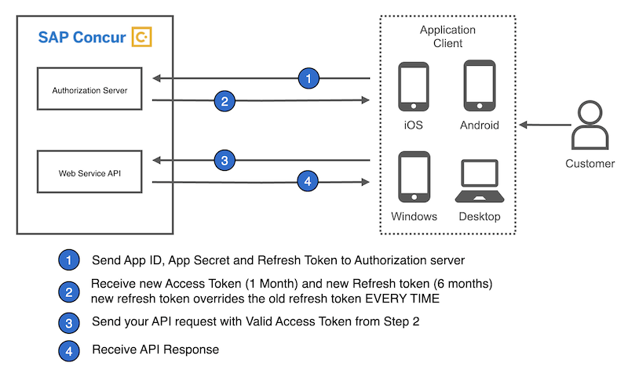
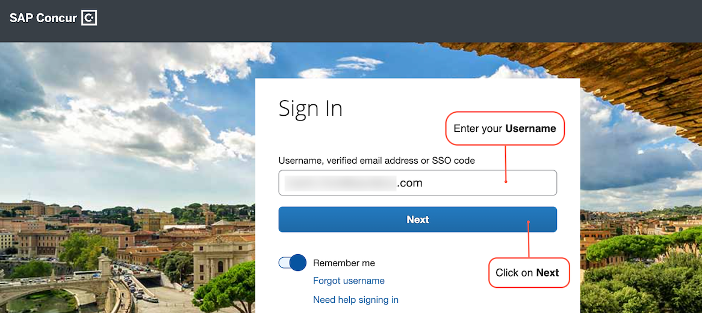
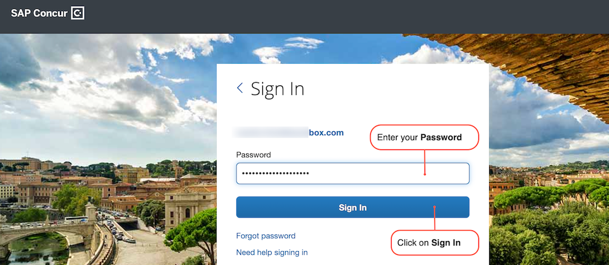
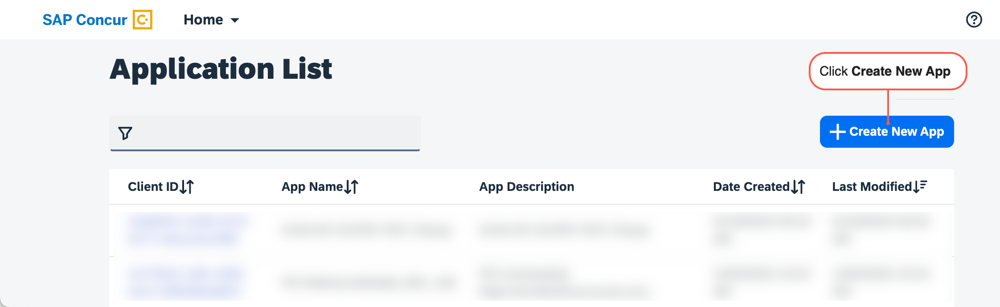
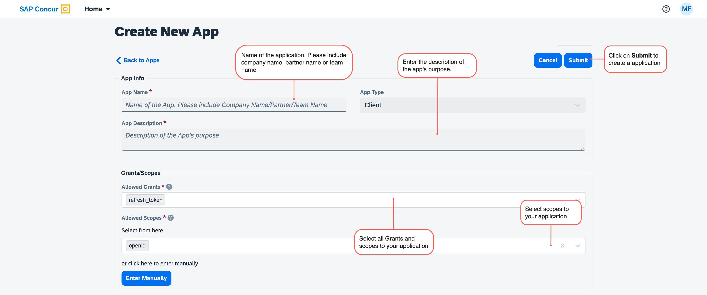
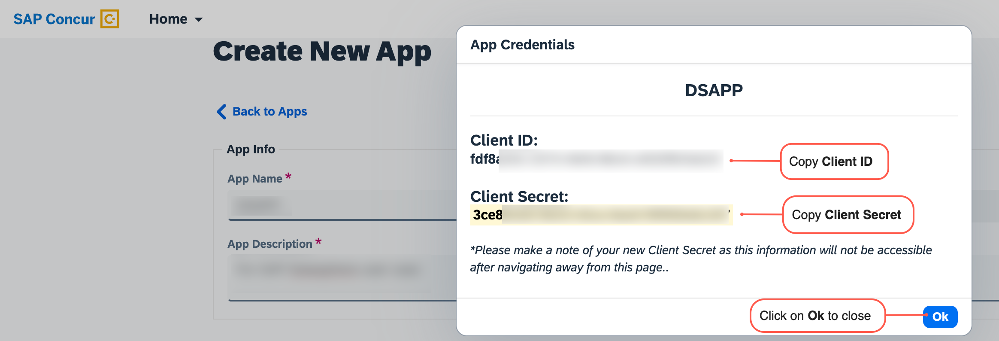
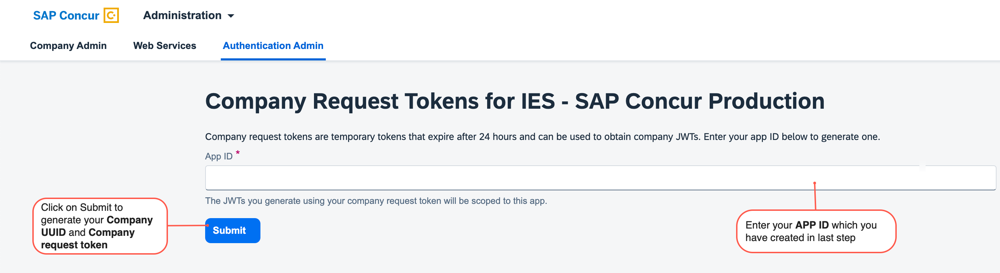
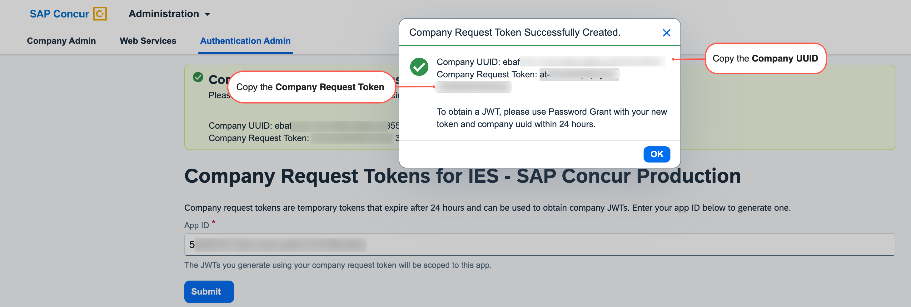
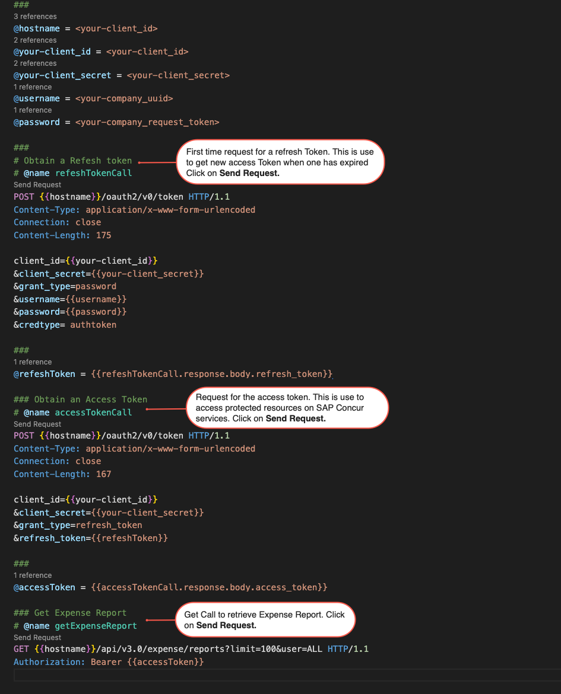
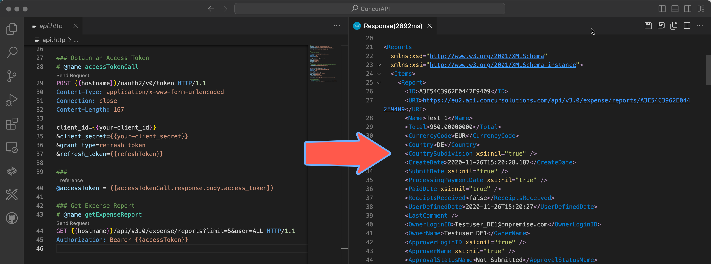

# Learn about SAP Concur APIs
SAP Concur is a SaaS solution that provides customers the travel and expense management services. It enables businesses to reinvent travel, expense, and invoice management, simplify everyday processes, and provide employees with better experiences.

More specifically, you can capture your spend from multiple sources and make spending decisions based on accurate data, reimburse employees more quickly, and simplify the expense reporting process for everyone. SAP Concur can help us to

- View all your expense data in one place
- Configure expense processes according to your business needs
- Easily enforce and change spending policies
- Automatically capture receipts and process reports

You can read and understand more about SAP Concur in the following links:

- [About Concur](https://www.concur.com/en-us/about-concur)
- [Expense Management](https://www.concur.com/en-us/expense-management)
- [Travel and Expense Management](https://www.sap.com/products/spend-management/travel-and-expense-management.html)

[SAP Concur APIs](https://api.sap.com/products/SAPConcur/apis/REST) allow clients or partners to access data and functions within the SAP Concur product ecosystem. 
Several business problems and reporting requirements can be resolved by utilizing these available endpoints and functionalities, including:

- For comprehensive reporting services, pull data from SAP Concur.
- Compare your data with SAP Concur data to check or reconcile your records.
- Upload new data into SAP Concur to enable information production via programming.
- To match the data in your system, update the existing information in SAP Concur.

SAP Concur APIs use the OAuth2 framework to implement a Unified Token mechanism within your application.
Before you will access the SAP Concur API, you need to register an Application with SAP Concur. 
Once you have registered an application, you will receive a clientId and clientSecret. 
You will be using this credential to obtain tokens for the application.



## You will learn
- How to login to SAP Concur and create an Application
- How to setup the rest client script in VSCode to a call SAP Concur API
- How to sequential execute the script to Get Expense Report.   

## Prerequisites
- A SAP Concur: cloud travel & expense system
- A [Visual Studio Code](https://code.visualstudio.com/) with [REST Client Extension](https://marketplace.visualstudio.com/items?itemName=humao.rest-client)   

---

### Login to your SAP Concur

1. Login to your [Concur admin panel.](https://www.concursolutions.com/nui/ocstool)
   
2. Enter your user Id and click **Next.**
   
   
3. Enter your password and click **Sign In.**
   

### Create a new app

1. Go to the [OAuth 2.0 Application Management](https://www.concursolutions.com/nui/ocstool) screen.
2. Click **Create New App.**
   
3. Fill in all of the required fields and add all of the grants and scopes you have access to. Click **Submit** when to form is completed
   
4. Copy and paste your **Client ID** and **Client Secret** to a text file. Click **OK** when completed
   

### Generate your company request token

1. Go to the [Company Request Token](https://www.concursolutions.com/nui/authadmin/companytokens) screen. 
2. Enter your **App ID** in the required field and click **Submit** to generate your company request token.
   
3. Copy/paste the **Company UUID** and **company request token** fields to a text file.

4. Click **OK** after you have saved this information to a text file.

### Set up a REST Client Script  

Visual Studio Code (or just VSCode) is a free source code editor developed and maintained by Microsoft. The REST Client plugin requires just a plain text file with the extension .http or .rest.

1. Open **Visual Studio Code**
2. Create a file with name **api.http** Or you can give any name but file extension should be **.http Or .rest.**
3. Copy the below code to the file
   
```

###
@hostname = <your-company-base_URI>
@your-client_id = <your-client_id>
@your-client_secret = <your-client_secret>
@username = <your-company_uuid>
@password = <your-company_request_token>

```

Replace the placeholder as per your application configuration **your-client_id**, **your-client_secret**, **your-company_uuid** and **your-company_request_token** you have generated in previous step.

When making the call, you will use your app’s geolocation as the **base URI** followed by the endpoint. For example, if your geolocation is https://us.api.concursolutions.com, you will call https://us.api.concursolutions.com/oauth2/v0/token.


### Add Code to obtain an Refresh Token

The first time you request for a **refreshToken** This is used to get a new accessToken when one has expired.

1. Copy below code just below the above code to Obtain a **refresh token** and store it to a variable. 

```

### Obtain a Refresh token
# @name refeshTokenCall
POST {{hostname}}/oauth2/v0/token HTTP/1.1
Content-Type: application/x-www-form-urlencoded
Connection: close
Content-Length: 175

client_id={{your-client_id}}
&client_secret={{your-client_secret}}
&grant_type=password
&username={{username}}
&password={{password}}
&credtype= authtoken

###
@refeshToken = {{refeshTokenCall.response.body.refresh_token}}

```

### Obtain an Access Token

The Oauth2 service generates access tokens for authenticated applications. The token returned in the Oauth2 response can be used to access protected resources on SAP Concur services.

1. Copy below code just below the above code to Obtain a **access Token** and store it to a variable.

```

### Obtain an Access Token
# @name accessTokenCall
POST {{hostname}}/oauth2/v0/token HTTP/1.1
Content-Type: application/x-www-form-urlencoded
Connection: close
Content-Length: 167

client_id={{your-client_id}}
&client_secret={{your-client_secret}}
&grant_type=refresh_token
&refresh_token={{refeshToken}}

###
@accessToken = {{accessTokenCall.response.body.access_token}}

```

### Calling an API with the Access Token
The base URI for all subsequent calls. Armed with the accessToken you can start making calls to an SAP Concur API. Here’s an example How you can retrieve Expense Report by utilizing the appropriate base URI with the access token.

```

### Get Expense Report
# @name getExpenseReport
GET {{hostname}}/api/v3.0/expense/reports?limit=100&user=ALL HTTP/1.1
Authorization: Bearer {{accessToken}}

```

### Test it out

Using VS Code extension you can make these API calls easily by giving the references to the required response objects in the first call and using them in the next call.

We have Three Request in the script.

1. First request for a **refresh token.** This is use to get new access token when one has expired.
   
2. Second request for a **access token.** this is use to access protected resources on SAP Concur services.

3. Last Request Get call to **retrieve Expense Report.**

Click on **Send Request** sequentially as mentioned in below screenshot




### Final Result

The SAP Concur Expense Reports API used to read and modify an existing expense report. This API can be used to simplify expense reporting and get more visibility into spending. 

1. **Check** your final request result. 
   



You have successfully completed the first tutorial of this tutorial group. Learn in the next tutorial how to fetch expense report entries using the integration flow.

---