# Learn how to consume SAP Concur API using Cloud Integration

SAP delivers rich [pre-packaged integration content](https://help.sap.com/docs/cloud-integration/sap-cloud-integration/integration-flow-extension) out of the box that enables you to get started quickly. These integration packages are created for some of the commonly used integration scenarios. They contain integration flows, value mappings, documentation, and so on. By using this content, you can easily get started with minimal integration developer effort.

To accelerate the integration scenario, we will use the pre-packaged integration content that helps us to connect to SAP Concur API by providing a way to authenticate and send the request to the SAP Concur API. For more information, refer to [Connect to SAP Concur API.](https://api.sap.com/package/IntegrationwithSAPConcurAPI/integrationflow)

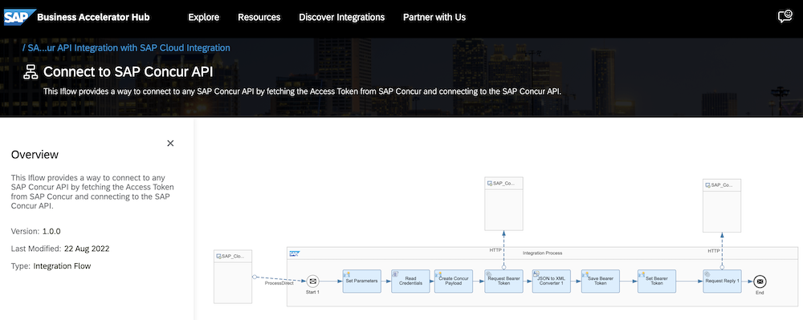

It should be used as a subprocess integration flow that is called by another Integration flow on the SAP Cloud integration to retrieve data from any SAP Concur API with a GET request.

## You will learn
- How to use the pre-packaged content in SAP Cloud Integration.
- How to create and deploy Concur Credential Artifact
- Create, configure and Deploy Integration Flow
- Deploy & Monitor Integration Flow

## Prerequisites
- A SAP Concur: cloud travel & expense system    
- You should have prior knowledge and setup of Integration suite with cloud integration. Make sure you've completed the [Request Product Details with an Integration Scenario](https://developers.sap.com/mission.cp-starter-integration-cpi.html) 
- Complete the tutorial: [SAP Concur APIs Overview](../data-to-value-conn-concur-part01/data-to-value-conn-concur-part01.md)

### Copy Integration Package from Catalog

1. On the SAP Integration Suite home page, You can find this pre-packaged content in the **Discover** section. Choose **Discover** > **Integrations** from the left menu and search for **Connect to SAP Concur API**. Choose the package **SAP Concur API Integration with SAP Cloud Integration**.
   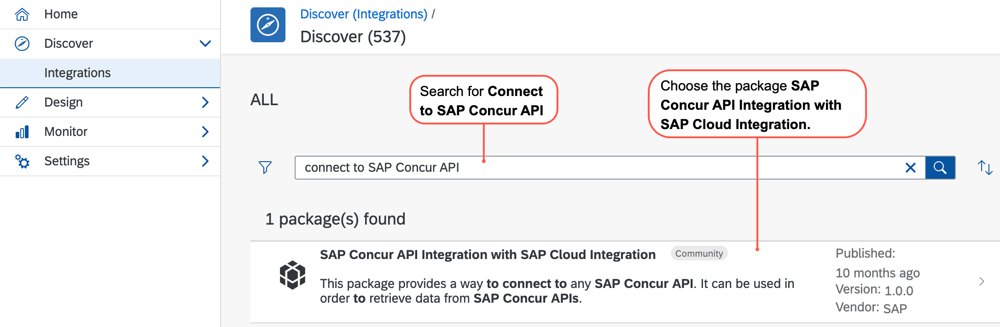

   In the Overview tab of the package, you can find a detailed description of the package and the Artifacts tab shows the integration flows within the current package.
   
2. Choose **Copy** at the top left corner to Copy selected package's content into your tenant.
   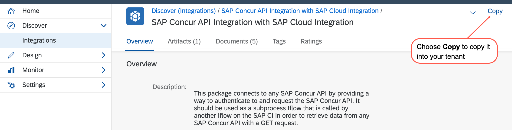

3. After you’ve successfully copied your integration flow package, go to the **Design** > **Integrations** tab which you find in your left-hand navigation bar. You can now see a list of all existing integration packages as well as newly copied package with the title **SAP Concur API Integration with SAP Cloud Integration** on this tenant.
   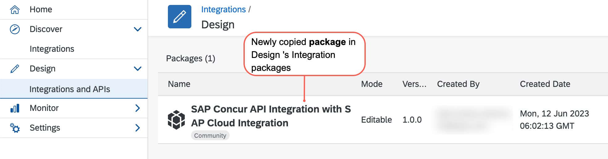

In next step we will create credential artifact and deploy it.

### Create & Deploy Concur Credential Artifact
 Before we configure and deploy this Integration flow we need the additional information
   - **Concur Credential Store:** A SAP Cloud Integration OAuth2 Client Credential Artifact.
   - **Concur RefreshToken:** which we have already used in the VS Code extension API Calls.

1. In the overview dashboard of your SAP Cloud Platform Integration Tenant, Choose **Monitor** > **Integrations** and then **Security Material**.
   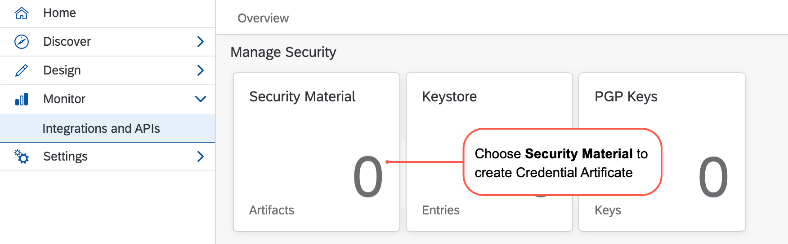
2. choose **Create** > **OAuth2 Credentials**.
   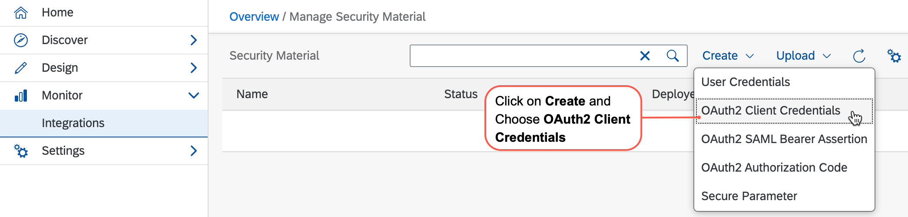 
3. Specify the following attributes:
   1. **Name :** Name for the credentials.
   2. **Token Service URL :** URL of the OAuth2 authorization server that issues the access token.
   3. **Client ID :** ID of the client that you're connecting to.
   4. **Client Secret :** Secret key of the client that you're connecting to
   
   then, Choose **Deploy**.
   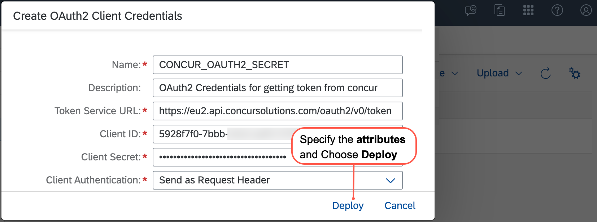

4. When you refresh the **Manage Security Material** page, the new artifact is displayed (with Type **OAuth2 Client Credentials**) in the artifact table.
   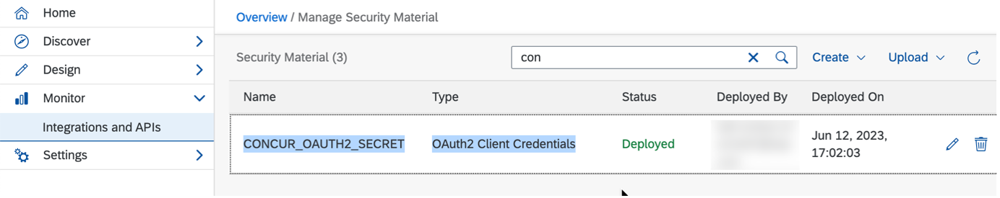

5. Take note of it we will be using it to configure the Integration Flow.

### Download Certificate

We need to upload the SSL Certificate a digital certificate that provide authentication and a secured connection. One of the easiest ways is to download the required SSL certificate from an appropriate website. Common browsers give users the option to download these certificates by exporting them.

1. Visit the website for the URL you wish to download the Certificate from. For instance, at https://eu2.concursolutions.com/home.asp, sign in with your login and password.
2. After logging in, notice the certificate information Pop-up by clicking the **padlock icon** before the URL
    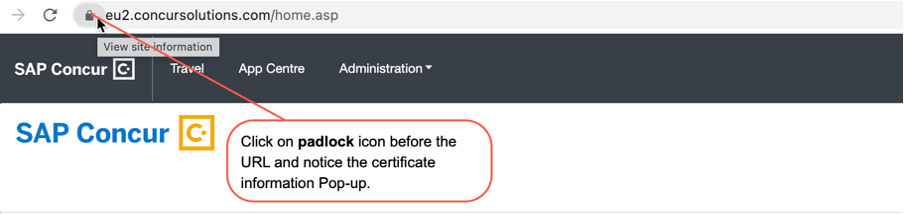
3. As shown below, click the **Connection is secure** link.
   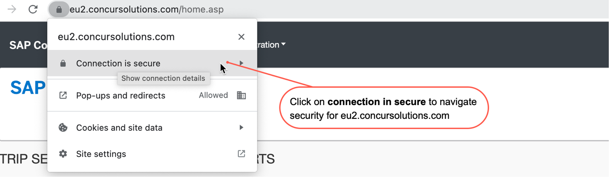
4. Click on **Certificate is Valid** Tab to bring up the certificate viewer to export the appropriate Certificate.
   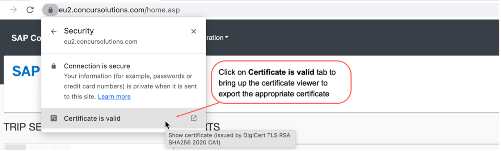
5. Click the **Export button** to export the certificate to the download folder.
   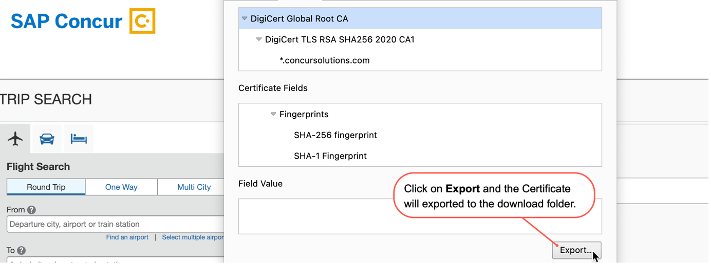
   
### Upload Certificate
We have already discussed we need a server certificate that needs to be uploaded to enable a secure SSL/TLS-based connection and have downloaded as well.

1. Return to the Integration Suite, Choose **Monitor > Integrations** then click on **Keystore.**
    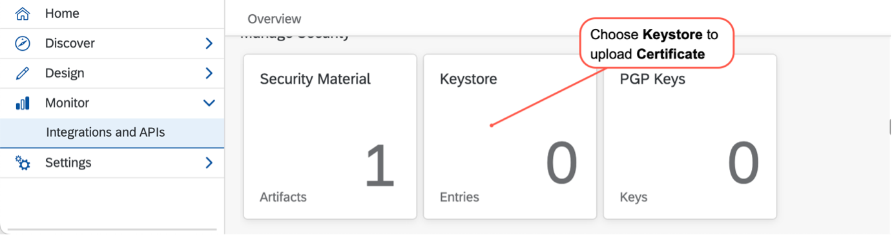
2. Choose **Add > Certificate**
   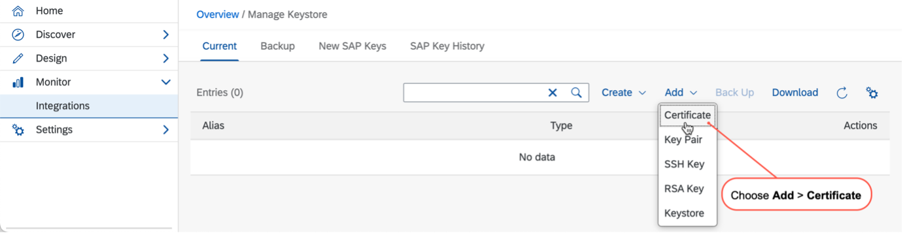
3. Enter the** Alias** and **Choose** the certificate by browsing your local directory in the Add Certificate dialogue. Choose **Add**.
   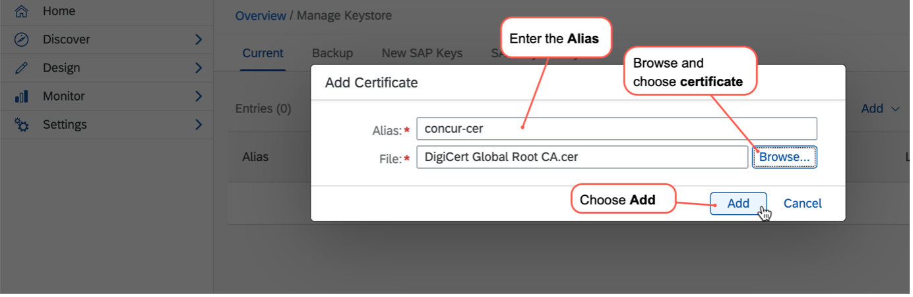
4. In the **Manage Keystor**e, you can see the new Certificate is displayed with the Valid Until and Last Modified fields in the Entries 
   

### Configure and deploy Integration Flow
After you've successfully copied integration flow package, go to the Design tab which you find in your left-hand navigation bar. you can now see a list of all existing integration packages on this tenant. Select your newly copied package by clicking on the title Connect

1. Now we have everything to configure and update the Integration flow. Select the **Artifacts** and click on **Action** then **Configure**.
   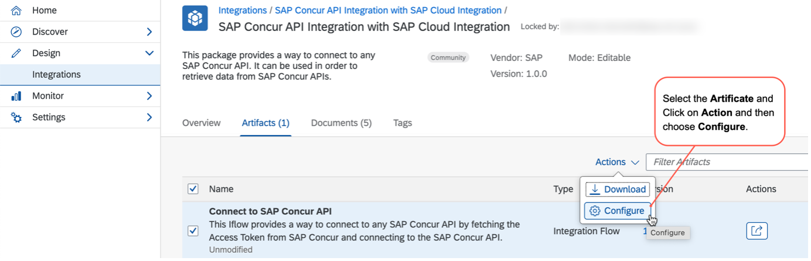
2. In **Sender** Tab no need to change anything please note down the Adapter type is **ProcessDirect** and Connection Address **/Concur/API** which we going to use in a Integration flow.
   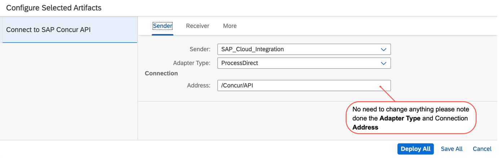
3. Now select the **Receiver** Tab and select the Receiver to **SAP_Concur_API**. Enter the Connection **Address** the **Concur's url** which we have consume above and for connection **Query** mention. 
   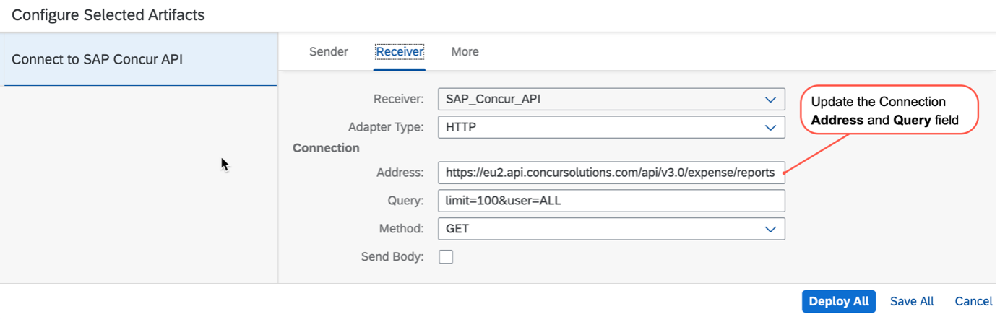
4. Change the Receiver to **SAP_Concur_Authentication**
   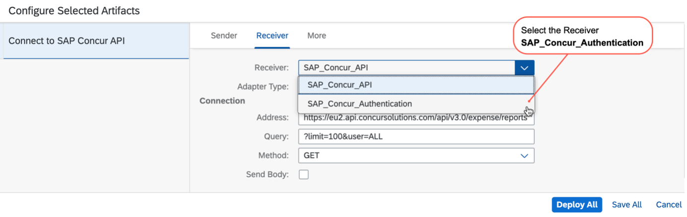
5. Enter the connection **Address** the concur **OAuth Token URL.**
   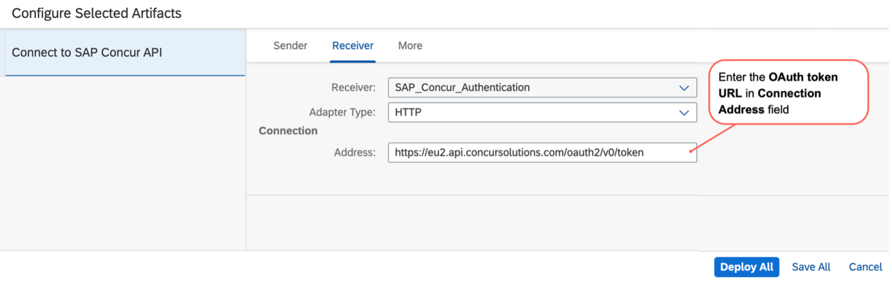
6. Now check the **More** Tab and the Concur **Credential Secret** which you have already created and enter the **Refesh token** which you already have from the **SAP Concur API Reference.**
   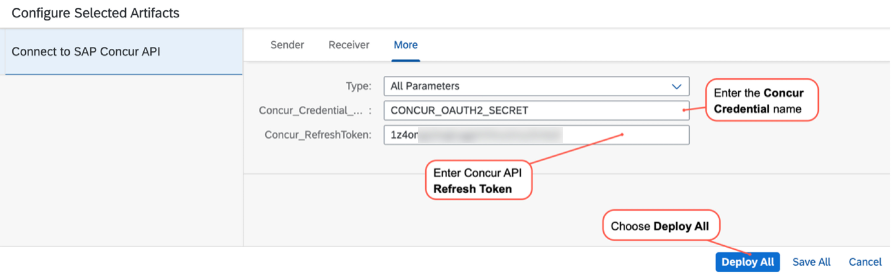

### Add Integration Flow

1. Go to your SAP Integration Suite tenant. Select **Design -> Integrations**. Navigate to **Artifacts** tab of the newly created integration package. Select **Add** and select **Integration Flow** from the drop-down menu.
   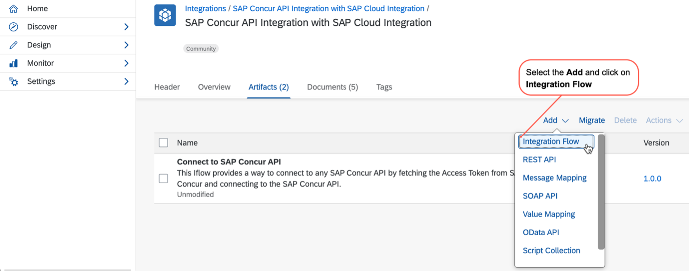
2. You can provide a Name for your Integration flow in the Add Integration Flow dialog. Enter **Consume SAP Concur API** in the **Name** field and select **OK**.
   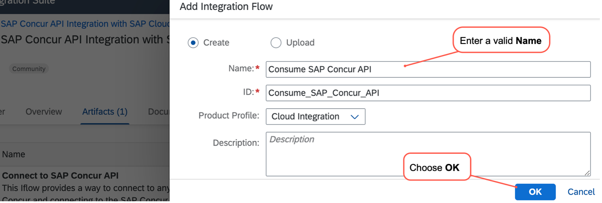
3. Select the newly created Integration flow named **Consume SAP Concur API**
   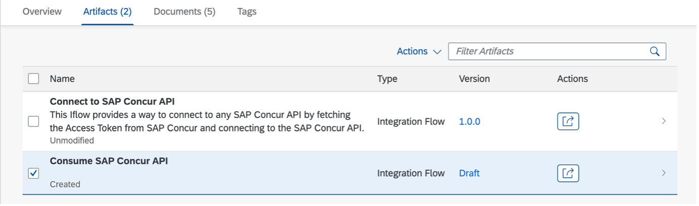
4. and then select **Edit** to start editing the integration flow.
   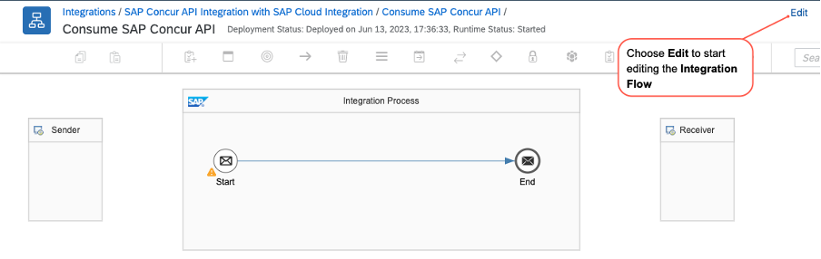
5. Since a timer-based integration flow will be used the default start message and Sender can be deleted. 
   1. Select the default **Sender** and select **Delete** 
   2. Select the default **Start** message and select **Delete** icon.
   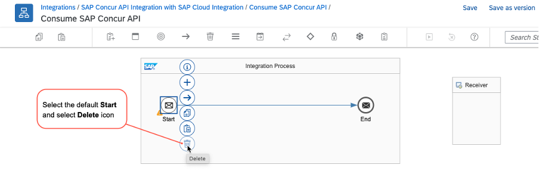
6. Select and add the **Timer** integration step. The default property of timer integration step is to execute the integration flow immediately after you deploy the integration flow. More about the available timer configurations is available in [help documentation](https://help.sap.com/viewer/368c481cd6954bdfa5d0435479fd4eaf/Cloud/en-US/ae14ad7916c04ecbaba3d26e2404410a.html).
   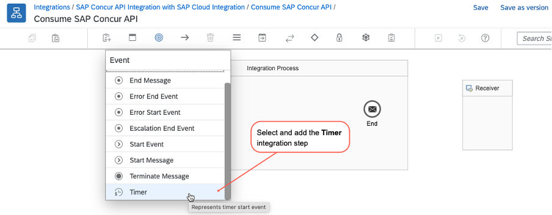
   
   It should be used as a subprocess integration flow that is called by another Integration flow on the SAP Cloud integration to retrieve data from any SAP Concur API with a GET request.

7. To establish inter-communication between integration flows we can use the Request Reply integration pattern with an ProcessDirect adapter. Search and Select Request Reply from integration palette and drop it into Integration Process.

   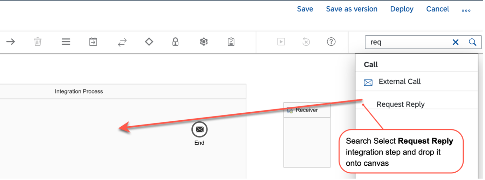

   - Change the name of Request Reply step to **Get Expense Report** in the General tab to improve readability.
   - Select and connect the **Get Expense Report** integration step to the Receiver. 
   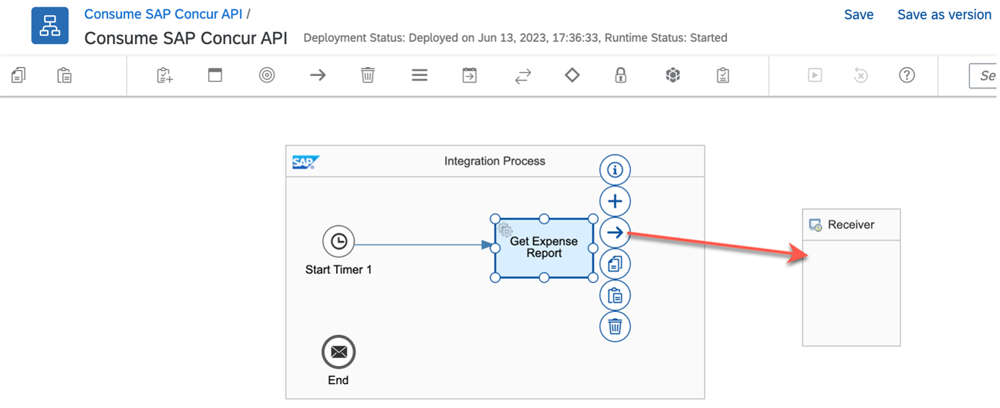
8.  This would open the Adapter list. From the available Adapter select **ProcessDirect** in the Adapter Type option dialog.
    The Integration Flow which we have copied from the **Catalog** is a **Consumer Integration Flow** using ProcessDirect adapter you can consume it from other integration flow.
   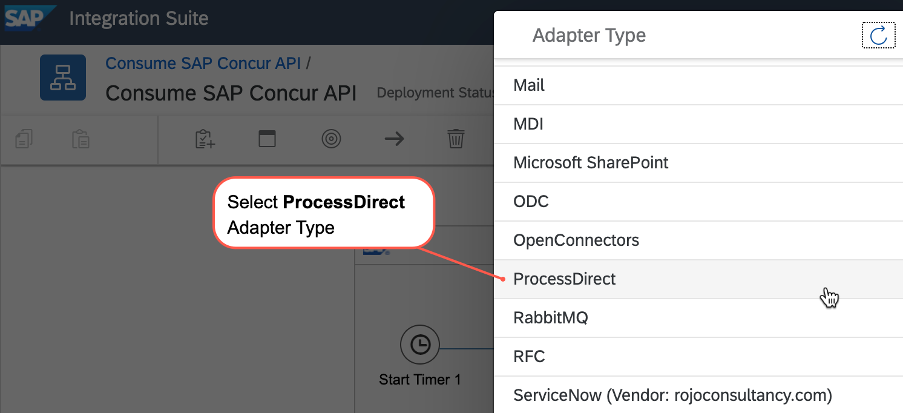
9.  Under the Connection tab, enter Address as **/Concur/API**.
    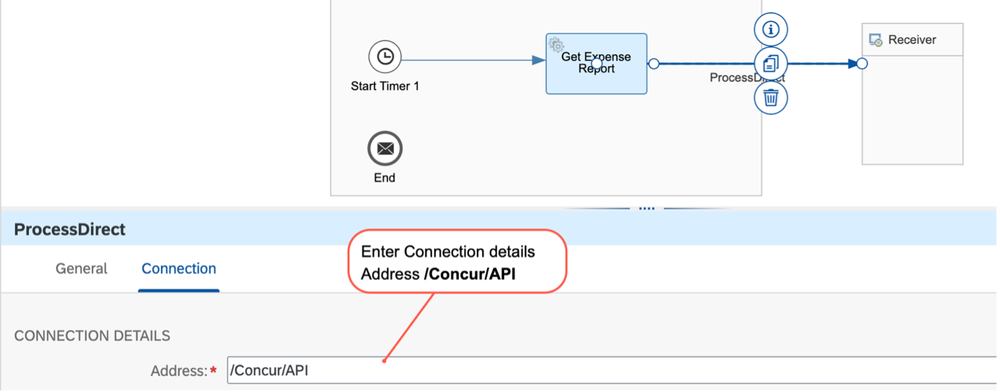
10.  Search and Select Groovy Script from integration palette and drop it into Integration Process canvas.
    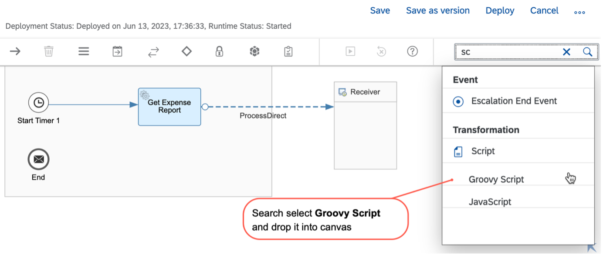
11.  Select the Groovy Script 1 Integration flow step and select the Create script icon.
    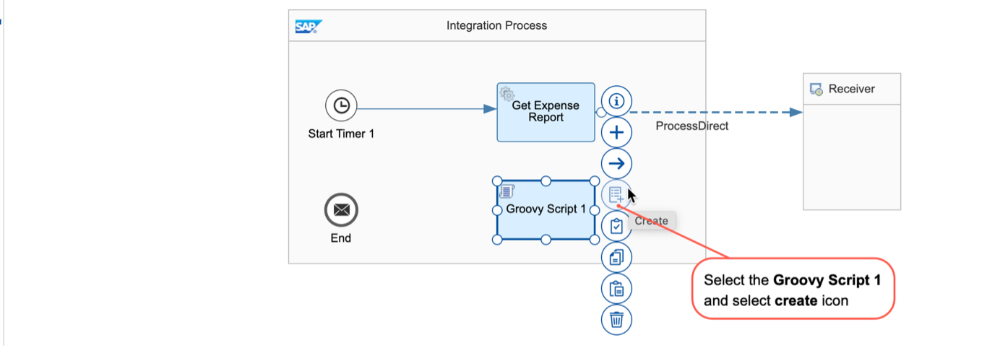

12. In the **script editor**, you can specify the script according to the requirements of your scenario. For an overview of the classes and interfaces supported by the Script step, see [SDK API](https://help.sap.com/docs/cloud-integration/sap-cloud-integration/sdk-api). For more information on how to use the dedicated interfaces and methods for specific use cases, refer to [Script Use Cases](https://help.sap.com/docs/cloud-integration/sap-cloud-integration/script-use-cases).

This is the Groovy script you can use to push the message log to the Response Payload. **Copy** and **Paste** it to script editor. **Copy** & **Paste** it.

```

import com.sap.gateway.ip.core.customdev.util.Message;
import java.util.HashMap;
def Message processData(Message message) {
    def body = message.getBody(java.lang.String) as String;
    def messageLog = messageLogFactory.getMessageLog(message);
    
    if(messageLog != null){
        messageLog.addAttachmentAsString("ResponsePayload:", body, "text/xml");
     }
    return message;
}

```

When you’ve finished the definition of your script, click **OK**
    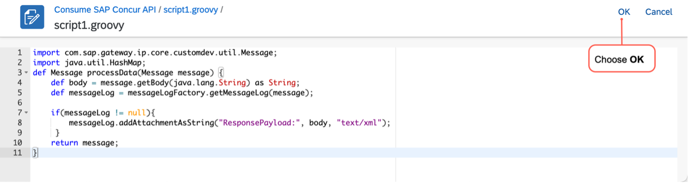
     
### Deploy & Monitor Integration Flow

1. Select **Save** and then select **Deploy** to deploy the integration flow to SAP Integration Suite tenant. This will trigger the deployment of your integration flow. Note, the first-time deployment might take some time before the changes are fully deployed.
   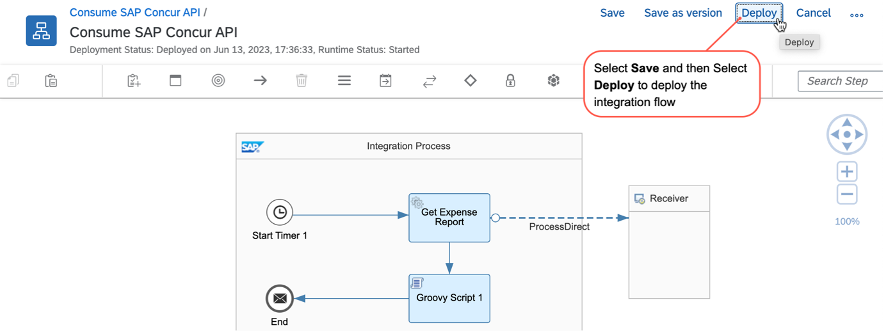
2. Navigate to **Monitor-> Integrations** tab to check the status of the deployed integration flow.
Since the integration flow was designed as a Run immediate timer-based integration the flow will be executed as soon as it deployed. Select **Completed Messages** tile to view the successfully executed integration flows. In case of any failure, it will appear under **Failed Messages**.
 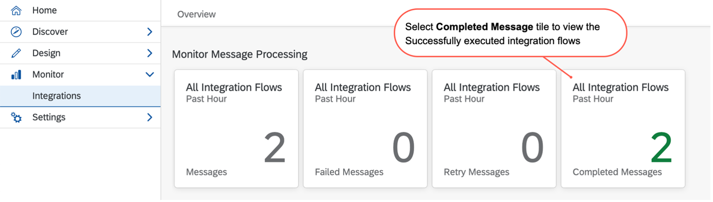


### Final Result

1. Check the status of the newly created integration flow from the **Monitor Message Processing**. If status changes to **Completed** then go the **Attachments** Tab and click on **Response Payload** attachment.
   

2. Payload able to show the Concur Expense Report API response. 
   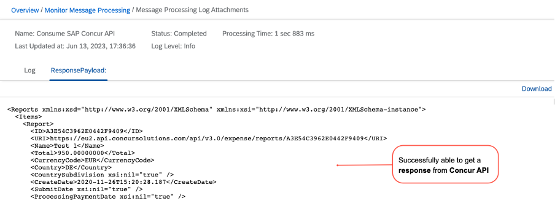

You have successfully completed the second tutorial of this tutorial group. Learn in the next tutorial how to push these expense report entries to the SAP Datasphere. 
