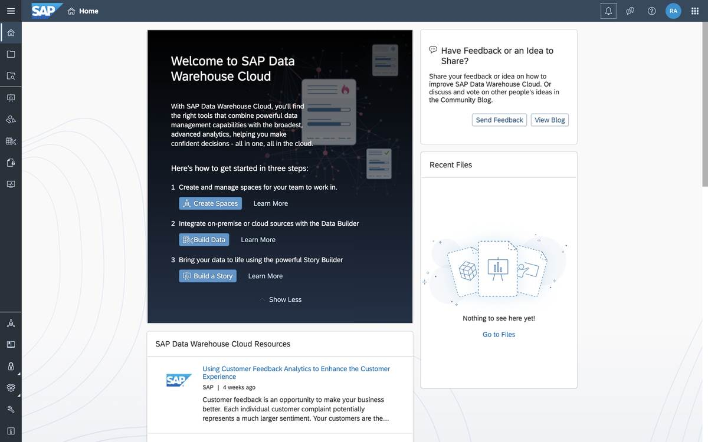
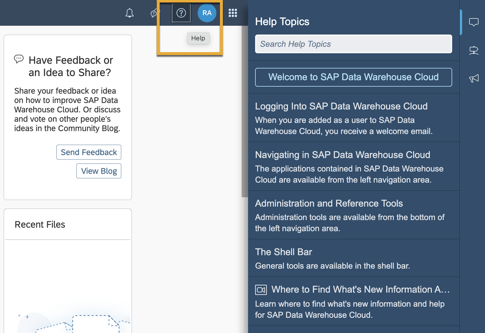
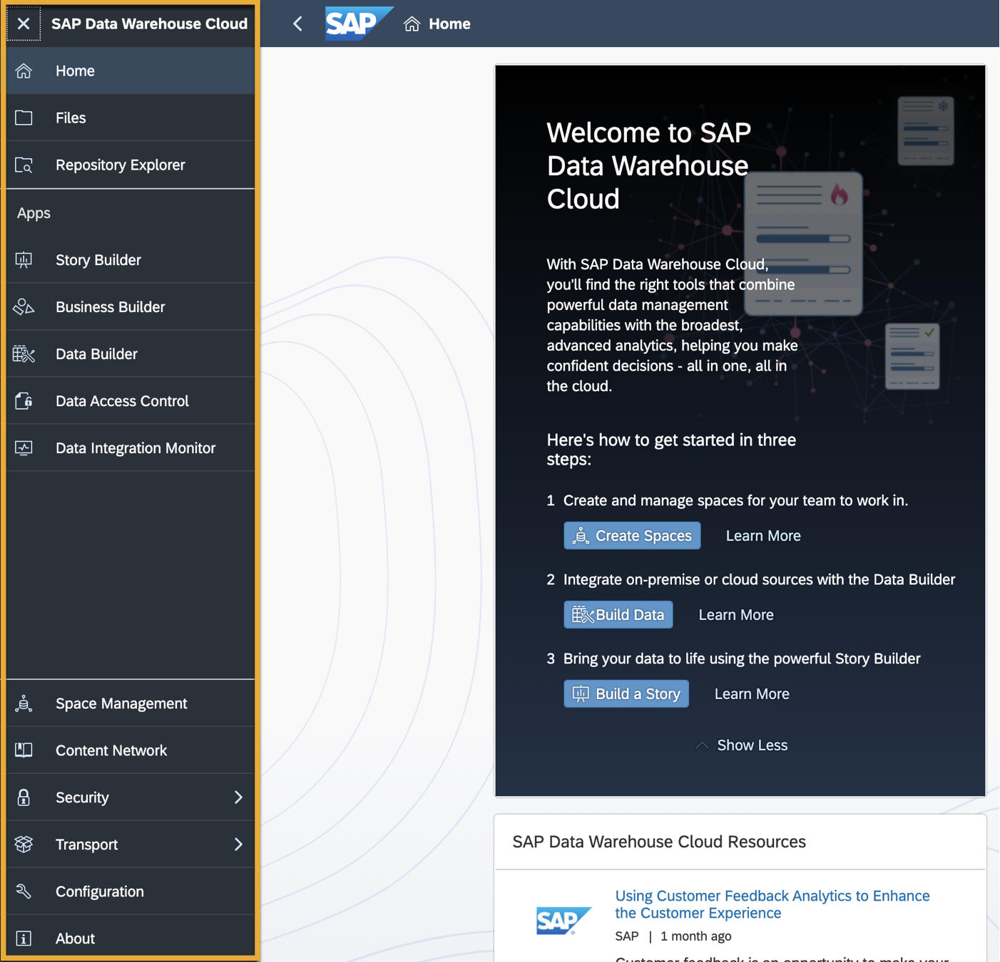

# Get to Know the SAP Data Warehouse Cloud Interface
<!-- description --> Familiarize yourself with the interface of SAP Data Warehouse Cloud

## Prerequisites
 - You have [signed up for a free SAP Data Warehouse Cloud Trial.](data-warehouse-cloud-1-begin-trial)

## You will learn
  -	How to navigate the user interface of SAP Data Warehouse Cloud
  - What the home screen controls can do for you

  You can also follow the steps in this tutorial by watching this video

  <iframe width="560" height="315" src="https://www.youtube.com/embed/rBHXzCmyYc0" title="YouTube video player" frameborder="0" allow="accelerometer; autoplay; clipboard-write; encrypted-media; gyroscope; picture-in-picture" allowfullscreen></iframe>

---

### Get to know the home page

Welcome to the home page in SAP Data Warehouse Cloud. This is where you land on signing into your SAP Data Warehouse Cloud tenant. In the center of your screen, you can see quick shortcuts to create a Space, and to build data. You can also see recently published resources and blogs relevant to SAP Data Warehouse Cloud.

### Find the help button

The top right of your interface consists of a help button to help you when you're stuck. This is where you can find links to quick tutorials, the help page, as well as videos. You can also browse the SAP Data Warehouse Cloud community, get in touch with experts. Finally, you can give us your valuable feedback.

### Meet the control icons

The top left of your interface has a hamburger icon which expands all the buttons leading to every feature in SAP Data Warehouse Cloud. This is where you access all the functionalities required to get started with modelling your data in SAP Data Warehouse Cloud.

### Find further help and documentation

Need further info?

Check out the SAP Data Warehouse Cloud [product page](https://www.sap.com/products/data-warehouse-cloud.html) and [events page](https://www.sap.com/products/data-warehouse-cloud/events.html).

You can find the complete technical documentation of SAP Data Warehouse Cloud by following [this link](https://help.sap.com/viewer/product/SAP_DATA_WAREHOUSE_CLOUD/cloud/en-US).

Explore all SAP Data Warehouse Cloud tutorials [here](https://developers.sap.com/tutorial-navigator.html?tag=products:technology-platform/sap-data-warehouse-cloud).

Follow the SAP Data Warehouse Cloud tag in the SAP Community to hear the latest news and ask questions from experts.

Now that you're familiar with the overview of SAP Data Warehouse Cloud, you are ready to get hands-on!

### Test yourself

---
