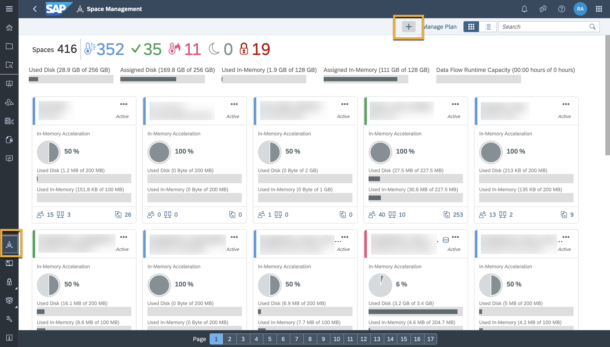
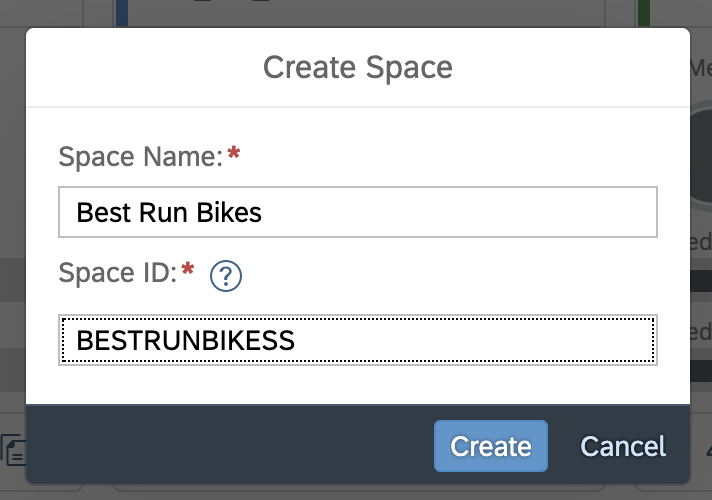
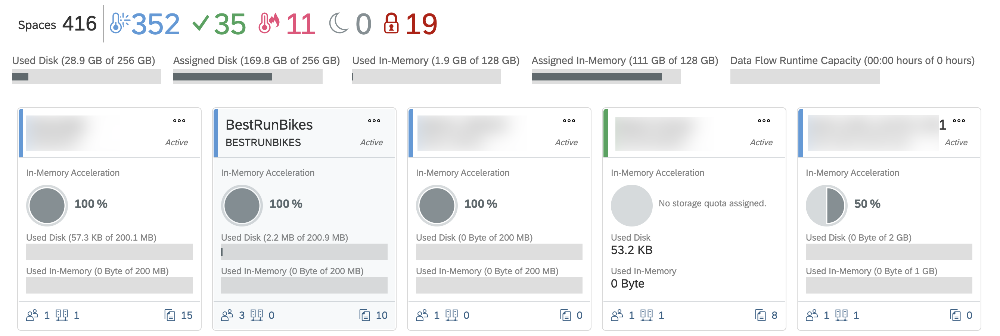
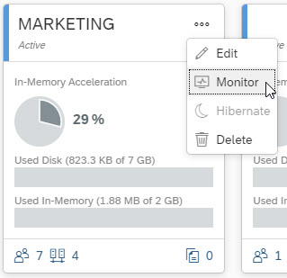
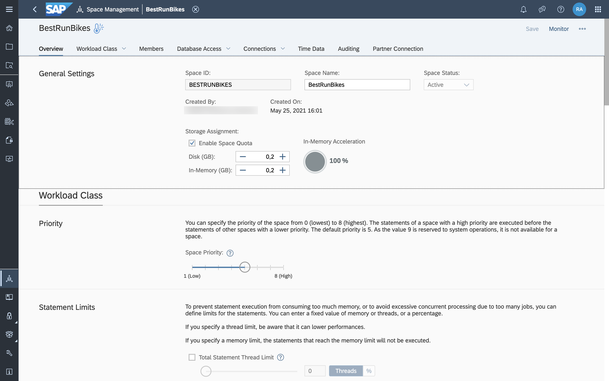
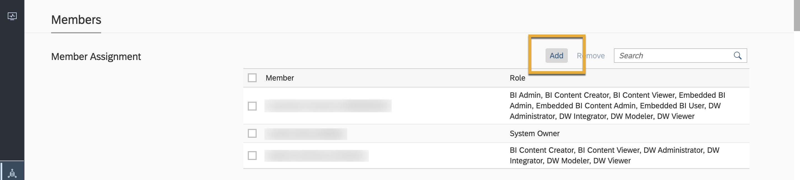
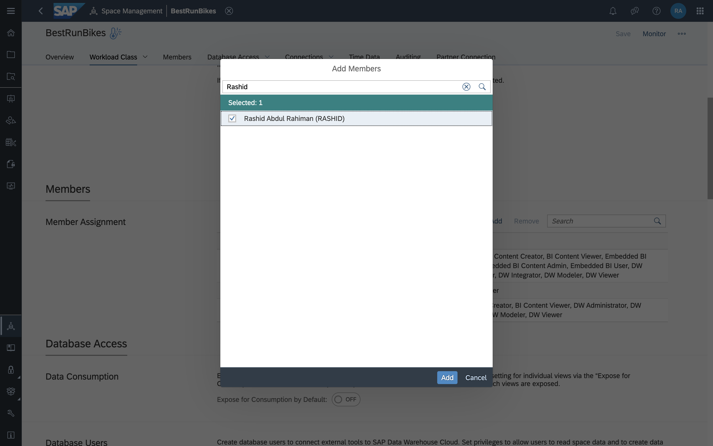
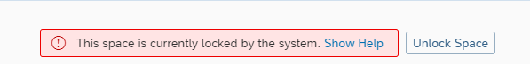

# Create and Monitor a Space in SAP Data Warehouse Cloud
<!-- description --> In this tutorial, learn how to create and monitor a Space. This is where you and your team will work towards fulfilling your objective with SAP Data Warehouse Cloud.

## Prerequisites
 - You have [familiarised yourself with the SAP Data Warehouse Cloud interface.](data-warehouse-cloud-2-interface)

## You will learn
  - How to create a Space
  - How to manage and monitor your Space

  You can also follow the steps in this tutorial by watching this video

  <iframe width="560" height="315" src="https://www.youtube.com/embed/sOFzqSZy5UI" title="YouTube video player" frameborder="0" allow="accelerometer; autoplay; clipboard-write; encrypted-media; gyroscope; picture-in-picture" allowfullscreen></iframe>

---

### Create a Space

1.	To create a Space, click on the Space management icon on the bottom left, and click on the plus symbol on the top right.

    

2.	Enter a name for your Space. The Space ID will auto populate. In this example, let's call our Space **Best Run Bikes**.

    

3.	Click on **Create**, and you've successfully created your Space in SAP Data Warehouse Cloud.

### Monitor your Space

In the **Space Management** screen, each Space is represented by a tile. The Spaces tiles can show a red, green, or blue colour table.

  -	Green Spaces are performing optimally.

  -	Red Spaces are overactive and need more resources allocated to perform optimally.

  -	Blue Spaces are under active.

Some resources that aren't being used by a blue Space could be reallocated to a red Space, for example. You also have the option to monitor a Space and see detailed information about disk use and in memory usage. This is done by clicking on the three dots next to your Space name.

Space monitoring allows the administrator to keep an eye on their Space.

Click your Space or click the monitoring button on the upper right side of your Space in Space Management to open the monitoring page.

On the monitoring screen, you can perform the following features:

- See used disk and in-memory storage of your Space.

- Track your data flow capacity units that have been assigned to your Space.

- Filter by schema or by storage type. Filter values by adding or removing them from the drop-down menu. The values are displayed in a doughnut and bar chart. The hidden replica tables of virtual tables in the SAP HANA Cloud, SAP HANA database are stored in a separate schema named `_SYS_TABLE_REPLICA_DATA`.

- The table storage consumption graph displays all the relevant tables according to your selected filter which makes it easy to get an overview over the consumed storage.

- Table details provides more information such as the name, schema, storage type, record count, and the used storage of each table. Sort your list of tables in ascending, descending order or group them together as well as search for certain values.

To see an overview of your Space settings, simply select the Space, and this takes you to the overview, where you can monitor your Space and see a more detailed view of the same. You can fine tune your disk-Space and memory allocations as per your requirements if you wish. For this example, use the minimum configuration.

Now that you've created your Space, you can now move ahead and assign users to your Space.

### Add users into your Space

1.	Once in your Space, click on the Members tab. You can also alternatively scroll down to the members heading.
2.	Click on **Add** to allocate a member from your user list.

    

3.	You can now select the users you'd like to add to your Space by checking them off. When you're happy with your choices, click on **Add** to confirm. Don't forget to add yourself as a user!

You have successfully added your team members as users into your Space.

### Responding to a locked Space

When a Space exceeds its quota, it will eventually get locked. You'll see it in Space Management. After you receive an alert that your Space is about to be locked, you should take immediate action to ensure that you can continue working in the Space.

When the Space is locked, operations like uploading data, creating a new user, creating a new connection, new model, or Open SQL Schema, are not possible. Also any operations in the data or business builder using this particular Space are also not possible.

When you click **Unlock Space**, you have 24 hours in which you can delete unwanted data or increase the increase the Space's quota. If you do not take action, the Space remains locked.

It is hence important to manage your Spaces well in order to ensure a smooth experience for you and your team with SAP Data Warehouse Cloud.

> **Well done!**

> You have completed this tutorial. Now you know how to create and monitor Spaces in SAP Data Warehouse Cloud.

### Test yourself

---
