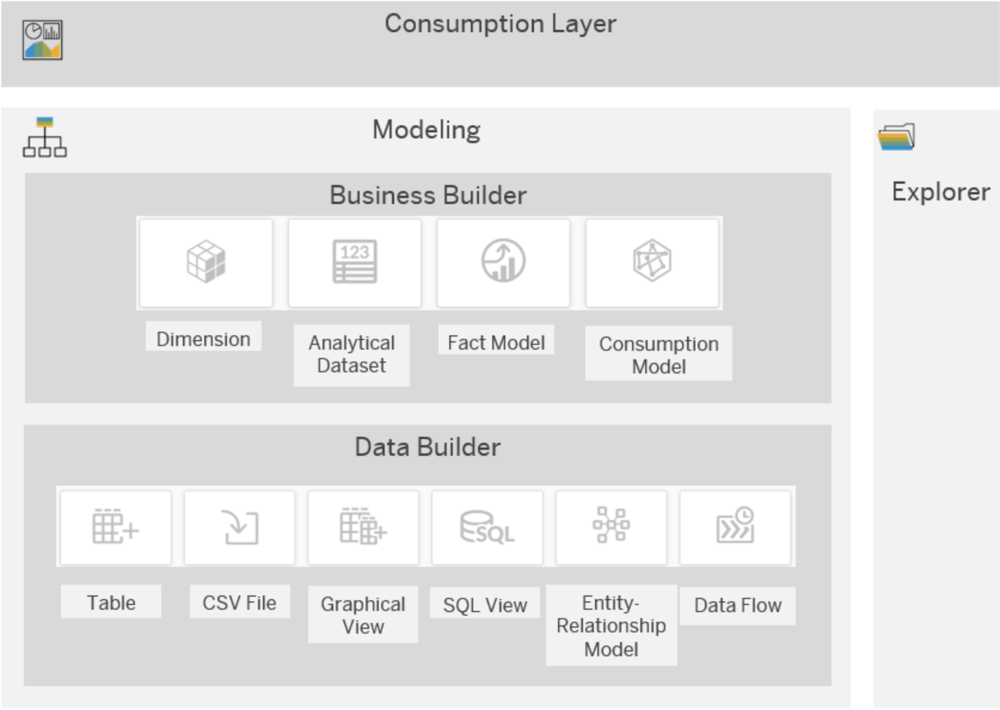
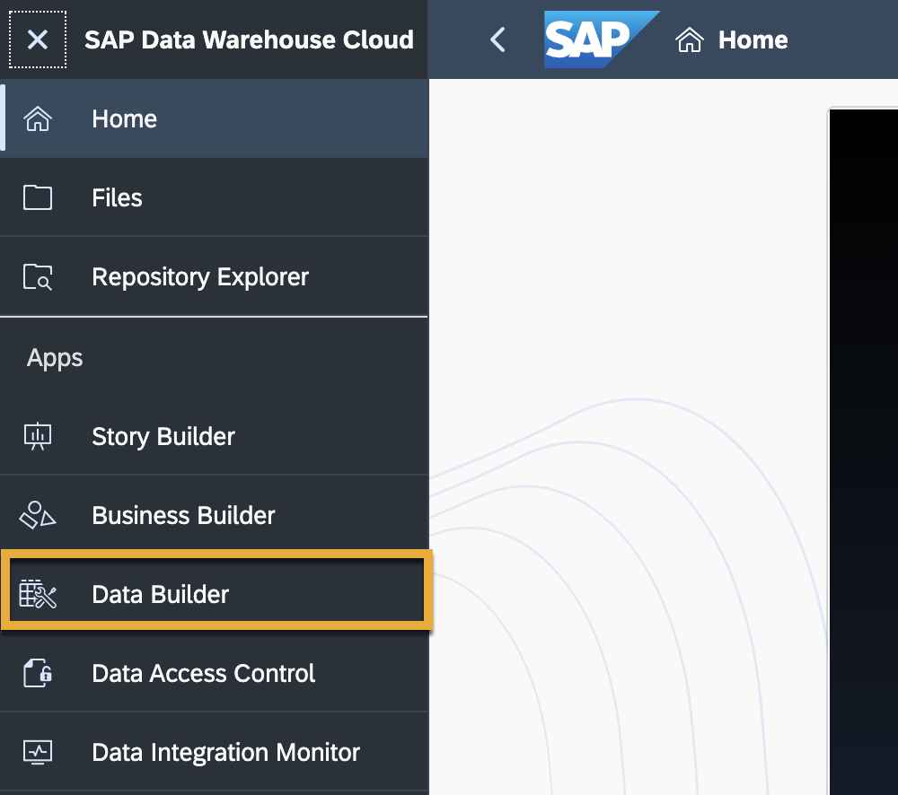
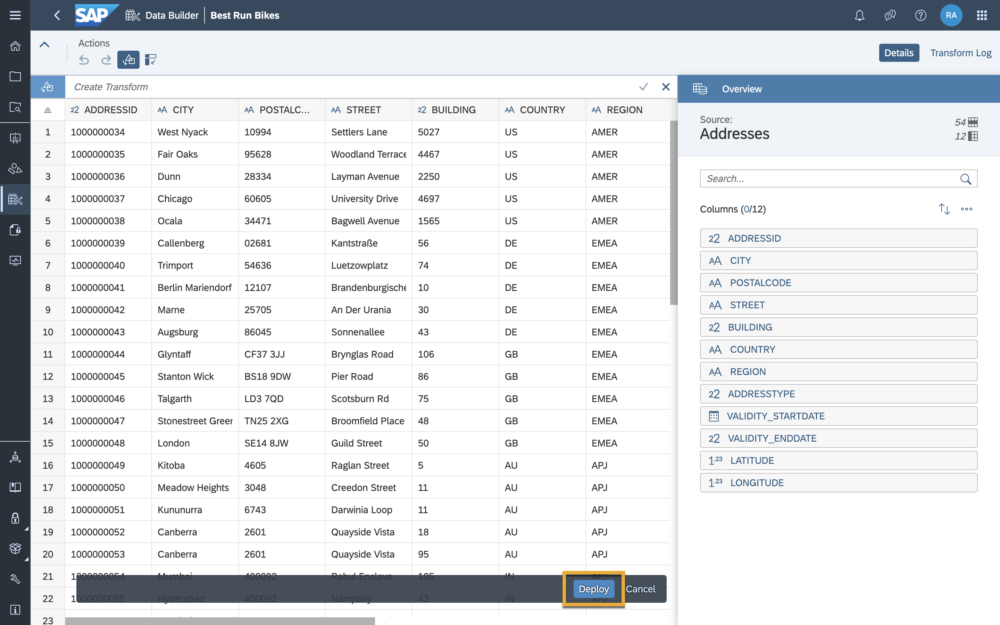

# Import a Dataset into SAP Data Warehouse Cloud
<!-- description --> One way to bring data into SAP Data Warehouse Cloud is by importing flat files. A flat file is a file that does not contain links to other files or is a non-relational database. It stands on its own, for instance, like a single text-only file. The most common flat files are .txt and .csv files.

## Prerequisites
- You have [added users into your Space.](data-warehouse-cloud-3-add-users)
- You have [created your space in SAP Data Warehouse Cloud.](data-warehouse-cloud-4-spaces)
- You have [assigned relevant roles to your added users.](data-warehouse-cloud-3-add-users)

## You will learn
  - How to use the Data Builder
  - How to import multiple datasets into your Space
  - Which connections are supported in SAP Data Warehouse Cloud

  This tutorial is part of a mission, in which you try to help Best Run Bikes to to get a holistic view of their sales data by using the power of SAP Data Warehouse Cloud. You will get the sales data of Best Run Bikes and it is your mission to use the features of SAP Data Warehouse Cloud to help the bike suppliers make the best possible business decisions.

  This mission consists of 8 modules that contain the necessary steps you need to follow in your mission to help Best Run Bikes:

  1. [Sign up for trial.](data-warehouse-cloud-1-begin-trial)
  2. [Get to know the SAP Data Warehouse Cloud interface](data-warehouse-cloud-2-interface)
  3. [Add users and assign roles](data-warehouse-cloud-3-add-users)
  4. [Create your Space](data-warehouse-cloud-4-spaces)
  5. **You are here ->** [Import your datasets](data-warehouse-cloud-5-import-dataset)
  6. [Create an entity relationship model](data-warehouse-cloud-6-entityrelationship-model)
  7. [Create a graphical view model](data-warehouse-cloud-7-graphicalview)
  8. [Define measures, business semantics and preview your data](data-warehouse-cloud-8-define-measures)

  You can also follow the steps in this tutorial by watching this video

  <iframe width="560" height="315" src="https://www.youtube.com/embed/36Gs4YZyQeY" title="YouTube video player" frameborder="0" allow="accelerometer; autoplay; clipboard-write; encrypted-media; gyroscope; picture-in-picture" allowfullscreen></iframe>

---

### Get to know the Data Builder

SAP Data Warehouse Cloud has two modelling layers tailored for different user groups: the data layer is the area where data engineers can create their models with a technical approach, whereas the business layer is the area for business users who create their models using a more semantic approach. This allows business users to work independently from data engineers, while still being able to collaborate and share data with them.

<!-- border -->

To access the Data Builder, simply click on the Data Builder icon on the left-hand side menu of SAP Data Warehouse Cloud.

### Import CSV files

Now it's time to import the CSV files from the Best Run Bikes scenario, so you can get active with SAP Data Warehouse Cloud.

1.	Simply click on the import CSV icon as shown in the image below.

2.	Then, select your source file from your system.
3.	Quickly review your data and then click deploy once done.
4.	Give the table a business name and then wait whilst the table is deployed.
5.	You can then add in your remaining CSV files by repeating the process.

### Check the supported connections in SAP Data Warehouse Cloud

There are also other ways to bring in your data into your system. SAP Data Warehouse Cloud supports a wide range of connections to data sources. These can be connected in the **Connections** tab of your Space properties page. These include:

- `Adverity`
- `Amazon Athena`
- `Amazon Redshift`
- `Amazon Simple Storage Service`
- `Cloud Data Integration`
- `Generic JDBC`
- `Generic OData`
- `Google BigQuery`
- `Google Cloud Storage`
- `Hadoop Distributed File System`
- `Microsoft Azure Data Lake Store Gen1`
- `Microsoft Azure Data Lake Store Gen2`
- `Microsoft Azure SQL Database`
- `Microsoft SQL Server`
- `Oracle`
- `SAP ABAP`
- `SAP BW`
- `SAP BW/4HANA Model Transfer`
- `SAP ECC`
- `SAP Fieldglass`
- `SAP HANA`
- `SAP Marketing Cloud`
- `SAP S/4HANA Cloud`
- `SAP S/4HANA On-Premise`
- `SAP SuccessFactors for Analytical Dashboards`

More information on the capabilities of these connections can be found in the [SAP Data Warehouse Cloud Connections Help Portal](https://help.sap.com/viewer/9f804b8efa8043539289f42f372c4862/cloud/en-US/eb85e157ab654152bd68a8714036e463.html).

---
