# Create a Graphical View in SAP Data Warehouse Cloud
<!-- description --> With SAP Data Warehouse Cloud, you can use a graphical interface to create data views. You can drag and drop sources, join them as appropriate, add other operators to transform your data, and specify measures and other aspects of your output structure in the output node.

## Prerequisites
 - You have [imported your dataset into your Space.](data-warehouse-cloud-5-import-dataset)

## You will learn
  - What graphical views are
  - How to create a graphical view
  - How to rename columns in your graphical view
  - How to restore columns in your graphical view
  - How to deploy a graphical view

  This tutorial is part of a mission, in which you try to help Best Run Bikes to to get a holistic view of their sales data by using the power of SAP Data Warehouse Cloud. You will get the sales data of Best Run Bikes and it is your mission to use the features of SAP Data Warehouse Cloud to help the bike suppliers make the best possible business decisions.

  This mission consists of 8 modules that contain the necessary steps you need to follow in your mission to help Best Run Bikes:

  1. [Sign up for trial.](data-warehouse-cloud-1-begin-trial)
  2. [Get to know the SAP Data Warehouse Cloud interface](data-warehouse-cloud-2-interface)
  3. [Add users and assign roles](data-warehouse-cloud-3-add-users)
  4. [Create your Space](data-warehouse-cloud-4-spaces)
  5. [Import your datasets](data-warehouse-cloud-5-import-dataset)
  6. [Create an entity relationship model](data-warehouse-cloud-6-entityrelationship-model)
  7. **You are here ->** [Create a graphical view model](data-warehouse-cloud-7-graphicalview)
  8. [Define measures, business semantics and preview your data](data-warehouse-cloud-8-define-measures)

  You can also follow the steps in this tutorial by watching this video

  <iframe width="560" height="315" src="https://www.youtube.com/embed/3VsItY2E9bw" title="YouTube video player" frameborder="0" allow="accelerometer; autoplay; clipboard-write; encrypted-media; gyroscope; picture-in-picture" allowfullscreen></iframe>

---

### Get to know the graphical views

In SAP Data Warehouse Cloud, you can use the graphical view builder to easily create data views. This allows you to work intuitively without having to be familiar with SQL statements.

In the graphical view builder, you have many resources to model your data, combine them from many sources and assigning business semantics that make your output easier to understand. Here is an example of a graphical view modelled in SAP Data Warehouse Cloud.

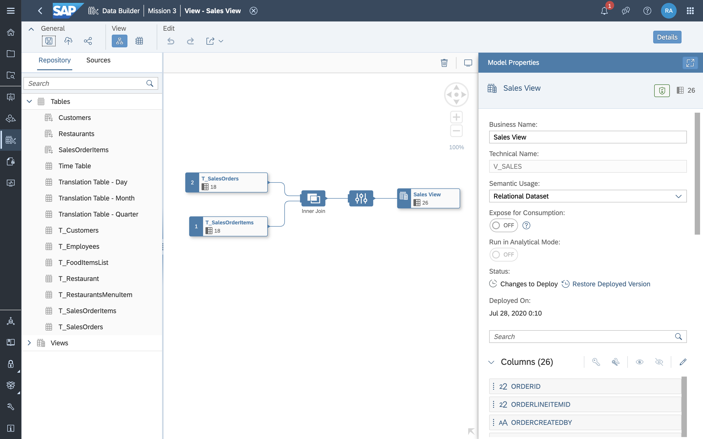

>
If you are comfortable writing SQL code or want to use SQL Script to create your view, you can use the SQL View editor.

### Create a graphical view

1.	Go to the **Data Builder** and click on the **New Graphical View** button.

    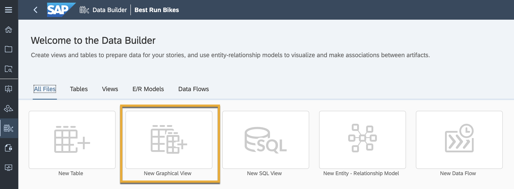

2.	Now that you are in the graphical model builder, it's time to find the data. As you imported CSV files, your data is under Repository, on the top right-hand side of the screen.

    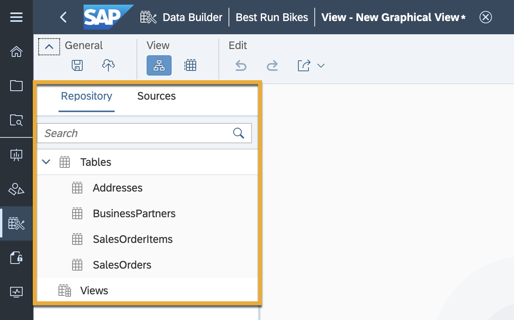

3.	To start building your model, click and drag the `SalesOrders` table onto the canvas.

    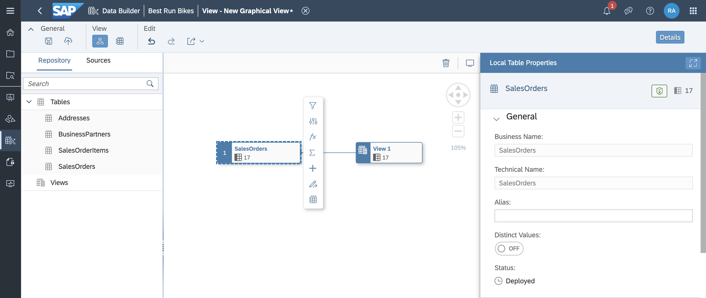

4.	As you can see, an output node appears on the canvas as soon as your drop your table in it. The output node is where all of our join table information will appear once you've completed the model.
5.	Click on the output node and then click on the data preview button to see a preview of the sales orders data.

    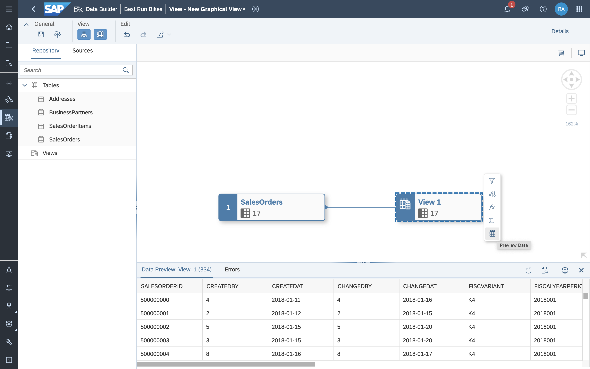

6.	Next, drag the table `SalesOrderItems` on top of the `SalesOrders` table to join the two tables. The icon that has appeared is our join node called Join One. The column `SalesOrderID` from both tables is automatically joined based on entity-relationship model.

    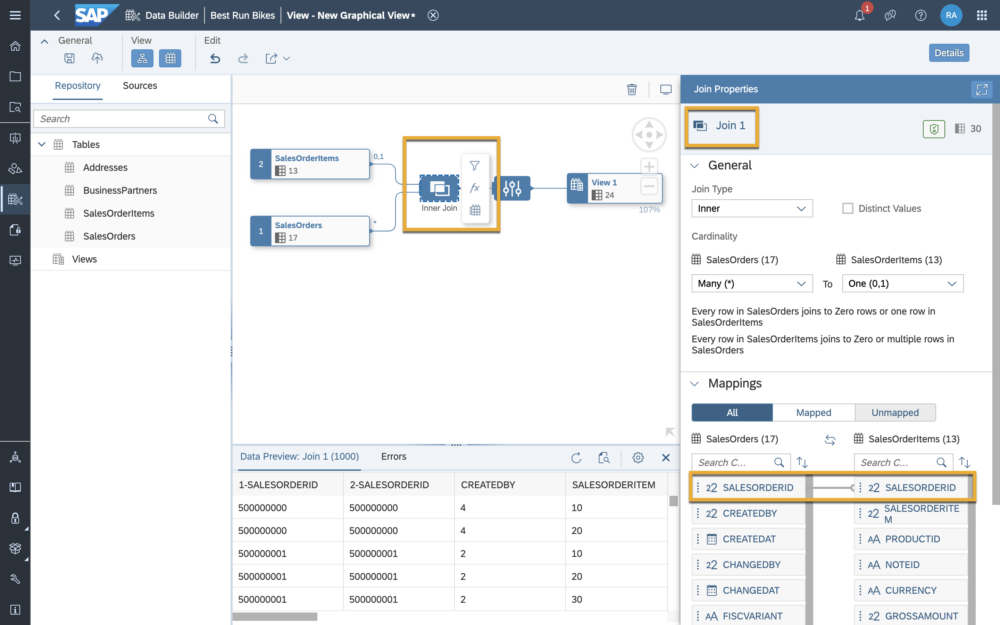

7.	Now drag in the `BusinessPartners` table. We'll go ahead and join it to the `SalesOrders` table. The column `Partner ID` from each table will join automatically, but if you want to double check, look at the join properties panel.

    <!-- border -->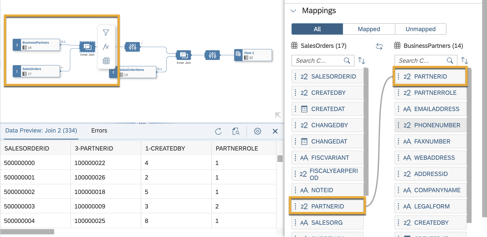

8.	If an alert has popped up on the Join 2 node, click on the join and make sure the `PartnerID` column from both tables is connected.

9.	Next, join the `Addresses` table to your `BusinessPartners` table. These `AddressID` will automatically be mapped based on the association in the entity relationship model.

    <!-- border -->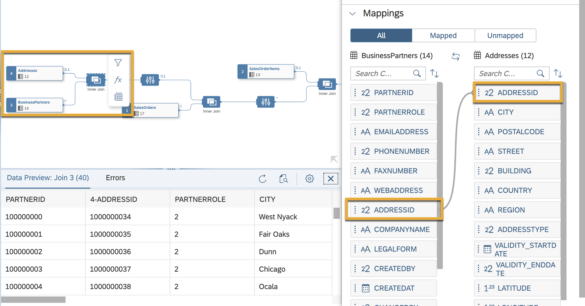

Now you've joined all the tables for this mission.

### Rename and restore columns

With the graphical view in place, rename some columns to help others understand better what the data is about. Rename the `Grossamount` column from the `SalesOrders` table and from the `SalesOrderItems` table so you can tell them apart.

1.	To do this, click on the projection one node immediately on the right-side of the output node.

    <!-- border -->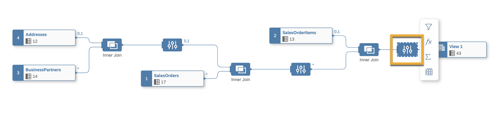

2.	Search for the `GrossAmount` column in the projection properties panel.

    

3.	If one of the columns is greyed out, this means the column has been automatically removed. Click on the dots next to it and select **Restore column**.

    <!-- border -->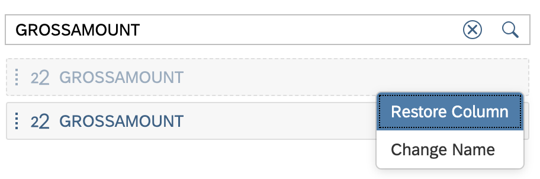

4.	Next, click on the column name. On the canvas, you will see a highlight that shows you exactly where the column originates from.

5.	Rename the `GrossAmount` column originating from the `SalesOrderItems` table to `GrossAmount_items`.

    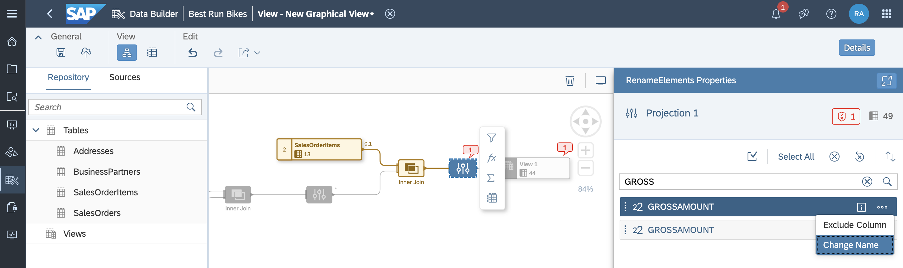

6.	Then rename the `GrossAmount` column originating from the `SalesOrders` table to `GrossAmount_orders`.

    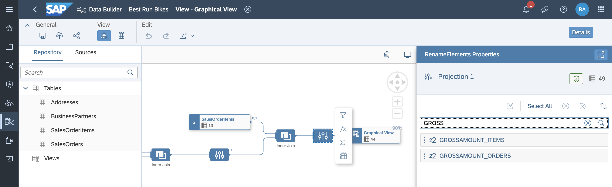

### Save and deploy

You have successfully created your graphical view. It is now extremely important to first save, and then deploy your view. When you save an object, it is stored in the SAP Data Warehouse Cloud repository, which contains the design-time definitions of all your objects. When you deploy an object, you are creating a run-time version for use in the SAP Data Warehouse Cloud database.

Click on the save icon on the top left and give your graphical view an appropriate name.

Once done, click on the deploy icon next to the save icon to deploy your model.

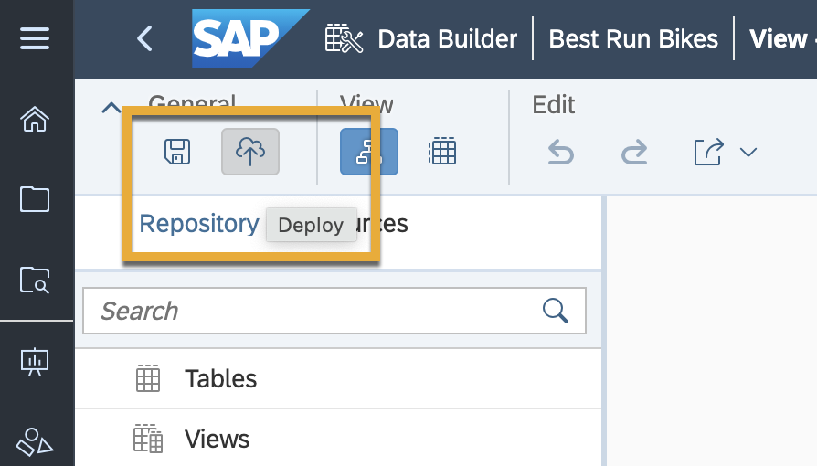

---
