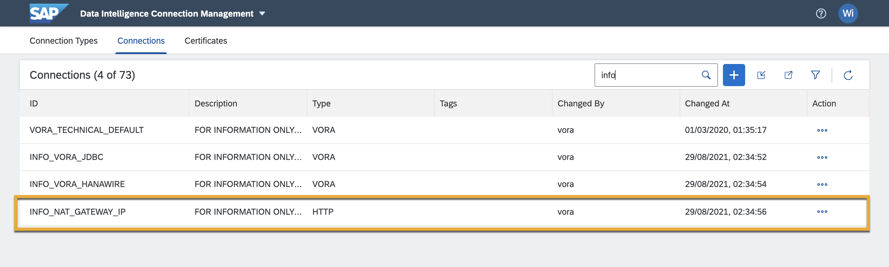
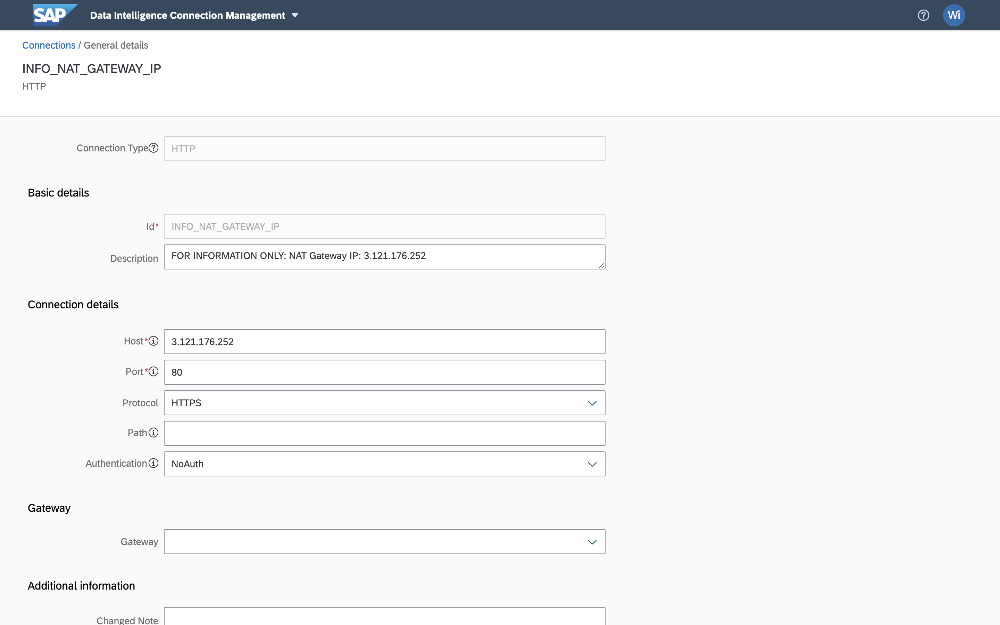
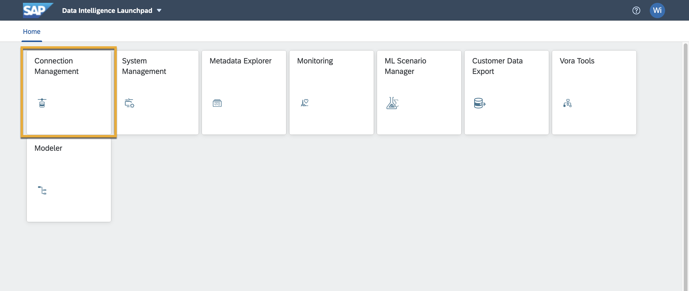
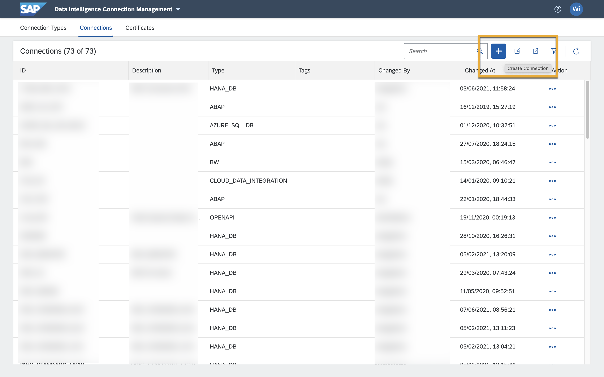
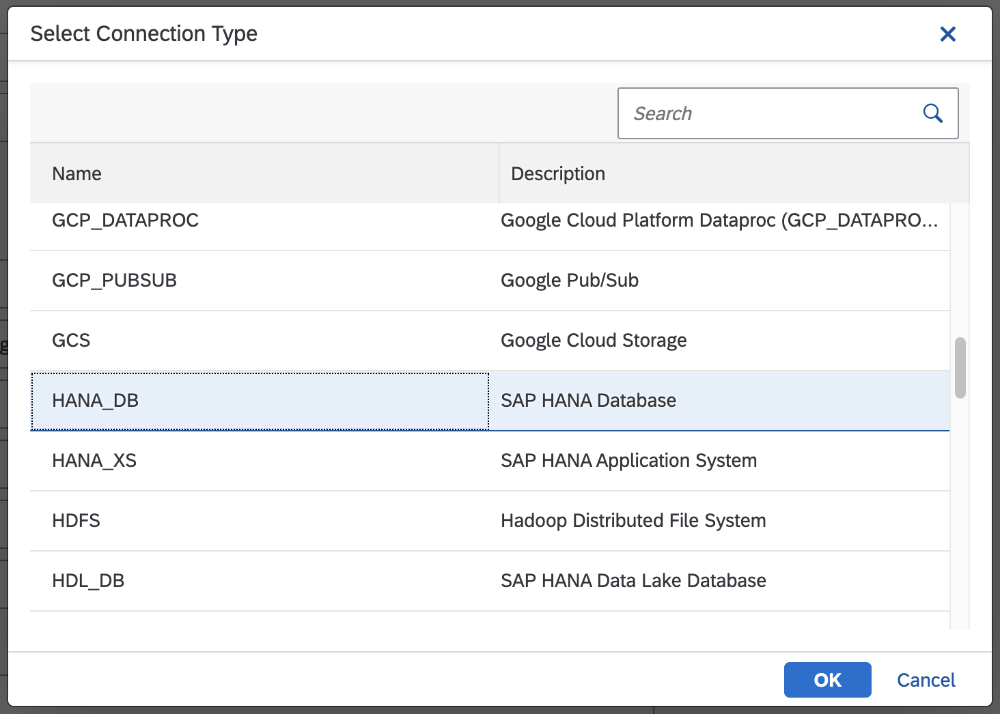
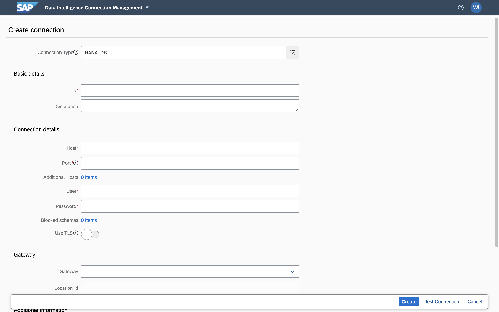
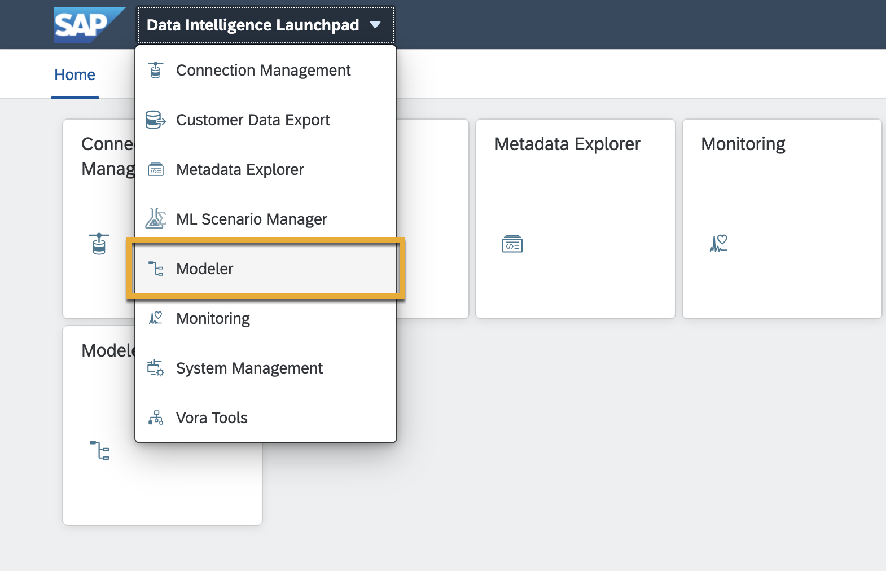
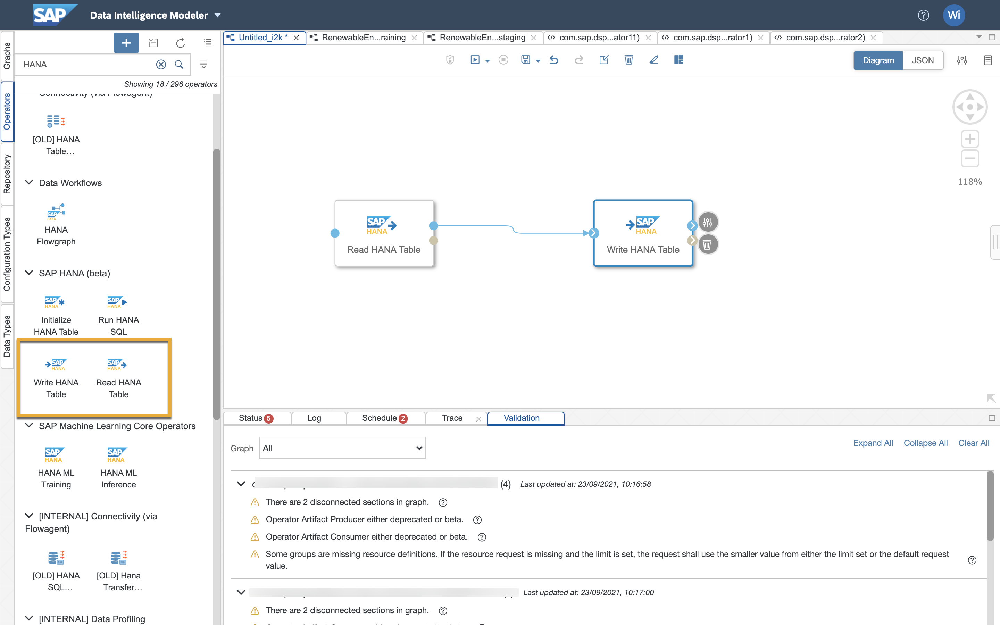
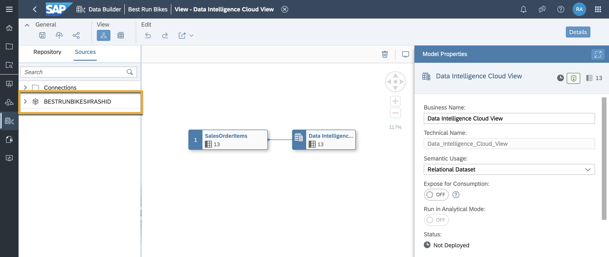

# Connect SAP Data Intelligence Cloud to SAP Data Warehouse Cloud
<!-- description --> SAP Data Warehouse Cloud and SAP Data Intelligence Cloud work together to provide a full data integration platform with machine learning capabilities, data discovery features and automated processing capabilities. Learn how to connect SAP Data Intelligence Cloud to SAP Data Warehouse Cloud in this tutorial.

## Prerequisites
  - You have [created a database user in your Space with both reading and writing capabilities.](data-warehouse-cloud-intro8-create-databaseuser)

## You will learn
  - How to connect SAP Data Intelligence Cloud to SAP Data Warehouse Cloud

---

### Add IP address to IP allowlist in SAP Data Warehouse Cloud

To allow SAP Data Intelligence Cloud to connect to the database of SAP Data Warehouse Cloud, you need to add the external (public) IPv4 address of the client to an allowlist in SAP Data Warehouse Cloud.

To do so, navigate to the **Configuration** screen on the bottom left of your SAP Data Warehouse Cloud tenant. Here, you can find the **IP Allowlist** tab, where you can simply click on **Add** and enter the IPv4 address of your system to add it to the allowlist.

  

> You can find the external IP address in the **Description** field of the read-only connection with the id `INFO_NAT_GATEWAY_IP` in the **Connection Management** application of SAP Data Intelligence Cloud.

  <!-- border -->
  <!-- border -->

### Establish connection to SAP HANA in SAP Data Intelligence Cloud

SAP Data Intelligence Cloud requires that you create a connection to ingest the data and another connection to write the data back into SAP Data Warehouse Cloud. Essentially, you are bringing data from a Space in SAP Data Warehouse Cloud into SAP Data Intelligence Cloud, where you can leverage the pipe lining and automated processing capabilities, and then putting the data back into a Space in SAP Data Warehouse Cloud.

This requires that you have a database user created in both your reading and writing Spaces in SAP Data Warehouse Cloud.

After creating your database users, proceed with the following steps to create a connection to ingest the data in SAP Data Intelligence Cloud.

1.	On your SAP Data Intelligence Cloud home screen, click on **Connection Management**.

    

2.	Click on the **+** icon to create a connection.

    <!-- border -->

3.	Select `HANA_DB` to create a connection to the SAP HANA database.

    

4.	Enter the credentials of the database user you have created in your reading Space, and click on **Create** to create the connection.

    <!-- border -->

This connection can now act as your means of reading the data.

Simply follow the same steps but with the credentials of the database user from your writing Space to create a connection that writes the processed data back into SAP Data Warehouse Cloud.

### Leverage connection and create data model

With the connection now firmly established, you can create your data model in SAP Data Intelligence Cloud with the data from SAP Data Warehouse Cloud.

1.	Navigate to the **Modeler** tab from the home screen of SAP Data Intelligence Cloud.

    

2. Select the **Graph** tab on the left, and drag the **Read HANA table** and **Write HANA table** into your view. Enter their respective database user credentials into their properties. This acts as your base of reading and writing data from and back into SAP Data Warehouse Cloud. Once you read the data from SAP Data Warehouse Cloud, you can leverage the pipe lining and automated processing capabilities, and then write the data back into a Space in SAP Data Warehouse Cloud using the **Write HANA table** function.

    

3.	The data model now becomes available in SAP Data Warehouse Cloud. Simply navigate to the **Data Builder**, click on **New Graphical View** and navigate to the sources tab, where you can find the database schema you defined for writing in SAP Data Intelligence Cloud.

    

>**Well done!**

> You have completed the 3rd tutorial of this group! Now you know how to connect SAP Data Intelligence Cloud to SAP Data Warehouse Cloud and create data models.

> Learn in the next tutorial [how to install an ODBC Driver for use with SAP Data Warehouse Cloud.](data-warehouse-cloud-bi4-install-odbc)

### Test yourself

---
