# Install an ODBC Driver for Third-Party BI Client Access
<!-- description --> Installing an ODBC Driver is the first step towards fully utilizing SAP Data Warehouse Cloud across multiple third-party BI clients and tools. Find out how in this tutorial.

## Prerequisites
 - You have [created a database user](data-warehouse-cloud-intro8-create-databaseuser)

## You will learn
  - How to install an ODBC driver for third party BI client access

## Intro
It is extremely important to use the 64-bit or 32-bit of the based on the version of the third-party BI tool you aim to use. (For example, MS Excel 32-bit requires the connection be installed in ODBC Manager 32-bit)

This tutorial covers installing an ODBC driver in both Windows and macOS. For Windows, continue to Step 1, and for macOS, skip to Step 4.

---

### Install the ODBC driver on Windows

Every Windows system comes pre-installed with an ODBC Manager, as shown below. Based on the version of the 3rd party BI tool you aim to use, determine whether you will use ODBC Manager 32-bit or 64-bit for the installation.

  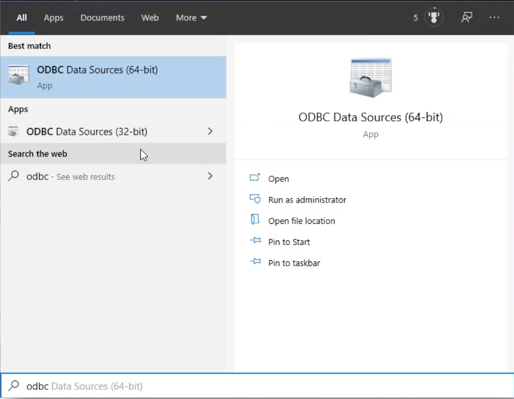

### Download and install the SAP HANA database server

1.	First, install the corresponding driver to connect to the HANA database of SAP Data Warehouse Cloud. To find your driver, navigate to the [HANA developer tools website.](https://tools.eu1.hana.ondemand.com/#hanatools)

2.	Go to the HANA tab, and then you select the corresponding client and click on Windows install.

    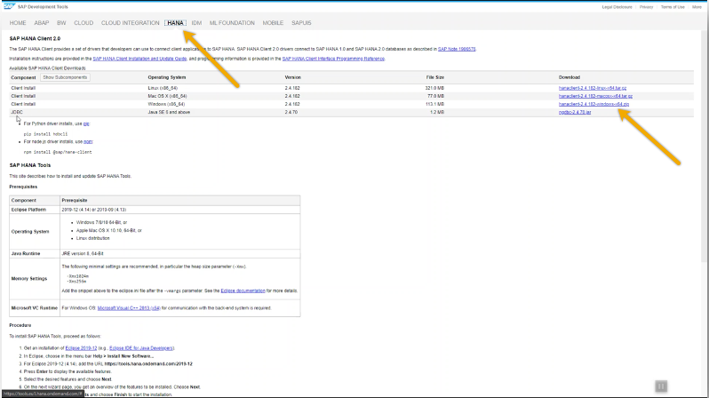

3.	Run the downloaded file `hdbsetup.exe` Click through the wizard, and complete the installation.

    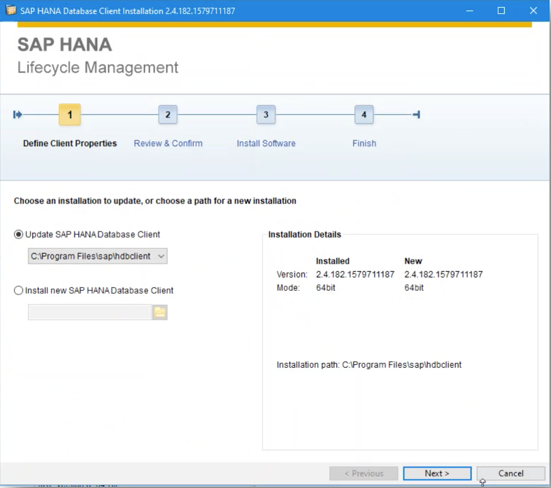

4.	Once done, open the ODBC Data Sources application on your system, and you can see the new entry HDBODBC, which can now be used to create new system and user data sources.

    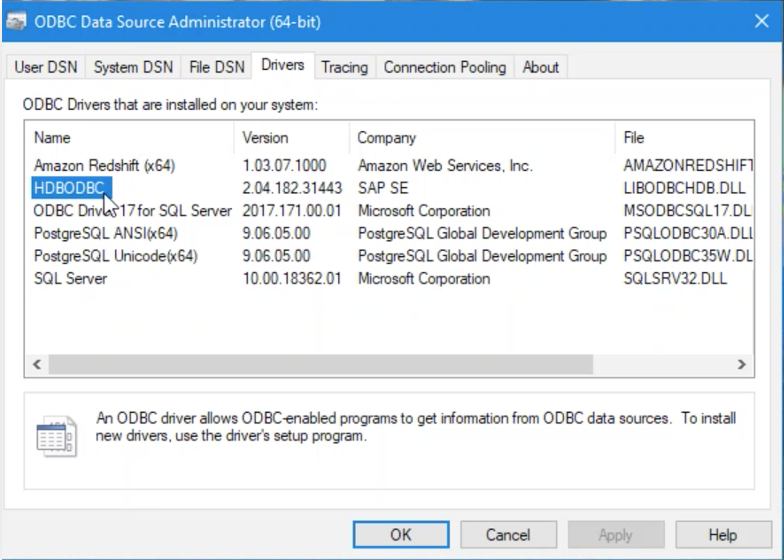

You have now successfully installed an ODBC Driver in your system.

### Install the user/system data source

Using the database user you have created as a pre-requisite, you can now create a user / system data source with the ODBC driver you have just installed in your system.

1.	In the ODBC Data Source Administrator application, click on the **User DSN** tab, and click on **Add**.

    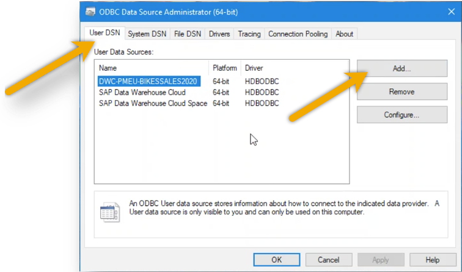

2.	Select the **HDBODBC (HANA Database ODBC)** driver and click on **Finish**.

    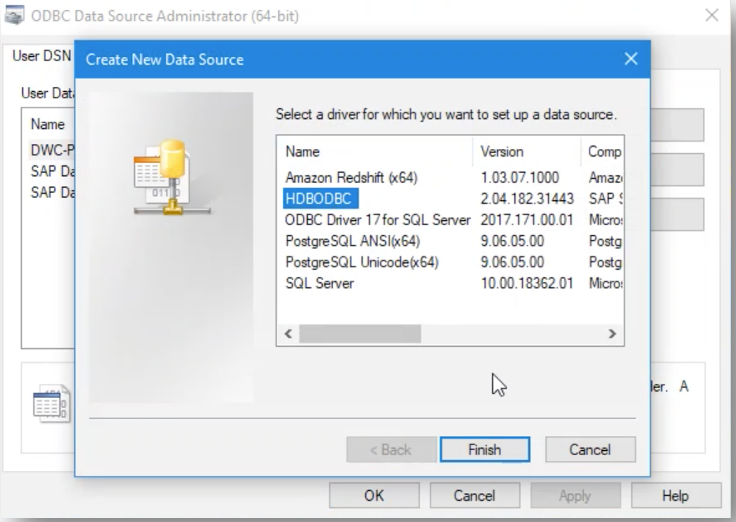

3.	Now enter the configuration settings for the new data source. Enter the **Name, Description, Host and Port Number**. Leave the **Multitenant** and **Validate the TSL/SSL certificate** boxes unchecked, and the **Connect to database using TSL/SSL certificate box** checked to securely connect to the database. Click on `Ok` when done.

    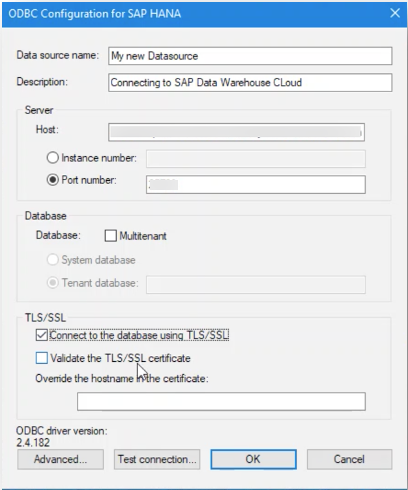

You have now successfully created an ODBC data source in your Windows system, and can now use it with the BI tool of your choice.

  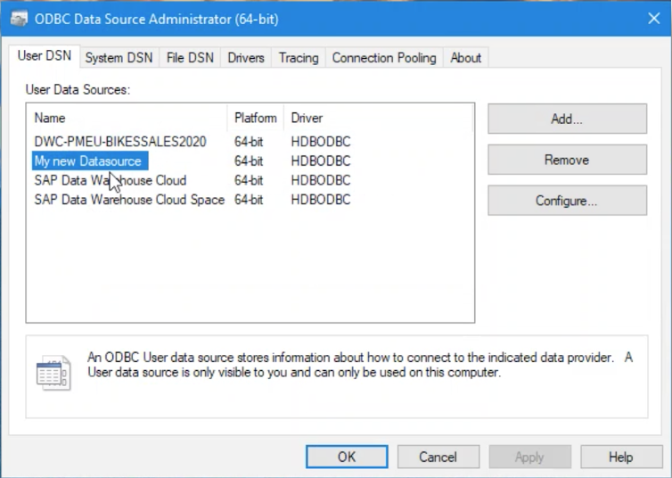

### Install the ODBC driver on macOS

macOS requires that you initially install an ODBC manager. ODBC managers for macOS can be found on a variety of websites including odbcmanager.net, and iODBC.org. In this example, we use iODBC.org.

1.	First, visit the iODBC.org website on your web browser. Go to the Downloads section, and select the corresponding client and download the `dmg` file.

    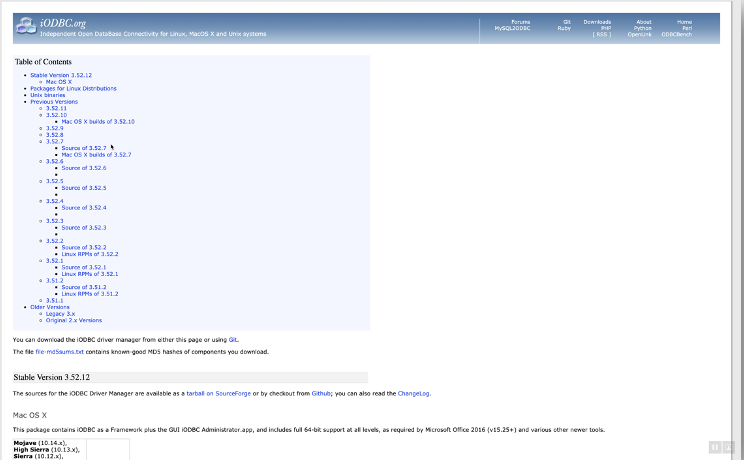

2.	Follow the install wizard and complete the installation of the ODBC manager on your system.

    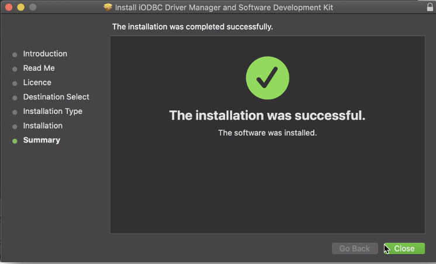

### Install bridge between ODBC manager and HANA driver

There exists no native macOS HANA driver, which means you need to install a bridge between the ODBC manager to the HANA driver. You can use [Open Link](https://www.openlinksw.com/), [Actual Tech](https://www.actualtech.com/) or any similar third-party program for the same. In this example, we use Open Link.

1.	Open the Open Link website and navigate to **Downloads**. Click on the **Driver license** tab, and specify the license type and database, along with the operating system. Type in your email ID, and click on **Generate a license**. The license will be emailed to you.

    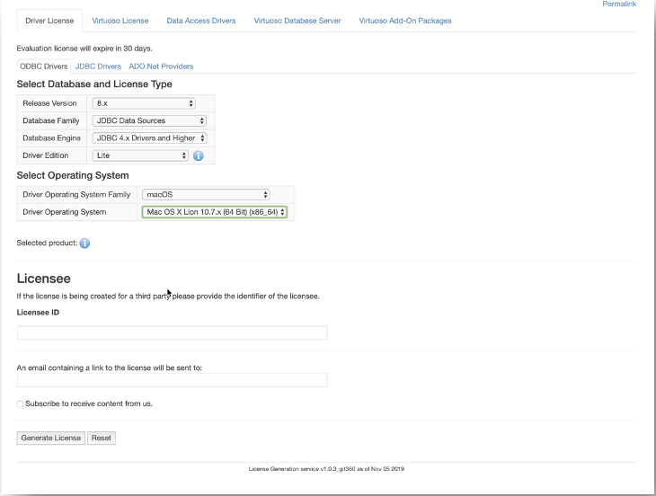

2.	On receiving the license details in your e-mail, login to the bridge software through the page redirected to in the email. Click on the **Download** icon to download the Open Link license.

    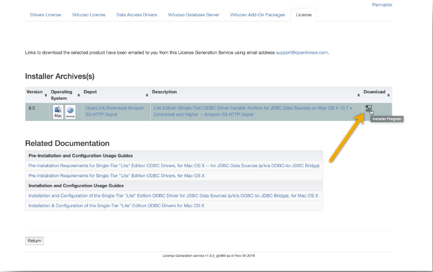

3.	The next step is downloading the data access drivers. Navigate to the **Data Access Drivers** tab on the Open Link website. Specify the type of database and driver you need, which in this case is the same information you entered for downloading the license. Then, click on **Find Downloads**.

    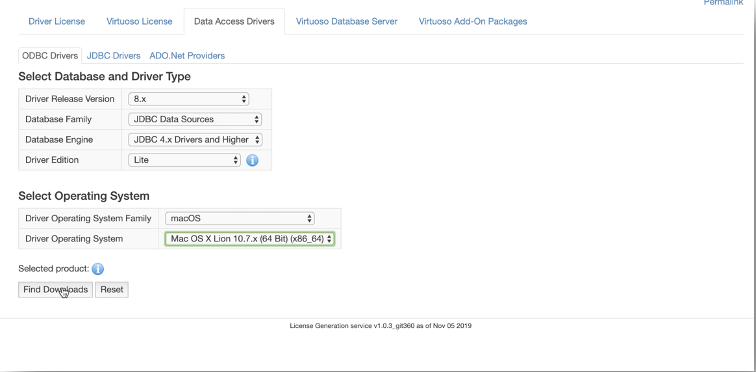

4.	This gives you the link to the installer. Click on the **Download** icon to download the data access driver.

    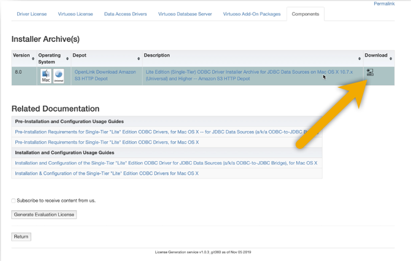

5. On completing the download, follow the install wizard and complete the installation on your system.

> When prompted, enter the license details that were downloaded earlier.

  

### Install the ODBC driver

1.	Navigate to the [HANA developer tools website](https://tools.eu1.hana.ondemand.com/#hanatools), and under the **HANA** tab, download the **JDBC SAP HANA Client**.

    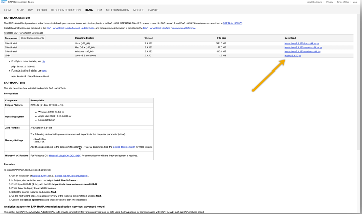

2.	Move the downloaded jar file from the Downloads folder in your macOS system to `/Library/Java/Extensions`. This is where the ODBC manager will look for the client.

3.	Open `iODBC Administrator` which you installed earlier. Depending on whether you want to add a user data source or system data source, click on the corresponding tab and click on **Add**.

    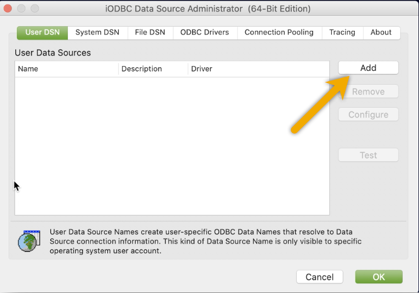

4.	Since you have installed the ODBC bridge, `iODBC` provides you with the option of choosing either Open Link JDBC Lite Driver (Unicode) or Open Link JDBC Lite Driver, alongside PostgreSQL Unicode which exists as default. Select **Open Link JDBC Lite Driver (Unicode)**, and click on **Finish**.
>Ensure that the ODBC drivers have their version numbers specified. If unspecified, remove the ODBC drivers and install again.

    

5.	Enter a technical name and description for the data source and click on **Continue**.

    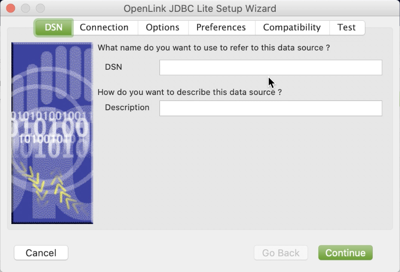

6.	Now in the JDBC driver column, enter `com.sap.db.jdbc.Driver`. In the URL string column, enter `jdbc:sap//<serverhost>:<port>?encrypt=true` where <serverhost> is your server URL and <port> is your port number. Click on **Continue** once done.

    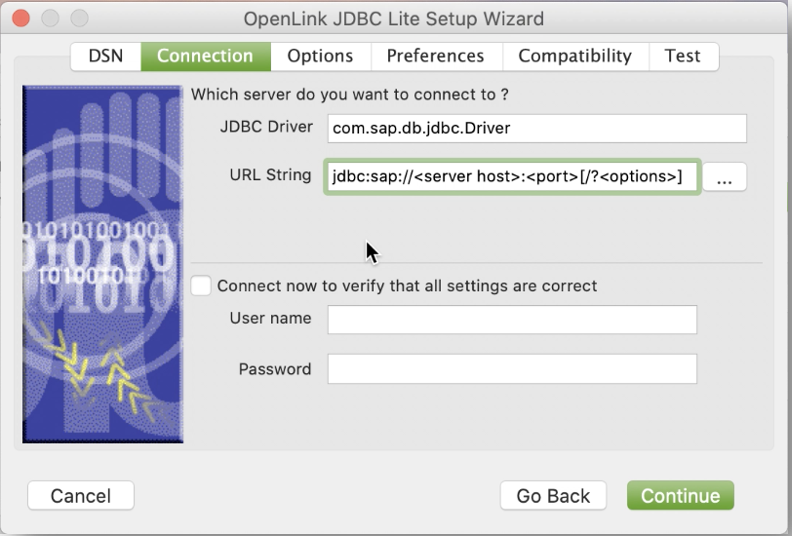

7.	Now proceed through the rest of the wizard by clicking on **Continue**, and click on `Ok` when done. You have now added a **User / System Data Source Name** entry, which can be used by third party BI clients.

    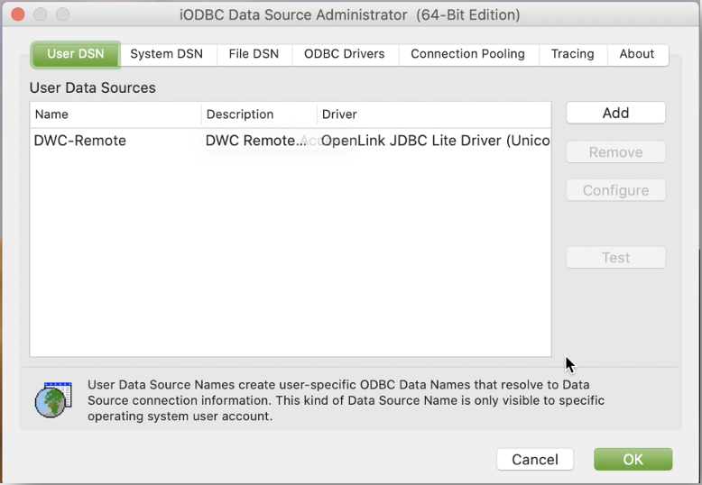

You can now fully leverage the flexibility of SAP Data Warehouse Cloud and connect to the BI tool of your choice.

>**Well done!**

> You have completed the 4th tutorial of this group! Now you know how to install an ODBC driver in your system.

> Learn in the next tutorial [how to connect Tableau to SAP Data Warehouse Cloud.](data-warehouse-cloud-bi5-connect-tableau)

### Test yourself

---
