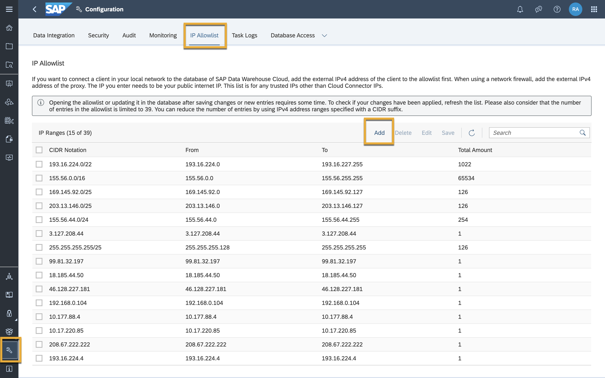
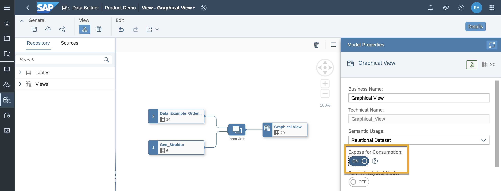
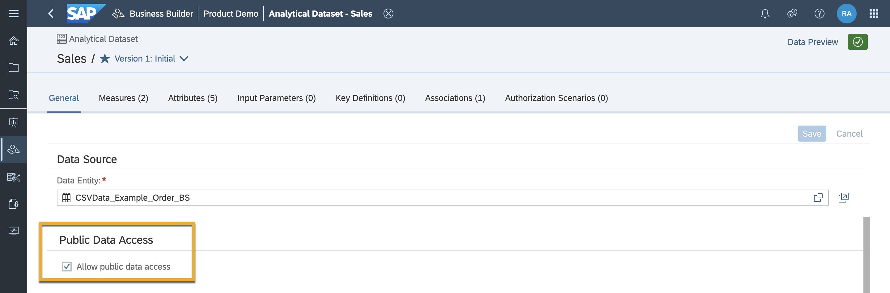
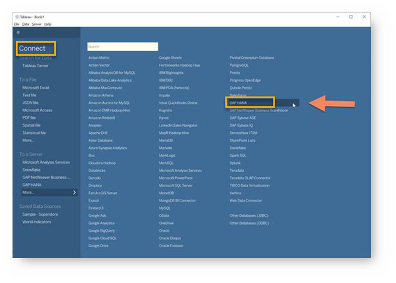
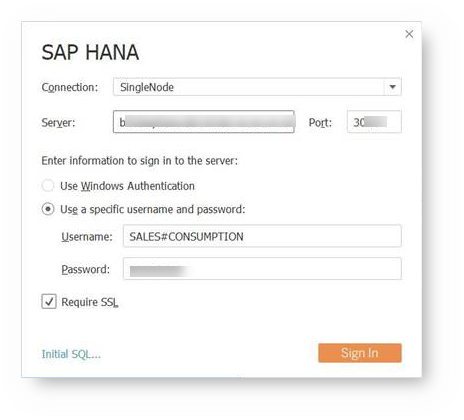
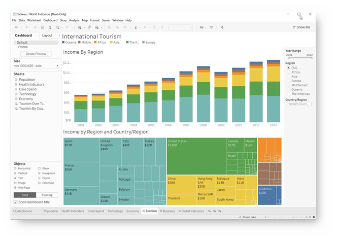

# Connect Tableau to SAP Data Warehouse Cloud
<!-- description --> In this tutorial, you will learn how to connect your SAP Data Warehouse Cloud tenant to Tableau.

## Prerequisites
  - You have [installed an SAP HANA ODBC Driver](data-warehouse-cloud-bi4-install-odbc)
  - You have [created a database user](data-warehouse-cloud-intro8-create-databaseuser)

## You will learn
  - How to connect Tableau to SAP Data Warehouse Cloud

---
### Add your IP address to IP allowlist

To allow an external BI client in your local network to connect to the database of SAP Data Warehouse Cloud, you need to add the external (public) IPv4 address of the client to an allowlist.

To do so, navigate to the **Configuration** screen on the bottom left of your SAP Data Warehouse Cloud tenant. Here, you can find the **IP Allowlist** tab, where you can simply click on **Add** and enter the IPv4 address of your system to add it to the allowlist.

  

### Ensure entities in SAP Data Warehouse Cloud are consumable

In order to ensure the data entities and models created in your SAP Data Warehouse Cloud tenant are consumable by the BI tool of your choice, it is important to expose them for consumption.
If the entity was created in the data builder, simply click on the entity and set the **Expose for Consumption** toggle to **ON** as below.

  

If the entity was created in the business builder, the toggle shows up as a **Allow public data access** checkbox in it's properties tab. Simple click on the data entity to open it, and ensure the checkbox is ticked.

  

### Connect Tableau to SAP Data Warehouse Cloud

The next step to connecting Tableau to SAP Data Warehouse Cloud is connecting to the SAP server from Tableau. Open Tableau and navigate to the **Connect to Server** screen, where you can select SAP HANA.

  

A connection screen pops up, where you can enter the connection details including your host name, port, username and password you received when creating your database user in SAP Data Warehouse Cloud.

  

Sign in once done, and you have now connected Tableau to your SAP Data Warehouse Cloud tenant. Look for your DWC Space name in the list of schemas. Under the schema, you will get a list of artefacts that can be consumed in Tableau.

  

>**Well done!**

> You have completed the 5th tutorial of this group! Now you know how to connect Tableau to SAP Data Warehouse Cloud.

> Learn in the next tutorial [how to connect Microsoft Excel to SAP Data Warehouse Cloud.](data-warehouse-cloud-bi6-connect-excel)

### Test yourself

---
