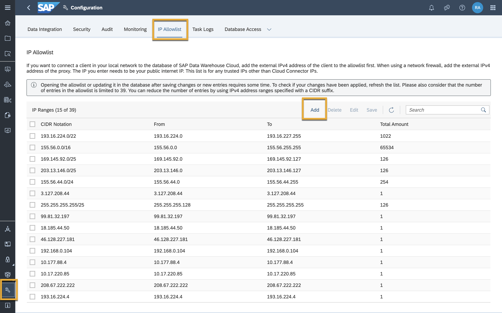
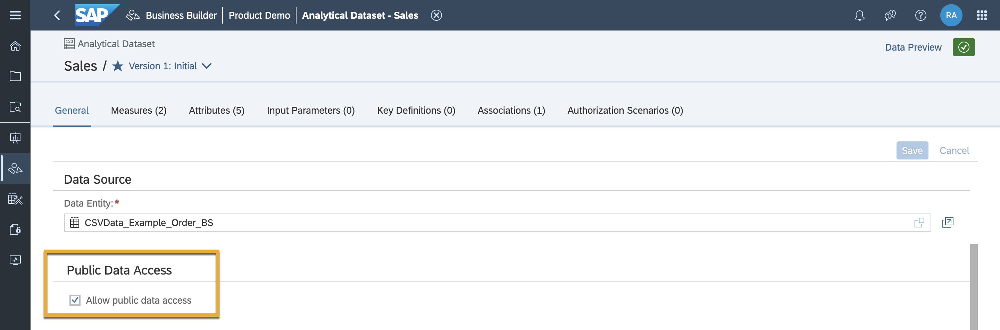
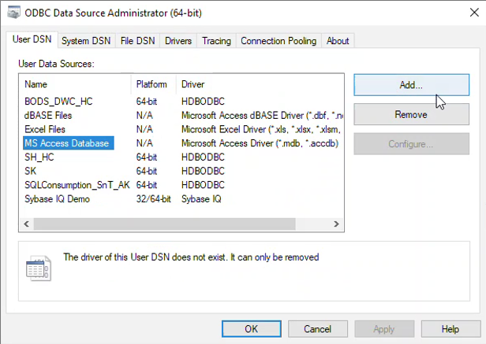
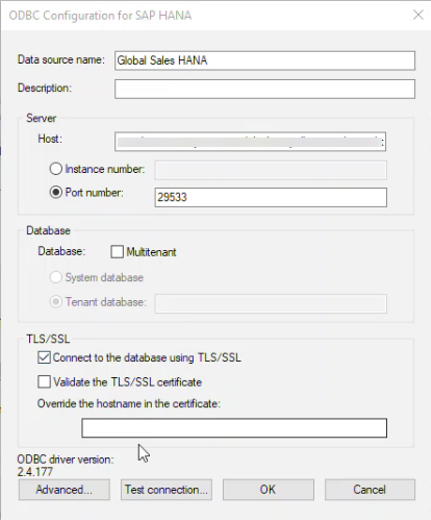
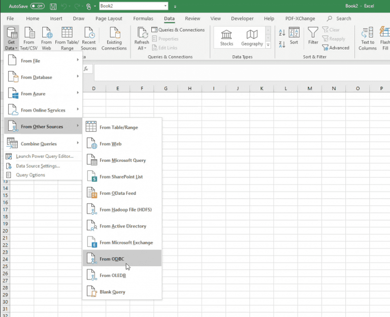
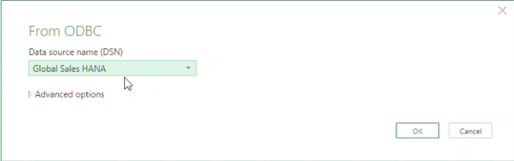
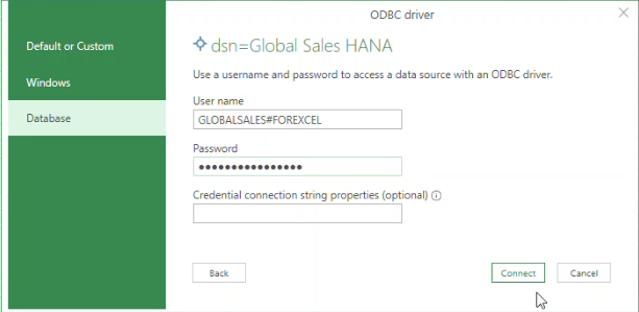
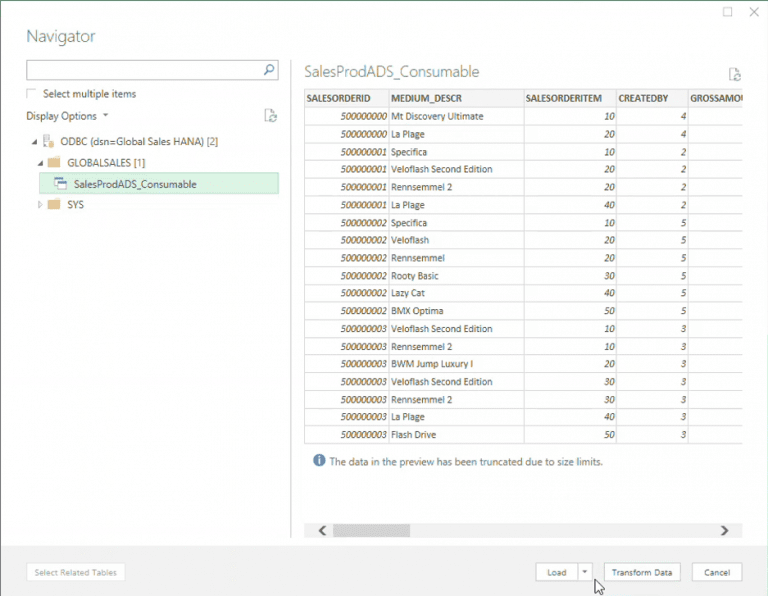
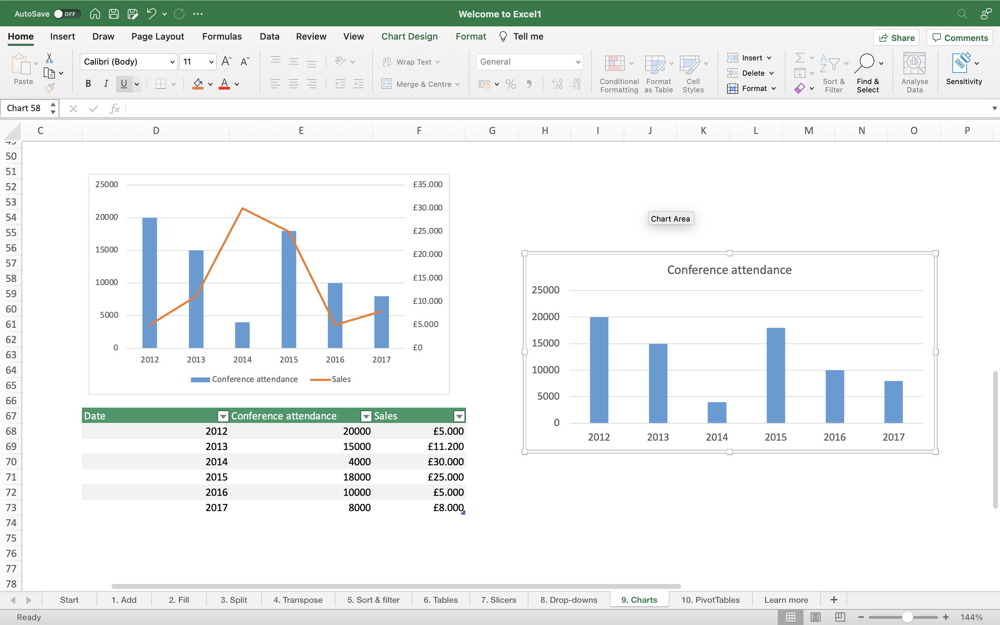

# Connect Microsoft Excel to SAP Data Warehouse Cloud
<!-- description --> In this tutorial, you will learn how to connect your SAP Data Warehouse Cloud tenant to Microsoft Excel.

## Prerequisites
  - You have installed the [ODBC Data Source Administrator (64-bit)](https://docs.microsoft.com/en-us/sql/connect/odbc/download-odbc-driver-for-sql-server?view=sql-server-ver15)
  - You have [installed an SAP HANA ODBC Driver](data-warehouse-cloud-bi4-install-odbc)
  - You have [created a database user](data-warehouse-cloud-intro8-create-databaseuser)

## You will learn
  - How to connect Microsoft Excel to SAP Data Warehouse Cloud

---
### Add your IP address to IP allowlist

To allow an external BI client in your local network to connect to the database of SAP Data Warehouse Cloud, you need to add the external (public) IPv4 address of the client to an allowlist.

To do so, navigate to the **Configuration** screen on the bottom left of your SAP Data Warehouse Cloud tenant. Here, you can find the **IP Allowlist** tab, where you can simply click on **Add** and enter the IPv4 address of your system to add it to the allowlist.

  

### Ensure entities in SAP Data Warehouse Cloud are consumable

In order to ensure the data entities and models created in your SAP Data Warehouse Cloud tenant are consumable by the BI tool of your choice, it is important to expose them for consumption.
If the entity was created in the data builder, simply click on the entity and set the **Expose for Consumption** toggle to **ON** as below.

  

If the entity was created in the business builder, the toggle shows up as a **Allow public data access** checkbox in it's properties tab. Simple click on the data entity to open it, and ensure the checkbox is ticked.

  

### Create an ODBC data source

The next step to connecting Microsoft Power BI to SAP Data Warehouse Cloud is creating an ODBC data source. This data source must point to the SAP Data Warehouse Cloud schema using the database user credentials you already have created. To create an ODBC data source, follow the steps below:

1. Open the ODBC Data Source Administrator (64 bit) application. Click on **Add** to add a new data source. Select and add the SAP HANA ODBC driver you have earlier installed. The driver is named **HDBODBC**.

    

2. On the configuration screen, enter the same connection credentials as that of your database user. Ensure that the **Multitenant** box is unchecked, and the **Connect to the database using TLS/SSL** box is checked.

    

In case the driver cannot be found, re-install it from the [SAP HANA development tools website.](https://tools.eu1.hana.ondemand.com/#hanatools) The ODBC driver used in this example is version 2.4.177.

### Connect Microsoft Excel to SAP Data Warehouse Cloud

1.	With the data now ready to be imported, open the Microsoft Excel application from your system and click on the **Get Data** icon under the **Data** tab. Navigate to **From Other Sources**, and select **From ODBC**.

    

2. Select the data source you have just created, which in this case is titled **Global Sales HANA**.

    

3. Enter the user credentials for the SAP Data Warehouse Cloud database user, and click on **Connect**.

    

4.	Microsoft Excel now displays all the views that are available for consumption. Here, you can see all the data entities you exposed for consumption in Step 1. Select the required datasets, and click on **Load**.

    

And that's it! The data is now available in MS Excel and can be used to create reports and charts for analysis.

  

>**Well done!**

> You have completed the 6th tutorial of this group! Now you know how to connect Microsoft Excel to SAP Data Warehouse Cloud.

> Learn in the next tutorial [how to connect Microsoft Power BI to SAP Data Warehouse Cloud.](data-warehouse-cloud-bi7-connect-powerbi)

### Test yourself

---
