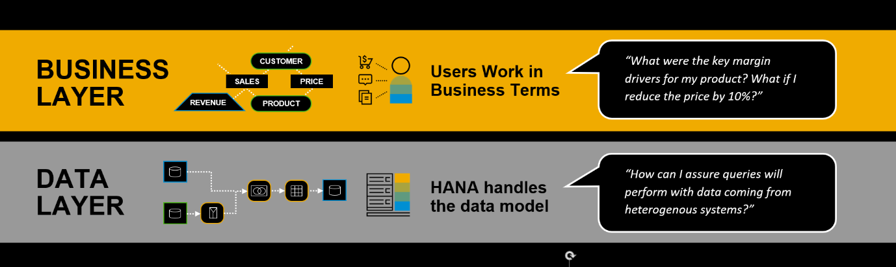

# Business Builder in SAP Data Warehouse Cloud
<!-- description --> Learn about the business modeling capabilities of the Business Builder in SAP Data Warehouse Cloud, including what you can use it for, who should use it, and some of the prerequisites.

## You will learn
- What is the Business Layer in SAP Data Warehouse Cloud
- What type of objects you can create with the Business Builder
- When you should use the Business Builder instead of the Data Builder
- An end-to-end example

## Intro
The Business Builder helps you instantly model your organizational data in business terms. With it, you can create business entities and relationships with an easy to understand structure, making business users more independent from IT.

In practice, it allows business users to collaborate and create data models in SAP Data Warehouse Cloud based on a semantic view of the organization's data. Once all the data is setup and made available by IT in SAP Data Warehouse Cloud, then it's easy to give permissions to the right people, enabling you to get your data ready to provide business insights.

---

### Get to know the business layer

In SAP Data Warehouse Cloud, you can work on your data in two different layers:

-	The **business layer**, where business users can see facts, measures and dimensions already modelled in the data layer, and create business models to answer business questions. This is where you can prepare your data to be shared with visualization tool, such as SAP Analytics Cloud.

-	The **data layer**, where IT and other technical users can directly create connections to data sources, prepare and transform the data itself. It requires knowledge of the data architecture of your organization, as well as system access to bring the data together into SAP Data Warehouse Cloud.

When it comes to using the Business Builder for modeling data, it allows you to:

-	Explore, validate, and model their business scenarios in SAP Data Warehouse Cloud
-	Create business scenarios independently from changes in the data layer
-	Collaborate with technical experts on one system
-	Collaborate with other business users by sharing models in the Repository Explorer

### Objects you can create with Business Builder

To create your business scenarios with the Business Builder, here are the objects you can create:

-	Business Entities (Analytical Datasets or Dimensions)
-	Fact Models
-	Consumption Models and Perspectives
-	Authorization Scenarios

**Business Entities: Analytical Datasets or Dimensions**

A business entity is based on a view created in the data layer, and it represents an object, such as information about products or sales, including all selected attributes and measures. In the Business Builder, you can create associations between facts and attributes coming from a view in the data layer. Business entities can be either an analytical dataset – which is a fact table with measures and foreign keys - or a dimension – which is tables containing only attributes.

[Learn here more about facts and dimensions](https://blogs.sap.com/2021/07/22/facts-measures-and-dimensions/)

Business entities are independent from the data layer and include versioning to allow you to have a high level of control.

**Fact Models**

A fact model is a combination of multiple business entities, including facts and dimensions, as well as added calculations across multiple facts. Typically, fact models are used to show more complex yet generic metrics or KPI's, such as Pipeline Coverage. Fact models can be nested, which can help make this model very re-usable.

**Consumption Models and Perspectives**

Perspectives allow you to select only specific attributes and measures and focus on them to create the best input to visualization and consumption tools, like SAP Analytics Cloud.

A consumption model allows you to combine business entities and fact models to create an output that answers a concrete business question. A consumption model can contain multiple perspectives. You can enrich business entities with additional calculations if necessary. Once you are done with a consumption model, you can deploy it to any target visualization client, such as SAP Analytics Cloud or 3rd-party tools via SQL.

To model a meaningful consumption model, business entities define associations between each other. All potential association targets can be pre-defined on the data layer to provide business users with a variety of modeling options when preparing their use case-specific consumption model. Designating the right measures to your business entities is the first step towards fully utilizing the powerful capabilities of the Business Builder in SAP Data Warehouse Cloud.

**Authorization Scenarios**

An authorization scenario is a way to restrict access to parts of the data within a business entity. It's reusable and can be applied to any business entity in SAP Data Warehouse Cloud.

### Choose the right tool for you

As you get to know SAP Data Warehouse Cloud better, you might wonder which of the builders is the best one for your needs: the Data Builder or the Business Builder.

Both have their reason to exist, but you can understand better in the example below:

  

One important thing to keep in mind is: everything is that is created in the Business Builder can only be created after the data has been brought into the Space, and after a view is created with the Data Builder.

The strength of SAP Data Warehouse Cloud is in bringing together different parts of the organization to connect, prepare, model, and then create business entities for visualization. That means collaborating with colleagues who have different skills to enable business analysts to come into the Business Builder and start modeling data based on concrete business questions.

### Watch an end-to-end example

In this video, you can see a simple, but complete example of data modeling with SAP Data Warehouse Cloud. You can then see how the modeling workflow starts in the data layer, and then can be finished in the business layer.

<iframe width="560" height="315" src="https://www.youtube.com/embed/mrhfsMaXBGU" title="YouTube video player" frameborder="0" allow="accelerometer; autoplay; clipboard-write; encrypted-media; gyroscope; picture-in-picture" allowfullscreen></iframe>

> **Well done!**

> You have completed the first tutorial of this group! Now you understand better the business layer and Business Builder in SAP Data Warehouse Cloud.

> Learn in the next tutorial how to create your first analytical dataset.

### Test yourself

---
