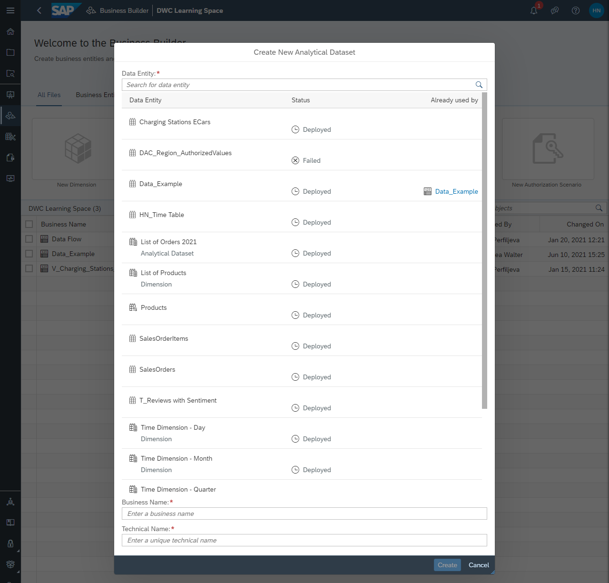
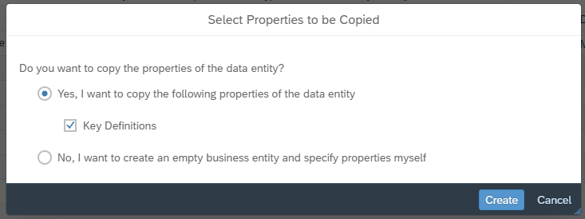
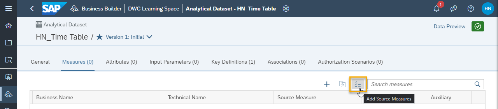
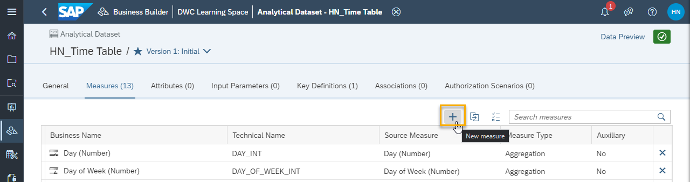
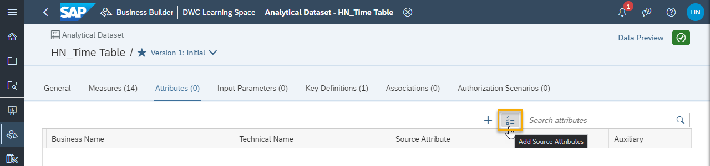
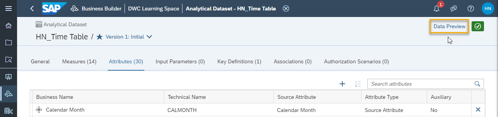
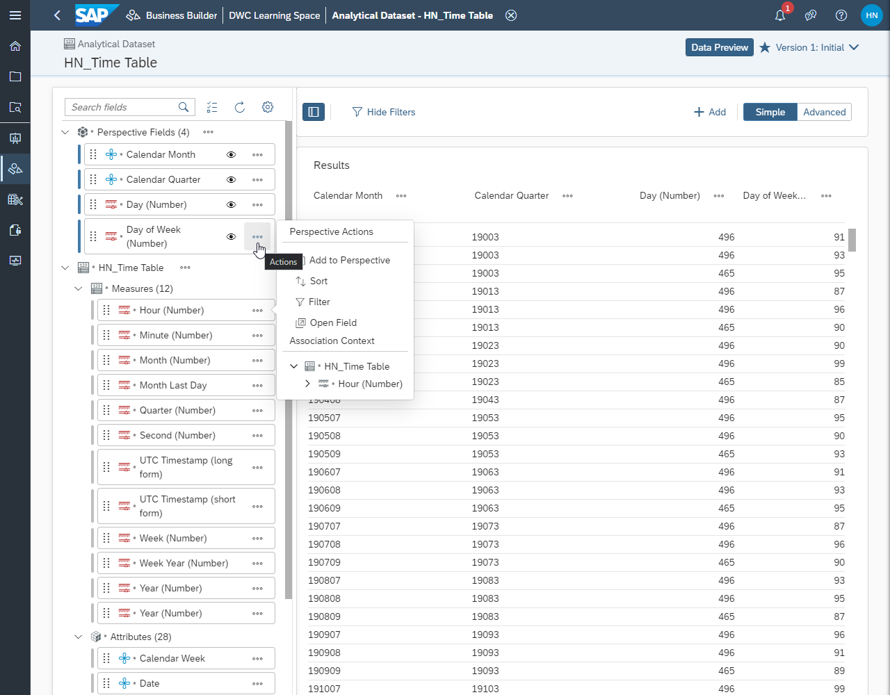

# Create an Analytical Dataset in the Business Builder
<!-- description --> Create a new analytical dataset with measures and attributes in the Business Builder of SAP Data Warehouse Cloud.

## Prerequisites
- Understand the Business Builder in SAP Data Warehouse Cloud
- Have at least one table or view with at least one measure created and deployed in the data layer of SAP Data Warehouse Cloud

## You will learn
- How to create a new analytical dataset
- How to add existing measures to your dataset
- How to add a new measure to your dataset
- How to add existing attributes to your dataset
- How to add a new attribute to your dataset
- How to preview your data and adjust the perspective

## Intro
<iframe width="560" height="315" src="https://www.youtube.com/embed/LNT7ciCJnpA" title="YouTube video player" frameborder="0" allow="accelerometer; autoplay; clipboard-write; encrypted-media; gyroscope; picture-in-picture" allowfullscreen></iframe>

In this tutorial, you will see an example dataset that contains information about sales. Please keep in mind that any data that will be used in the Business Builder needs to first be connected to or imported into SAP Data Warehouse Cloud before you can start creating business objects with Business Builder.

---

### Create a new analytical dataset

1.	In SAP Data Warehouse Cloud, click on the **Business Builder** icon.

2.	Then, click on **New Analytical Dataset**.

3.	Select the data entity you wish to use in this dataset. Either click on the entity you want to use, or search for it by using the search field on top of the pop-up window.

    

4.	The **Business Name** and **Technical Name** fields will be automatically filled-out for you, but you can make changes if needed.

5.	Click on **Create**.

6.	Finally, a pop-up will ask you if you want to copy the properties of the data entity or not.

    

7.	After you make your selection, click on **Create**.

### Add existing measures

Now that your analytical dataset is created, it's time to populate it. Start with adding measures.

1.	Click on **Measures** on the top menu.

2.	To add existing measures, click on the **Add Source Measures** button.

    

3.	A pop-up will open to show you the measures available in the source data. Check all the measures you wish to include. Then click on **Apply**.

Your existing measures are now available in the analytical dataset.

### Add a new measure

1.	To add a new measure, click on the **New Measure** button.

    

2.	Now you can enter the details of the new measure, including:

    a.	Business Name. This can contain a maximum of 120 characters/special characters.

    b.	Technical Name

    > Please note that the technical name of your new measure must be unique, even though new measures will be based on existing measures available on the source data.

3.	Now choose the **Measure Type**. By default, measures are of type **Aggregation**. The properties of a new measure depend on the type of measure you choose to create. Depending on the type of model, the following measure types are available:

    -	**Aggregation Measure**: An aggregate measurement is used when the data is available only in aggregate form. If selected, you can then set the aggregation type to suit the respective measure (sum, average, count, max, min).

    -	**Derived Measure**: A derived measure refers to another measure and allows restrictions on available attributes. For derived measures, you can define restrictions. In the restrictions editor, you can choose between the simple and the advanced mode. In the simple mode, you are guided by a wizard. In the advanced mode, you have more options and can create more complex criteria.

    -	**Count Distinct Measure**: The Count Distinct Measure counts unique (tuple) occurrences of attributes (e.g. in case multiple rows contain the country "Germany", it is counted only once).

    -	**Calculated Measure**: A calculated measure references other measures and allows the combination of measures with elementary arithmetic (operations of addition, subtraction, multiplication, and division).

    -	**Fixed Value**: Define a fixed value or a constant that can be used for further calculation or comparisons within the Consumption Models.

4.	Next, select the **Source Measure**.

5.	Then, choose the **Aggregation** for your measure.

6.	You can add a currency or measurement unit to your measure, if appropriate, on the **Currency or Unit** field.

    <iframe width="560" height="315" src="https://www.youtube.com/embed/TTwxioVhSZk" title="YouTube video player" frameborder="0" allow="accelerometer; autoplay; clipboard-write; encrypted-media; gyroscope; picture-in-picture" allowfullscreen></iframe>

7.	Finally, you can choose to make your measure an **Auxiliary measure**.

    > An auxiliary measure can be used for further calculation in a specific business entity but is not exposed to the consumption model. For example, general measures that are exposed via differently restricted derived measures might not be required in the consumption model itself.

8.	Click on **Save** to save your new measure.

Your new measure is now available in the analytical dataset.

### Add existing attributes

Now it's time to add attributes to your analytical dataset.

1.	Click on **Attributes** on the top menu.

2.	To add existing measures, click on the **Add Source Attributes** button.

    

3.	A pop-up will open to show you the attributes available in the source data. Check all the attributes you wish to include. Then click on **Apply**.

Your existing attributes are now available in the analytical dataset.

### Add a new attribute

1.	To add a new attribute, click on the **New Attribute** button.

2.	Now you can enter the details of the new attribute, including:

    - Business Name

    - Technical Name

    - Attribute Type

    - Calculation Formula

    - Auxiliary attribute

    > Please note that the technical name of your new attribute must be unique, even though new attributes can be based on existing attributes available on the source data.

3.	Click on **Save** to save your new attribute.

Your new attribute is now available in the analytical dataset

### Preview your dataset and adjust the perspective

You are almost done creating a base analytical dataset. Before you move on to another task, it's important to preview your data and make sure you have the right dataset.
Just click on the **Data Preview** link on the top right-hand corner of the screen.

Now you can see the preview, as well as adjust it by using the sidebar on the left of the screen. You can add measures and attributes to the perspective or remove them. You can also hide fields that are in the perspective according to your needs.

> You have completed the second tutorial of this group! Now you know how to create an analytical dataset in the Business Builder of SAP Data Warehouse cloud.

> Learn in the next tutorial how to create a dimension in the Business Builder.

### Test yourself

---
