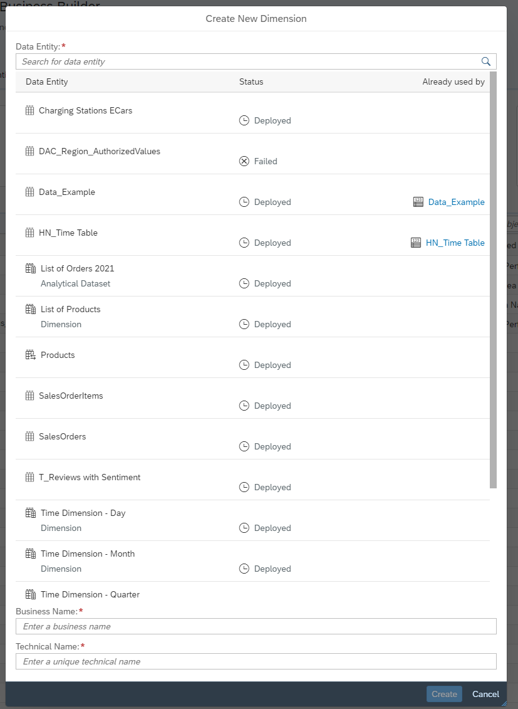
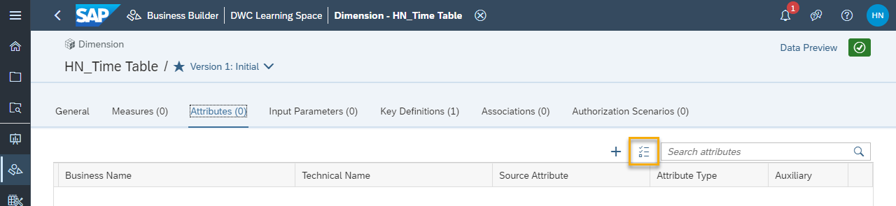
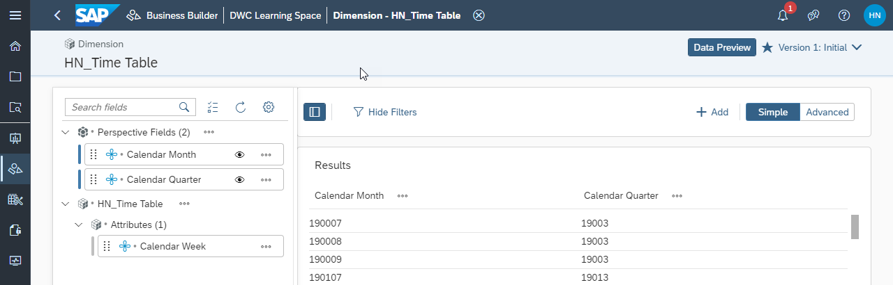

# Create a Dimension in the Business Builder
<!-- description --> Create a dimension in the Business Builder of SAP Data Warehouse Cloud.

## Prerequisites
- Understand the Business Builder in SAP Data Warehouse Cloud
- Have at least one table or view with at least one dimension created and deployed in the data layer of SAP Data Warehouse Cloud

## You will learn
- How to create a new dimension
- How to add existing attributes
- How to add a new attribute to your dimension
- How to preview your data and adjust the perspective

## Intro
In this tutorial, you will see an example dataset that contains information about sales. Please keep in mind that any data that will be used in the Business Builder needs to first be connected to or imported into SAP Data Warehouse Cloud before you can start creating business objects with Business Builder.

---

### Create a new dimension

1.	In SAP Data Warehouse Cloud, click on the **Business Builder** icon.

2.	Then, click on **New Dimension**.

3.	Select the data entity you wish to use in this dataset. Either click on the entity you want to use, or search for it by using the search field on top of the pop-up window.

    

4.	The **Business Name** and **Technical Name** fields will be automatically filled-out for you, but you can make changes if needed.

5.	Click on **Create**.

6.	Finally, a pop-up will ask you if you want to copy the properties of the data entity or not.

    

7.	After you make your selection, click on **Create**.

### Add existing attributes

Now it's time to add attributes to your dimension.

1.	Click on **Attributes** on the top menu.

2.	To add existing measures, click on the **Add Source Attributes** button.

    

3.	A pop-up will open to show you the attributes available in the source data. Check all the attributes you wish to include. Then click on **Apply**.

Your existing attributes are now available in the dimension.

### Add a new attribute

1.	To add a new attribute, click on the **New Attribute** button.

2.	Now you can enter the details of the new measure, including:

    - Business Name

    - Technical Name

    - Attribute Type

    - Source Attribute

    - Use Identifier

    - Auxiliary attribute

    > Please note that the technical name of your new attribute must be unique, even though new attributes can be based on existing attributes available on the source data.

3.	Click on **Save** to save your new attribute.

Your new attribute is now available in the dimension.

### Preview your dataset and adjust the perspective

You are almost done creating a dimension. Before you move on to another task, it's important to preview your data and make sure you have the right dataset.

Just click on the **Data Preview** link on the top right-hand corner of the screen.

Now you can see the preview, as well as adjust it by using the sidebar on the left of the screen. You can add measures and attributes to the perspective or remove them. You can also hide fields that are in the perspective according to your needs.

> **Well done!**

> You have completed the second tutorial of this group! Now you know how to create a dimension in the Business Builder of SAP Data Warehouse cloud.

> Learn in the next tutorial how to create a fact model in the Business Builder .

### Test yourself

---
