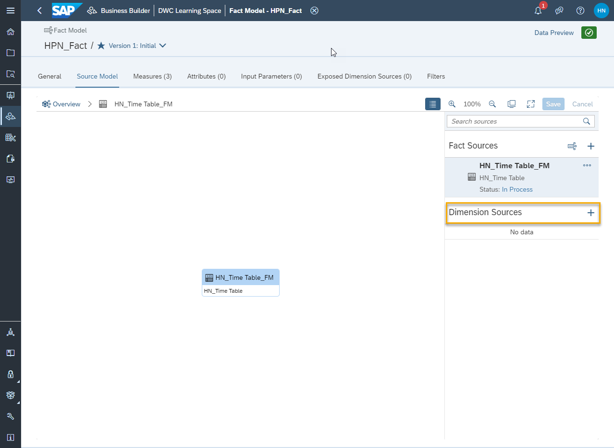

# Create a Fact Model in the Business Builder
<!-- description --> Group analytical datasets and dimensions into fact models in the Business Builder of SAP Data Warehouse Cloud.

## Prerequisites
- Understand the Business Builder in SAP Data Warehouse Cloud
- Have at least one table or view with at least one dimension created and deployed in the data layer of SAP Data Warehouse Cloud
- Have at least one analytical dataset and at least one dimension created with the Business Builder

## You will learn
- How to create a new fact model
- How to add a second fact source or dimension
- How to add a new business entity

## Intro
Fact models in the Business Builder of SAP Data Warehouse Cloud help you group analytical datasets and dimensions, so that it is easier to create a complete consumption model, and then visualize the data in SAP Analytics Cloud or equivalent.

> It is not mandatory to create a fact model before creating a consumption model, but it can help you avoid re-work. For example, if you have 10 different analytical datasets that need to be used in several different consumption models, you can group them in a fact model, and then simply re-use this in every consumption model needed.

---

### Create a new fact model

In the Business Builder of SAP Data Warehouse, start with following these steps:

1.	Click on the **New Fact Model** button.

2.	Enter a name for your fact model.

3.	Click on **Step 2**.

4.	Select the **Initial Fact Source**. This can be an analytical dataset, a dimension, or another fact model.

5.	Click on **Step 3**.

6.	Define an alias name for the source in **Source alias**.

7.	Click on **Create**.

Your new fact model is created.

### Add a second fact source or a dimension source to your fact model

If you wish to add a previously created dimension to your fact model, it's very simple:

1.	On the main canvas of the fact model, click on the plus icon under **Fact Sources** or **Dimension Sources** on the right sidebar.

    

2.	On the pop-up, select the fact model or dimension you wish to add to this fact model. You can select as many as you need from the available business entities.

3.	Click on **Create** and the entity will be added to your fact model. The model is automatically saved for you.

> Please keep in mind that, if you add more than one fact source to a fact model, in the background a union will be made between these two facts. So, it's crucial that the data in the two fact sources can be combined.

> Learn more in the following video:

> <iframe width="560" height="315" src="https://www.youtube.com/embed/5x0Hq2kQgAg" title="YouTube video player" frameborder="0" allow="accelerometer; autoplay; clipboard-write; encrypted-media; gyroscope; picture-in-picture" allowfullscreen></iframe>

### Add to or create new business entities in your fact model

Just as you can do in the analytical datasets and dimensions, you can add existing measures, attributes and more to your new fact model. You can also create new business entities from the main fact model screen, if needed.

You can also filter and refine your fact model as you wish. To learn more about exposing dimension sources, please see our technical documentation.

>**Well done!**

> You have completed the 4th tutorial of this group! Now you know how to create a fact model.

> Learn in the next tutorial how to create a consumption model.

### Test yourself

---
