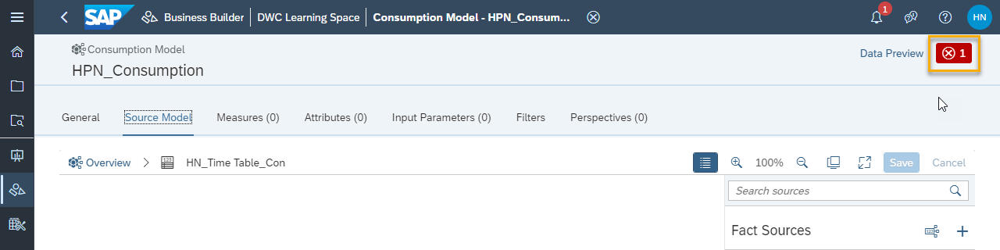
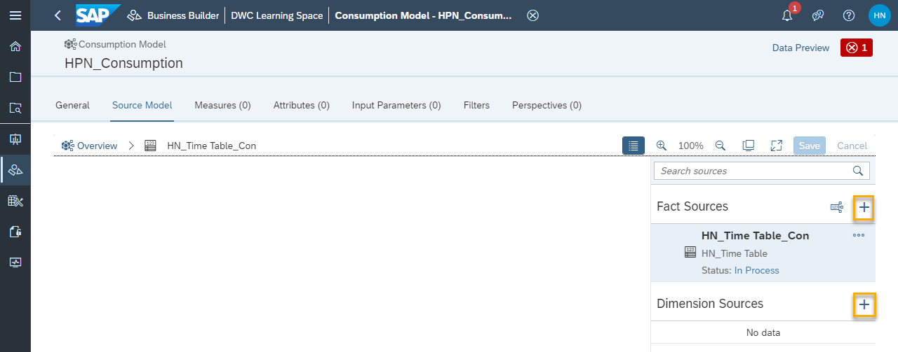

# Create a Consumption Model in the Business Builder
<!-- description --> Create consumption models in the Business Builder of SAP Data Warehouse Cloud to use the output data in visualization tools, such as SAP Analytics Cloud.

## Prerequisites
- Understand the Business Builder in SAP Data Warehouse Cloud
- Have at least one table or view with at least one dimension created and deployed in the data layer of SAP Data Warehouse Cloud
- Have at least one analytical dataset, dimension, or fact model created with the Business Builder

## You will learn
- How to create a new consumption model
- How to populate your consumption model
- How to add a perspective to your consumption model
- How to define the authorizations for your model

## Intro
Consumption models in the Business Builder of SAP Data Warehouse Cloud are the final business model you need to create before sharing your data with a visualization tool, such as SAP Analytics Cloud or equivalent.

To get an overview of using consumption models, please see the video below.

<iframe width="560" height="315" src="https://www.youtube.com/embed/Pl3ZnvTqDsc" title="YouTube video player" frameborder="0" allow="accelerometer; autoplay; clipboard-write; encrypted-media; gyroscope; picture-in-picture" allowfullscreen></iframe>

To learn more about consumption models, please see our [technical documentation](https://help.sap.com/viewer/c8a54ee704e94e15926551293243fd1d/cloud/en-US/337fa99de4a44700ba49e2214a1f3349.html).

---

### Create a new consumption model

In the Business Builder of SAP Data Warehouse, start by following these steps:

1.	Click on the **New Consumption Model** button.

2.	Enter a name for your consumption model.

3.	Click on **Step 2**.

4.	Select the **Initial Fact Source**. This can be an analytical dataset, a dimension, or a fact model.

5.	Click on **Step 3**.

6.	Define an alias name for the source in **Source alias**.

7.	Click on **Create**.

Your new consumption model is created.

>You may notice a red alert on the top right-hand side of the screen.
>
>   
>
> This appears because you have not yet allowed public data access to this consumption model, nor have assigned an authorization scenario to it. You need to give either public data access or a specific authorization, so that this consumption model can be used outside of SAP Data Warehouse Cloud.

### Add business entities to the consumption model

For your consumption model to have data in its output, you need to add business entities to your consumption model, such as measures and attributes.

1.	On the main canvas of the consumption model, click on the plus icon under **Fact Sources** or **Dimension Sources** on the right sidebar.

    

2.	On the pop-up, select the fact source or dimension you wish to add to this consumption model. You can select as many as you need from the available business entities.

3.	Click on **Create** and the entity will be added to your consumption model. The model is automatically saved for you.

### Add to or create a new perspective to your consumption model

Perspectives are a way to reuse a combination of measures, attributes, and other parameters. You can create or refine perspectives in your consumption model editor. The perspectives can then be used to create data stories with SAP Analytics Cloud.

You can create perspectives from the Data Preview area or from the Perspectives tab in the consumption model. To learn how to create a perspective, please see our [technical documentation](https://help.sap.com/viewer/c8a54ee704e94e15926551293243fd1d/cloud/en-US/ce26fd3da31b414f9482292d3969340a.html).

### Make your consumption model available to visualization tools

As mentioned in step 1, you need to make your consumption model available to visualization and reporting tools, such as SAP Analytics Cloud, before these tools can actually have access to the output of this model. This is really simple to do, and you can grant public data access at any time, as well as revoke it again.

1.	In your consumption model screen, click on the **General** tab.

2.	Then, check the box next to **Allow public data access**.

3.	Click on **Save**. You are able to now consume this data in SAP Analytics Cloud.

> **Well done!**

> You have completed the 5th tutorial of this group! Now you know how to create a consumption model.

> Learn in the next tutorial how to create an authorization scenario.

### Test yourself

---
