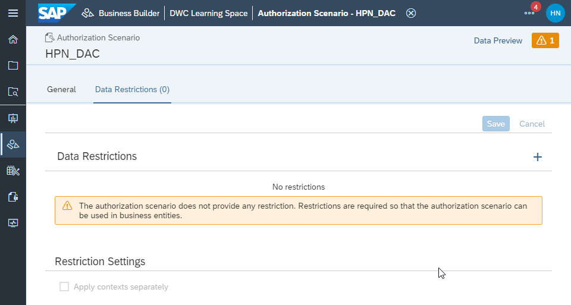

# Create an Authorization Scenario in the Business Builder
<!-- description --> Create authorization scenarios in the Business Builder of SAP Data Warehouse Cloud to control who can access your business models.

## Prerequisites
- Understand the Business Builder in SAP Data Warehouse Cloud
- Have at least one table or view with at least one dimension created and deployed in the data layer of SAP Data Warehouse Cloud
- Have at least one analytical dataset, dimension, or fact model created with the Business Builder
- Have at least one data access control created

## You will learn
- What are data access controls in SAP Data Warehouse Cloud
- How to create a new authorization scenario
- How to apply an authorization scenario to a business entity

## Intro
Every authorization scenario requires at least one data access control, which you can create in the Data Access Control area of SAP Data Warehouse Cloud. To understand what data access controls are and how to create them, please see our [technical documentation](https://help.sap.com/viewer/c8a54ee704e94e15926551293243fd1d/cloud/en-US/a032e51c730147c7a1fcac125b4cfe14.html).

Authorization scenarios can be created for any business entities created with the Business Builder, as well as consumption models.
To learn more about authorization scenarios, please see our [technical documentation](https://help.sap.com/viewer/c8a54ee704e94e15926551293243fd1d/cloud/en-US/46d8c42e1b1f421c9735a7cbc6fdba60.html).

---

### Create a new authorization scenario

In the Business Builder of SAP Data Warehouse, start by following these steps:

1.	Click on the **New Authorization Scenario** button.
2.	Select a previously created and deployed **Data Entity**.
3.	The **Business Name** and the **Technical Name** are entered automatically, but you can change it if you wish.
4.	Click on **Create**.

Your new authorization scenario is created.

### Add data restrictions to the authorization scenario

Now that you have an authorization scenario, please note that, on the top right corner of the screen, you can see an orange warning icon.

This usually means that you don't have yet any data restrictions. If you click on the warning icon, you will be then taken to Data Restrictions tab and see the full warning message.

To correct that, you need to add data restrictions. This is how you can do it:

1.	Click on the plus icon on the top right corner of the tab.
2.	Select the **Target Business Entity** you wish to restrict.
3.	Once you select an appropriate target business entity, the **Target Key** field will be automatically selected with the column you can use to apply data restrictions.
5.	Click on **Save** to apply the data restrictions.
4.	Then, you can map this **Target Key Member** to the **Foreign Key** field coming from the data access control.

> **Data access controls** and **data restrictions** need to be planned out in advance to work smoothly. It's also necessary to have basic knowledge of the data to be able to match the data access controls settings to the authorization scenario.

> Learn more about it in our [technical documentation](https://help.sap.com/viewer/c8a54ee704e94e15926551293243fd1d/cloud/en-US/167c05c673dc4715baba8d5d305abb1e.html).

### Apply an authorization scenario to a business entity

You can use your authorization scenario to limit access to any business entity created in the Business Builder. It's pretty simple:

1.	Open the existing business entity.
2.	Go to the **Authorization Scenario** tab of that business entity.
3.	Click on the plus icon.
4.	Select an existing authorization scenario and click on **Apply**.
5.	Click on **Save**.

Your authorization scenario is now limiting access to the business entity.

> **Well done!**

> You have completed the 6th tutorial of this group! Now you know how to create an authorization scenario.

> Learn in the next tutorial how to collaborate using the Repository Explorer.

### Test yourself

---
