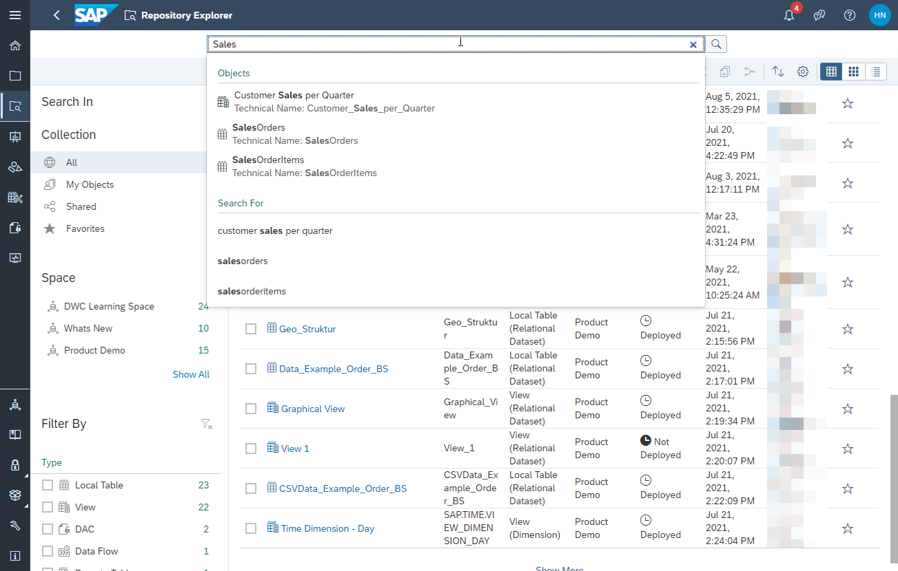
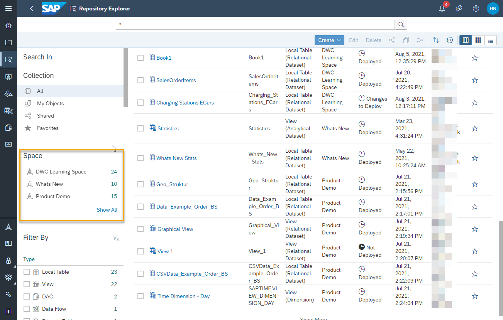
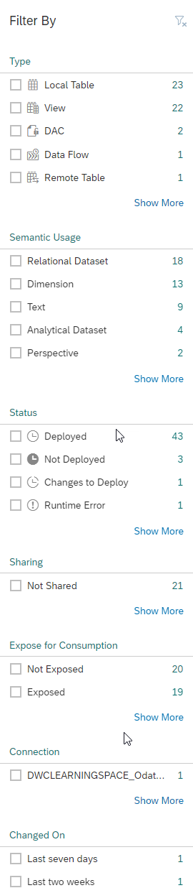
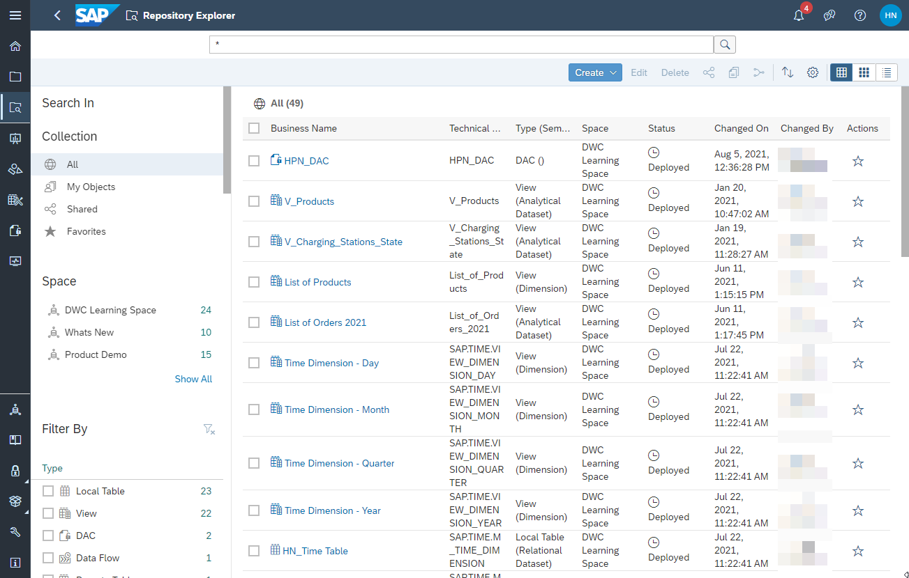
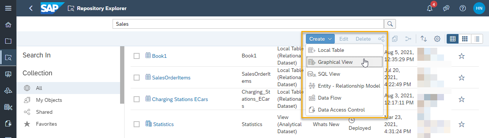
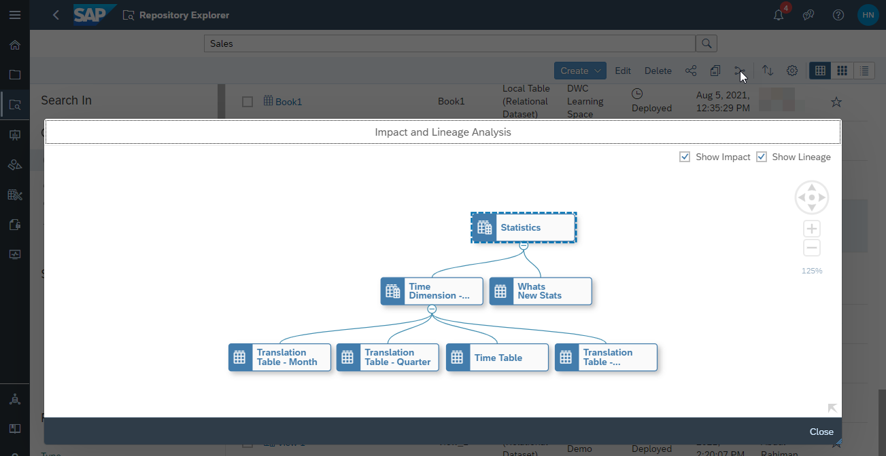
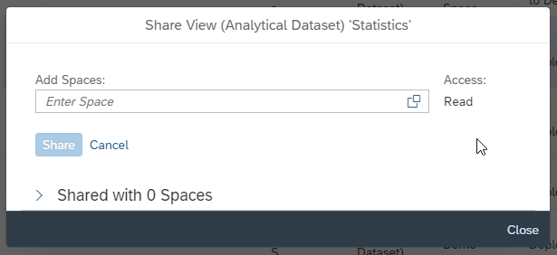

# Collaborate with the Repository Explorer
<!-- description --> Collaborate with other users of SAP Data Warehouse Cloud using the Repository Explorer.

## You will learn
- What the Repository Explorer can be used for
- How to search and filter
- How to create collections and favorites
- How to create and edit new objects
- How to see the impact and lineage analysis for an object
- How to share an object between Spaces

## Intro
The Repository Explorer is the central point to find, manage, and collaborate on all views, business entities, tables and any kind of entities within SAP Data Warehouse Cloud.

---

### Get to know the Repository Explorer

See a demo of the Repository Explorer in this video:

  <iframe width="560" height="315" src="https://www.youtube.com/embed/kxhcpKGzWcw" title="YouTube video player" frameborder="0" allow="accelerometer; autoplay; clipboard-write; encrypted-media; gyroscope; picture-in-picture" allowfullscreen></iframe>

The Repository Explorer is a place to secure and organize entities within SAP Data Warehouse Cloud.

All entities are shown here according to Space permissions, so users will only see the entities they have access to. Currently, all files within a Space are accessible to all members of that Space.

With the Repository Explorer, you can:

- Filter and search for specific objects

- Create collections and favorites

- Create new objects

- Edit existing objects

- Copy existing objects

- Share data models with other users of SAP Data Warehouse Cloud

- Trace the lineage of your data

In this tutorial, you will see some of these functionalities in more detail.

### Search and filter to find the right objects

On the top of the screen of the Repository Explorer, you will find the freestyle search bar. This is where you can enter the search term you wish. Then you will get an auto completion suggestion, and you can select the right result.

Alternatively, you can see the full search results by simply pressing **Enter**.

To filter the list of objects, you can use the left sidebar options. This allows you to easily filter objects based on the Space they are in. If you are a member of multiple Spaces, you will see the list of all Spaces available to you.

You can also filter by object type, such as remote tables, local tables, and even semantic usages. On top of that, you can filter by status. This allows you to easily find models that, for example, have not yet been deployed. If there are models with errors that need your attention, you can use the quick filters to easily find them and act on it.

Use the left sidebar to enable all available filters.

<!-- border -->

### Create collections and favorite objects

The collections in SAP Data Warehouse Cloud are predefined by the system, such as the recent entities. This includes all entities that you have modified or edited. It also allows you to quickly see all entities that you have created or shared.

Favorites are specific objects that you have marked as a favorite. You can mark an object as a favorite by clicking on the star icon on the right side of the line of the chosen entity. After that, you can click on the **Favorites** collection on the right sidebar to see only the entities you have selected.

### Create and edit new objects

It's very easy to create new objects or edit existing ones from the Repository Explorer. Just use the menu right below the search bar, where you can **Create**, **Edit**, **Delete**, **Share**, **Copy**, and see the **Impact and Lineage Analysis**.

### See the impact and lineage analysis for an object

To see where the data is coming from, you can do a lineage analysis. This also includes an impact analysis, so you can also see the impact of any changes you might make to an object.
Just click on the **Impact and Lineage Analysis** button and a pop-up will open with the lineage of the data included in the selected object.

To go back to the Repository Explorer, just click on **Close**.

### Share an object between Spaces

If you want to make an object available in multiple Spaces, you can share it on the Repository Explorer. Just select the objects you wish to share and click on the share icon on the top menu.

A **Share** pop-up will appear, so you can select or type the names of the Spaces in which you wish to share the selected object(s). From here you can also see if this object was already shared in any Space.

To go back to the Repository Explorer, just click on **Close**.

> **Well done!**

> You have completed the last tutorial of this group! Now you know how to use the Repository Explorer.

> Now it's time to continue learning. Please check out the other [SAP Data Warehouse Cloud tutorials available here](https://developers.sap.com/tutorial-navigator.html?tag=products:technology-platform/sap-data-warehouse-cloud), and don't forget to follow the [SAP Data Warehouse Cloud tag](https://blogs.sap.com/tags/73555000100800002141/) in the SAP Community to hear about the most up to date product news.

### Test yourself

---
