# Create a Calculated Column in SAP Data Warehouse Cloud
<!-- description --> Learn how to add a calculated column to a view and get familiar with writing formulas using functions in the Data Builder of SAP Data Warehouse Cloud.

## Prerequisites
- You have your SAP Data Warehouse Cloud tenant, or you have signed up for a [trial account](https://www.sap.com/products/data-warehouse-cloud/trial.html)
- You have imported data into your Space
- Understand [Core Data Services Query Language (CQL)](https://cap.cloud.sap/docs/cds/cql)


## You will learn
- How to create a new calculated column in the Data Builder
- How to write formulas for a new calculated column
- How to preview a newly added calculated column
- How to create a calculated expression using CQL


## Intro
You can kick start this tutorial by checking out our tutorial on [**Model Data with a Graphical View**](data-warehouse-cloud-graphical1-model) to understand the basic data modeling in SAP Data Warehouse Cloud.

---

### Create a new calculated column


1.	Go to the **Data Builder** in the menu of left-hand side of the SAP Data Warehouse Cloud welcome page and select the Space in which you have your view.

    <!-- border -->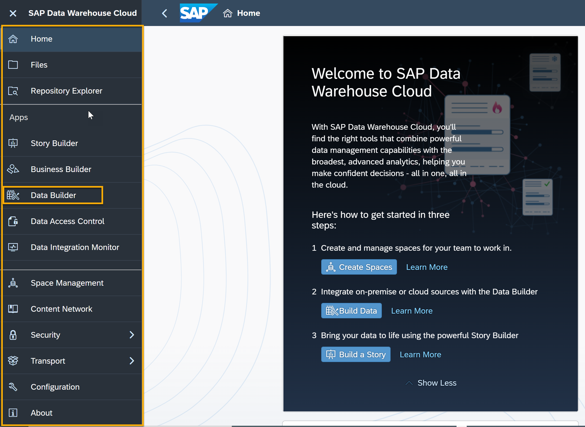

2. Then, click on **New Graphical View**.

	  <!-- border -->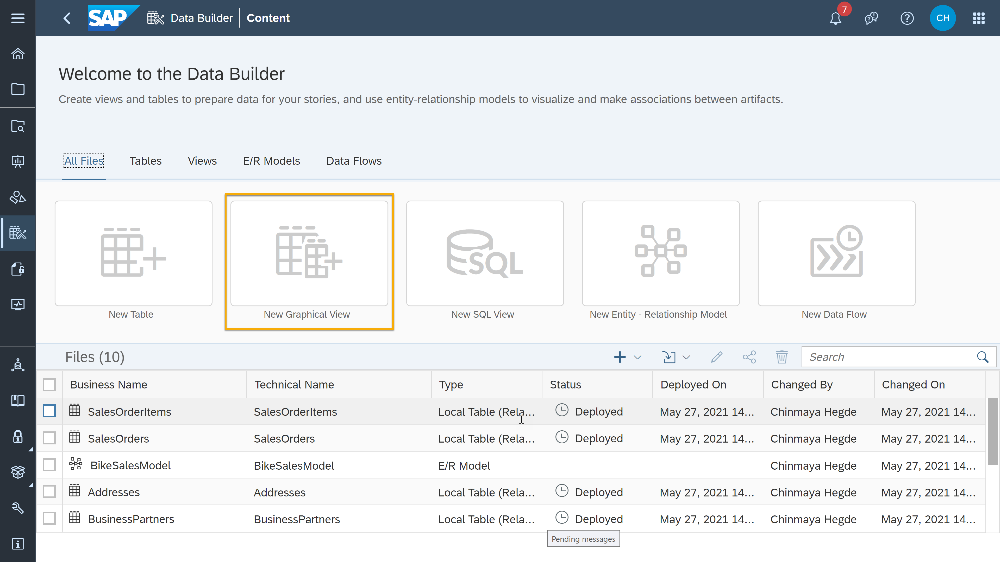

3. This is your canvas to start modeling. Use the left side panel to select your data source. You can either use the data already in the **Repository** of this Space or select from the **Sources** connected to this Space. You can also select an already existing view from the tables and view lists populated at the end of Step 1 to directly arrive at the modeling canvas.

    <!-- border -->    
> To add data to your new view, select either one table or view, click on it, and drag it to the canvas in the middle of the screen. You can now drag and drop other tables or views on top of the one that is already in the canvas.
>
> As you drag the first table or view, you will see a pop-up listing **Union and Join**. Once you have your first join, notice that the canvas rearranges itself to show a Join node and a Projection node.
>
> If you have selected an already existing view after step 1, you will arrive at the modeling canvas with join node and projection nodes for your view.

4. In the example below, you can see the tables `SalesOrder` and `SalesOrderItems` joined.

    <!-- border -->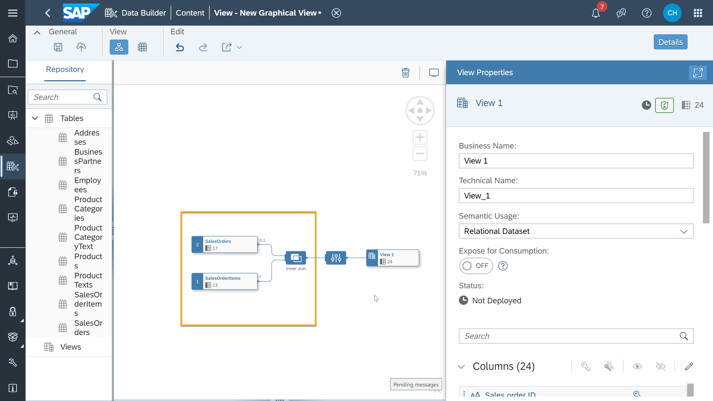

5. To add a new calculated column, just click on the `fx` icon next to the output, a projection, or a join node.
<!-- border -->

6. Then, In the **Calculated Elements Properties** sidebar on the right, click on the plus icon.

    <!-- border -->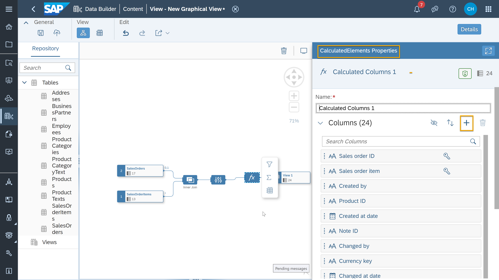

You have added a new calculated column. Next, we will look at how to set up the calculation that will show data in this column.


### Write formulas for a new calculated column 


Now it is time to add technical and business name for the column and write a formula in the expression box as a logic which defines the column.


2. Based on the formula you use, the system suggests the data type. You can also adjust the data type later if required.

3. In the example below, you can see a formula which calculates the difference between `Createdat` from the `SalesOrder` table and `Delivery Date` from the `SalesOrderItems` table to get a `Delivery_Time_in_Days` calculated column.

	   <!-- border -->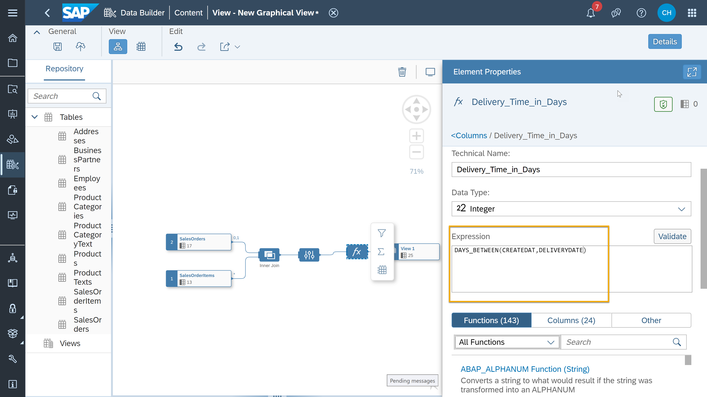

4. You can see the available functions by clicking on the **All Functions** dropdown. In this example, you can use the `Datetime` function which will give you the required difference.

	   <!-- border -->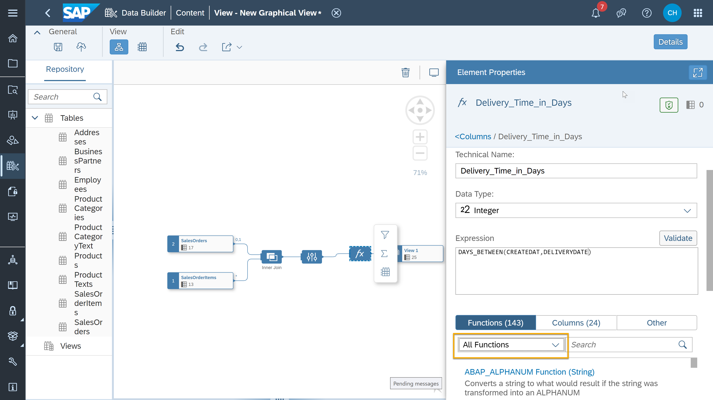

5. After selecting the function you wish to use, scroll down to select the appropriate method under it, in this case you can select `DAYS_BETWEEN` since the new calculated column is to get the difference between dates in days.

    <!-- border -->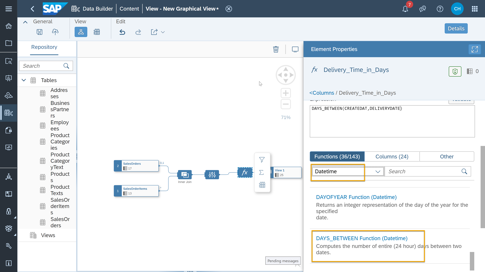

6. Finally, you can go to the **Columns** section next to the **All Functions** option to select the two required columns for the expression. In this example, `Createdat` from `SalesOrder` and `Delivery_Date` from `SalesOrderItems` tables respectively.

7. Then, click on **Validate**.

Below are the examples of common methods used under different functions available for calculated columns in the Data Builder to enhance the data modeling capabilities.

- `DAYS_BETWEEN` – Calculating the days between two columns or a certain date and a specific column. Always helpful to know how much time you have left until the end of the quarter. For example `DAYS_BETWEEN (Date, '2021-12-31')`.

- `LENGTH` – Even though sometimes less is more, it is crucial to understand how much or long something is. That is why this function helps you to derive the length of the string in a column – for example to understand the length of a list (knowing that especially here quality is superior to quantity), for example `LENGTH(Text) `.

- `NEXT_DAY` – Especially for daily comparisons, the ability to calculate the date for the next day for a subsequent join is important. For example, `NEXT_DAY(Date) `.

- `UPPER and LOWER` – Transforming a string into upper or lower characters to harmonize columns. For example, `UPPER (header)`.


### Preview new calculated column


To preview the data after adding a new calculated column, follow these steps:

1.	In the `CalculatedElementsProperties` sidebar, click on **Columns**.

    <!-- border -->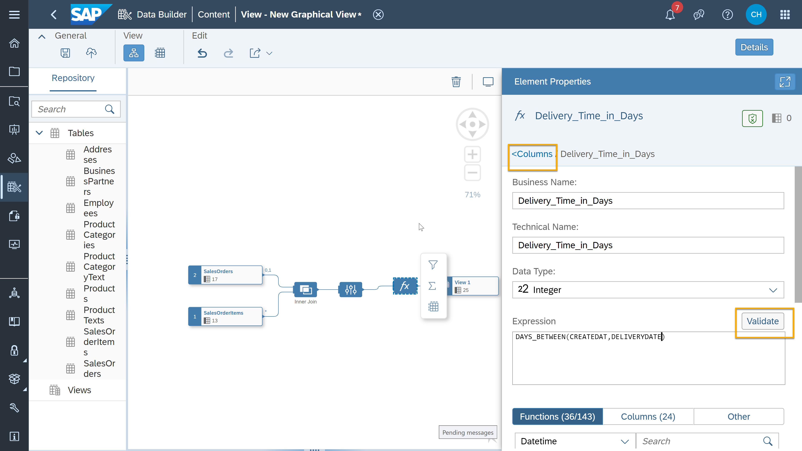

2.	In the modeling canvas, click on the view icon.

    <!-- border -->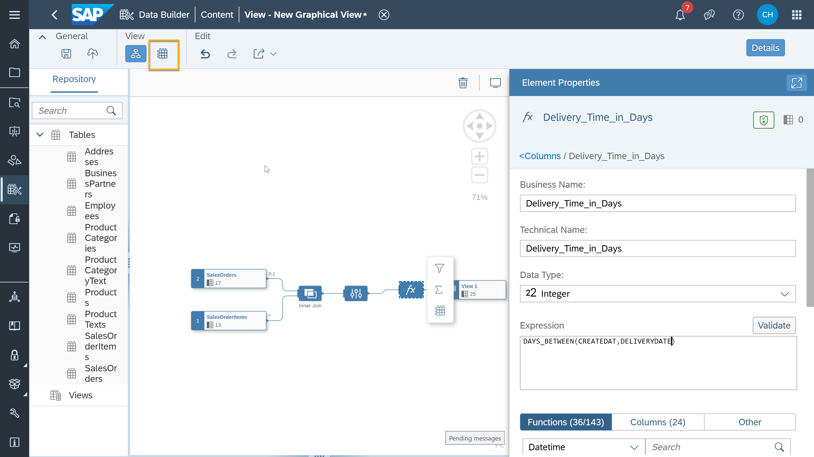

3.	You can now see, for example the new calculated column `Delivery_Time_in_Days` added in Step 2.

    <!-- border -->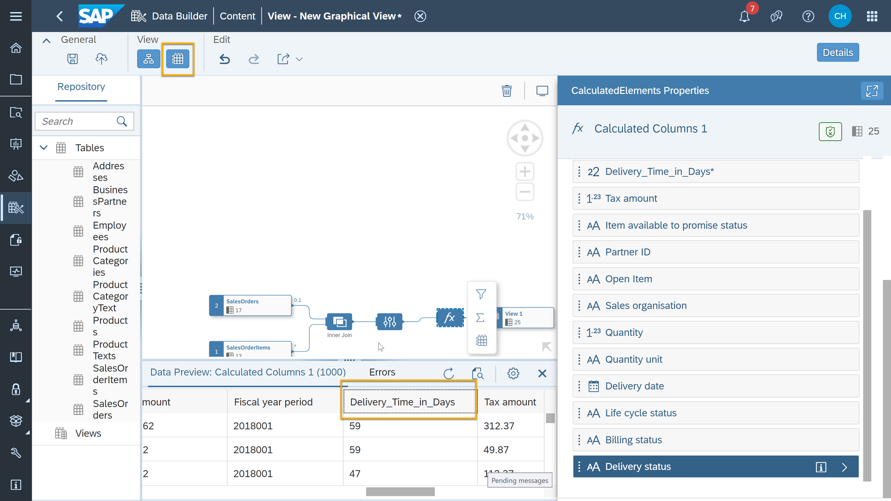

You can also go through the video below which will guide you through the same process of creating a calculated column and previewing the result including advanced examples of functions and formulas.

<iframe width="560" height="315" src="https://www.youtube.com/embed/YHF-WZ56rxs" title="YouTube video player" frameborder="0" allow="accelerometer; autoplay; clipboard-write; encrypted-media; gyroscope; picture-in-picture" allowfullscreen></iframe>


### Write a calculated expression


In the video below, you can see an example of calculated expression in **Data Builder** in SAP Data Warehouse Cloud. The steps in this tutorial will guide you through the same process.

<iframe width="560" height="315" src="https://www.youtube.com/embed/TbPHfnoQ0vI" title="YouTube video player" frameborder="0" allow="accelerometer; autoplay; clipboard-write; encrypted-media; gyroscope; picture-in-picture" allowfullscreen></iframe>

Once you have arrived at the `CalculatedElementsProperties` sidebar and chose to create a new calculated column in the Data Builder, you will see the fields to enter Business name and Technical name followed by Expression box, Functions, Columns and the Operators that you can use in SAP Data Warehouse Cloud.

  <!-- border -->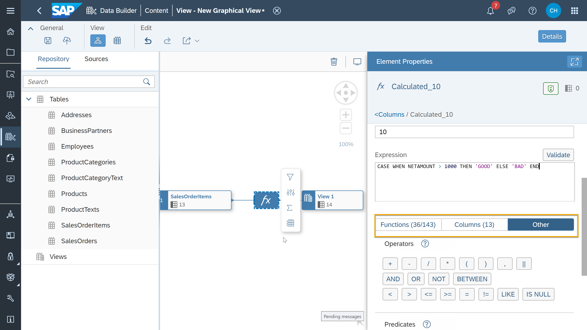

1. Now it is time to use the code editor in Data Builder and write a calculated expression as a logic which defines the new calculated column.

2. In the example below, you will see an expression which determines whether the deal is good or bad based on the ` NETAMOUNT ` column in the `SalesOrderItems` table.
```SQL
CASE WHEN NETAMOUNT > 1000 THEN 'GOOD' ELSE 'BAD' END
```


3. You can validate the above expression by using the **Validate** option and then preview data to confirm if the new column has been added. The column should have either of two values 'GOOD' or 'BAD' as defined in the expression.


> **Well done!**
>
> You have completed the **Calculated Columns** tutorial in SAP Data Warehouse Cloud. Now it is time to continue learning. Please check out the other [SAP Data Warehouse Cloud tutorials available here] (https://developers.sap.com/tutorial-navigator.html?tag=products:technology-platform/sap-data-warehouse-cloud), and do not forget to follow the [SAP Data Warehouse Cloud tag] (https://blogs.sap.com/tags/73555000100800002141/) in the SAP Community to hear about the most up to date product news.


### Test yourself


---
