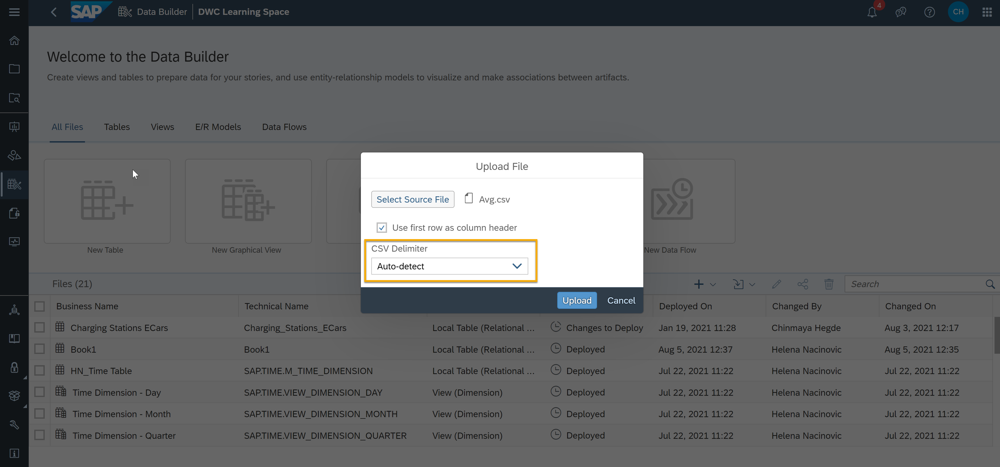
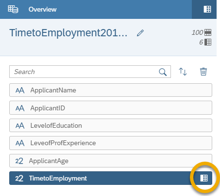
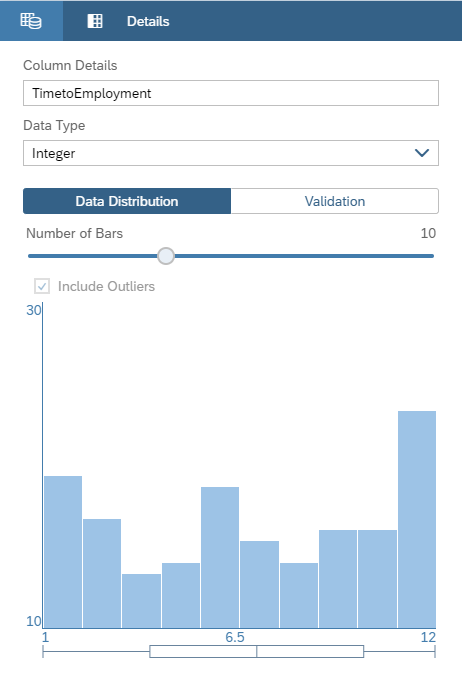
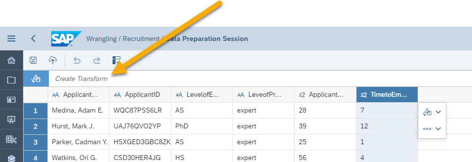

# Upload Flat Files and Wrangle Your Data
<!-- description --> Upload flat files, such as CSV files, in SAP Data Warehouse Cloud and then transform the data using the Data Builder.

## You will learn
- How to upload flat files in the Data Builder of SAP Data Warehouse Cloud
- How to make the best of the Data Builder capabilities during a file upload process
- How to transform the data for data consistency and integrity

## Intro
Data Wrangling is the process used to clean and convert data from one format and structure to another. The goal is to make the data as accurate and convenient for consumption as possible. After all, it is easier to gain more insight from complex and large amounts of data if it is accurate and actionable. Data Wrangling reduces the time you need to collect and organize unruly data to make it usable for the business.

---

### Upload a CSV file

    <iframe width="560" height="315" src="https://www.youtube.com/embed/6XStDvm7CaE" title="YouTube video player" frameborder="0" allow="accelerometer; autoplay; clipboard-write; encrypted-media; gyroscope; picture-in-picture" allowfullscreen></iframe>

In the video above, you can see an example of how to upload a flat file in `csv` format to SAP Data Warehouse Cloud. You can then see the steps in detail here below.

1.	In the SAP Data Warehouse Cloud welcome page, click on **Data Builder** on the menu on the left-hand side.

    <!-- border -->

2.	Choose the space in which you would like to upload and transform the data.

3.	This brings you to the Data Builder, click on the **import** icon as shown in the below example.

4.	Select **Import a CSV file**.

    <!-- border -->

5.	Find the source file on your local computer and upload. The file must be in CSV format.

6.	Choose the delimiter in the same **Upload file** pop-up dialog.

    <!-- border -->

### Work on your new data using the Data Builder

Once you upload a CSV file, you will be automatically redirected to a data transformation canvas where you will see a preview of your CSV data.

> The system will classify the data type for each column automatically, but you can change this setting using the capabilities of the Data Builder.

You can see in the video in the beginning of this tutorial that columns such as Country and Sales Units are set as strings, Time is set as time date type, and Revenue is set as an integer.

1.	If you want to rename one of the columns, go to the overview panel on the right side of the screen and double click on the column name to give it a new name.

    

2.	You can preview the content of the column by clicking on the cube icon. For instance, if the column has values from 1 to 12, we can see the data distribution of the column with number of occurrences of each value as shown in the below example.

    

3.	You can also specify how you want to display the data by clicking the info icon. This can give you some ideas or suggestions as to how you can change it.

### Transform your CSV file

You can apply some of the basic transformation to your data set. Suppose you want to filter the data records for a particular year from the available dates of last 50 years. You can easily achieve by transforming data to match only the records from a particular year.

1.	Click on the column which you want to transform in the canvas to make a change.

2.	Click on **Create a transform** to see the transformations available. This varies depending on the data type.

    
> In the Data Builder, you can see the following transformation options :
> - **Concatenate**: Join items of two different columns together.
> - **Split**: Split one value in a cell into two or more.
> - **Replace**: Replace a value with another, or with a better description.
> - **Change**: Change the font from lower to upper case or vice versa.
> - **Filter**: Filter your data and match.
>

3.	If you want to, for example, filter the data records for a particular year, click on the date column and then select **Create a transform** and from the available options choose **Filter**.

4.	Select **matching** from the transformation bar at the top and include the year for which the data records should be filtered.

5.	Once all the changes are done, deploy them by clicking on the deploy icon on the bottom of the transformation canvas.

You can again preview the file to see the reflected changes.

> **Well done!**
>
> You have completed the first tutorial of this group! Now you know how to upload and transform your data in SAP Data Warehouse Cloud.

> Learn in the next tutorial how to integrate and monitor your data in SAP Data Warehouse Cloud.

### Test yourself

---
