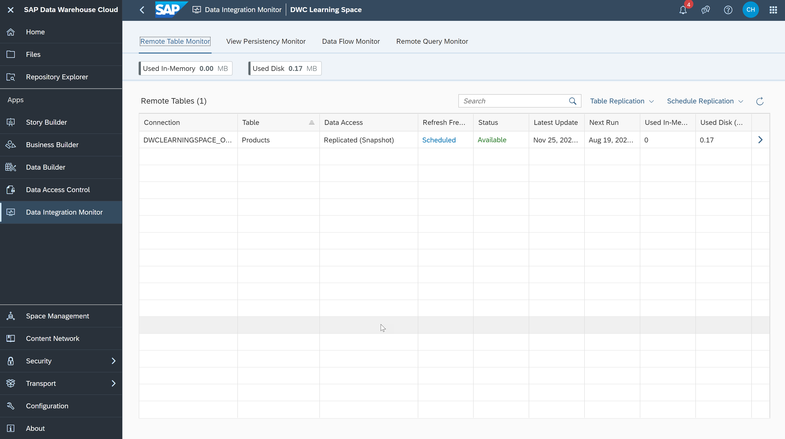
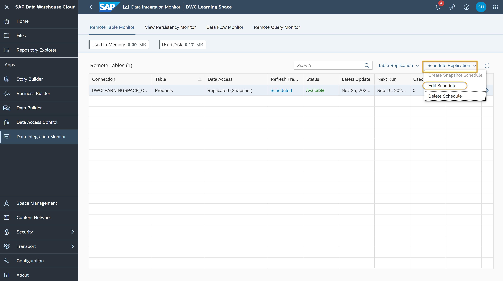

# Replicate Data into SAP Data Warehouse Cloud
<!-- description --> Replicate data in real time with the Data Integration Monitor of SAP Data Warehouse Cloud.

## You will learn
- How to check the type of data access
- How to create a real time data replication
- How to schedule the data replication

## Intro
The **Remote Table Monitor** in the Data integration Monitor helps you to manage your access to data in SAP Data Warehouse Cloud. Get started with the user-friendly interface of the Data Integration Monitor and organize your data replication efficiently.

In the video below, you can see a demo of data replication in SAP Data Warehouse Cloud. The steps in this tutorial will guide you through a similar process in detail.

<iframe width="560" height="315" src="https://www.youtube.com/embed/KbyMqiqH-1s" title="YouTube video player" frameborder="0" allow="accelerometer; autoplay; clipboard-write; encrypted-media; gyroscope; picture-in-picture" allowfullscreen></iframe>
---

### Access the Data Integration Monitor

1.	In SAP Data Warehouse Cloud, click on the **Data Integration** icon on the left-side menu.

    

2.	Choose your Space and you see the **Remote Table Monitor** dashboard.

    

3.	Here you can see an overview of all remote tables that currently exist in this Space and are active. The **Type of data access** field indicates if the data is a remote data, a snapshot replica, or if you have real-time access to the data.

### Replicate real-time data or take a snapshot

In the example video above, you can see an example of `SalesOrders` table and `SalesOrderItems` table already existing on the system and the demo starts with a completely federated environment where all the data access is remote. The next steps will guide you to do live replication of data instead of a remote access.

1.	As an example, imagine you have a table created from SAP HANA connection. To confirm this, go to the home page of SAP Data Warehouse Cloud and click on the **Data Builder** icon on the left-hand side of the control menu.

2.	Choose your Space and click on any of the views for which the `SalesOrders` or the `SalesOrderItems` remote table was used. This opens the modeling canvas.

3.	Here, you will see the information about remote tables that is used for the creation of this view. Click on the `SalesOrders` or `SalesOrderItems` table on the modelling canvas to see the connection name on the remote properties' canvas on the right side of the screen. You will see that the connection is from an SAP HANA database. You can check the connection names for any tables in the same way.

4.	Now go back to the **Data integration Monitor** to optimise the remote system and keep the existing data view synchronized.

5.	In the tables listed, click on the `SalesOrder` or `SalesOrderItems` row and then click on the **Table Replication** option next to the search bar.

6.	From the dropdown menu, select **Enable Real-Time Access** to get the real time data replication of the table.

7.	The status now changes to active. You can do the same for any tables you wish to replicate. Now the views which are dependent on these tables get data from SAP Data Warehouse Cloud replica and is stored locally.

8.	From the same dropdown menu in step 7 you can select load a snapshot replica to have a one-time data replication from remote tables.

### Schedule data replication

1.	Go to the **Data Integration Monitor** and from the tables listed, select the row of a table for which you wish to schedule data replication.

2.	Click on the **Schedule Replication** option on the top right.

    

3.	From the dropdown menu, click on **Edit schedule**.

4.	In the next dialog, you can select the frequency (Hourly, Daily, Weekly, Monthly), day of month and time of the replication along with start and end date.

5.	Check the summary in the same dialog and click on **OK** to schedule the replication.

> **Well done!**
>
> You have completed the third tutorial of this group! Now you know how to create a data replication and schedule them in SAP Data Warehouse Cloud.

> Learn in the next tutorial learn about **View Persistency** in SAP Data Warehouse Cloud.

### Test yourself

---
