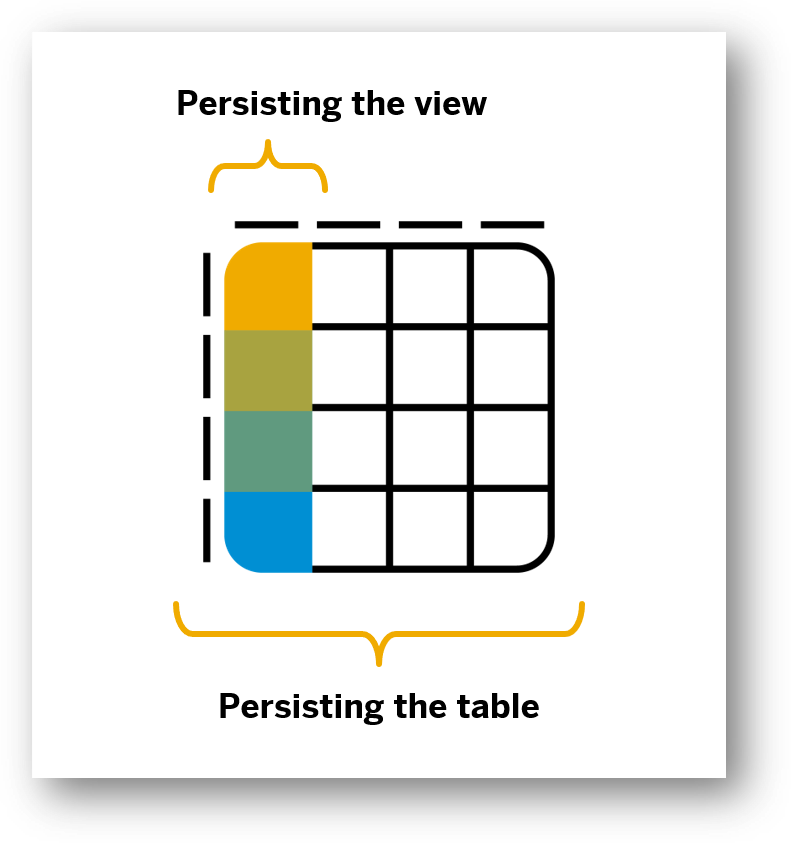
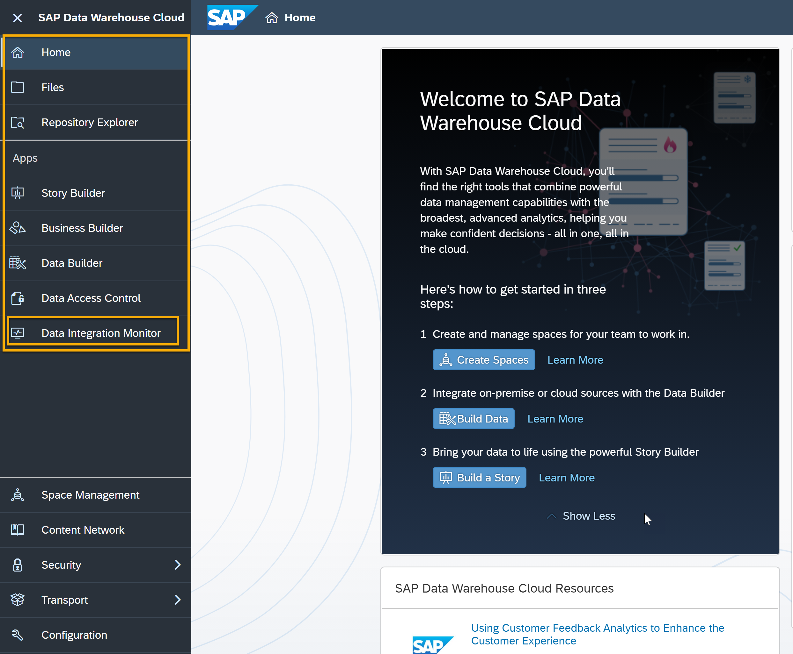
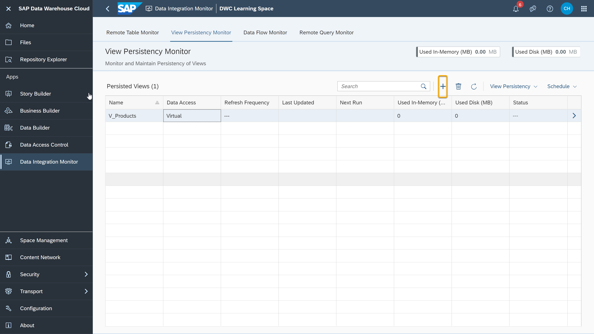
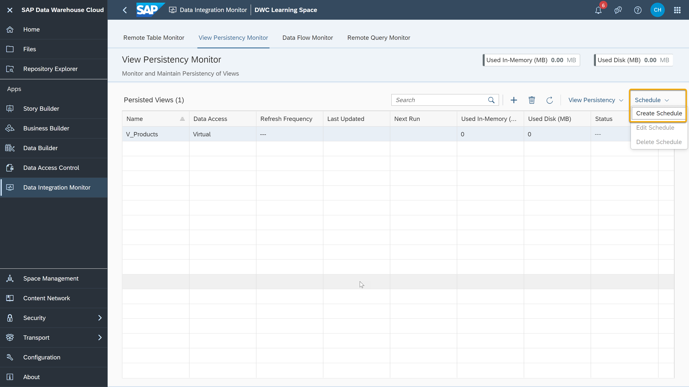

# Create Persistent Views in the Data Integration Monitor
<!-- description --> Create persistent views and schedule them in SAP Data Warehouse Cloud using the Data Integration Monitor.

## You will learn
- How to access the **View Persistency Monitor**
- How to create a persistent view
- How to schedule persistent data access

## Intro
SAP Data Warehouse Cloud already includes options to persist data from the remote tables and schedule its regular replication. You can also pre-compute the **`modeled views`** instead of the remote tables themselves by determining the data that a view uses and scheduling them for the required data replication.
Whether you choose to persist a view or remote tables depends on your performance and data storage needs. Remote tables are always replicated as exact copies from the original source. On the other hand, replicating a view will replicate and persist only the data that is included in the view. 

> This way you can filter the original data from a remote source and replicate only the data that you need.

> <!-- border -->

You can see this feature in action in the video below. Throughout this tutorial, we will cover the details of the same process.

<iframe width="560" height="315" src="https://www.youtube.com/embed/Rg67g3B8y_I" title="YouTube video player" frameborder="0" allow="accelerometer; autoplay; clipboard-write; encrypted-media; gyroscope; picture-in-picture" allowfullscreen></iframe>

---

### Access the View Persistency Monitor

1.	In SAP Data Warehouse Cloud, click on the **Data Integration** icon on the left- side menu.

    <!-- border -->

2.	Choose your Space and you see the **Remote Table Monitor** dashboard. You can now click on the **View Persistency Monitor** tab on the top menu.

### Create a persistent view

1.	To select a view to persist, click on the plus icon.

    

2.	In the next dialog, you can see the list of views available in your Space. As an example, you can see a view in the screenshot below.

3.	Click on the view you want in the dialog and select **OK** to persist a view.

4.	Click on the refresh icon and the status of the view will change to **Available**.

### Schedule persistent data access

1.	Once the view persistency is created for a view, click on the view and go to the **Schedule** option on the top right of the **View Persistency Monitor** dashboard.

    

2.	In the **Create schedule** dialog, you will see the scheduling details similar to scheduling data replication for remote tables. This includes the refresh frequency, month, day, year, start date, and end date.

3.	Click on **OK**. You will see the updated fields in the view persistency monitor dashboard with refresh frequency, last updated, next run.

> **Well done!**
>
> You have completed the Introduction to Data Preparation tutorial group in SAP Data Warehouse Cloud. Now it is time to continue learning.
Please check out the other [SAP Data Warehouse Cloud tutorials available here](https://developers.sap.com/tutorial-navigator.html?tag=products:technology-platform/sap-data-warehouse-cloud), and do not forget to follow the [SAP Data Warehouse Cloud tag](https://blogs.sap.com/tags/73555000100800002141/) in the SAP Community to hear about the most up to date product news.

### Test yourself

---
